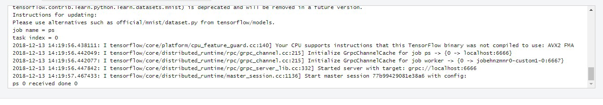

# 示例：使用自定义镜像创建训练作业<a name="modelarts_23_0088"></a>

本示例所需的文件存储在[Github仓库](https://github.com/huaweicloud/ModelArts-Lab/tree/master/docs/custom_image/mnist)中。本示例使用[MNIST数据集](https://modelarts-cnnorth1-market-dataset.obs.cn-north-1.myhuaweicloud.com/dataset-market/Mnist-Data-Set/archiver/Mnist-Data-Set.zip)。端到端示例请参见[最佳实践](https://support.huaweicloud.com/bestpractice-modelarts/modelarts_10_0071.html)。

-   “mnist\_softmax.py“为单机脚本。

## 制作并上传自定义镜像<a name="section5491135613409"></a>

本示例使用Dockerfile文件定制自定义镜像。

以linux x86\_x64架构的主机为例，您可以购买相同规格的ECS或者应用本地已有的主机进行自定义镜像的制作。

1.  安装Docker，可参考[Docker官方文档](https://docs.docker.com/engine/install/binaries/#install-static-binaries)。

    以linux x86\_64架构的操作系统为例，获取Docker安装包。使用以下指令安装Docker：

    ```
    curl -fsSL get.docker.com -o get-docker.sh
    sh get-docker.sh
    ```

    如果**docker images**命令可以执行成功，表示Docker已安装，该步骤可跳过。

2.  获取自定义镜像的基础镜像。

    训练作业的自定义镜像需要以基础镜像为基础。基础镜像名称格式参见[基础镜像包概述](训练作业自定义镜像规范.md#section1126616610513)。使用以下指令获取自定义镜像的基础镜像：

    ```
    docker pull swr.<region>.myhuaweicloud.com/<image org>/<image name>
    ```

    另外，您还可以使用**docker images**命令可查看本地的镜像列表。

3.  编写构建自定义镜像的Dockerfile文件。

    本示例构建tensorflow 1.13.2版本镜像。文件命名为“tf-1.13.2.dockerfile“。执行_vi tf-1.13.2.dockerfile_命令，进入文件中。

    Dockerfile文件编写的更多指导内容参见[官方指导说明](https://docs.docker.com/engine/reference/builder/)。

    ```
    FROM swr.cn-north-4.myhuaweicloud.com/modelarts-job-dev-image/custom-base-cuda10.0-cp36-ubuntu18.04-x86:1.1
    # 配置华为云的源，安装tensorflow
    RUN cp -a /etc/apt/sources.list /etc/apt/sources.list.bak && \
    sed -i "s@http://.*archive.ubuntu.com@http://repo.myhuaweicloud.com@g"  /etc/apt/sources.list && \
    sed -i "s@http://.*security.ubuntu.com@http://repo.myhuaweicloud.com@g"  /etc/apt/sources.list && \
    pip install  --trusted-host https://repo.huaweicloud.com -i https://repo.huaweicloud.com/repository/pypi/simple  tensorflow==1.13.2
    # 配置环境变量
    ENV PATH=/root/miniconda3/bin/:$PATH
    ```

4.  构建自定义镜像。

    下列例子中镜像所在的区域为cn-north-4，镜像所属组织为deep-learning-diy，在“tf-1.13.2.dockerfile“文件所在的目录执行：

    ```
    docker build -f tf-1.13.2.dockerfile . -t swr.cn-north-4.myhuaweicloud.com/deep-learning-diy/tf-1.13.2:latest
    ```

5.  推送镜像至SWR，上传镜像的详细操作可参考[SWR用户指南](https://support.huaweicloud.com/qs-swr/index.html)。

    前提条件是已经[创建组织](https://support.huaweicloud.com/usermanual-swr/swr_01_0014.html#section0)并[获取SWR登录指令](https://support.huaweicloud.com/usermanual-swr/swr_01_0011.html)。下列例子中镜像所在的区域为cn-north-4，镜像所属组织为deep-learning-diy，执行以下命令推送镜像至SWR。

    ```
    docker push swr.cn-north-4.myhuaweicloud.com/deep-learning-diy/tf-1.13.2:latest
    ```

    “swr.cn-north-4.myhuaweicloud.com/deep-learning-diy/tf-1.13.2:latest“即为此自定义镜像的“SWR\_URL“。


## 单机训练<a name="section1616455615264"></a>

1.  将训练代码“mnist\_softmax.py“和训练数据上传至OBS。将代码和数据都放在同一代码根目录下，以便直接下载到容器中。

    以根目录“obs://deep-learning/new/mnist/“为例：

    训练代码文件为“obs://deep-learning/new/mnist/mnist\_softmax.py“；

    数据存储路径为“obs://deep-learning/new/mnist/minist\_data“。

2.  创建自定义镜像训练作业，“镜像地址“、“代码目录“和“运行命令“参考如下信息填写，“数据存储位置“和“训练输出位置“请根据实际情况填写。
    -   “镜像地址“：填写已上传镜像的“SWR\_URL“。
    -   “代码目录“：训练代码存储的OBS路径，即为步骤1中的代码根目录。

        在训练作业实际启动之前，ModelArts自动将“代码目录“下的所有内容递归下载到容器本地路径。下载后的容器本地路径为“/home/work/user-job-dir/$\{代码根目录的最后一级名称\}/“。例如“代码目录“选择“obs://deep-learning/new/mnist“时，下载后的本地路径为“/home/work/user-job-dir/mnist/“，代码启动文件为“/home/work/user-job-dir/mnist/mnist\_softmax.py“。

    -   “运行命令“：**bash /home/work/run\_train.sh python /home/work/user-job-dir/mnist/mnist\_softmax.py --data\_url /home/work/user-job-dir/mnist/mnist\_data**

        其中，“/home/work/user-job-dir/mnist/mnist\_softmax.py“为代码启动文件，“--data\_url /home/work/user-job-dir/mnist/mnist\_data“为数据存储路径。

3.  训练作业创建完成后，后台完成代码目录下载、自定义镜像审核以及自定义镜像的训练作业。训练作业一般需要运行一段时间，根据您选择的数据量和资源不同，训练时间将耗时几分钟到几十分钟不等。程序执行成功后，日志信息如下所示。

    **图 1**  运行日志信息<a name="fig4698112215347"></a>  
    


