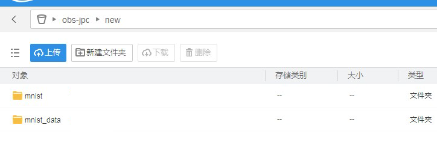
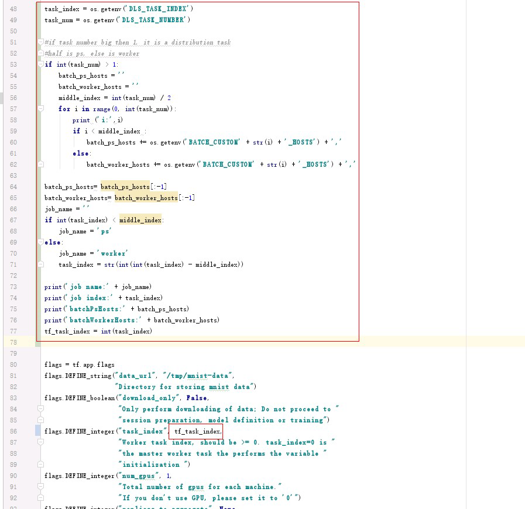
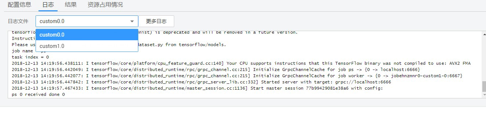

# 示例：使用自定义镜像创建训练作业

本示例所需的文件存储在[Github目录](https://github.com/huaweicloud/ModelArts-Lab/tree/master/docs/custom_image/mnist)中。本示例使用MNIST训练数据，数据集可从[MNIST官网](http://yann.lecun.com/exdb/mnist/)下载。示例中的分布式和单机的区别主要在于脚本和运行命令不一样，使用的镜像都为同一个。

-   “mnist\_softmax.py“为单机脚本。
-   “mnist\_replica\_kill.py“为分布式脚本。

## 单机训练示例

1.  下载基础镜像，安装 Tensorflow 深度学习库，然后把镜像push到SWR。也可以采用[Dockerfile](https://github.com/huaweicloud/ModelArts-Lab/blob/master/docs/custom_image/mnist/Dockerfile)在SWR上构建。
2.  将“mnist\_softmax.py“和训练数据上传至OBS。现将脚本和数据都放在代码目录下，以便直接下载到容器中。

    **图 1**  上传训练脚本和数据  
    

3.  创建自定义镜像训练作业，数据存储位置和训练输出位置请根据实际情况填写。
    -   “镜像地址“：填写刚上传镜像的“SWR\_URL“。
    -   “运行命令“：

        **bash /home/work/run\_train.sh python /home/work/user-job-dir/new/mnist/mnist\_softmax.py --data\_url /home/work/user-job-dir/new/mnist\_data**

        其中，“/home/work/user-job-dir/new/mnist/mnist\_softmax.py“为下载下来训练脚本的位置，“--data\_url /home/work/user-job-dir/new/mnist\_data“为数据的位置。由于已经把数据放在代码目录中，容器已经下载了代码目录，所以直接使用本地的。

4.  自定义镜像审核成功后，后台会直接执行自定义镜像训练作业。程序执行成功后，日志信息如下所示。

    **图 2**  运行日志信息  
    

## 分布式训练示例

1.  分布式例子和单机的例子不同的点在于需要修改“python“文件。对“DLS\_TASK\_INDEX“和“DLS\_TASK\_NUMBER“进行处理，来适配脚本所需参数，决定当前容器的功能。当前脚本的功能是将前两个容器作为“ps“，后两个容器作为“worker“。

    **图 3**  脚本修改  
    

    其中，运行命令为:

    **bash /home/work/run\_train.sh python /home/work/user-job-dir/new/mnist/mnist\_replica\_kill.py --data\_url /home/work/user-job-dir/new/mnist\_data**

2.  计算节点个数选择多个（即至少大于1），其他设置与单机一样。执行结果如下所示。

    **图 4**  运行结果日志  
    

