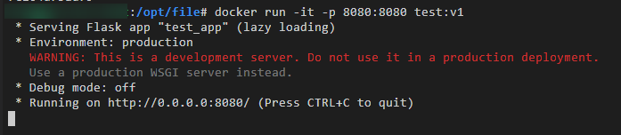
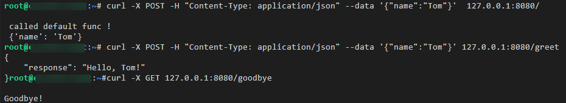
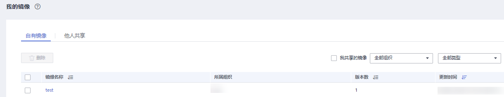
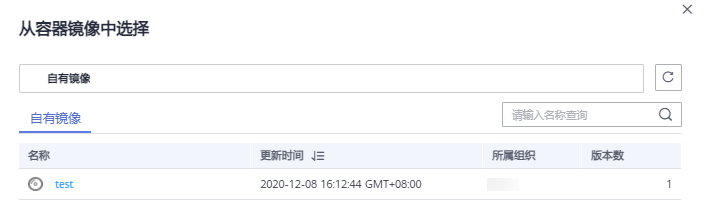
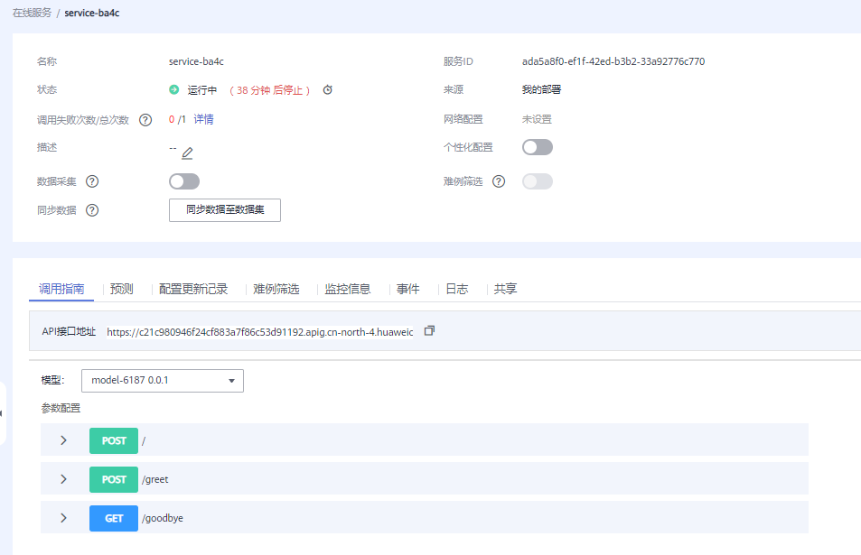
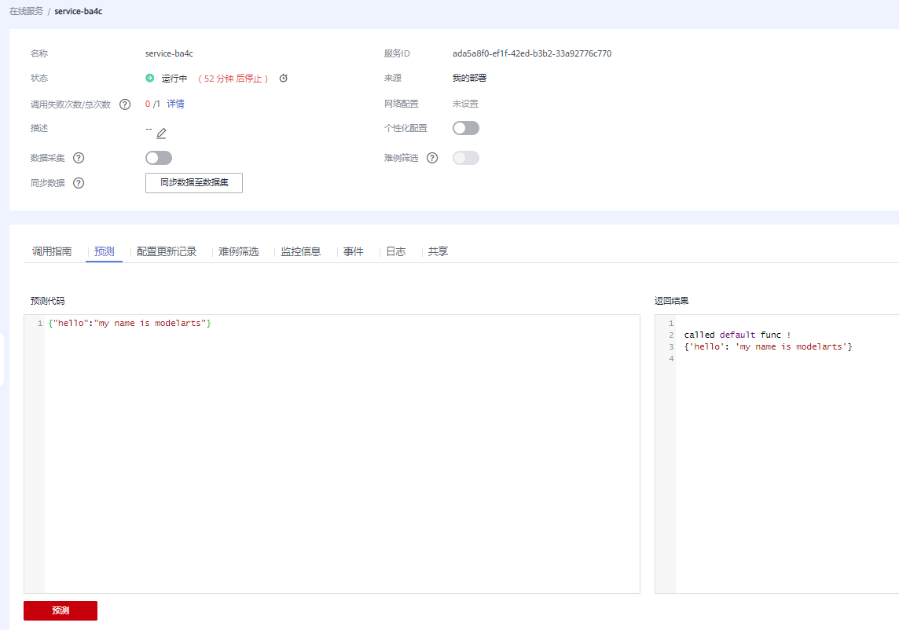

# 示例：使用自定义镜像导入模型<a name="modelarts_23_0270"></a>

针对ModelArts目前不支持的AI引擎，您可以通过自定义镜像的方式将编写的模型导入ModelArts。本示例详细介绍如何使用自定义镜像完成模型导入。

## 本地构建镜像<a name="section537112981619"></a>

以linux x86\_x64架构的主机为例，您可以购买相同规格的ECS或者应用本地已有的主机进行自定义镜像的制作。

1.  安装Docker，可参考[Docker官方文档](https://docs.docker.com/engine/install/binaries/#install-static-binaries)。可参考以下方式安装docker。

    ```
    curl -fsSL get.docker.com -o get-docker.sh
    sh get-docker.sh
    ```

2.  获取基础镜像。本示例以Ubuntu18.04为例。

    ```
    docker pull ubuntu:18.04
    ```

3.  新建文件夹“self-define-images“，在该文件夹下编写自定义镜像的“Dockerfile“文件和应用服务代码“test\_app.py“。本样例代码中，应用服务代码采用了flask框架。

    文件结构如下所示

    ```
    self-define-images/
        --Dockerfile
        --test_app.py
    ```

    -   “Dockerfile“

        ```
        From ubuntu:18.04
        # 配置华为云的源，安装 python、python3-pip 和 Flask
        RUN cp -a /etc/apt/sources.list /etc/apt/sources.list.bak && \
          sed -i "s@http://.*security.ubuntu.com@http://repo.huaweicloud.com@g" /etc/apt/sources.list && \
          sed -i "s@http://.*archive.ubuntu.com@http://repo.huaweicloud.com@g" /etc/apt/sources.list && \
          apt-get update && \
          apt-get install -y python3 python3-pip && \
          pip3 install  --trusted-host https://repo.huaweicloud.com -i https://repo.huaweicloud.com/repository/pypi/simple  Flask
        
        # 拷贝应用服务代码进镜像里面
        COPY test_app.py /opt/test_app.py
        
        # 指定镜像的启动命令
        CMD python3  /opt/test_app.py
        ```

    -   “test\_app.py“

        ```
        from flask import Flask, request
        import json 
        app = Flask(__name__)
        
        @app.route('/greet', methods=['POST'])
        def say_hello_func():
            print("----------- in hello func ----------")
            data = json.loads(request.get_data(as_text=True))
            print(data)
            username = data['name']
            rsp_msg = 'Hello, {}!'.format(username)
            return json.dumps({"response":rsp_msg}, indent=4)
        
        @app.route('/goodbye', methods=['GET'])
        def say_goodbye_func():
            print("----------- in goodbye func ----------")
            return '\nGoodbye!\n'
        
        
        @app.route('/', methods=['POST'])
        def default_func():
            print("----------- in default func ----------")
            data = json.loads(request.get_data(as_text=True))
            return '\n called default func !\n {} \n'.format(str(data))
        
        # host must be "0.0.0.0", port must be 8080
        if __name__ == '__main__':
            app.run(host="0.0.0.0", port=8080)
        ```

        > **说明：** 
        >modelarts 平台会将请求转发至自定义镜像起的服务的8080端口，故容器内的服务监听的端口必须是8080，如 test\_app.py文件所示。


4.  进入“self-define-images“文件夹，执行以下命令构建自定义镜像“test:v1”。

    ```
    docker build -t test:v1 .
    ```

5.  您可以使用“docker image“查看您构建的自定义镜像。

## 本地验证镜像并上传镜像至SWR服务<a name="section048011101569"></a>

1.  在本地环境执行以下命令启动自定义镜像

    ```
    docker run -it -p 8080:8080 test:v1
    ```

    **图 1**  启动自定义镜像<a name="fig1060013135570"></a>  
    

2.  另开一个终端，执行以下命令验证自定义镜像的三个API接口功能。

    ```
    curl -X POST -H "Content-Type: application/json" --data '{"name":"Tom"}'  127.0.0.1:8080/
    curl -X POST -H "Content-Type: application/json" --data '{"name":"Tom"}' 127.0.0.1:8080/greet
    curl -X GET 127.0.0.1:8080/goodbye
    ```

    如果验证自定义镜像功能成功，结果如下图所示。

    **图 2**  校验接口<a name="fig1160014132577"></a>  
    


1.  上传自定义镜像至SWR服务。上传镜像的详细操作可参考[SWR用户指南](https://support.huaweicloud.com/usermanual-swr/swr_01_0011.html)。
2.  完成自定义镜像上传后，您可以在“容器镜像服务\>我的镜像\>自有镜像“列表中看到已上传镜像。

    **图 3**  上传镜像列表<a name="modelarts_23_0270_fig1657118467164"></a>  
    


## 选择从容器镜像中导入模型<a name="section1610615113496"></a>

参考[从容器镜像中选择元模型](从容器镜像中选择元模型.md)导入模型，您需要特别关注以下参数：

-   元模型来源：选择“从容器镜像中选择“
-   容器镜像所在的路径：选择已制作好的自有镜像

    **图 4**  选择已制作好的自有镜像<a name="fig47202015173211"></a>  
    

-   配置文件：选择“在线编辑“，配置文件详细要求参考[模型配置文件编写说明](模型配置文件编写说明.md)。编辑完成后单击“保存“。

    本样例的配置文件如下所示

    ```
    {
        "model_algorithm": "test_001",
        "model_type": "Image",
        "apis": [{
            "protocol": "http",
            "url": "/",
            "method": "post",
            "request": {
                "Content-type": "application/json"
            },
            "response": {
                "Content-type": "application/json"
            }
        },
    {
            "protocol": "http",
            "url": "/greet",
            "method": "post",
            "request": {
                "Content-type": "application/json"
            },
            "response": {
                "Content-type": "application/json"
            }
        },
    {
            "protocol": "http",
            "url": "/goodbye",
            "method": "get",
            "request": {
                "Content-type": "application/json"
            },
            "response": {
                "Content-type": "application/json"
            }
        }
    ]
    }
    ```


## 将模型部署为在线服务<a name="section11593124119461"></a>

1.  参考[部署为在线服务](部署为在线服务.md)将模型部署为在线服务。
2.  在线服务创建成功后，您可以在服务详情页查看服务详情。

    **图 5**  调用指南<a name="fig2407195510136"></a>  
    

3.  您可以通过“预测“页签访问在线服务。

    **图 6**  访问在线服务<a name="fig8929313600"></a>  
    


