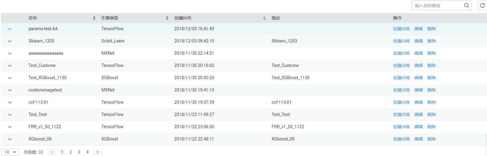

# 管理作业参数

创建训练作业时，您可以将训练作业的参数保存在ModelArts中，再次创建训练作业时，可一键使用已存储的作业参数，使得训练作业的创建高效便捷。

在创建训练作业、编辑训练作业、查看训练作业等操作过程中，保存的作业参数都将存储在“作业参数管理“页面中。

## 使用作业参数

-   方式:1：在“作业参数管理“页面使用

    登录ModelArts管理控制台，在左侧导航栏中选择“训练作业“，然后单击“作业参数管理“页签。在已有的作业参数列表中，单击“创建训练“，可快速将此作业参数用于创建一个新的训练作业。

-   方式2：在创建训练作业页面使用

    在创建训练作业页面中，在“一键式参数配置参数“中，根据界面提示操作，选择需要使用的作业参数，快速创建一个可用的训练作业。

**图 1**  作业参数管理  

## 编辑作业参数

1.  登录ModelArts管理控制台，在左侧导航栏中选择“训练作业“，然后单击“作业参数管理“页签。
2.  在作业参数列表中，单击“操作“列的“编辑“。
3.  在打开的作业参数页面，参见[表1](创建训练作业.md#table1819364517144)，修改相关参数，然后单击“确定“保存此作业参数。

    其中，作业参数的“名称“，不支持修改。

## 删除作业参数

1.  登录ModelArts管理控制台，在左侧导航栏中选择“训练作业“，然后单击“作业参数管理“页签。
2.  在作业参数列表中，单击“操作“列的“删除“。
3.  确认弹出对话框的信息，单击“确定“，完成删除操作。

    > **说明：**   
    >作业参数删除后不可恢复，请谨慎操作。  

