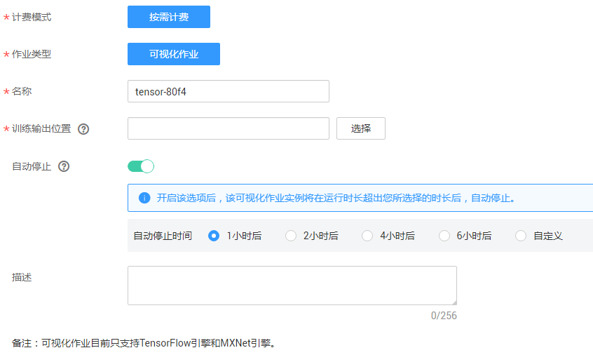
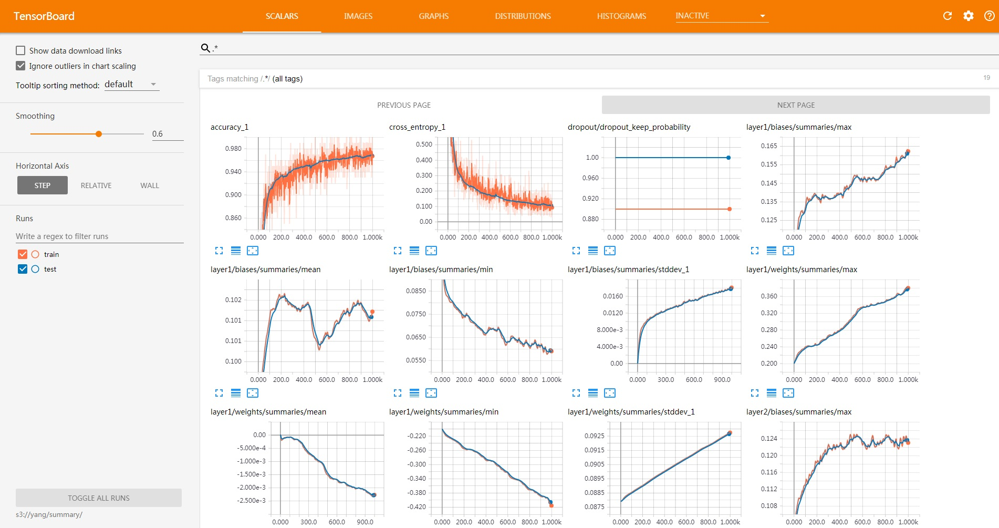

# 管理可视化作业<a name="modelarts_23_0050"></a>

当前，您管理的ModelArts可视化作业默认为TensorBoard类型的。

TensorBoard是一个可视化工具，能够有效地展示TensorFlow在运行过程中的计算图、各种指标随着时间的变化趋势以及训练中使用到的数据信息。TensorBoard当前只支持基于TensorFlow和MXNet引擎的训练作业。TensorBoard相关概念请参考[TensorBoard官网](https://www.tensorflow.org/guide/#tensorboard)。

对于采用AI引擎为TensorFlow和MXNet的训练作业，您可以使用模型训练时产生的Summary文件来创建TensorBoard作业。

> **说明：**   
>目前只有“华北-北京四”区域支持使用可视化作业功能。  

## 前提条件<a name="section8661181014569"></a>

为了保证训练结果中输出Summary文件，在编写训练脚本时，您需要在代码中添加Summary相关代码。

-   使用TensorFlow引擎编写程序时

    使用基于TensorFlow的MoXing时，需要将“mox.run“中设置参数“save\_summary\_steps\>0“，并且超参“summary\_verbosity≥1“。

    如果您想显示其他指标，可以在“model\_fn“的返回值类型“mox.ModelSpec“的“log\_info“中添加张量（仅支持0阶张量，即标量），添加的张量会被写入到Summary文件中。如果您希望在Summary文件中写入更高阶的张量，只需要在“model\_fn“中使用TensorFlow原生的“tf.summary“的方式添加即可。

-   使用MXNet引擎编写程序时

    需要在代码里添加Summary相关代码，代码内容如下所示：

    ```
    batch_end_callbacks.append(mx.contrib.tensorboard.LogMetricsCallback('s3路径'))
    ```


## 注意事项<a name="section76683231945"></a>

-   运行中的可视化作业会一直按需计费，当您不需要使用时，建议停止可视化作业，避免产生不必要的费用。可视化作业支持自动停止功能，即在指定时间后停止可视化作业，为避免产生不必要的费用，推荐启用此功能。
-   默认使用CPU资源运行可视化作业，且不支持修改为其他资源池。
-   确保您使用的OBS目录与ModelArts在同一区域。

## 创建可视化作业<a name="section1020112915311"></a>

1.  登录ModelArts管理控制台，在左侧导航栏中选择“训练作业“，然后单击“可视化作业“页签。
2.  在可视化作业列表中，单击左上方“创建“，进入“创建可视化作业“界面。
3.  其中，“计费模式“设置为“按需计费“，“作业类型“为“TensorBoard“，不可更改。请根据实际情况填写可视化作业“名称“、“描述“，设置“训练输出位置“和“自动停止“参数。

    -   “训练输出位置“：选择创建训练作业时的“训练输出位置“。
    -   “自动停止“：设置是否开启自动停止功能。由于运行中的可视化作业会一直计费，为避免产生不必要的费用，您可以开启自动停止功能，在指定时间后自动停止可视化作业。目前支持设置为“1小时后“、“2小时后“、“4小时后“、“6小时后“、“自定义“。如果选择“自定义“的模式，可在右侧输入框中输入1\~24范围内的任意整数。

    **图 1**  创建可视化作业<a name="fig552516971113"></a>  
    

4.  参数填写完成后，单击“下一步“进行规格确认。
5.  规格确认无误后，单击“立即创建“，完成可视化作业的创建。

    在可视化作业列表中，当状态变为“运行中“时，表示TensorBoard已创建完成。您可以单击可视化作业名称进入查看详情。


## 打开可视化作业<a name="section753201719445"></a>

在可视化作业列表中，单击可视化作业名称，即可打开TensorBoard显示界面，如[图2](#fig10383193183613)所示。只有“运行中“状态的可视化作业支持打开。

**图 2**  TensorBoard界面<a name="fig10383193183613"></a>  


## 运行或停止可视化作业<a name="section145180461716"></a>

-   **停止可视化作业**：由于“运行中“的可视化作业将一直按需计费，在不需要使用时，您可以停止可视化作业停止计费。在可视化作业列表中，单击“操作“列的“停止“，即可停止可视化作业。
-   **运行可视化作业**：对于“已取消“状态的可视化作业，您可以重新运行并使用可视化作业。在可视化作业列表中，单击“操作“列的“运行“，即可运行可视化作业。

## 删除可视化作业<a name="section5577717813"></a>

如果您的可视化作业不再使用，您可以删除可视化作业释放资源。在可视化作业列表中，单击“操作“列的“删除“，即可删除可视化作业。

> **说明：**   
>可视化作业删除后不可恢复，需重新创建可视化作业。请谨慎操作。  

