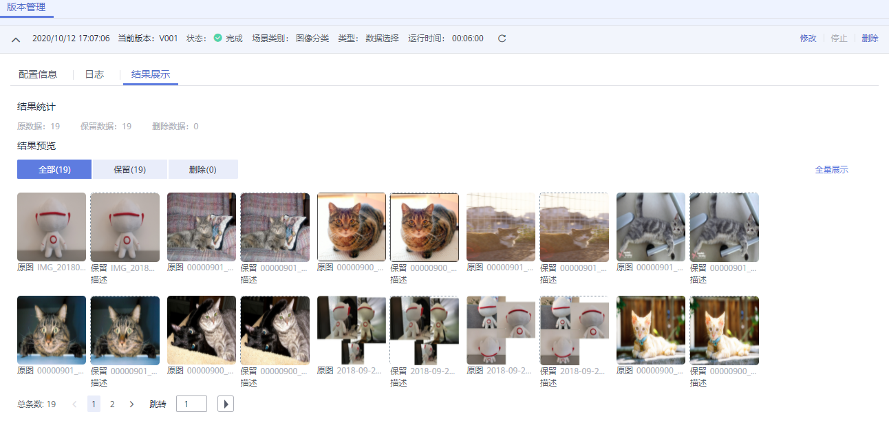

# 管理和查看数据处理任务

## 删除数据处理任务

当已有的数据处理任务不再使用时，您可以删除数据处理任务。

处于“完成“、“失败“、“已停止“、“运行失败“、“部署中“状态的训练作业，您可以单击操作列的“删除“，删除对应的数据处理任务。

## 查看数据处理任务详情

1.  登录ModelArts管理控制台，在左侧的导航栏中选择“数据管理\>数据处理“，进入“数据处理“页面。
2.  在数据处理列表中，单击数据处理任务名称，进入数据处理任务的版本管理页面。您可以在该页面进行数据处理任务的“修改“与“删除“。

    **图 1**  数据处理版本管理页面  
    

3.  您可以在版本管理页面，通过切换页签查看“配置信息“、“日志“和“结果展示“。

    **图 2**  日志页面  
    

    **图 3**  结果展示页面  
    

