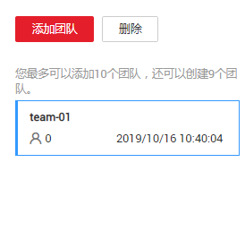

# 管理团队

团队标注功能是以团队为单位进行管理，数据集启用团队标注功能时，必须指定一个团队。一个团队可以添加多个成员。

## 背景说明

-   一个帐号最多可添加10个团队。
-   如果数据集需要启用团队标注功能，当前帐号至少拥有一个团队。如果没有，请执行[添加团队](#zh-cn_topic_0186456617_section165361815383)操作添加。

## 添加团队

1.  在ModelArts管理控制台左侧导航栏中，选择“数据管理\>标注团队“，进入“标注团队“管理页面。
2.  在“标注团队“管理页面，单击“添加团队“。
3.  在弹出的“添加团队“对话框中，填写团队“名称“和“描述“，然后单击“确定“。完成标注团队的添加。

    **图 1**  添加团队  
    

    团队添加完成后，“标注团队“管理页面呈现新添加的团队，在页面右侧区域，可以查看团队详情。新添加的团队，其成员列表为空，请参考[添加成员](管理成员.md#zh-cn_topic_0186456618_section060323818470)操作，为您的团队添加成员。

## 删除团队

当已有的团队不再使用，您可以执行删除操作。

在“标注团队“管理页面中，选中需删除的团队，然后单击“删除“。在弹出的对话框中，确认信息无误后，单击“确定“完成团队删除。

**图 2**  删除团队  

