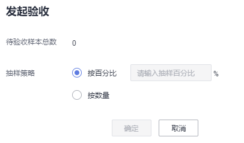
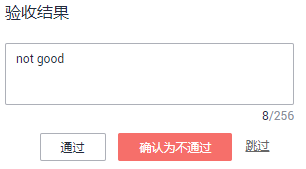

# 管理团队标注任务

数据标注支持创建团队标注任务，将标注任务指派给不同的团队，由多人完成标注任务。同时，在成员进行数据标注过程中，支持发起验收、继续验收以及查看验收报告等功能。

## 团队标注作业的创建方式

-   从控制台的“数据管理 \>数据标注“页面进入，创建标注作业时，打开“启用团队标注”开关，同时指定一个标注团队，或者指定标注管理员。

    **图 1**  创建团队标注作业  
    

-   从控制台的“数据管理 \>数据集“页面进入，对于同一个数据集，可以创建多个团队标注任务。

    **图 2**  在数据集列表中创建团队标注任务  
    

    **图 3**  在数据集概览页中，选择标注标注任务页签，点击“新建标注任务”，创建团队标注任务  
    

    **图 4**  在数据集详情页创建团队标注任务  
    

    > **说明：** 
    >-   当标注人员第一次收到标注邮件时，会告知标注的地址\(labelConsole\)以及默认初始密码。
    >-   只有当创建团队标注任务时，标注人员才会收到邮件。创建标注团队及添加标注团队的成员并不会发送邮件。此外，当所有样本都是已标注状态时，创建团队标注任务也不会收到邮件。

## 创建团队标注任务

同一个数据集，支持创建多个团队标注作业，指派给同一团队的不同成员，或者指派给其他标注团队。

1.  登录ModelArts管理控制台，在左侧菜单栏中选择“数据管理 \>数据集“，打开数据集列表。
2.  在数据集列表中，选择支持团队标注的数据集，单击数据集名称进入数据集概览页。
3.  在数据集概览页中，单击“标注任务“页签，可查看此数据集已有的标注任务。单击左上角的“新建标注任务“开始创建新任务。

    **图 5**  标注任务  
    

    或者也可以从“数据管理 \>数据标注“页面进入，单击“创建标注作业”进入创建标注作业页面。

4.  在弹出的“创建标注作业“页面中，填写相关参数，然后单击“确定“，完成任务创建。
    -   “名称“：设置此任务的名称。
    -   **“标注场景”**：选择标注作业的任务类型。
    -   “标签集“：展示当前数据集已有的标签及标签属性。
    -   **“启用团队标注”**：选择打开，并配置如下团队标注相关参数。

        -   “类型“：设置任务类型，支持“指定标注团队“或“指定标注管理员“。
        -   “选择标注团队“：任务类型设置为“指定标注团队“，需在此参数中指定一个团队，同时勾选此团队中某几个成员负责标注。下拉框中将罗列当前帐号下创建的标注团队及其成员。
        -   “选择标注接口人“：任务类型设置为“指定标注管理员“，需在所有团队的“Team Manager“中选择一人作为管理员。
        -   “自动将新增图片同步给标注团队“：根据需要选择是否将任务中新增的数据自动同步给标注人员。
        -   “团队标注的图片自动加载智能标注结果“：根据需要选择是否将任务中智能标注待确认的结果自动同步给标注人员。

            > **说明：** 
            >团队标注加载智能标注结果的处理步骤：
            >-   如果类型选择"指定标注团队"，需要先创建团队标注任务，然后执行智能标注任务。
            >-   如果类型选择"指定标注管理员"，需要登录labelconsole先执行"分配任务"，然后执行智能标注任务。

            **图 6**  创建团队标注任务  
            

        任务创建完成后，您可以在“标注任务“页签下看到新建的任务。

## 进入标注（团队成员）

在标注任务创建后，被分配任务的团队成员将收到一封通知邮件，标题为“您有新的标注任务待查收”。

在邮件详情中，单击标注任务链接进入数据标注平台，使用您的“邮箱地址“及“初始密码“登录标注平台系统。首次登录时，需根据提示修改密码。关于标注平台的详细说明，请参见[什么是数据标注平台](https://support.huaweicloud.com/modelarts_faq/modelarts_05_0257.html)。

> **说明：** 
>首次登录时，请务必修改密码。如果未修改，将导致下一次无法正常登录。

登录数据标注平台后，可查看到分配的标注任务，单击任务名称，可进入标注页面。不同类型的数据集，标注方式不同，详细请参见：

-   [图像分类](图像分类.md#section888019266174)
-   [物体检测](物体检测.md#section888019266174)
-   [文本分类](文本分类.md#section888019266174)
-   [命名实体](命名实体.md#section888019266174)
-   [文本三元组](文本三元组.md#section888019266174)

在标注平台中，每个成员可查看“未标注“、“待修正“、“已驳回“、“待审核“、“审核通过“、“验收通过“的图片信息。请及时关注管理员驳回以及待修正的图片。

当团队标注任务中，分配了Reviewer角色，则需要对标注结果进行审核，审核完成后，再提交给管理员验收。

**图 7**  成员标注平台  

## 任务验收（管理员）

-   **发起验收**

    当团队的成员已完成数据标注，标注作业的创建者可发起验收，对标注结果进行抽验。只有当标注成员存在标注完成的数据时，才可以发起验收，否则发起验收按钮为灰色。

    1.  录ModelArts管理控制台，在左侧菜单栏中选择“数据管理 \>数据标注“，打开数据标注管理页。
    2.  在数据标注作业列表，选择团队标注作业，点击作业名称进入“标注作业详情页”，单击右上角“发起验收“。
    3.  在弹出的对话框中，设置“抽样策略“，可设置为“按百分比“，也可以设置为“按数量“。设置好参数值后，单击“确定“启动验收。

        “按百分比“：按待验收图片总数的一定比例进行抽样验收。

        “按数量“：按一定数量进行抽样验收。

        **图 8**  发起验收  
        

    4.  验收启动后，界面将展示实时验收报告，您可以在右侧选择“验收结果“（“通过“或“不通过“）。

        当选择验收结果为“通过“时，需设置“验收评分“（分“A“、“B“、“C“、“D“四个选项，“A“表示最高分），如[图10](#zh-cn_topic_0209053802_fig119710204340)所示。当选择验收结果为“不通过“时，可以在文本框中写明驳回原因，如[图11](#zh-cn_topic_0209053802_fig1414741016354)所示。

        **图 9**  查看实时验收报告  
        

        **图 10**  设置验收结果为“通过”  
        

        **图 11**  设置验收结果为“不通过”  
        

-   **继续验收**

    针对未完成验收的任务，可以继续验收。针对未发起过验收流程的任务，不支持“继续验收“，按钮为灰色。

    在“标注任务进展“页签中，针对需继续验收的任务，单击“继续验收“。系统直接进入“实时验收报告“页面，您可以继续验收未验收的图片，设置其“验收结果“。

-   **完成验收**

    在完成验收窗口，您可以查看本标注作业的验收情况，如抽样文件数等，同时设置如下参数，然后进行验收。只有完成验收，标注信息才会同步到标注作业的已标注页面中。

    一旦标注数据完成验收，团队成员无法再修改标注信息，只有数据集创建者可修改。

    **表 1**  完成验收的参数设置

    
    <table><thead align="left"><tr id="zh-cn_topic_0209053802_row0729021379"><th class="cellrowborder" valign="top" width="25.740000000000002%" id="mcps1.2.3.1.1">
参数

    </th>
    <th class="cellrowborder" valign="top" width="74.26%" id="mcps1.2.3.1.2">
说明

    </th>
    </tr>
    </thead>
    <tbody><tr id="zh-cn_topic_0209053802_row57291525379"><td class="cellrowborder" valign="top" width="25.740000000000002%" headers="mcps1.2.3.1.1 ">
对已标注数据修改

    </td>
    <td class="cellrowborder" valign="top" width="74.26%" headers="mcps1.2.3.1.2 "><ul id="zh-cn_topic_0209053802_ul1270313159019"><li>不覆盖：针对同一个数据，不使用当前团队标注的结果覆盖已有数据。</li><li>覆盖：针对同一个数据，使用当前团队标注的结果覆盖已有数据。覆盖后无法恢复，请谨慎操作。</li></ul>
    </td>
    </tr>
    <tr id="zh-cn_topic_0209053802_row187292211374"><td class="cellrowborder" valign="top" width="25.740000000000002%" headers="mcps1.2.3.1.1 ">
通过范围

    </td>
    <td class="cellrowborder" valign="top" width="74.26%" headers="mcps1.2.3.1.2 "><ul id="zh-cn_topic_0209053802_ul203233533371"><li>全部：当前团队标注完成的所有数据。包含验收通过、未验收和验收不通过的。即本数据集的所有抽样文件数。</li><li>全部不通过：当前团队标注完成的所有数据不通过验收，即将所有标注数据驳回给标注人员。全部数据指验收通过、未验收和验收不通过的所有数据，
即本数据集的所有抽样文件数。

    </li><li>验收通过和未验收的数据：针对抽样文件中验收通过和未验收的数据，通过验收。验收不通过的数据将驳回给标注人员。</li><li>验收通过的数据：针对抽样文件中验收通过的数据，通过验收。未验收和验收不通过的数据将驳回给标注人员。</li></ul>
    </td>
    </tr>
    </tbody>
    </table>

    **图 12**  完成验收  
    

## 查看验收报告

针对进行中或已完成的标注任务，都可以查看其验收报告。在“标注任务进展“页签中，单击“验收报告“，即可在弹出的“验收报告“对话框中查看详情。

**图 13**  查看验收报告  

## 删除标注任务

针对不再使用的标注任务，您可以在“标注任务进展“页签下，单击任务所在行的删除。任务删除后，未验收的标注详情将丢失，请谨慎操作。但是数据集中的原始数据以及完成验收的标注数据仍然存储在对应的OBS桶中。

