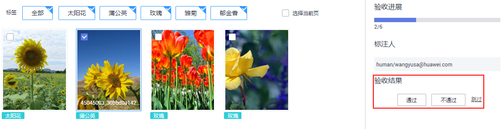
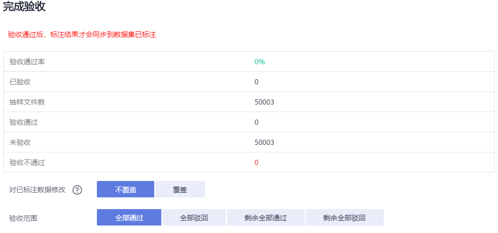
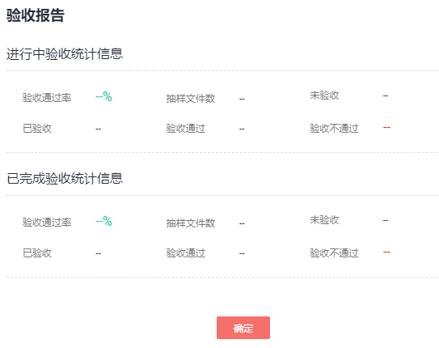

# 管理团队标注任务

针对启用团队标注功能的数据集，支持创建团队标注任务，将标注任务指派给不同的团队，由多人完成标注任务。同时，在成员进行数据标注过程中，支持发起验收、继续验收以及查看验收报告等功能。

## 创建团队标注任务

如果您在创建数据集时，即启用团队标注，且指派了某一团队负责标注，系统将默认基于此团队创建一个标注任务。您可以在数据集创建后，在数据集的“标注任务进展”页面查看此任务。

您还可以重新创建一个团队标注任务，指派给统一团队的不同成员，或者指派给其他标注团队。

1.  登录ModelArts管理控制台，在左侧菜单栏中选择“数据管理（Beta） \> 数据集“，打开数据集列表。
2.  在数据集列表中，选择支持团队标注的数据集，单击数据集名称进入数据集概览页。
3.  在数据集概览页中，单击“标注任务进展“页签，可查看此数据集已有的标注任务。单击右上角的“创建团队标注任务“开始创建新任务。

    **图 1**  标注任务  
    

4.  在弹出的“创建团队标注任务“对话框中，填写相关参数，然后单击“确定“，完成任务创建。
    -   “名称“：设置此任务的名称。
    -   “类型“：设置任务类型，支持“指定标注团队“或“指定标注管理员“。
    -   “选择标注团队“：任务类型设置为“指定标注团队“，需在此参数中指定一个团队，同时勾选此团队中某几个成员负责标注。下拉框中将罗列当前账号下创建的标注团队及其成员，团队管理的操作指导请参见[团队标注简介](团队标注简介.md)。
    -   “选择标注接口人“：任务类型设置为“指定标注管理员“，需在所有团队的“Team Manager“中选择一人作为管理员。
    -   “标签集“：展示当前数据集已有的标签及标签属性。在“标签集“下方也可以设置“自动将新增图片同步给标注团队“或“团队标注的图片自动加载智能标注结果“。

        **图 2**  创建团队标注任务  
        

        任务创建完成后，您可以在“标注任务进展“页签下看到新建的任务。

## 任务验收

-   **发起验收**

    当团队的成员已完成数据标注，数据集的创建者可发起验收，对标注结果进行抽验。

    1.  在“标注任务进展“页签中，针对需发起验收的任务，单击“发起验收“。
    2.  在弹出的对话框中，设置“抽样策略“，可设置为“按百分比抽样“，也可以设置为“按数量抽样“。设置好参数值后，单击“确定“启动验收。

        “按百分比抽样“：按待验收图片总数的一定比例进行抽样验收。

        “按数量抽样“：按一定数量进行抽样验收。

        **图 3**  发起验收  
        

    3.  验收启动后，界面将展示实时验收报告，您可以在右侧选择“验收结果“（“通过“或“不通过“）。

        当选择验收结果为“通过“时，需设置“验收评分“（分“A“、“B“、“C“、“D“四个选项，“A“表示最高分），如[图5](#fig119710204340)所示。当选择验收结果为“不通过“时，可以在文本框中写明驳回原因，如[图6](#fig1414741016354)所示。

        **图 4**  查看实时验收报告  
        

        **图 5**  设置验收结果为“通过”  
        

        **图 6**  设置验收结果为“不通过”  
        

-   **继续验收**

    针对未完成验收的任务，可以继续验收。针对未发起过验收流程的任务，不支持“继续验收“，按钮为灰色。

    在“标注任务进展“页签中，针对需继续验收的任务，单击“继续验收“。系统直接进入“实时验收报告“页面，您可以继续验收上一次未通过的图片，设置其“验收结果“。

-   **完成验收**

    当所有图片已完成验收后，可单击右上角“完成验收“完成本次验收操作。在弹出的“完成验收“对话框中，查看验收的情况报告，确认无误后，单击“验收通过“。如果验收数据不符合要求，也可单击“验收驳回“，继续进行数据标注和验收。

    一旦标注数据完成验收，团队成员无法再修改标注信息，只有数据集创建者可修改。

    **图 7**  完成验收  
    

## 查看验收报告

针对进行中或已完成的标注任务，都可以查看其验收报告。在“标注任务进展“页签中，单击“验收报告“，即可在弹出的“验收报告“对话框中查看详情。

**图 8**  查看验收报告  

## 删除标注任务

针对不再使用的标注任务，您可以在“标注任务进展“页签下，单击任务所在行的删除。任务删除后，未验收的标注详情将丢失，请谨慎操作。但是数据集中的原始数据以及完成验收的标注数据仍然存储在对应的OBS桶中。

