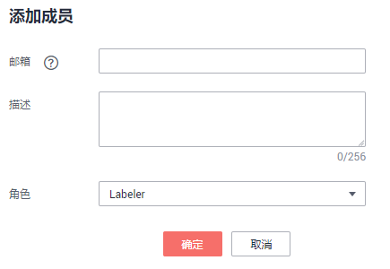

# 管理成员

新添加的团队，其成员列表为空。您需要根据实际情况添加即将参与标注任务的成员信息。

一个团队最多支持添加100个成员，当超过100时，建议分为多个团队进行管理。

## 添加成员

1.  在ModelArts管理控制台左侧导航栏中，选择“数据管理Beta \> 标注团队“，进入“标注团队“管理页面。
2.  在“标注团队“管理页面，从左侧团队列表中选择一个团队，单击团队，其右侧区域将呈现“团队详情“。
3.  在“团队详情“区域，单击“添加成员“。
4.  在弹出的“添加成员“对话框中，填写成员的“邮箱“、“描述“、指定“角色“，然后单击“确定“。

    其中，“角色“支持“Laber“、“Reviewer“和“Team Manager“，“Team Manager“只能设置为一个人。

    **图 1**  添加成员  
    

    成员添加完成后，团队详情区域中将呈现此成员的信息。

## 修改成员信息

团队中的成员，当其信息发生变化时，可以编辑其基本情况。

1.  在“团队详情“区域，选择需修改的成员。
2.  在成员所在行的“操作“列，单击“修改“。在弹出的对话框中，修改其“描述“或“角色“。

    成员的“邮箱“无法修改，如果需要修改邮箱地址，建议先删除此成员，然后再基于新的邮箱地址添加新成员。

    “角色“支持“Laber“、“Reviewer“和“Team Manager“，“Team Manager“只能设置为一个人。

## 删除成员

-   **删除单个成员**

    在“团队详情“区域，选择需要删除的成员， 单击“操作“列的“删除“。在弹出的对话框中，确认信息无误后，单击“确定“完成删除操作。

-   **批量删除**

    在“团队详情“区域，勾选需删除的成员，然后单击“删除“。在弹出的对话框中，确认信息无误后，单击“确定“完成多个成员的删除操作。

    **图 2**  批量删除  
    

