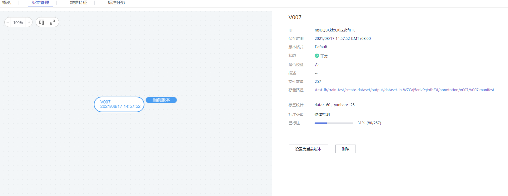
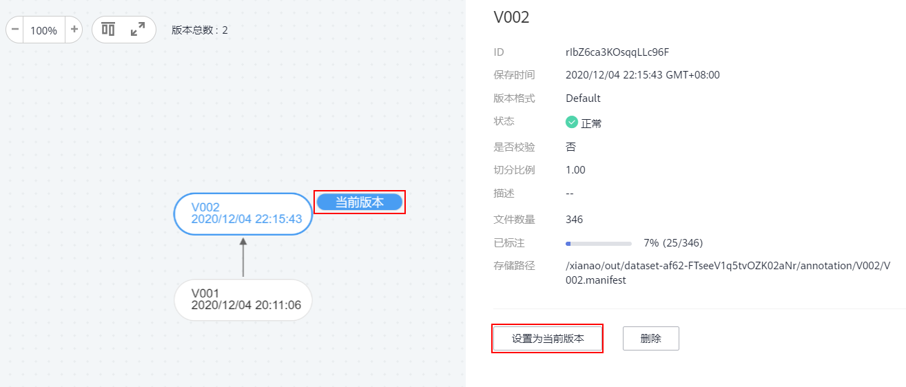

# 管理数据集版本

数据标注完成后，您可以发布成多个版本对数据集进行管理。针对已发布生产的数据集版本，您可以通过查看数据集演进过程、设置当前版本、删除版本等操作，对数据集进行管理。数据集版本的相关说明，请参见[关于数据集版本](发布数据集.md#section38541340654)。

发布为新版本的说明，请参见[发布数据集](发布数据集.md)。

## 查看数据集演进过程

1.  登录ModelArts管理控制台，在左侧菜单栏中选择“数据管理（Beta） \> 数据集“，进入“数据集“管理页面。
2.  在数据集列表中，单击操作列的“更多 \> 版本管理“，进入数据集“版本管理“页面。

    您可以查看数据集的基本信息，并在左侧查看版本及其发布时间。

    **图 1**  查看数据集版本  
    

## 设置当前版本

1.  登录ModelArts管理控制台，在左侧菜单栏中选择“数据管理（Beta） \> 数据集“，进入“数据集“管理页面。
2.  在数据集列表中，单击操作列的“更多 \> 版本管理“，进入数据集“版本管理“页面。
3.  在“版本管理“页面中，选择对应的数据集版本，在数据集版本基本信息区域，单击“设置为当前版本“。设置完成后，版本名称右侧将显示为“当前版本“。

    > **说明：**   
    >只有状态为“正常“的版本，才能被设置为当前版本。  

    **图 2**  设置当前版本  
    

## 删除数据集版本

1.  登录ModelArts管理控制台，在左侧菜单栏中选择“数据管理（Beta） \> 数据集“，进入“数据集“管理页面。
2.  在数据集列表中，单击操作列的“更多 \> 版本管理“，进入数据集“版本管理“页面。
3.  选择需删除的版本所在行，单击操作列的“删除“。在弹出的对话框中确认信息，然后单击“确定“完成删除操作。

    > **说明：**   
    >删除数据集版本不会删除原始数据，数据及其标注信息仍存在在对应的OBS目录下。但是，执行删除操作后，无法在ModelArts管理控制台清晰的管理数据集版本，请谨慎操作。  

