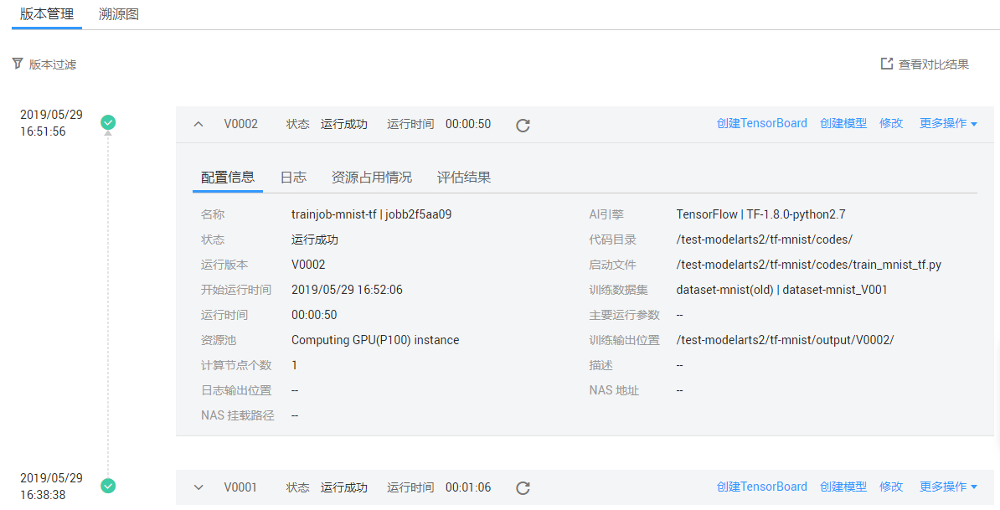
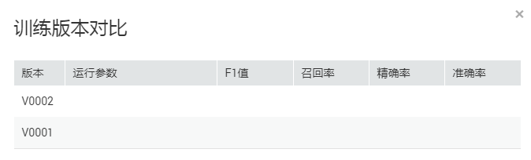
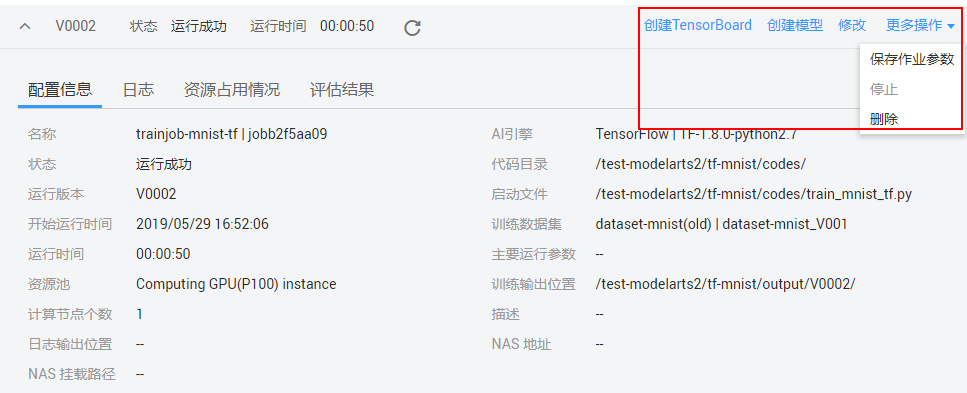

# 管理训练作业版本

在模型构建过程中，您可能需要根据训练结果，不停的调整数据、训练参数或模型，以获得一个满意的模型。因此，ModelArts为了方便用户在调整内容后快速高效的训练模型，提供了管理训练作业版本的能力。每训练一次，生成一个版本，不同的作业版本之间，能快速进行对比，获得对比结果。

## 查看训练作业版本

1.  登录ModelArts管理控制台，在左侧导航栏中选择“训练作业“，默认进入“训练作业“列表。
2.  在训练作业列表中，单击训练作业名称，进入训练作业的详情页面。

    默认打开最近一个版本的基本信息。当版本较多时，您可以单击左上角过滤某几个版本进行查看。单击版本左侧的打开作业的详细信息。训练作业的详细信息说明请参见[训练作业详情](查看作业详情.md#section15518121114018)。

    **图 1**  查看训练作业版本  
    

## 版本对比

在“版本管理“页面中，针对当前训练作业的所有版本，或者使用过滤功能筛选后的版本，单击右侧“查看对比结果“，可查看训练版本之间的对比，包含“运行参数“、“F1值“、“召回率“、“精确率“、“准确率“。

**图 2**  训练版本对比  

## 基于训练作业版本的快捷操作

在训练作业的版本管理页面，ModelArts提供了一些快捷操作的入口，方便您在模型训练结束后，快速进行下一步操作。

**表 1**  快捷操作说明

<table><thead align="left"><tr id="row1445412266175"><th class="cellrowborder" valign="top" width="24.91%" id="mcps1.2.3.1.1">
操作

</th>
<th class="cellrowborder" valign="top" width="75.09%" id="mcps1.2.3.1.2">
说明

</th>
</tr>
</thead>
<tbody><tr id="row73661140131711"><td class="cellrowborder" valign="top" width="24.91%" headers="mcps1.2.3.1.1 ">
创建TensorBoard

</td>
<td class="cellrowborder" valign="top" width="75.09%" headers="mcps1.2.3.1.2 ">
基于当前训练版本创建TensorBoard，详细参见<a href="管理可视化作业.md">管理可视化作业</a>。

 说明： 

TensorBoard目前只支持TensorFlow和MXNet引擎，只有使用TensorFlow或MXNet引擎的训练作业才可以创建TensorBoard作业。

</td>
</tr>
<tr id="row104541526111712"><td class="cellrowborder" valign="top" width="24.91%" headers="mcps1.2.3.1.1 ">
创建模型

</td>
<td class="cellrowborder" valign="top" width="75.09%" headers="mcps1.2.3.1.2 ">
基于当前训练版本创建模型，详细参见<a href="导入模型.md">导入模型</a>。只有“运行成功”的训练作业，支持此操作。

</td>
</tr>
<tr id="row645562681714"><td class="cellrowborder" valign="top" width="24.91%" headers="mcps1.2.3.1.1 ">
修改训练作业

</td>
<td class="cellrowborder" valign="top" width="75.09%" headers="mcps1.2.3.1.2 ">
如果当前版本的训练结果不满足业务需求时，或者训练作业“运行失败”时，您可以单击“修改”，跳转至训练作业参数设置页面，训练作业的参数说明请参见<a href="创建训练作业.md">创建训练作业</a>。根据实际情况调整作业参数后，单击“确定”启动新版本的训练作业。

</td>
</tr>
<tr id="row445582610170"><td class="cellrowborder" valign="top" width="24.91%" headers="mcps1.2.3.1.1 ">
保存作业参数

</td>
<td class="cellrowborder" valign="top" width="75.09%" headers="mcps1.2.3.1.2 ">
将此版本的作业参数可保存为新的作业参数。单击“更多操作&gt;保存作业参数”，进入“作业参数”页面，确认信息无误后的，单击确定完成操作。作业参数管理详情请参见<a href="管理作业参数.md">管理作业参数</a>。

</td>
</tr>
<tr id="row134551626201712"><td class="cellrowborder" valign="top" width="24.91%" headers="mcps1.2.3.1.1 ">
停止

</td>
<td class="cellrowborder" valign="top" width="75.09%" headers="mcps1.2.3.1.2 ">
单击“更多操作&gt;停止”可停止当前版本的训练作业。只有“运行中”的训练作业版本才支持停止操作。

</td>
</tr>
<tr id="row1845582617173"><td class="cellrowborder" valign="top" width="24.91%" headers="mcps1.2.3.1.1 ">
删除

</td>
<td class="cellrowborder" valign="top" width="75.09%" headers="mcps1.2.3.1.2 ">
单击“更多操作&gt;删除”可停止当前版本的训练作业。

</td>
</tr>
</tbody>
</table>

**图 3**  快捷操作  

