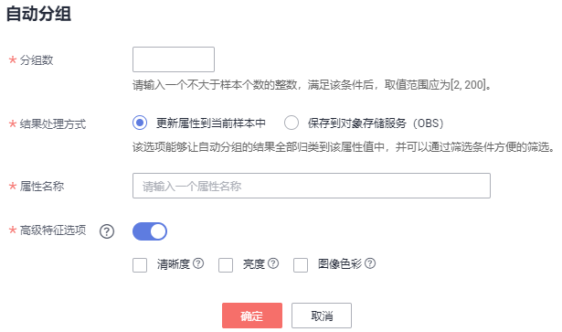

# 自动分组

ModelArts内置了分组算法，您可以针对您选中的数据，执行自动分组，提升您的数据标注效率。

> **说明：**   
>目前只有“图像分类”和“物体检测”类型的数据集支持自动分组功能。  

## 启动自动分组任务

1.  登录ModelArts管理控制台，在左侧菜单栏中选择“数据管理（Beta） \> 数据集“，进入“数据集“管理页面。
2.  在数据集列表中，选择“物体检测”或“图像分类”类型的数据集，单击数据集名称进入“数据集概览页“。
3.  在“数据集概览页“，单击右上角“开始标注“，进入数据集详情页。
4.  在数据集详情页的“全部“页签中，单击“自动分组 \> 启动任务“。

    > **说明：**   
    >只能在“全部“页签下启动自动分组任务或查看任务历史。  

5.  在弹出的“自动分组“对话框中，填写参数信息，然后单击“确定“。

    -   “分组数“：填写2\~200之间的整数，指将图片分为多少组。
    -   “结果处理方式“：“更新属性到当前样本中“，或者“保存到对象存储服务“。
    -   “属性名称“：当选择“更新属性到当前样本中“时，需输入一个属性名称。
    -   “结果存储目录“：当选择“保存到对象存储服务“时，需指定一个用于存储的OBS路径。
    -   “高级特征选项“：启用此功能后，可选择“清晰度“、“高亮“、“图像色彩“等维度为自动分组功能增加选项，使得分组着重于图片亮度、色彩和清晰度等特征进行分组。支持多选。

    **图 1**  自动分组  
    

6.  启动任务提交成功后，界面右上角显示此任务的进度。等待任务执行完成后，您可以查看自动分组任务的历史记录，了解任务状态。

## 查看自动分组结果

在数据集详情页面的“全部“页签中，展开“筛选条件“，将“样本属性“设置为自动分组任务中的“属性名称“，并通过设置样本属性值，筛选出分组结果。

**图 2**  查看自动分组结果  

## 查看自动分组的历史任务

在数据集详情页面的“全部“页签中，单击“自动分组 \> 任务历史“。在弹出的“任务历史“对话框中，展示当前数据集之前执行的自动分组任务的基本信息。

**图 3**  任务历史  

