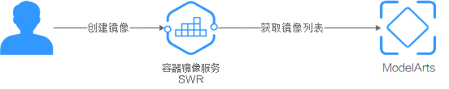

# 自定义镜像简介

ModelArts为用户提供了多种常见的预置引擎，但是当用户对深度学习引擎、开发库有特殊需求场景的时候，预置AI引擎已经不能满足用户需求。ModelArts提供自定义镜像功能支持用户自定义运行引擎。

ModelArts底层采用容器技术，自定义镜像指的是用户自行制作容器镜像并在ModelArts上运行。自定义镜像功能支持自由文本形式的命令行参数和环境变量，灵活性比较高，便于支持任意计算引擎的作业启动需求。

## 关联服务介绍

使用自定义镜像功能可能涉及以下云服务：容器镜像服务、对象存储服务、弹性云服务器。

-   容器镜像服务

    容器镜像服务（Software Repository for Container，SWR）是一种支持镜像全生命周期管理的服务， 提供简单易用、安全可靠的镜像管理功能，帮助您快速部署容器化服务。您可以通过界面、社区CLI和原生API上传、下载和管理容器镜像。

    ModelArts训练和导入模型使用的自定义镜像需要从SWR服务管理列表获取。您制作的自定义镜像需要上传至SWR服务。

    **图 1**  获取镜像列表  
    

-   对象存储服务

    对象存储服务（Object Storage Service，OBS）是一个基于对象的海量存储服务，为客户提供海量、安全、高可靠、低成本的数据存储能力。

    在创建训练作业和导入模型时往往存在数据交互，您需要的云上数据可以存储至OBS服务。

-   弹性云服务器

    弹性云服务器（Elastic Cloud Server，ECS）是由CPU、内存、操作系统、云硬盘组成的基础的计算组件。弹性云服务器创建成功后，您就可以像使用自己的本地PC或物理服务器一样，在云上使用弹性云服务器。

    在制作自定义镜像时，您可以在本地环境或者ECS上完成自定义镜像制作。

> **说明：** 
>在您使用自定义镜像功能时，ModelArts可能需要访问您的容器镜像服务SWR、对象存储服务OBS等依赖服务，若没有授权，这些功能将不能正常使用。建议您使用委托授权功能，将依赖服务操作权限委托给ModelArts服务，让ModelArts以您的身份使用依赖服务，代替您进行一些资源操作。详细操作参见使用[委托授权](https://support.huaweicloud.com/prepare-modelarts/modelarts_08_0007.html)。

## 自定义镜像使用场景

-   **用于训练模型**

    如果您已经在本地完成模型开发或训练脚本的开发，且您使用的AI引擎是ModelArts不支持的框架。您可以基于ModelArts提供的基础镜像包制作自定义镜像，并上传至SWR服务。您可以在ModelArts使用此自定义镜像创建训练作业，使用ModelArts提供的资源训练模型。

-   **用于导入模型**

    如果您使用了ModelArts不支持的AI引擎开发模型，也可通过制作自定义镜像，导入ModelArts进行统一管理，并支持将模型部署上线为服务。

