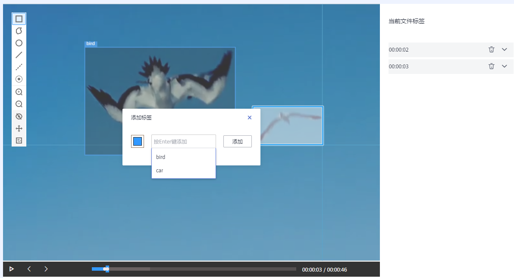
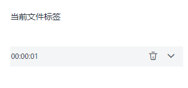
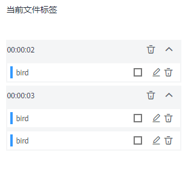
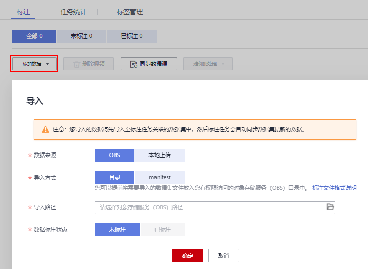

# 视频标注

由于模型训练过程需要大量有标签的视频数据，因此在模型训练之前需对没有标签的视频添加标签。通过ModelArts您可对视频添加标签，快速完成对视频的标注操作，也可以对已标注视频修改或删除标签进行重新标注。

## 开始标注

1.  登录ModelArts管理控制台，在左侧菜单栏中选择“数据管理\> 数据标注“，进入“数据标注“管理页面。
2.  在数据集列表中，基于“标注类型“选择需要进行标注的数据集，单击标注作业名称进入标注作业标注详情页。
3.  在标注作业标注详情中，展示此标注作业下全部数据。

## 同步数据源

ModelArts会自动从数据集输入位置同步数据至数据集详情页，包含数据及标注信息。

为了快速获取OBS桶中最新数据，可在数据集详情页的“全部“或“未标注“页签中，单击“同步数据源“，快速将通过OBS上传的数据添加到数据集中。

## 视频标注

标注作业详情页中，展示了此数据集中“未标注“和“已标注“的视频。

1.  在“未标注“页签左侧视频列表中，单击目标视频文件，打开标注页面。
2.  在标注页面中，播放视频，当视频播放至待标注时间时，单击进度条中的暂停按钮，将视频暂停至某一画面。
3.  在左侧区域选择标注框，默认为矩形框。使用鼠标在视频画面中框出目标，然后在弹出的添加标签文本框中，直接输入新的标签名，在文本框前面选中标签颜色，单击“添加“完成1个物体的标注。如果已存在标签，从下拉列表中选择已有的标签，然后单击“添加“完成标注。逐步此画面中所有物体所在位置，一张画面可添加多个标签。

    支持的标注框与“物体检测”类型一致，详细描述请参见物体检测章节的[表1](物体检测.md#table165201739119)。

    **图 1**  视频标注  
    

4.  上一个暂停画面标注完成后，在进度条处单击播放按钮继续播放，在需要标注的画面中暂停，然后重复执行步骤[3](#li993163014399)完成整个视频的标注。

    界面右侧将呈现当前视频带标注的时间点。

    **图 2**  当前文件标签信息  
    

5.  单击页面左上角“返回数据标注预览“，页面将自动返回标注作业详情页面，同时，标注好的视频将呈现在“已标注“页签下。

## 修改标注

当数据完成标注后，您还可以进入“已标注“页签，删除标注数据。

-   单击目标编号操作列的，删除该段视频的标注。您也可以单击标注视频文件上方的叉号删除标注，然后单击“确认标注“。

在“已标注“页签下，单击目标视频文件，在标注页面右侧的“当前文件标签“下，可单击时间点右侧小三角展开详情，您可以修改或删除标签。

-   修改标签：单击标签右侧的编辑按钮，标签名称可进行修改。
-   删除标签：单击标签右侧的删除按钮，将直接删除此标签。如果单击画面时间右侧的删除按钮，将删除此画面下的所有标签。

**图 3**  修改标注  

## 添加视频

除了同步新数据外，您还可以在标注详情页面中，直接添加数据，用于数据标注。

1.  在标注作业详情页面，单击“未标注“页签，然后单击左上角“添加数据“。
2.  在弹出的导入对话框中，选择数据来源、导入方式、导入路径等参数，导入数据。单击确定。

    导入数据的详细操作介绍请参见[OBS导入数据](https://support.huaweicloud.com/dataprepare-modelarts/dataprepare-modelarts-0011.html)。

    **图 4**  导入数据  
    

## 删除视频

通过数据删除操作，可将需要丢弃的视频数据快速删除。

在“全部“、“未标注“或“已标注“页面中，依次选中需要删除的视频，或者选择“选择当前页“选中该页面所有视频，然后单击左上角“删除视频“。在弹出的对话框中，根据实际情况选择是否勾选“同时删除源文件“，确认信息无误后，单击“确定“完成视频删除操作。

其中，被选中的视频，其左上角将显示为勾选状态。如果当前页面无选中视频时，“删除视频“按钮为灰色，无法执行删除操作。

> **说明：** 
>如果勾选了“同时删除源文件“，删除视频操作将删除对应OBS目录下存储的视频，此操作可能会影响已使用此源文件的其他数据集或数据集版本，有可能导致展示异常或训练/推理异常。删除后，数据将无法恢复，请谨慎操作。

