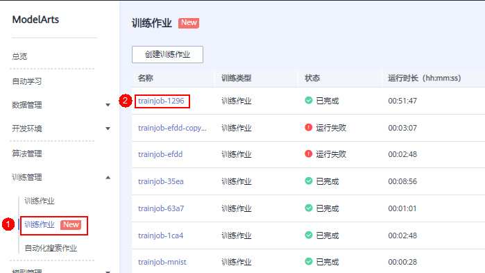

# 训练作业详情

1.  登录ModelArts管理控制台，在左侧导航栏中选择“训练管理 \>训练作业（New）“，默认进入“训练作业“列表。
2.  在训练作业列表中，您可以单击作业名称，查看该作业的基本信息与训练作业参数。

    **图 1**  查看训练作业详情  
    

3.  在训练作业详情页的左侧，可以查看此次训练作业的配置、算法的配置的相关信息。
    1.  训练作业基本信息

        **表 1**  训练作业基本信息

        
        <table><thead align="left"><tr id="row1521116577356"><th class="cellrowborder" valign="top" width="18.55%" id="mcps1.2.3.1.1">
参数

        </th>
        <th class="cellrowborder" valign="top" width="81.45%" id="mcps1.2.3.1.2">
说明

        </th>
        </tr>
        </thead>
        <tbody><tr id="row921165714359"><td class="cellrowborder" valign="top" width="18.55%" headers="mcps1.2.3.1.1 ">
作业ID

        </td>
        <td class="cellrowborder" valign="top" width="81.45%" headers="mcps1.2.3.1.2 ">
训练作业唯一标识。

        </td>
        </tr>
        <tr id="row2211857193513"><td class="cellrowborder" valign="top" width="18.55%" headers="mcps1.2.3.1.1 ">
状态

        </td>
        <td class="cellrowborder" valign="top" width="81.45%" headers="mcps1.2.3.1.2 ">
训练作业状态。

        </td>
        </tr>
        <tr id="row1321175793518"><td class="cellrowborder" valign="top" width="18.55%" headers="mcps1.2.3.1.1 ">
创建时间

        </td>
        <td class="cellrowborder" valign="top" width="81.45%" headers="mcps1.2.3.1.2 ">
记录训练作业创建时间。

        </td>
        </tr>
        <tr id="row142111657163512"><td class="cellrowborder" valign="top" width="18.55%" headers="mcps1.2.3.1.1 ">
运行时间

        </td>
        <td class="cellrowborder" valign="top" width="81.45%" headers="mcps1.2.3.1.2 ">
记录训练作业运行时长。

        </td>
        </tr>
        </tbody>
        </table>

    2.  训练作业参数

        **表 2**  训练作业参数

        
        <table><thead align="left"><tr id="row1621215579351"><th class="cellrowborder" valign="top" width="19.24%" id="mcps1.2.3.1.1">
参数

        </th>
        <th class="cellrowborder" valign="top" width="80.76%" id="mcps1.2.3.1.2">
说明

        </th>
        </tr>
        </thead>
        <tbody><tr id="row132121957173515"><td class="cellrowborder" valign="top" width="19.24%" headers="mcps1.2.3.1.1 ">
算法名称

        </td>
        <td class="cellrowborder" valign="top" width="80.76%" headers="mcps1.2.3.1.2 ">
本次训练作业使用的算法。

        </td>
        </tr>
        <tr id="row421285716354"><td class="cellrowborder" valign="top" width="19.24%" headers="mcps1.2.3.1.1 ">
AI引擎

        </td>
        <td class="cellrowborder" valign="top" width="80.76%" headers="mcps1.2.3.1.2 ">
本次训练作业使用的AI引擎。

        </td>
        </tr>
        <tr id="row1021211577359"><td class="cellrowborder" valign="top" width="19.24%" headers="mcps1.2.3.1.1 ">
代码目录

        </td>
        <td class="cellrowborder" valign="top" width="80.76%" headers="mcps1.2.3.1.2 ">
训练作业脚本所在的代码目录。如果您是市场订阅算法，该参数不显示内容。

        </td>
        </tr>
        <tr id="row1121215723520"><td class="cellrowborder" valign="top" width="19.24%" headers="mcps1.2.3.1.1 ">
启动文件

        </td>
        <td class="cellrowborder" valign="top" width="80.76%" headers="mcps1.2.3.1.2 ">
训练作业启动文件位置。如果您是市场订阅算法，该参数不显示内容。

        </td>
        </tr>
        <tr id="row202122572357"><td class="cellrowborder" valign="top" width="19.24%" headers="mcps1.2.3.1.1 ">
计算节点个数

        </td>
        <td class="cellrowborder" valign="top" width="80.76%" headers="mcps1.2.3.1.2 ">
本次训练作业设置的计算节点个数。

        </td>
        </tr>
        <tr id="row162122578355"><td class="cellrowborder" valign="top" width="19.24%" headers="mcps1.2.3.1.1 ">
规格

        </td>
        <td class="cellrowborder" valign="top" width="80.76%" headers="mcps1.2.3.1.2 ">
本次训练作业使用的训练规格。

        </td>
        </tr>
        <tr id="row1321214576352"><td class="cellrowborder" valign="top" width="19.24%" headers="mcps1.2.3.1.1 ">
训练输入-输入路径

        </td>
        <td class="cellrowborder" valign="top" width="80.76%" headers="mcps1.2.3.1.2 ">
本次训练中，输入数据的OBS路径。

        </td>
        </tr>
        <tr id="row4212105723514"><td class="cellrowborder" valign="top" width="19.24%" headers="mcps1.2.3.1.1 ">
训练输入-训练参数名称

        </td>
        <td class="cellrowborder" valign="top" width="80.76%" headers="mcps1.2.3.1.2 ">
算法代码中，输入路径指代的参数。

        </td>
        </tr>
        <tr id="row1221295712359"><td class="cellrowborder" valign="top" width="19.24%" headers="mcps1.2.3.1.1 ">
训练输入-本地路径

        </td>
        <td class="cellrowborder" valign="top" width="80.76%" headers="mcps1.2.3.1.2 ">
训练启动后，ModelArts将OBS路径中的数据下载至后台容器，本地路径指ModelArts后台容器中存储输入数据的路径。

        </td>
        </tr>
        <tr id="row1821215575352"><td class="cellrowborder" valign="top" width="19.24%" headers="mcps1.2.3.1.1 ">
训练输出-输出路径

        </td>
        <td class="cellrowborder" valign="top" width="80.76%" headers="mcps1.2.3.1.2 ">
本次训练中，输出数据的OBS路径。

        </td>
        </tr>
        <tr id="row10212175763518"><td class="cellrowborder" valign="top" width="19.24%" headers="mcps1.2.3.1.1 ">
训练输出-训练参数名称

        </td>
        <td class="cellrowborder" valign="top" width="80.76%" headers="mcps1.2.3.1.2 ">
算法代码中，输出路径指代的参数。

        </td>
        </tr>
        <tr id="row1121218578351"><td class="cellrowborder" valign="top" width="19.24%" headers="mcps1.2.3.1.1 ">
训练输出-本地路径

        </td>
        <td class="cellrowborder" valign="top" width="80.76%" headers="mcps1.2.3.1.2 ">
ModelArts后台容器中存储训练输出的路径。

        </td>
        </tr>
        <tr id="row16212175711356"><td class="cellrowborder" valign="top" width="19.24%" headers="mcps1.2.3.1.1 ">
超参

        </td>
        <td class="cellrowborder" valign="top" width="80.76%" headers="mcps1.2.3.1.2 ">
本次训练作业使用的超参。

        </td>
        </tr>
        </tbody>
        </table>

