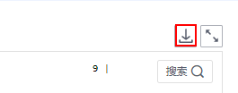
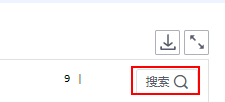
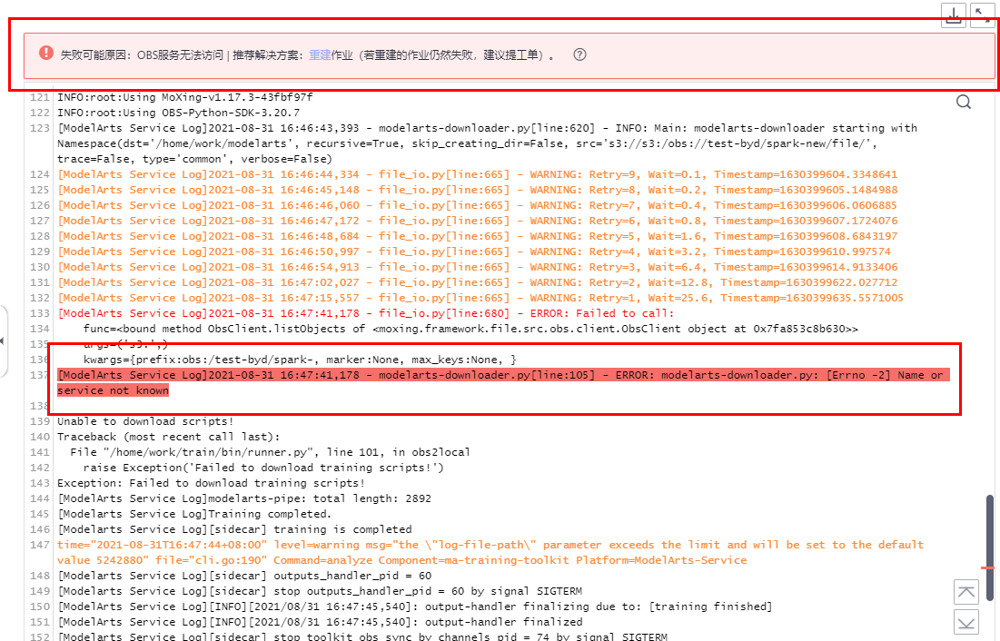

# 训练日志详情<a name="modelarts_23_0401"></a>

在训练作业详情页，训练日志窗口提供日志预览、日志下载、日志中搜索关键字能力和训练故障识别能力。

-   预览

    系统日志窗口提供训练日志预览功能，并支持查看不同计算节点日志，您可以通过右侧下拉框选择目标节点预览。

    当日志文件过大时，系统日志窗口仅加载最新的部分日志，并在日志窗口上方提供全量日志访问链接。打开该链接可在新页面查看全部日志；在下载下拉框中也提供了对应节点的全量日志访问链接。

    如果全部日志超过500M，可能会引起浏览页面卡顿，建议您直接下载日志查看。

    > **说明：** 
    >-   如果全部日志超过500M，可能会引起浏览页面卡顿，建议您直接下载日志查看。
    >-   预览链接在生成后的一小时内，支持任何人打开并查看。您可以分享链接至他人。
    >    请注意日志中不能包含隐私内容，否则会造成信息泄露。

-   下载

    训练日志仅保留30天，超过30天会被清理。如果用户需要永久保存日志，请单击系统日志窗口右上角下载按钮下载日志至本地保存，支持批量下载多节点日志。用户也可以在[创建训练作业](创建训练作业.md)时打开永久保存日志按钮，保存训练日志至指定OBS路径。

    针对使用Ascend规格创建的训练作业，部分系统日志暂不支持直接在训练日志窗口下载，请用户在创建训练作时指定OBS路径用于保存训练日志。

    **图 1**  下载日志<a name="fig332022118594"></a>  
    

-   搜索关键字

    用户可以在系统日志右上角的搜索框搜索关键字。系统支持高亮关键字并实现搜索结果间的跳转。

    **图 2**  搜索关键字<a name="fig1676414594594"></a>  
    

    > **说明：** 
    >-   搜索功能仅支持搜索当前页面加载的日志，若日志加载不全（请关注页面提示）则需要下载或者通过打开全量日志访问链接进行搜索
    >-   全量日志访问链接打开的新页面可以通过CRTL+F进行搜索


-   训练故障识别

    如果您的训练作业运行失败，我们会自动识别导致您作业失败的原因，在界面上给出提示。提示包括三部分：失败的可能原因、推荐的解决方案以及对应的日志（底色标红）。解决方案可能会有以下类型：

    1.文档：会提供当前故障对应的一个指导文档，请按照文档提示修复问题。

    2.重建作业：建议重建作业进行重试，大概率能修复问题。若重试后仍然失败，建议提工单。

    3.提工单：建议提工单解决。

    **图 3**  训练故障识别<a name="fig925665316716"></a>  
    

    > **说明：** 
    >-   系统会对部分常见训练错误给出分析建议，目前还不能识别所有错误。
    >-   提供的失败可能原因仅供参考。
    >-   如果提供的解决方案不能解决您的问题，可以提工单进行人工咨询。
    >-   针对分布式作业，只会显示当前节点的一个分析结果，作业的失败需要综合各个节点的失败原因做一个综合判断。


## 训练日志说明<a name="section146571314574"></a>

如果选择Ascend 910规格创建训练作业，日志结构举例说明如下：

```
obs://dgg-test-user/ascend910-test-cases/log-out/                                       # 作业日志路径
├── modelarts-job-9ccf15f2-6610-42f9-ab99-059ba049a41e-proc-rank-0-device-0.txt	# proc log  单卡训练日志
└── modelarts-job-9ccf15f2-6610-42f9-ab99-059ba049a41e-worker-0.log			# training log 训练日志合集
	└── ascend                                                                   # Ascend日志
		└── log                      # 默认不生成该文件  
			├── device		# device log  默认不生成
			│	└── ...
			└── plog		
				└── ...
```

主要生成两种类型日志：

-   [训练平台日志](#section136046161573)

    training log是训练日志合集，proc log是单卡训练日志重定向文件，方便用户快速定位对应计算节点的日志。

-   [Ascend 日志](#section1813414271689)

    默认设置 plog 日志打屏，  “ascend/log“  文件夹及相关文件默认不生成日志文件。

    您可以通过ma-pre-start 脚本修改默认环境变量配置。

    ```
    ASCEND_GLOBAL_LOG_LEVEL=3      # 日志级别设置  debug级别为0;info 级别为1;warning级别为 2;error级别为4  
    ASCEND_SLOG_PRINT_TO_STDOUT=1  # plog日志是否打屏
    ASCEND_GLOBAL_EVENT_ENABLE=1   # 设置事件级别  不开启Event日志级别为0；开启Event日志级别为1
    ```

    > **说明：** 
    >**ma-pre-start**脚本
    >在与训练启动文件同级的目录下放置 ma-pre-start.sh or ma-pre-start.py 脚本。
    >在训练启动文件被执行前，系统会在 /home/work/user-job-dir/ 目录下执行上述 pre-start 脚本
    >使用该机制可以更新容器镜像内安装的 Ascend RUN 包，或者设置一些训练运行时额外需要的全局环境变量。


## 训练平台日志<a name="section136046161573"></a>

```
样例：modelarts-job-9ccf15f2-6610-42f9-ab99-059ba049a41e-worker-0.log	
统一日志格式：modelarts-job-[job id]-[task id].log
```

其中 task id 为分布式作业中的节点id，单机作业的 task id 默认为 worker-0。

training log中包括“pip-requirement.txt 安装日志”、“ma-pre-start 日志”、“davincirun 日志”、“训练进程日志”、 “MA平台日志”等。

-   **MA平台日志**

    类型一：\[Modelarts Service Log\] xxx

    ```
    [Modelarts Service Log][init] download code_url: s3://dgg-test-user/ascend910-test-cases/mindspore/lenet/
    ```

    类型二：time=“xxx” level=“xxx” msg=“xxx” file=“xxx” Command=xxx Component=xxx Platform=xxx

    ```
    time="2021-07-26T19:24:11+08:00" level=info msg="start the periodic upload task, upload period = 5 seconds " file="upload.go:46" Command=obs/upload Component=ma-training-toolkit Platform=ModelArts-Service
    ```

    单机作业只会生成一个 training log 文件。MA平台日志主要用于运维人员定位平台问题，如果不涉及可以通过上述类型模式规则进行筛除。


-   **proc log**

    proc log是单卡训练日志重定向文件，方便用户快速定位对应计算节点的日志。

    ```
    样例：modelarts-job-9b43aba3-ed9c-48c1-9f5e-2d61d20dce65-proc-rank-6-device-6.txt
    日志文件格式： [modelarts-job-uuid]-proc-rank-[rank id]-device-[device logic id].txt
    ```

    device id 为顺序编号 id。


## Ascend 日志<a name="section1813414271689"></a>

样例：

```
└── ascend
	└── log
		├── device		# device log
		│	└── ...
		└── plog		# plog
			└── ...
```

**表 1**  Ascend日志说明

<a name="zh-cn_topic_0000001181366391_table10473193654713"></a>
<table><thead align="left"><tr id="zh-cn_topic_0000001181366391_row1247383614719"><th class="cellrowborder" valign="top" width="33.33333333333333%" id="mcps1.2.4.1.1"><p id="zh-cn_topic_0000001181366391_p04731636124716"><a name="zh-cn_topic_0000001181366391_p04731636124716"></a><a name="zh-cn_topic_0000001181366391_p04731636124716"></a><strong id="zh-cn_topic_0000001181366391_b0732154384714"><a name="zh-cn_topic_0000001181366391_b0732154384714"></a><a name="zh-cn_topic_0000001181366391_b0732154384714"></a>日志说明</strong></p>
</th>
<th class="cellrowborder" valign="top" width="33.33333333333333%" id="mcps1.2.4.1.2"><p id="zh-cn_topic_0000001181366391_p20819348104717"><a name="zh-cn_topic_0000001181366391_p20819348104717"></a><a name="zh-cn_topic_0000001181366391_p20819348104717"></a><strong id="zh-cn_topic_0000001181366391_b2081974824720"><a name="zh-cn_topic_0000001181366391_b2081974824720"></a><a name="zh-cn_topic_0000001181366391_b2081974824720"></a>日志产生源</strong></p>
</th>
<th class="cellrowborder" valign="top" width="33.33333333333333%" id="mcps1.2.4.1.3"><p id="zh-cn_topic_0000001181366391_p781934844720"><a name="zh-cn_topic_0000001181366391_p781934844720"></a><a name="zh-cn_topic_0000001181366391_p781934844720"></a><strong id="zh-cn_topic_0000001181366391_b13819348114718"><a name="zh-cn_topic_0000001181366391_b13819348114718"></a><a name="zh-cn_topic_0000001181366391_b13819348114718"></a>日志落盘位置</strong></p>
</th>
</tr>
</thead>
<tbody><tr id="zh-cn_topic_0000001181366391_row4473193610477"><td class="cellrowborder" valign="top" width="33.33333333333333%" headers="mcps1.2.4.1.1 "><p id="zh-cn_topic_0000001181366391_p186259585479"><a name="zh-cn_topic_0000001181366391_p186259585479"></a><a name="zh-cn_topic_0000001181366391_p186259585479"></a>用户进程,在HOST侧产生的日志（例如:ACL /GE）</p>
<p id="zh-cn_topic_0000001181366391_p534193612487"><a name="zh-cn_topic_0000001181366391_p534193612487"></a><a name="zh-cn_topic_0000001181366391_p534193612487"></a></p>
</td>
<td class="cellrowborder" valign="top" width="33.33333333333333%" headers="mcps1.2.4.1.2 "><p id="zh-cn_topic_0000001181366391_p262545816477"><a name="zh-cn_topic_0000001181366391_p262545816477"></a><a name="zh-cn_topic_0000001181366391_p262545816477"></a>HOST侧</p>
</td>
<td class="cellrowborder" valign="top" width="33.33333333333333%" headers="mcps1.2.4.1.3 "><p id="zh-cn_topic_0000001181366391_p162625812476"><a name="zh-cn_topic_0000001181366391_p162625812476"></a><a name="zh-cn_topic_0000001181366391_p162625812476"></a>HOST侧:</p>
<p id="zh-cn_topic_0000001181366391_p0626175834719"><a name="zh-cn_topic_0000001181366391_p0626175834719"></a><a name="zh-cn_topic_0000001181366391_p0626175834719"></a>Linux: ~/ascend/log/plog</p>
</td>
</tr>
<tr id="zh-cn_topic_0000001181366391_row247323610476"><td class="cellrowborder" valign="top" width="33.33333333333333%" headers="mcps1.2.4.1.1 "><p id="zh-cn_topic_0000001181366391_p562675844711"><a name="zh-cn_topic_0000001181366391_p562675844711"></a><a name="zh-cn_topic_0000001181366391_p562675844711"></a>用户进程，在DEVICE侧产生的AICPU、HCCP的日志，回传到HOST侧</p>
</td>
<td class="cellrowborder" valign="top" width="33.33333333333333%" headers="mcps1.2.4.1.2 "><p id="zh-cn_topic_0000001181366391_p1162611588475"><a name="zh-cn_topic_0000001181366391_p1162611588475"></a><a name="zh-cn_topic_0000001181366391_p1162611588475"></a>DEVICE侧</p>
</td>
<td class="cellrowborder" valign="top" width="33.33333333333333%" headers="mcps1.2.4.1.3 "><p id="zh-cn_topic_0000001181366391_p18626558194713"><a name="zh-cn_topic_0000001181366391_p18626558194713"></a><a name="zh-cn_topic_0000001181366391_p18626558194713"></a>HOST侧:</p>
<p id="zh-cn_topic_0000001181366391_p176261858204718"><a name="zh-cn_topic_0000001181366391_p176261858204718"></a><a name="zh-cn_topic_0000001181366391_p176261858204718"></a>Linux:~/ascend/log/device-{device-id}</p>
</td>
</tr>
</tbody>
</table>

> **说明：** 
>由于 Device Log 在训练进程结束后获取；因此假若出现如下情况，Ascend Device Log 会获取不到。
>-   节点异常重启
>-   被主动停止的节点

