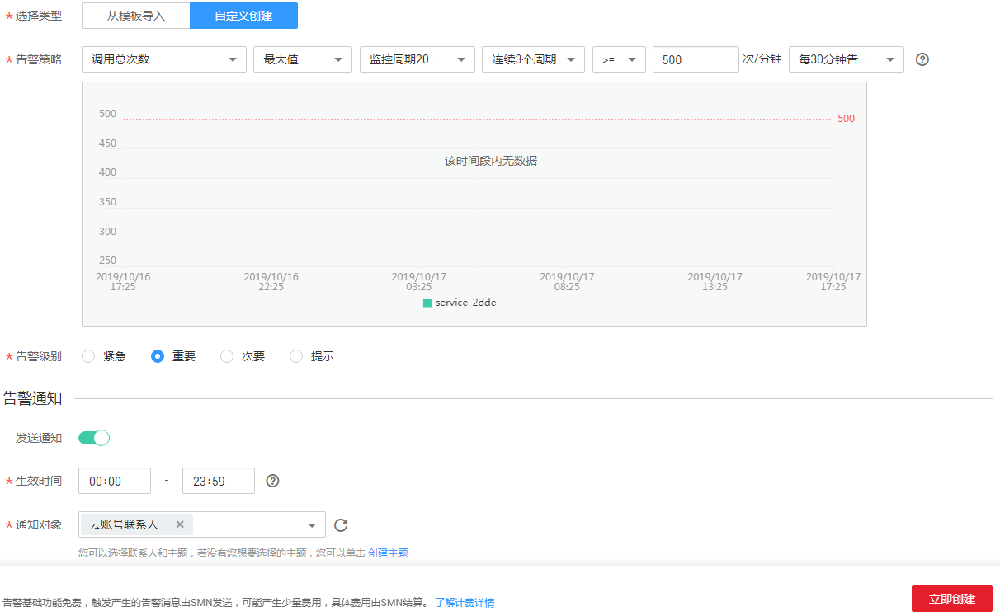

# 设置告警规则

## 操作场景

通过设置ModelArts在线服务和模型负载告警规则，用户可自定义监控目标与通知策略，及时了解ModelArts在线服务和模型负载状况，从而起到预警作用。

设置ModelArts服务和模型的告警规则包括设置告警规则名称、监控对象、监控指标、告警阈值、监控周期和是否发送通知等参数。本节介绍了设置ModelArts服务和模型告警规则的具体方法。

## 前提条件

已创建ModelArts在线服务。

## 操作步骤

1.  登录华为云管理控制台。
2.  在“服务列表“中选择“管理与部署 \> 云监控“。
3.  在左侧导航栏，选择“云服务监控 \> ModelArts“。
4.  选择需要添加告警规则的在线服务名称，单击操作列的“创建告警规则“。
5.  在“创建告警规则“界面，根据界面提示设置ModelArts在线服务和模型负载的告警规则。

    **图 1**  创建告警规则  
    

6.  设置完成后，单击“立即创建“。当符合规则的告警产生时，系统会自动进行通知。

