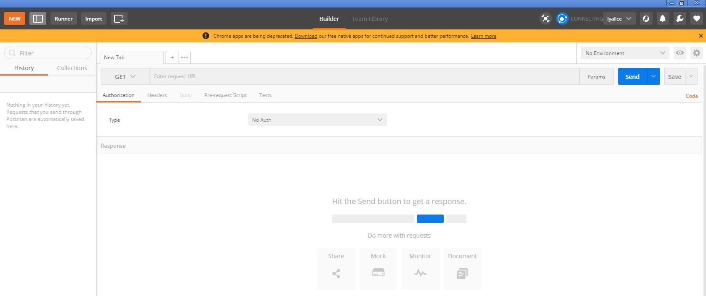

# 访问在线服务<a name="modelarts_23_0063"></a>

若在线服务的状态处于“运行中“，则表示在线服务已部署成功，您可以使用以下两种方式向在线服务发起预测请求。

[方式一：使用图形界面的软件进行预测（以Postman为例）](#section959354162911)。

[方式二：使用curl命令发送预测请求](#section104131434203114)。

## 方式一：使用图形界面的软件进行预测（以Postman为例）<a name="section959354162911"></a>

1.  下载[Postman](https://www.getpostman.com/apps)软件并安装，您也可以直接在Chrome浏览器添加Postman扩展程序（也可使用其它支持发送post请求的软件）。
2.  打开Postman，如[图1](#fig133784354141)所示。

    **图 1**  Postman界面<a name="fig133784354141"></a>  
    

3.  在Postman界面填写参数，以图像分类举例说明。
    -   选择POST任务，将在线服务的调用地址（通过在线服务详情界面-调用指南页签查看）复制到POST后面的方框。Headers页签的Key值填写为“X-Auth-Token”，Value值为您获取到的Token（关于如何获取token，请参考[获取用户Token](https://support.huaweicloud.com/api-iam/zh-cn_topic_0057845583.html)），如[图2](#fig107051040195610)所示。

        > **说明：**   
        >您也可以通过AK（Access Key ID）/SK（Secret Access Key\)加密调用请求，具体可参见《ModelArts API参考》中的"[认证鉴权](https://support.huaweicloud.com/api-modelarts/modelarts_03_0004.html)\>AK/SK认证”。  

        **图 2**  参数填写<a name="fig107051040195610"></a>  
        

    -   在Body页签，根据模型的输入参数不同，可分为2种类型：文件输入、文本输入。
        -   **文件输入**

            选择“form-data“。在“KEY“值填写模型的入参，比如本例中预测图片的参数为“images“。然后在“VALUE“值，选择文件，上传一张待预测图片（当前仅支持单张图片预测），如[图3](#fig51835538167)所示。

            **图 3**  填写Body<a name="fig51835538167"></a>  
            

        -   **文本输入**

            选择“raw“，选择JSON\(application/json\)类型，在下方文本框中填写请求体，请求体样例如下：

            ```
            {
              "meta": {
                "uuid": "10eb0091-887f-4839-9929-cbc884f1e20e"
              },
              "data": {
                "req_data": [
                  {
                    "sepal_length": 3,
                    "sepal_width": 1,
                    "petal_length": 2.2,
                    "petal_width": 4
                  }
                ]
              }
            }
            ```

            其中，“meta“中可携带“uuid“，调用时传入一个“uuid“，返回预测结果时回传此“uuid“用于跟踪请求，如无此需要可不填写meta**。**“data“包含了一个“req\_data“的数组，可传入单条或多条请求数据，其中每个数据的参数由模型决定，比如本例中的“sepal\_length“、“sepal\_width“等。


4.  参数填写完成，点击“send“发送请求，结果会在“Response“下的对话框里显示。
    -   文件输入形式的预测结果样例如[图4](#fig32966269191)所示，返回结果的字段值根据不同模型可能有所不同。
    -   文本输入形式的预测结果样例如[图5](#fig1711573710205)所示，请求体包含“meta“及“data“。如输入请求中包含“uuid“，则输出结果中回传此“uuid“。如未输入，则为空。“data“包含了一个“resp\_data“的数组，返回单条或多条输入数据的预测结果,其中每个结果的参数由模型决定，比如本例中的“sepal\_length“、“predictresult“等。

        **图 4**  文件输入预测结果<a name="fig32966269191"></a>  
        

        **图 5**  文本输入预测结果<a name="fig1711573710205"></a>  
        


## 方式二：使用curl命令发送预测请求<a name="section104131434203114"></a>

使用curl命令发送预测请求的命令格式也分为文件输入、文本输入两类。

1.  文件输入

    ```
    curl -F 'images=@图片路径' -H 'X-Auth-Token:Token值' -X POST 在线服务地址
    ```

    -   “-F“是指上传数据的是文件，本例中参数名为“images“，这个名字可以根据具体情况变化，@后面是图片的存储路径。
    -   “-H“是post命令的headers，Headers的Key值为“X-Auth-Token“，这个名字为固定的， Token值是用户获取到的token值（关于如何获取token，请参考[获取请求认证](https://support.huaweicloud.com/api-modelarts/modelarts_03_0004.html)）。
    -   “POST“后面跟随的是在线服务的调用地址。

    curl命令文件输入样例：

    ```
    curl -F 'images=@/home/data/test.png' -H 'X-Auth-Token:MIISkAY***80T9wHQ==' -X POST https://modelarts-infers-1.cn-north-1.myhuaweicloud.com/v1/infers/eb3e0c54-3dfa-4750-af0c-95c45e5d3e83
    ```

2.  文本输入

    ```
    curl -d '{"data":{"req_data":[{"sepal_length":3,"sepal_width":1,"petal_length":2.2,"petal_width":4}]}}' -H 'X-Auth-Token:MIISkAY***80T9wHQ==' -H 'Content-type: application/json' -X POST https://modelarts-infers-1.cn-north-1.myhuaweicloud.com/v1/infers/eb3e0c54-3dfa-4750-af0c-95c45e5d3e83
    ```

    “-d“是Body体的文本内容。


