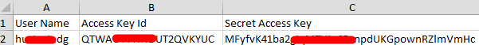
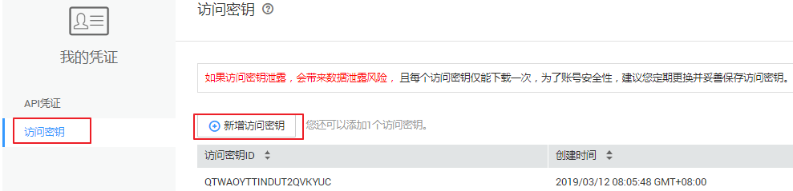
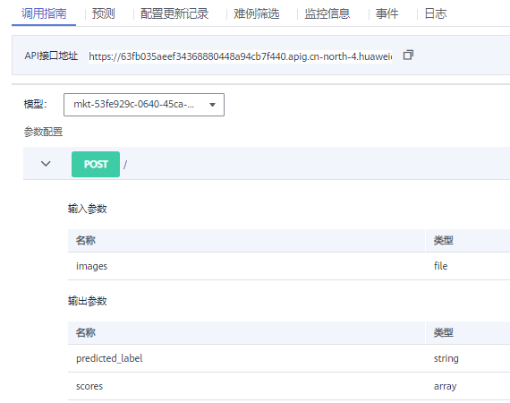
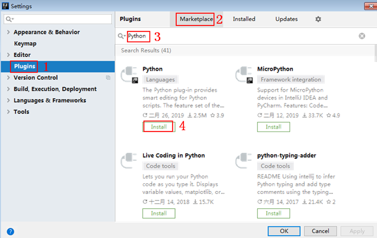
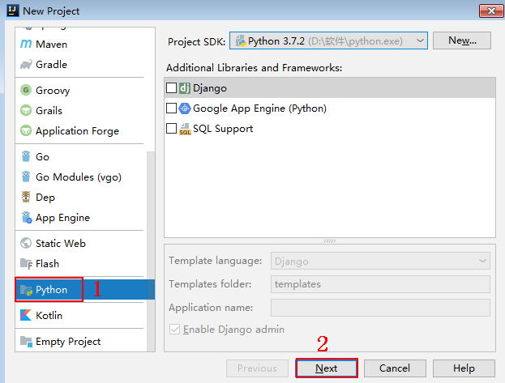
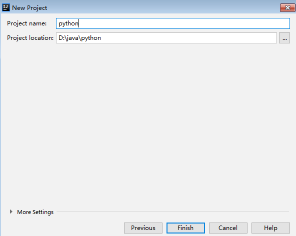
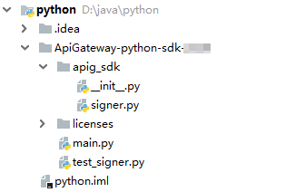
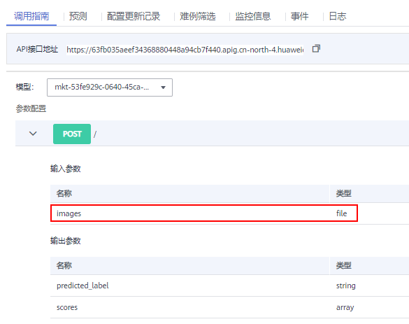

# 访问在线服务（AK/SK认证\)<a name="modelarts_23_0074"></a>

若在线服务的状态处于“运行中“，则表示在线服务已部署成功。部署成功的在线服务，将为用户提供一个可调用的API，此API为标准Restful API。用户可以通过AK/SK签名认证方式调用API。

使用AK/SK认证时，您可以通过APIG SDK 访问，也可以通过ModelArts SDK 访问。使用ModelArts SDK 访问参见[用户AK-SK认证模式](https://support.huaweicloud.com/sdkreference-modelarts/modelarts_04_0155.html)。本文档详细介绍如何通过APIG SDK访问在线服务，具体操作流程如下：

1.  [获取AK/SK](#section5742192219435)
2.  [获取URI](#section194836116422)
3.  [以Python语言为例准备环境](#section8151659179)
4.  [调用API示例](#section119028272242)

> **说明：** 
>1.  AK/SK签名认证方式，仅支持Body体12M以内，12M以上的请求，需使用Token认证。
>2.  客户端须注意本地时间与时钟服务器的同步，避免请求消息头X-Sdk-Date的值出现较大误差
>    API网关除了校验时间格式外，还会校验该时间值与网关收到请求的时间差，如果时间差超过15分钟，API网关将拒绝请求。

## 获取AK/SK<a name="section5742192219435"></a>

如果已生成过AK/SK，则可跳过此步骤，找到原来已下载的AK/SK文件，文件名一般为：credentials.csv。

如下图所示，文件包含了租户名（User Name），AK（Access Key Id），SK（Secret Access Key）。

**图 1**  credential.csv文件内容<a name="fig88471716195412"></a>  


AK/SK生成步骤：

1.  注册并登录管理控制台。
2.  单击右上角的用户名，在下拉列表中单击“我的凭证”。

1.  单击“访问密钥”。
2.  单击“新增访问密钥”，进入“身份验证”页面。
3.  输入验证码，单击“确定”，下载密钥，请妥善保管。

**图 2**  访问密钥获取页面示意<a name="fig1454218218716"></a>  


## 获取URI<a name="section194836116422"></a>

在调用接口时，需获取API接口地址。步骤如下：

1.  登录ModelArts管理控制台，在左侧导航栏中选择“部署上线 \> 在线服务“，默认进入“在线服务“列表。
2.  单击目标服务名称，进入服务详情页面。
3.  在“在线服务“的详情页面，可以获取该服务的API接口。

    **图 3**  获取API接口<a name="fig17201832185212"></a>  
    


## 以Python语言为例准备环境<a name="section8151659179"></a>

此章节内容以Python语言为例介绍APIG SDK使用方式，其他语言的SDK下载与使用示例请参见[《API网关 APIG开发指南》](https://support.huaweicloud.com/devg-apig/apig-dev-180307002.html)。

1.  从[Python官网](https://www.python.org/downloads/)获取并安装Python安装包（支持使用2.7.9或3.X版本）。Python安装完成后，您可以执行命令**pip install requests**，通过Python通用包管理工具pip安装“requests”库。

    > **说明：** 
    >如果使用pip安装requests库遇到证书错误，请下载并使用Python执行[此文件](https://bootstrap.pypa.io/get-pip.py)，升级pip，然后再执行以上命令安装。

2.  从[IntelliJ IDEA官网](https://www.jetbrains.com/idea/)获取并安装IntelliJ IDEA。在IntelliJ IDEA中安装Python插件， 如[图4](#modelarts_23_0298_fig1760956134615)所示。

    **图 4**  安装Python插件<a name="modelarts_23_0298_fig1760956134615"></a>  
    

3.  获取SDK。[下载SDK](https://obs.cn-north-1.myhuaweicloud.com/apig-sdk/ApiGateway-python-sdk.zip)，获取“ApiGateway-python-sdk.zip“压缩包，解压后目录结构如下：

    **表 1**  SDK压缩包解压目录

    <a name="modelarts_23_0298_table119553561176"></a>
    <table><thead align="left"><tr id="modelarts_23_0298_row16303157175"><th class="cellrowborder" valign="top" width="35%" id="mcps1.2.3.1.1"><p id="modelarts_23_0298_p153030571779"><a name="modelarts_23_0298_p153030571779"></a><a name="modelarts_23_0298_p153030571779"></a><strong id="modelarts_23_0298_b030355716716"><a name="modelarts_23_0298_b030355716716"></a><a name="modelarts_23_0298_b030355716716"></a>名称</strong></p>
    </th>
    <th class="cellrowborder" valign="top" width="65%" id="mcps1.2.3.1.2"><p id="modelarts_23_0298_p12303557271"><a name="modelarts_23_0298_p12303557271"></a><a name="modelarts_23_0298_p12303557271"></a><strong id="modelarts_23_0298_b1030317571179"><a name="modelarts_23_0298_b1030317571179"></a><a name="modelarts_23_0298_b1030317571179"></a>说明</strong></p>
    </th>
    </tr>
    </thead>
    <tbody><tr id="modelarts_23_0298_row1330311576715"><td class="cellrowborder" valign="top" width="35%" headers="mcps1.2.3.1.1 "><p id="modelarts_23_0298_p14303857476"><a name="modelarts_23_0298_p14303857476"></a><a name="modelarts_23_0298_p14303857476"></a>apig_sdk\__init__.py</p>
    </td>
    <td class="cellrowborder" rowspan="2" valign="top" width="65%" headers="mcps1.2.3.1.2 "><p id="modelarts_23_0298_p103038571710"><a name="modelarts_23_0298_p103038571710"></a><a name="modelarts_23_0298_p103038571710"></a>SDK代码</p>
    </td>
    </tr>
    <tr id="modelarts_23_0298_row1530325716714"><td class="cellrowborder" valign="top" headers="mcps1.2.3.1.1 "><p id="modelarts_23_0298_p33049579714"><a name="modelarts_23_0298_p33049579714"></a><a name="modelarts_23_0298_p33049579714"></a>apig_sdk\signer.py</p>
    </td>
    </tr>
    <tr id="modelarts_23_0298_row5304185710712"><td class="cellrowborder" valign="top" width="35%" headers="mcps1.2.3.1.1 "><p id="modelarts_23_0298_p13041857372"><a name="modelarts_23_0298_p13041857372"></a><a name="modelarts_23_0298_p13041857372"></a>main.py</p>
    </td>
    <td class="cellrowborder" valign="top" width="65%" headers="mcps1.2.3.1.2 "><p id="modelarts_23_0298_p10304957676"><a name="modelarts_23_0298_p10304957676"></a><a name="modelarts_23_0298_p10304957676"></a>示例代码</p>
    </td>
    </tr>
    <tr id="modelarts_23_0298_row330405713716"><td class="cellrowborder" valign="top" width="35%" headers="mcps1.2.3.1.1 "><p id="modelarts_23_0298_p11305457975"><a name="modelarts_23_0298_p11305457975"></a><a name="modelarts_23_0298_p11305457975"></a>backend_signature.py</p>
    </td>
    <td class="cellrowborder" valign="top" width="65%" headers="mcps1.2.3.1.2 "><p id="modelarts_23_0298_p830510571573"><a name="modelarts_23_0298_p830510571573"></a><a name="modelarts_23_0298_p830510571573"></a>后端签名示例代码</p>
    </td>
    </tr>
    <tr id="modelarts_23_0298_row113051857574"><td class="cellrowborder" valign="top" width="35%" headers="mcps1.2.3.1.1 "><p id="modelarts_23_0298_p03059570715"><a name="modelarts_23_0298_p03059570715"></a><a name="modelarts_23_0298_p03059570715"></a>licenses\license-requests</p>
    </td>
    <td class="cellrowborder" valign="top" width="65%" headers="mcps1.2.3.1.2 "><p id="modelarts_23_0298_p0305145716714"><a name="modelarts_23_0298_p0305145716714"></a><a name="modelarts_23_0298_p0305145716714"></a>第三方库license文件</p>
    </td>
    </tr>
    </tbody>
    </table>

4.  新建工程。
    1.  打开IDEA，选择菜单“File \> New \> Project“。在弹出的“New Project“对话框中选择“Python“，单击“Next“。

        **图 5**  新建工程<a name="modelarts_23_0298_fig842212420505"></a>  
        

    2.  再次单击“Next“，弹出以下对话框。单击“...“，在弹出的对话框中选择解压后的SDK路径，单击“Finish“完成工程创建。

        **图 6**  选择解压后的SDK路径<a name="modelarts_23_0298_fig62936012216"></a>  
        

5.  完成工程创建后，目录结构如下。其中“main.py“为示例代码，请根据实际情况修改参数后使用。

    **图 7**  新建工程的目录结构<a name="modelarts_23_0298_fig2068165114534"></a>  
    


## 调用API示例<a name="section119028272242"></a>

1.  在工程中引入“apig\_sdk“。

    ```
    from apig_sdk import signer
    import requests
    ```

2.  生成一个新的Signer，填入“AK“和“SK“，获取方式请参见[获取AK/SK](#section5742192219435)。

    ```
    sig = signer.Signer()
    sig.Key = "UATBQ1PQO1D5ORNVCDAA"
    sig.Secret = "ap6H7L******0QvHCNk"
    ```

3.  生成一个Request对象，指定方法名、请求uri、header和body。

    ```
    r= signer.HttpRequest(method, uri, header, body)
    ```

    **表 2**  HttpRequest参数说明

    <a name="modelarts_23_0298_table1375416587428"></a>
    <table><thead align="left"><tr id="modelarts_23_0298_row87553581426"><th class="cellrowborder" valign="top" width="15.45154515451545%" id="mcps1.2.5.1.1"><p id="modelarts_23_0298_p18755758124212"><a name="modelarts_23_0298_p18755758124212"></a><a name="modelarts_23_0298_p18755758124212"></a>参数</p>
    </th>
    <th class="cellrowborder" valign="top" width="16.29162916291629%" id="mcps1.2.5.1.2"><p id="modelarts_23_0298_p169161517807"><a name="modelarts_23_0298_p169161517807"></a><a name="modelarts_23_0298_p169161517807"></a>子参数</p>
    </th>
    <th class="cellrowborder" valign="top" width="10.88108810881088%" id="mcps1.2.5.1.3"><p id="modelarts_23_0298_p11630202714141"><a name="modelarts_23_0298_p11630202714141"></a><a name="modelarts_23_0298_p11630202714141"></a>是否必填</p>
    </th>
    <th class="cellrowborder" valign="top" width="57.37573757375738%" id="mcps1.2.5.1.4"><p id="modelarts_23_0298_p1275535817427"><a name="modelarts_23_0298_p1275535817427"></a><a name="modelarts_23_0298_p1275535817427"></a>说明</p>
    </th>
    </tr>
    </thead>
    <tbody><tr id="modelarts_23_0298_row1475510587425"><td class="cellrowborder" valign="top" width="15.45154515451545%" headers="mcps1.2.5.1.1 "><p id="modelarts_23_0298_p137553582426"><a name="modelarts_23_0298_p137553582426"></a><a name="modelarts_23_0298_p137553582426"></a>method</p>
    </td>
    <td class="cellrowborder" valign="top" width="16.29162916291629%" headers="mcps1.2.5.1.2 "><p id="modelarts_23_0298_p1091621713017"><a name="modelarts_23_0298_p1091621713017"></a><a name="modelarts_23_0298_p1091621713017"></a>-</p>
    </td>
    <td class="cellrowborder" valign="top" width="10.88108810881088%" headers="mcps1.2.5.1.3 "><p id="modelarts_23_0298_p1863022714145"><a name="modelarts_23_0298_p1863022714145"></a><a name="modelarts_23_0298_p1863022714145"></a>是</p>
    </td>
    <td class="cellrowborder" valign="top" width="57.37573757375738%" headers="mcps1.2.5.1.4 "><p id="modelarts_23_0298_p1075575818421"><a name="modelarts_23_0298_p1075575818421"></a><a name="modelarts_23_0298_p1075575818421"></a>可填<span class="parmname" id="modelarts_23_0298_parmname162531617411"><a name="modelarts_23_0298_parmname162531617411"></a><a name="modelarts_23_0298_parmname162531617411"></a>“GET”</span>、<span class="parmname" id="modelarts_23_0298_parmname17477815413"><a name="modelarts_23_0298_parmname17477815413"></a><a name="modelarts_23_0298_parmname17477815413"></a>“POST”</span>、<span class="parmname" id="modelarts_23_0298_parmname784661382411"><a name="modelarts_23_0298_parmname784661382411"></a><a name="modelarts_23_0298_parmname784661382411"></a>“PUT”</span> 、<span class="parmname" id="modelarts_23_0298_parmname10673183813244"><a name="modelarts_23_0298_parmname10673183813244"></a><a name="modelarts_23_0298_parmname10673183813244"></a>“DELETE”</span></p>
    </td>
    </tr>
    <tr id="modelarts_23_0298_row37551558144214"><td class="cellrowborder" valign="top" width="15.45154515451545%" headers="mcps1.2.5.1.1 "><p id="modelarts_23_0298_p177551058174211"><a name="modelarts_23_0298_p177551058174211"></a><a name="modelarts_23_0298_p177551058174211"></a>uri</p>
    </td>
    <td class="cellrowborder" valign="top" width="16.29162916291629%" headers="mcps1.2.5.1.2 "><p id="modelarts_23_0298_p1391613174011"><a name="modelarts_23_0298_p1391613174011"></a><a name="modelarts_23_0298_p1391613174011"></a>-</p>
    </td>
    <td class="cellrowborder" valign="top" width="10.88108810881088%" headers="mcps1.2.5.1.3 "><p id="modelarts_23_0298_p186301027161410"><a name="modelarts_23_0298_p186301027161410"></a><a name="modelarts_23_0298_p186301027161410"></a>是</p>
    </td>
    <td class="cellrowborder" valign="top" width="57.37573757375738%" headers="mcps1.2.5.1.4 "><p id="modelarts_23_0298_p97551158174213"><a name="modelarts_23_0298_p97551158174213"></a><a name="modelarts_23_0298_p97551158174213"></a>填入在线服务的API接口，获取接口方式参见<a href="#section194836116422">获取URI</a>。</p>
    </td>
    </tr>
    <tr id="modelarts_23_0298_row875585864210"><td class="cellrowborder" rowspan="3" valign="top" width="15.45154515451545%" headers="mcps1.2.5.1.1 "><p id="modelarts_23_0298_p207551858154210"><a name="modelarts_23_0298_p207551858154210"></a><a name="modelarts_23_0298_p207551858154210"></a>header</p>
    <p id="modelarts_23_0298_p159501619548"><a name="modelarts_23_0298_p159501619548"></a><a name="modelarts_23_0298_p159501619548"></a></p>
    </td>
    <td class="cellrowborder" valign="top" width="16.29162916291629%" headers="mcps1.2.5.1.2 "><p id="modelarts_23_0298_p1191612174014"><a name="modelarts_23_0298_p1191612174014"></a><a name="modelarts_23_0298_p1191612174014"></a>x-stage</p>
    </td>
    <td class="cellrowborder" valign="top" width="10.88108810881088%" headers="mcps1.2.5.1.3 "><p id="modelarts_23_0298_p166308275147"><a name="modelarts_23_0298_p166308275147"></a><a name="modelarts_23_0298_p166308275147"></a>是</p>
    </td>
    <td class="cellrowborder" valign="top" width="57.37573757375738%" headers="mcps1.2.5.1.4 "><p id="modelarts_23_0298_p075510583422"><a name="modelarts_23_0298_p075510583422"></a><a name="modelarts_23_0298_p075510583422"></a>接口发布环境，必填，当前仅支持<span class="parmname" id="modelarts_23_0298_parmname18810436419"><a name="modelarts_23_0298_parmname18810436419"></a><a name="modelarts_23_0298_parmname18810436419"></a>“RELEASE”</span>。</p>
    </td>
    </tr>
    <tr id="row18674111662011"><td class="cellrowborder" valign="top" headers="mcps1.2.5.1.1 "><p id="p13675161614200"><a name="p13675161614200"></a><a name="p13675161614200"></a>Content-Type</p>
    </td>
    <td class="cellrowborder" valign="top" headers="mcps1.2.5.1.2 "><p id="p166751116132010"><a name="p166751116132010"></a><a name="p166751116132010"></a>否</p>
    </td>
    <td class="cellrowborder" valign="top" headers="mcps1.2.5.1.3 "><p id="p186753163207"><a name="p186753163207"></a><a name="p186753163207"></a>内容类型，当前支持<span class="parmname" id="parmname17285153222014"><a name="parmname17285153222014"></a><a name="parmname17285153222014"></a>“application/json”</span>。<span class="parmname" id="parmname10285232142010"><a name="parmname10285232142010"></a><a name="parmname10285232142010"></a>“multipart/form-data”</span>形式请求体请参考<a href="#table35531047192112">表3</a>。</p>
    </td>
    </tr>
    <tr id="modelarts_23_0298_row2095071910412"><td class="cellrowborder" valign="top" headers="mcps1.2.5.1.1 "><p id="modelarts_23_0298_p1950161910413"><a name="modelarts_23_0298_p1950161910413"></a><a name="modelarts_23_0298_p1950161910413"></a>x-sdk-content-sha256</p>
    </td>
    <td class="cellrowborder" valign="top" headers="mcps1.2.5.1.2 "><p id="modelarts_23_0298_p16630142781415"><a name="modelarts_23_0298_p16630142781415"></a><a name="modelarts_23_0298_p16630142781415"></a>否</p>
    </td>
    <td class="cellrowborder" valign="top" headers="mcps1.2.5.1.3 "><p id="modelarts_23_0298_p689715304129"><a name="modelarts_23_0298_p689715304129"></a><a name="modelarts_23_0298_p689715304129"></a>签名方式，可填<span class="parmname" id="modelarts_23_0298_parmname99910343121"><a name="modelarts_23_0298_parmname99910343121"></a><a name="modelarts_23_0298_parmname99910343121"></a>“UNSIGNED-PAYLOAD”</span>，表示不对body进行签名认证。</p>
    <p id="modelarts_23_0298_p295014191641"><a name="modelarts_23_0298_p295014191641"></a><a name="modelarts_23_0298_p295014191641"></a>当body为文件时，该参数必填。</p>
    </td>
    </tr>
    <tr id="modelarts_23_0298_row273185819012"><td class="cellrowborder" valign="top" width="15.45154515451545%" headers="mcps1.2.5.1.1 "><p id="modelarts_23_0298_p77319581207"><a name="modelarts_23_0298_p77319581207"></a><a name="modelarts_23_0298_p77319581207"></a>body</p>
    </td>
    <td class="cellrowborder" valign="top" width="16.29162916291629%" headers="mcps1.2.5.1.2 "><p id="modelarts_23_0298_p873114585015"><a name="modelarts_23_0298_p873114585015"></a><a name="modelarts_23_0298_p873114585015"></a>-</p>
    </td>
    <td class="cellrowborder" valign="top" width="10.88108810881088%" headers="mcps1.2.5.1.3 "><p id="modelarts_23_0298_p15630172711418"><a name="modelarts_23_0298_p15630172711418"></a><a name="modelarts_23_0298_p15630172711418"></a>否</p>
    </td>
    <td class="cellrowborder" valign="top" width="57.37573757375738%" headers="mcps1.2.5.1.4 "><p id="modelarts_23_0298_p117316581106"><a name="modelarts_23_0298_p117316581106"></a><a name="modelarts_23_0298_p117316581106"></a>支持json格式，示例 ："{\"xxx\":\"xxx\"}"</p>
    </td>
    </tr>
    </tbody>
    </table>

    1.  当请求体为json格式

        ```
        r = signer.HttpRequest("POST",
                               "https://1684994b180244de9d141c00d3e52c73.apig.exampleRegion.huaweicloudapis.com/v1/infers/exampleServiceId"，
                               {"x-stage": "RELEASE","Content-Type":"application/json"},"{\"xxx\":\"xxx\"}")
        ```

    2.  当请求体为文件格式，您需要构造multipart/form-data形式的请求体。

        请求体样式：_files=\{"请求参数":\("文件路径"，文件内容，“文件类型”，请求头\)\}_

        **表 3**  files参数

        <a name="table35531047192112"></a>
        <table><thead align="left"><tr id="row6553194719213"><th class="cellrowborder" valign="top" width="23.47%" id="mcps1.2.3.1.1"><p id="p185531347162111"><a name="p185531347162111"></a><a name="p185531347162111"></a>参数</p>
        </th>
        <th class="cellrowborder" valign="top" width="76.53%" id="mcps1.2.3.1.2"><p id="p1455324772113"><a name="p1455324772113"></a><a name="p1455324772113"></a>说明</p>
        </th>
        </tr>
        </thead>
        <tbody><tr id="row165531447122111"><td class="cellrowborder" valign="top" width="23.47%" headers="mcps1.2.3.1.1 "><p id="p55531847182118"><a name="p55531847182118"></a><a name="p55531847182118"></a>请求参数</p>
        </td>
        <td class="cellrowborder" valign="top" width="76.53%" headers="mcps1.2.3.1.2 "><p id="p75539477215"><a name="p75539477215"></a><a name="p75539477215"></a>在线服务输入参数名称。</p>
        </td>
        </tr>
        <tr id="row755315476218"><td class="cellrowborder" valign="top" width="23.47%" headers="mcps1.2.3.1.1 "><p id="p55531347172114"><a name="p55531347172114"></a><a name="p55531347172114"></a>文件路径</p>
        </td>
        <td class="cellrowborder" valign="top" width="76.53%" headers="mcps1.2.3.1.2 "><p id="p1555412476219"><a name="p1555412476219"></a><a name="p1555412476219"></a>上传文件的路径。</p>
        </td>
        </tr>
        <tr id="row6554194782111"><td class="cellrowborder" valign="top" width="23.47%" headers="mcps1.2.3.1.1 "><p id="p1355434715210"><a name="p1355434715210"></a><a name="p1355434715210"></a>文件内容</p>
        </td>
        <td class="cellrowborder" valign="top" width="76.53%" headers="mcps1.2.3.1.2 "><p id="p6554164782111"><a name="p6554164782111"></a><a name="p6554164782111"></a>上传文件的内容。</p>
        </td>
        </tr>
        <tr id="row176674311245"><td class="cellrowborder" valign="top" width="23.47%" headers="mcps1.2.3.1.1 "><p id="p0671243102419"><a name="p0671243102419"></a><a name="p0671243102419"></a>文件类型</p>
        </td>
        <td class="cellrowborder" valign="top" width="76.53%" headers="mcps1.2.3.1.2 "><p id="p867134313245"><a name="p867134313245"></a><a name="p867134313245"></a>上传文件类型。当前支持以下类型：</p>
        <a name="ul1114583012269"></a><a name="ul1114583012269"></a><ul id="ul1114583012269"><li>txt类型：text/plain</li><li>jpg/jpeg类型：image/jpeg</li><li>png类型：image/png</li></ul>
        </td>
        </tr>
        <tr id="row7554204719210"><td class="cellrowborder" valign="top" width="23.47%" headers="mcps1.2.3.1.1 "><p id="p115541647182110"><a name="p115541647182110"></a><a name="p115541647182110"></a>请求头</p>
        </td>
        <td class="cellrowborder" valign="top" width="76.53%" headers="mcps1.2.3.1.2 "><p id="p11554104714216"><a name="p11554104714216"></a><a name="p11554104714216"></a>建议填<span class="parmname" id="parmname10210162512313"><a name="parmname10210162512313"></a><a name="parmname10210162512313"></a>“{}”</span>，请求头在<span class="parmname" id="parmname1984810357231"><a name="parmname1984810357231"></a><a name="parmname1984810357231"></a>“HttpRequest”</span>参数<span class="parmvalue" id="parmvalue164624401239"><a name="parmvalue164624401239"></a><a name="parmvalue164624401239"></a>“header”</span>中填入。</p>
        </td>
        </tr>
        </tbody>
        </table>

        如果您访问请求参数为images在线服务，示例如下。

        **图 8**  访问在线服务<a name="modelarts_23_0298_fig19732193515438"></a>  
        

        ```
        r = signer.HttpRequest("POST","https://63fb035aeef34368880448a94cb7f440.apig.cn-north-4.huaweicloudapis.com/v1/infers/76c41384-23ab-45f9-a66e-892e7bc2be53",
        {"x-stage": "RELEASE", "x-sdk-content-sha256": "UNSIGNED-PAYLOAD"})
        files = {"images": ("flower.png", open("flower.png", "rb"), "image/png", {})}
        ```

4.  进行签名，执行此函数会在请求参数中添加用于签名的“X-Sdk-Date“头和“Authorization“头。

    ```
    sig.Sign(r)
    ```

5.  调用API，查看访问结果。

    ```
    resp = requests.request(method,url, headers, data, files)
    ```

    **表 4**  request参数说明

    <a name="modelarts_23_0298_table1954905410253"></a>
    <table><thead align="left"><tr id="modelarts_23_0298_row19549175462513"><th class="cellrowborder" valign="top" width="12.82%" id="mcps1.2.3.1.1"><p id="modelarts_23_0298_p16549654202512"><a name="modelarts_23_0298_p16549654202512"></a><a name="modelarts_23_0298_p16549654202512"></a>参数</p>
    </th>
    <th class="cellrowborder" valign="top" width="87.18%" id="mcps1.2.3.1.2"><p id="modelarts_23_0298_p25492542256"><a name="modelarts_23_0298_p25492542256"></a><a name="modelarts_23_0298_p25492542256"></a>说明</p>
    </th>
    </tr>
    </thead>
    <tbody><tr id="modelarts_23_0298_row854985412259"><td class="cellrowborder" valign="top" width="12.82%" headers="mcps1.2.3.1.1 "><p id="modelarts_23_0298_p195491954182518"><a name="modelarts_23_0298_p195491954182518"></a><a name="modelarts_23_0298_p195491954182518"></a>method</p>
    </td>
    <td class="cellrowborder" valign="top" width="87.18%" headers="mcps1.2.3.1.2 "><p id="modelarts_23_0298_p175498549251"><a name="modelarts_23_0298_p175498549251"></a><a name="modelarts_23_0298_p175498549251"></a>填入签名后Request对象的请求方法。</p>
    </td>
    </tr>
    <tr id="modelarts_23_0298_row13549454182514"><td class="cellrowborder" valign="top" width="12.82%" headers="mcps1.2.3.1.1 "><p id="modelarts_23_0298_p195497546258"><a name="modelarts_23_0298_p195497546258"></a><a name="modelarts_23_0298_p195497546258"></a>url</p>
    </td>
    <td class="cellrowborder" valign="top" width="87.18%" headers="mcps1.2.3.1.2 "><p id="modelarts_23_0298_p854965420259"><a name="modelarts_23_0298_p854965420259"></a><a name="modelarts_23_0298_p854965420259"></a>填入签名后Request对象的请求地址。</p>
    </td>
    </tr>
    <tr id="modelarts_23_0298_row1515133518266"><td class="cellrowborder" valign="top" width="12.82%" headers="mcps1.2.3.1.1 "><p id="modelarts_23_0298_p151511356262"><a name="modelarts_23_0298_p151511356262"></a><a name="modelarts_23_0298_p151511356262"></a>headers</p>
    </td>
    <td class="cellrowborder" valign="top" width="87.18%" headers="mcps1.2.3.1.2 "><p id="modelarts_23_0298_p108684577293"><a name="modelarts_23_0298_p108684577293"></a><a name="modelarts_23_0298_p108684577293"></a>填入签名后Request对象的headers。</p>
    </td>
    </tr>
    <tr id="modelarts_23_0298_row519816399266"><td class="cellrowborder" valign="top" width="12.82%" headers="mcps1.2.3.1.1 "><p id="modelarts_23_0298_p12198113932610"><a name="modelarts_23_0298_p12198113932610"></a><a name="modelarts_23_0298_p12198113932610"></a>data</p>
    </td>
    <td class="cellrowborder" valign="top" width="87.18%" headers="mcps1.2.3.1.2 "><p id="modelarts_23_0298_p61981393262"><a name="modelarts_23_0298_p61981393262"></a><a name="modelarts_23_0298_p61981393262"></a>填入Request对象的body请求体，仅支持Json格式。</p>
    </td>
    </tr>
    <tr id="modelarts_23_0298_row18916142112614"><td class="cellrowborder" valign="top" width="12.82%" headers="mcps1.2.3.1.1 "><p id="modelarts_23_0298_p1691604232614"><a name="modelarts_23_0298_p1691604232614"></a><a name="modelarts_23_0298_p1691604232614"></a>files</p>
    </td>
    <td class="cellrowborder" valign="top" width="87.18%" headers="mcps1.2.3.1.2 "><p id="modelarts_23_0298_p14916134252612"><a name="modelarts_23_0298_p14916134252612"></a><a name="modelarts_23_0298_p14916134252612"></a>填入multipart/form-data形式的请求体。</p>
    </td>
    </tr>
    </tbody>
    </table>

    1.  当请求体为json格式

        ```
        resp = requests.request(r.method, r.scheme + "://" + r.host + r.uri, headers=r.headers, data=r.body)
        print(resp.status_code, resp.reason)
        print(resp.content)
        ```

    2.  当请求体为图片格式

        ```
        resp = requests.request(r.method, r.scheme + "://" + r.host + r.uri, headers=r.headers, data={}, files=files)
        print(resp.status_code, resp.reason)
        print(resp.content)
        ```


