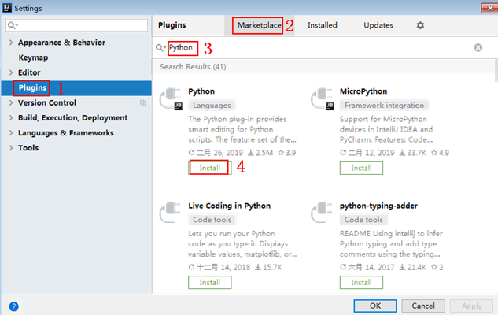
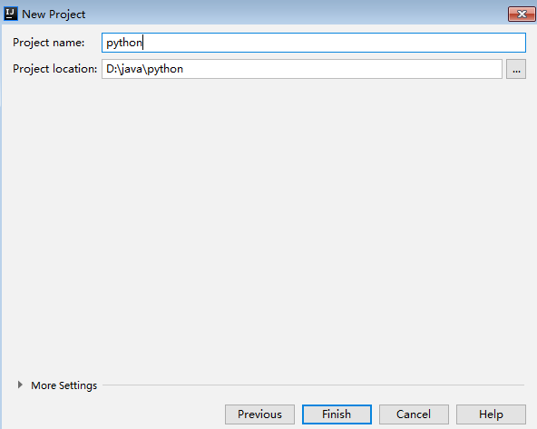

# 访问在线服务（APP认证）<a name="modelarts_23_0298"></a>

部署在线服务支持开启APP认证，即ModelArts会为服务注册一个支持APP认证的接口，为此接口配置APP授权后，用户可以使用授权应用的AppKey+AppSecret或AppCode调用该接口。

针对在线服务的APP认证，具体操作流程如下。

-   [开启支持APP认证功能](#section633522314449)：开启支持APP认证并创建应用。
-   [在线服务授权管理](#section187461712143214)：对创建的应用进行管理，包括查看、重置或删除应用，绑定或解绑应用对应的在线服务，获取“AppKey/AppSecret“或“AppCode“。
-   [APP认证鉴权](#section16719134283219)：调用支持APP认证的接口需要进行认证鉴权，支持两种鉴权方式，您可以选择其中一种进行认证鉴权。
-   [以Python语言为例准备环境](#section4769123820212)：在APP认证鉴权完成之后，您可以准备调用环境进行接口调用。
-   [调用API示例](#section1760144014545)：使用授权应用信息调用该接口进行预测。

## 前提条件<a name="section10145736175016"></a>

-   数据已完成准备：已在ModelArts中创建状态“正常“可用的模型。
-   由于在线运行需消耗资源，确保帐户未欠费。

## 开启支持APP认证功能<a name="section633522314449"></a>

在部署为在线服务时，您可以开启支持APP认证功能。或者针对已部署完成的在线服务，您可以修改服务，开启支持APP认证功能。

1.  登录ModelArts管理控制台，在左侧菜单栏中选择“部署上线 \> 在线服务“，进入在线服务管理页面。
2.  开启支持APP认证功能。
    -   在部署为在线服务时，即“部署“页面，填写部署服务相关参数时，开启支持APP认证功能。
    -   针对已部署完成的在线服务，进入在线服务管理页面，单击目标服务名称“操作“列的“修改“按钮，进入修改服务页面开启支持APP认证功能。

        **图 1**  部署页面开启支持APP认证功能<a name="fig8516152364414"></a>  
        

3.  选择APP授权配置。从下拉列表中选择您需要配置的APP应用，如果没有可选项，您可以通过如下方式创建应用。
    -   单击右侧“创建应用“，填写应用名称和描述之后单击“确定“完成创建。其中应用名称默认以“app\_“开头，您也可以自行修改。
    -   进入“部署上线\>在线服务“页面，单击“授权管理“，进入“在线服务授权管理“页面，选择“创建应用“，详请参见[在线服务授权管理](#section187461712143214)。

4.  开启支持APP认证功能后，将支持APP认证的服务授权给应用，用户可以使用创建的“AppKey/AppSecret“或“AppCode“调用服务的支持APP认证的接口。

## 在线服务授权管理<a name="section187461712143214"></a>

如果您需要使用支持APP认证功能，建议您在部署在线服务之前进行授权管理操作完成应用创建。进入“部署上线\>在线服务“页面，单击“授权管理“，进入“在线服务授权管理“页面。在此页面您可以实现应用的创建和管理，包括查看、重置或删除应用，解绑应用对应的在线服务，获取“AppKey/AppSecret“或“AppCode“。

**图 2**  在线服务授权管理<a name="fig16621105355719"></a>  


-   **创建应用**

    选择“创建应用“，填写应用名称和描述之后单击“确定“完成创建。其中应用名称默认以“app\_“开头，您也可以自行修改。

-   **查看、重置或删除应用**

    您可以单击目标应用名称操作列的按钮完成应用的查看、重置或删除。创建完成后自动生成“AppKey/AppSecret“以供您后续调取接口进行APP鉴权使用。

-   **解绑服务**

    您可以单击目标应用名称前方的，在下拉列表中展示绑定的服务列表，即该应用对应的在线服务列表。单击操作列的“解绑“取消绑定，将不再支持调用该接口。

-   **获取AppKey/AppSecret或AppCode**

    调用接口需要进行APP鉴权，在创建应用时自动生成“AppKey/AppSecret“，“AppCode“也可以通过单击“+添加AppCode“自动生成。

    **图 3**  添加AppCode<a name="fig33451503119"></a>  
    


## APP认证鉴权<a name="section16719134283219"></a>

当支持APP认证功能的在线服务运行成功处于“运行中“状态，就可以对服务进行调用 。在调用之前您需要进行APP认证鉴权。

调用支持APP认证的接口有如下两种认证方式，您可以选择其中一种进行认证鉴权。推荐使用AppKey/AppSecret认证，其安全性比AppCode认证要高。

-   AppCode认证：通过AppCode认证通用请求。
-   AppKey/AppSecret认证：通过AppKey（APP访问密钥ID）与AppSecret（APP私有访问密钥），对请求进行加密签名，可标识发送方，并防止请求被修改。

您可以在服务详情页的“调用指南“页签（如[图4](#fig39591038195718)）或者在线服务授权管理页面（如[图2](#fig16621105355719)）获取API接口和AppKey/AppSecret和AppCode。请注意使用图中红框所示的API接口地址。

**图 4**  获取API的接口地址<a name="fig39591038195718"></a>  


**AppCode认证**

当使用APP认证，且开启了简易认证模式，API请求既可以选择使用Appkey和AppSecret做签名和校验，也可以选择使用AppCode进行简易认证。ModelArts默认启用简易认证。

AppCode认证就是在调用API的时候，在HTTP请求头部消息增加一个参数“X-Apig-AppCode“（参数值为“AppCode“），而不需要对请求内容签名，API网关也仅校验AppCode，不校验请求签名，从而实现快速响应。示例代码如下：

```
import requests
url = 'https://e27faf2cc66a42fbad2dce18747962e5.apig.cn-north-4.huaweicloudapis.com/v1/infers/xxxxxx/goodbye'
headers={'Content-Type':'application/json',
         'X-Apig-Appcode':'dd19xxxxxx'}
response=requests.request('GET', url, headers=headers)
print(response.text)
```

> **说明：** 
>-   当APP不支持AppCode时，可使用AppKey进行简易认证，即在调用API的时候，在HTTP请求头部消息增加一个参数“apikey“（参数值为“AppKey“），实现快速认证。
>-   使用AppCode认证访问的更多方式可参考[访问在线服务（Token认证）](访问在线服务（Token认证）.md)。

**AppKey/AppSecret认证**

AppKey/AppSecret认证就是通过应用的AppKey和AppSecret进行签名认证。

-   AppKey：APP访问密钥ID。与私有访问密钥关联的唯一标识符；访问密钥ID和私有访问密钥一起使用，对请求进行加密签名。
-   <a name="li095763715198"></a>AppSecret：与访问密钥ID结合使用的密钥，对请求进行加密签名，可标识发送方，并防止请求被修改。

使用AppKey/AppSecret认证时，您需要使用专门的签名SDK对请求进行签名。

## 以Python语言为例准备环境<a name="section4769123820212"></a>

在APP认证鉴权完成之后，您可以准备调用环境进行接口调用。此章节内容以Python语言为例介绍SDK使用方式，其他语言的SDK下载与使用示例请参见[《API网关 APIG开发指南》](https://support.huaweicloud.com/devg-apig/apig-dev-180307002.html)。

1.  获取API的接口地址、请求方法、AppKey和AppSecret。获取方式请参见[APP认证鉴权](#li095763715198)。
2.  从[Python官网](https://www.python.org/downloads/)获取并安装Python安装包（支持使用2.7.9或3.X版本）。Python安装完成后，您可以执行命令**pip install requests**，通过Python通用包管理工具pip安装“requests”库。

    > **说明：** 
    >如果使用pip安装requests库遇到证书错误，请下载并使用Python执行[此文件](https://bootstrap.pypa.io/get-pip.py)，升级pip，然后再执行以上命令安装。

3.  从[IntelliJ IDEA官网](https://www.jetbrains.com/idea/)获取并安装IntelliJ IDEA。在IntelliJ IDEA中安装Python插件， 如[图5](#fig1760956134615)所示。

    **图 5**  安装Python插件<a name="fig1760956134615"></a>  
    

4.  获取SDK。[下载SDK](https://obs.cn-north-1.myhuaweicloud.com/apig-sdk/ApiGateway-python-sdk.zip)，获取“ApiGateway-python-sdk.zip“压缩包，解压后目录结构如下：

    **表 1**  SDK压缩包解压目录

    <a name="table119553561176"></a>
    <table><thead align="left"><tr id="row16303157175"><th class="cellrowborder" valign="top" width="35%" id="mcps1.2.3.1.1"><p id="p153030571779"><a name="p153030571779"></a><a name="p153030571779"></a><strong id="b030355716716"><a name="b030355716716"></a><a name="b030355716716"></a>名称</strong></p>
    </th>
    <th class="cellrowborder" valign="top" width="65%" id="mcps1.2.3.1.2"><p id="p12303557271"><a name="p12303557271"></a><a name="p12303557271"></a><strong id="b1030317571179"><a name="b1030317571179"></a><a name="b1030317571179"></a>说明</strong></p>
    </th>
    </tr>
    </thead>
    <tbody><tr id="row1330311576715"><td class="cellrowborder" valign="top" width="35%" headers="mcps1.2.3.1.1 "><p id="p14303857476"><a name="p14303857476"></a><a name="p14303857476"></a>apig_sdk\__init__.py</p>
    </td>
    <td class="cellrowborder" rowspan="2" valign="top" width="65%" headers="mcps1.2.3.1.2 "><p id="p103038571710"><a name="p103038571710"></a><a name="p103038571710"></a>SDK代码</p>
    </td>
    </tr>
    <tr id="row1530325716714"><td class="cellrowborder" valign="top" headers="mcps1.2.3.1.1 "><p id="p33049579714"><a name="p33049579714"></a><a name="p33049579714"></a>apig_sdk\signer.py</p>
    </td>
    </tr>
    <tr id="row5304185710712"><td class="cellrowborder" valign="top" width="35%" headers="mcps1.2.3.1.1 "><p id="p13041857372"><a name="p13041857372"></a><a name="p13041857372"></a>main.py</p>
    </td>
    <td class="cellrowborder" valign="top" width="65%" headers="mcps1.2.3.1.2 "><p id="p10304957676"><a name="p10304957676"></a><a name="p10304957676"></a>示例代码</p>
    </td>
    </tr>
    <tr id="row330405713716"><td class="cellrowborder" valign="top" width="35%" headers="mcps1.2.3.1.1 "><p id="p11305457975"><a name="p11305457975"></a><a name="p11305457975"></a>backend_signature.py</p>
    </td>
    <td class="cellrowborder" valign="top" width="65%" headers="mcps1.2.3.1.2 "><p id="p830510571573"><a name="p830510571573"></a><a name="p830510571573"></a>后端签名示例代码</p>
    </td>
    </tr>
    <tr id="row113051857574"><td class="cellrowborder" valign="top" width="35%" headers="mcps1.2.3.1.1 "><p id="p03059570715"><a name="p03059570715"></a><a name="p03059570715"></a>licenses\license-requests</p>
    </td>
    <td class="cellrowborder" valign="top" width="65%" headers="mcps1.2.3.1.2 "><p id="p0305145716714"><a name="p0305145716714"></a><a name="p0305145716714"></a>第三方库license文件</p>
    </td>
    </tr>
    </tbody>
    </table>

5.  新建工程。
    1.  打开IDEA，选择菜单“File \> New \> Project“。在弹出的“New Project“对话框中选择“Python“，单击“Next“。

        **图 6**  新建工程<a name="fig842212420505"></a>  
        

    2.  再次单击“Next“，弹出以下对话框。单击“...“，在弹出的对话框中选择解压后的SDK路径，单击“Finish“完成工程创建。

        **图 7**  选择解压后的SDK路径<a name="fig62936012216"></a>  
        

6.  完成工程创建后，目录结构如下。其中“main.py“为示例代码，请根据实际情况修改参数后使用。

    **图 8**  新建工程的目录结构<a name="fig2068165114534"></a>  
    


## 调用API示例<a name="section1760144014545"></a>

1.  在工程中引入“apig\_sdk“。

    ```
    from apig_sdk import signer
    import requests
    ```

2.  生成一个新的Signer，填入“AppKey“和“AppSecret“，获取方式请参见[APP认证鉴权](#li095763715198)。

    ```
    sig = signer.Signer()
    sig.Key = "4f5f626b-073f-402f-a1e0-e52171c6100c"
    sig.Secret = "******"
    ```

3.  生成一个Request对象，指定方法名、请求uri、header和body。

    ```
    r= signer.HttpRequest(method, uri, header, body)
    ```

    **表 2**  HttpRequest参数说明

    <a name="table1375416587428"></a>
    <table><thead align="left"><tr id="row87553581426"><th class="cellrowborder" valign="top" width="15.45154515451545%" id="mcps1.2.5.1.1"><p id="p18755758124212"><a name="p18755758124212"></a><a name="p18755758124212"></a>参数</p>
    </th>
    <th class="cellrowborder" valign="top" width="16.29162916291629%" id="mcps1.2.5.1.2"><p id="p169161517807"><a name="p169161517807"></a><a name="p169161517807"></a>子参数</p>
    </th>
    <th class="cellrowborder" valign="top" width="10.88108810881088%" id="mcps1.2.5.1.3"><p id="p11630202714141"><a name="p11630202714141"></a><a name="p11630202714141"></a>是否必填</p>
    </th>
    <th class="cellrowborder" valign="top" width="57.37573757375738%" id="mcps1.2.5.1.4"><p id="p1275535817427"><a name="p1275535817427"></a><a name="p1275535817427"></a>说明</p>
    </th>
    </tr>
    </thead>
    <tbody><tr id="row1475510587425"><td class="cellrowborder" valign="top" width="15.45154515451545%" headers="mcps1.2.5.1.1 "><p id="p137553582426"><a name="p137553582426"></a><a name="p137553582426"></a>method</p>
    </td>
    <td class="cellrowborder" valign="top" width="16.29162916291629%" headers="mcps1.2.5.1.2 "><p id="p1091621713017"><a name="p1091621713017"></a><a name="p1091621713017"></a>-</p>
    </td>
    <td class="cellrowborder" valign="top" width="10.88108810881088%" headers="mcps1.2.5.1.3 "><p id="p1863022714145"><a name="p1863022714145"></a><a name="p1863022714145"></a>是</p>
    </td>
    <td class="cellrowborder" valign="top" width="57.37573757375738%" headers="mcps1.2.5.1.4 "><p id="p1075575818421"><a name="p1075575818421"></a><a name="p1075575818421"></a>可填<span class="parmname" id="parmname162531617411"><a name="parmname162531617411"></a><a name="parmname162531617411"></a>“GET”</span>、<span class="parmname" id="parmname17477815413"><a name="parmname17477815413"></a><a name="parmname17477815413"></a>“POST”</span>、<span class="parmname" id="parmname784661382411"><a name="parmname784661382411"></a><a name="parmname784661382411"></a>“PUT”</span> 、<span class="parmname" id="parmname10673183813244"><a name="parmname10673183813244"></a><a name="parmname10673183813244"></a>“DELETE”</span></p>
    </td>
    </tr>
    <tr id="row37551558144214"><td class="cellrowborder" valign="top" width="15.45154515451545%" headers="mcps1.2.5.1.1 "><p id="p177551058174211"><a name="p177551058174211"></a><a name="p177551058174211"></a>uri</p>
    </td>
    <td class="cellrowborder" valign="top" width="16.29162916291629%" headers="mcps1.2.5.1.2 "><p id="p1391613174011"><a name="p1391613174011"></a><a name="p1391613174011"></a>-</p>
    </td>
    <td class="cellrowborder" valign="top" width="10.88108810881088%" headers="mcps1.2.5.1.3 "><p id="p186301027161410"><a name="p186301027161410"></a><a name="p186301027161410"></a>是</p>
    </td>
    <td class="cellrowborder" valign="top" width="57.37573757375738%" headers="mcps1.2.5.1.4 "><p id="p97551158174213"><a name="p97551158174213"></a><a name="p97551158174213"></a>填入在线服务的API接口，获取接口方式参见<a href="#section16719134283219">APP认证鉴权</a></p>
    </td>
    </tr>
    <tr id="row875585864210"><td class="cellrowborder" rowspan="3" valign="top" width="15.45154515451545%" headers="mcps1.2.5.1.1 "><p id="p207551858154210"><a name="p207551858154210"></a><a name="p207551858154210"></a>header</p>
    </td>
    <td class="cellrowborder" valign="top" width="16.29162916291629%" headers="mcps1.2.5.1.2 "><p id="p1191612174014"><a name="p1191612174014"></a><a name="p1191612174014"></a>x-stage</p>
    </td>
    <td class="cellrowborder" valign="top" width="10.88108810881088%" headers="mcps1.2.5.1.3 "><p id="p166308275147"><a name="p166308275147"></a><a name="p166308275147"></a>是</p>
    </td>
    <td class="cellrowborder" valign="top" width="57.37573757375738%" headers="mcps1.2.5.1.4 "><p id="p075510583422"><a name="p075510583422"></a><a name="p075510583422"></a>接口发布环境，必填，当前仅支持<span class="parmname" id="parmname18810436419"><a name="parmname18810436419"></a><a name="parmname18810436419"></a>“RELEASE”</span>。</p>
    </td>
    </tr>
    <tr id="row67661242172413"><td class="cellrowborder" valign="top" headers="mcps1.2.5.1.1 "><p id="p1376654252415"><a name="p1376654252415"></a><a name="p1376654252415"></a>Content-Type</p>
    </td>
    <td class="cellrowborder" valign="top" headers="mcps1.2.5.1.2 "><p id="p15766124242415"><a name="p15766124242415"></a><a name="p15766124242415"></a>否</p>
    </td>
    <td class="cellrowborder" valign="top" headers="mcps1.2.5.1.3 "><p id="p1445495512415"><a name="p1445495512415"></a><a name="p1445495512415"></a>内容类型，当前支持<span class="parmname" id="parmname1445435519245"><a name="parmname1445435519245"></a><a name="parmname1445435519245"></a>“application/json”</span>。<span class="parmname" id="parmname645405518247"><a name="parmname645405518247"></a><a name="parmname645405518247"></a>“multipart/form-data”</span>形式请求体请参考<a href="#table35531047192112">表3</a>。</p>
    </td>
    </tr>
    <tr id="row2095071910412"><td class="cellrowborder" valign="top" headers="mcps1.2.5.1.1 "><p id="p1950161910413"><a name="p1950161910413"></a><a name="p1950161910413"></a>x-sdk-content-sha256</p>
    </td>
    <td class="cellrowborder" valign="top" headers="mcps1.2.5.1.2 "><p id="p16630142781415"><a name="p16630142781415"></a><a name="p16630142781415"></a>否</p>
    </td>
    <td class="cellrowborder" valign="top" headers="mcps1.2.5.1.3 "><p id="p689715304129"><a name="p689715304129"></a><a name="p689715304129"></a>签名方式，可填<span class="parmname" id="parmname99910343121"><a name="parmname99910343121"></a><a name="parmname99910343121"></a>“UNSIGNED-PAYLOAD”</span>，表示不对body进行签名认证。</p>
    <p id="p295014191641"><a name="p295014191641"></a><a name="p295014191641"></a>当body为文件时，该参数必填。</p>
    </td>
    </tr>
    <tr id="row273185819012"><td class="cellrowborder" valign="top" width="15.45154515451545%" headers="mcps1.2.5.1.1 "><p id="p77319581207"><a name="p77319581207"></a><a name="p77319581207"></a>body</p>
    </td>
    <td class="cellrowborder" valign="top" width="16.29162916291629%" headers="mcps1.2.5.1.2 "><p id="p873114585015"><a name="p873114585015"></a><a name="p873114585015"></a>-</p>
    </td>
    <td class="cellrowborder" valign="top" width="10.88108810881088%" headers="mcps1.2.5.1.3 "><p id="p15630172711418"><a name="p15630172711418"></a><a name="p15630172711418"></a>否</p>
    </td>
    <td class="cellrowborder" valign="top" width="57.37573757375738%" headers="mcps1.2.5.1.4 "><p id="p117316581106"><a name="p117316581106"></a><a name="p117316581106"></a>支持json格式，示例 ："{\"xxx\":\"xxx\"}"。</p>
    </td>
    </tr>
    </tbody>
    </table>

    1.  当请求体为json格式

        ```
        r = signer.HttpRequest("POST",
                               "https://1684994b180244de9d141c00d3e52c73.apig.exampleRegion.huaweicloudapis.com/v1/infers/exampleServiceId"，
                               {"x-stage": "RELEASE","Content-Type":"application/json"},"{\"xxx\":\"xxx\"}")
        ```

    2.  当请求体为图片格式，您需要构造multipart/form-data形式的请求体。

        请求体样式：_files=\{"请求参数":\("文件路径"，文件内容，“文件类型”，请求头\)\}_

        **表 3**  files参数

        <a name="table35531047192112"></a>
        <table><thead align="left"><tr id="row6553194719213"><th class="cellrowborder" valign="top" width="23.47%" id="mcps1.2.3.1.1"><p id="p185531347162111"><a name="p185531347162111"></a><a name="p185531347162111"></a>参数</p>
        </th>
        <th class="cellrowborder" valign="top" width="76.53%" id="mcps1.2.3.1.2"><p id="p1455324772113"><a name="p1455324772113"></a><a name="p1455324772113"></a>说明</p>
        </th>
        </tr>
        </thead>
        <tbody><tr id="row165531447122111"><td class="cellrowborder" valign="top" width="23.47%" headers="mcps1.2.3.1.1 "><p id="p55531847182118"><a name="p55531847182118"></a><a name="p55531847182118"></a>请求参数</p>
        </td>
        <td class="cellrowborder" valign="top" width="76.53%" headers="mcps1.2.3.1.2 "><p id="p75539477215"><a name="p75539477215"></a><a name="p75539477215"></a>在线服务输入参数名称。</p>
        </td>
        </tr>
        <tr id="row755315476218"><td class="cellrowborder" valign="top" width="23.47%" headers="mcps1.2.3.1.1 "><p id="p55531347172114"><a name="p55531347172114"></a><a name="p55531347172114"></a>文件路径</p>
        </td>
        <td class="cellrowborder" valign="top" width="76.53%" headers="mcps1.2.3.1.2 "><p id="p1555412476219"><a name="p1555412476219"></a><a name="p1555412476219"></a>上传文件的路径。</p>
        </td>
        </tr>
        <tr id="row6554194782111"><td class="cellrowborder" valign="top" width="23.47%" headers="mcps1.2.3.1.1 "><p id="p1355434715210"><a name="p1355434715210"></a><a name="p1355434715210"></a>文件内容</p>
        </td>
        <td class="cellrowborder" valign="top" width="76.53%" headers="mcps1.2.3.1.2 "><p id="p6554164782111"><a name="p6554164782111"></a><a name="p6554164782111"></a>上传文件的内容。</p>
        </td>
        </tr>
        <tr id="row176674311245"><td class="cellrowborder" valign="top" width="23.47%" headers="mcps1.2.3.1.1 "><p id="p0671243102419"><a name="p0671243102419"></a><a name="p0671243102419"></a>文件类型</p>
        </td>
        <td class="cellrowborder" valign="top" width="76.53%" headers="mcps1.2.3.1.2 "><p id="p867134313245"><a name="p867134313245"></a><a name="p867134313245"></a>上传文件类型。当前支持以下类型：</p>
        <a name="ul1114583012269"></a><a name="ul1114583012269"></a><ul id="ul1114583012269"><li>txt类型：text/plain</li><li>jpg/jpeg类型：image/jpeg</li><li>png类型：image/png</li></ul>
        </td>
        </tr>
        <tr id="row7554204719210"><td class="cellrowborder" valign="top" width="23.47%" headers="mcps1.2.3.1.1 "><p id="p115541647182110"><a name="p115541647182110"></a><a name="p115541647182110"></a>请求头</p>
        </td>
        <td class="cellrowborder" valign="top" width="76.53%" headers="mcps1.2.3.1.2 "><p id="p11554104714216"><a name="p11554104714216"></a><a name="p11554104714216"></a>建议填<span class="parmname" id="parmname10210162512313"><a name="parmname10210162512313"></a><a name="parmname10210162512313"></a>“{}”</span>，请求头在<span class="parmname" id="parmname1984810357231"><a name="parmname1984810357231"></a><a name="parmname1984810357231"></a>“HttpRequest”</span>参数<span class="parmvalue" id="parmvalue164624401239"><a name="parmvalue164624401239"></a><a name="parmvalue164624401239"></a>“header”</span>中填入。</p>
        </td>
        </tr>
        </tbody>
        </table>

        如果您访问请求参数为images，输入格式为file类型的在线服务，示例如下。

        **图 9**  访问在线服务<a name="fig19732193515438"></a>  
        

        ```
        r = signer.HttpRequest("POST","https://63fb035aeef34368880448a94cb7f440.apig.cn-north-4.huaweicloudapis.com/v1/infers/76c41384-23ab-45f9-a66e-892e7bc2be53",
        {"x-stage": "RELEASE", "x-sdk-content-sha256": "UNSIGNED-PAYLOAD"})
        files = {"images": ("flower.png", open("flower.png", "rb"), "image/png", {})}
        ```

4.  进行签名，执行此函数会在请求参数中添加用于签名的“X-Sdk-Date“头和“Authorization“头。

    ```
    sig.Sign(r)
    ```

5.  调用API，查看访问结果。

    ```
    resp = requests.request(method,url, headers, data, files)
    ```

    **表 4**  request参数说明

    <a name="table1954905410253"></a>
    <table><thead align="left"><tr id="row19549175462513"><th class="cellrowborder" valign="top" width="12.82%" id="mcps1.2.3.1.1"><p id="p16549654202512"><a name="p16549654202512"></a><a name="p16549654202512"></a>参数</p>
    </th>
    <th class="cellrowborder" valign="top" width="87.18%" id="mcps1.2.3.1.2"><p id="p25492542256"><a name="p25492542256"></a><a name="p25492542256"></a>说明</p>
    </th>
    </tr>
    </thead>
    <tbody><tr id="row854985412259"><td class="cellrowborder" valign="top" width="12.82%" headers="mcps1.2.3.1.1 "><p id="p195491954182518"><a name="p195491954182518"></a><a name="p195491954182518"></a>method</p>
    </td>
    <td class="cellrowborder" valign="top" width="87.18%" headers="mcps1.2.3.1.2 "><p id="p175498549251"><a name="p175498549251"></a><a name="p175498549251"></a>填入签名后Request对象的请求方法。</p>
    </td>
    </tr>
    <tr id="row13549454182514"><td class="cellrowborder" valign="top" width="12.82%" headers="mcps1.2.3.1.1 "><p id="p195497546258"><a name="p195497546258"></a><a name="p195497546258"></a>url</p>
    </td>
    <td class="cellrowborder" valign="top" width="87.18%" headers="mcps1.2.3.1.2 "><p id="p854965420259"><a name="p854965420259"></a><a name="p854965420259"></a>填入签名后Request对象的请求地址。</p>
    </td>
    </tr>
    <tr id="row1515133518266"><td class="cellrowborder" valign="top" width="12.82%" headers="mcps1.2.3.1.1 "><p id="p151511356262"><a name="p151511356262"></a><a name="p151511356262"></a>headers</p>
    </td>
    <td class="cellrowborder" valign="top" width="87.18%" headers="mcps1.2.3.1.2 "><p id="p108684577293"><a name="p108684577293"></a><a name="p108684577293"></a>填入签名后Request对象的headers。</p>
    </td>
    </tr>
    <tr id="row519816399266"><td class="cellrowborder" valign="top" width="12.82%" headers="mcps1.2.3.1.1 "><p id="p12198113932610"><a name="p12198113932610"></a><a name="p12198113932610"></a>data</p>
    </td>
    <td class="cellrowborder" valign="top" width="87.18%" headers="mcps1.2.3.1.2 "><p id="p61981393262"><a name="p61981393262"></a><a name="p61981393262"></a>填入Request对象的body请求体，仅支持Json格式。</p>
    </td>
    </tr>
    <tr id="row18916142112614"><td class="cellrowborder" valign="top" width="12.82%" headers="mcps1.2.3.1.1 "><p id="p1691604232614"><a name="p1691604232614"></a><a name="p1691604232614"></a>files</p>
    </td>
    <td class="cellrowborder" valign="top" width="87.18%" headers="mcps1.2.3.1.2 "><p id="p14916134252612"><a name="p14916134252612"></a><a name="p14916134252612"></a>填入multipart/form-data形式的请求体。</p>
    </td>
    </tr>
    </tbody>
    </table>

    1.  当请求体为json格式

        ```
        resp = requests.request(r.method, r.scheme + "://" + r.host + r.uri, headers=r.headers, data=r.body)
        print(resp.status_code, resp.reason)
        print(resp.content)
        ```

    2.  当请求体为图片格式

        ```
        resp = requests.request(r.method, r.scheme + "://" + r.host + r.uri, headers=r.headers, data={}, files=files)
        print(resp.status_code, resp.reason)
        print(resp.content)
        ```


