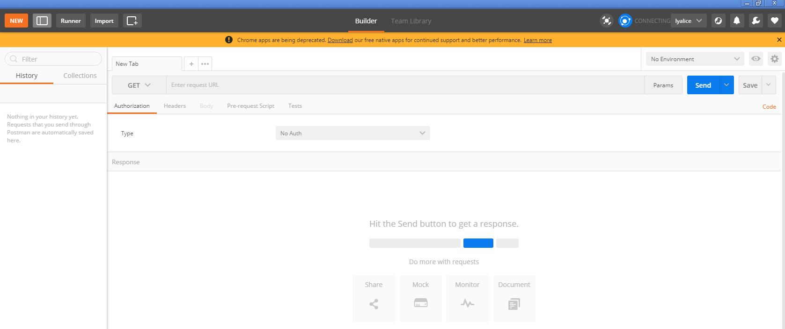
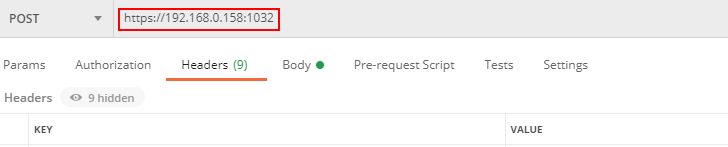
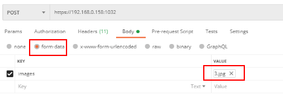
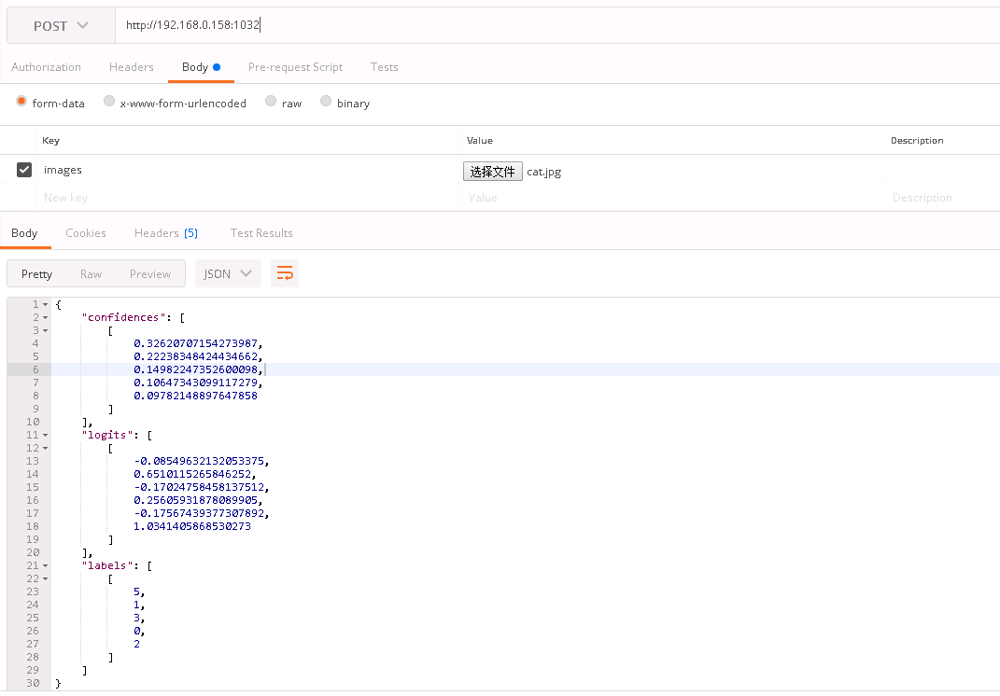
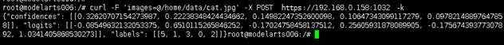
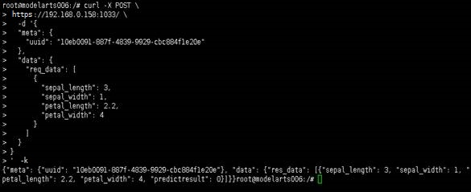

# 访问边缘服务<a name="modelarts_23_0070"></a>

## 访问边缘服务<a name="section129991528517"></a>

当边缘服务和边缘节点的状态都处于“运行中“状态，表示边缘服务已在边缘节点成功部署。

您可以通过以下两种方式，在能够访问到边缘节点的网络环境中，对部署在边缘节点上的边缘服务发起预测请求。

-   [方式一：使用图形界面的软件进行预测（以Postman为例）](#section148871319185615)
-   [方式二：使用curl命令发送预测请求](#section3383753105619)

## 方式一：使用图形界面的软件进行预测（以Postman为例）<a name="section148871319185615"></a>

1.  下载[Postman](https://www.getpostman.com/apps)软件并安装，您可以直接在Chrome浏览器添加Postman扩展程序（也可使用其它支持发送post请求的软件）。
2.  打开Postman，如[图1](#fig1498591965617)所示。

    **图 1**  Postman软件界面<a name="fig1498591965617"></a>  
    

3.  在Postman界面填写参数，以图像分类举例说明。
    -   选择POST任务，将某个边缘节点的调用地址（通过边缘服务详情界面-节点信息页签查看）复制到POST后面的方框。

        **图 2**  POST参数填写<a name="fig198681911568"></a>  
        

    -   在Body页签，根据模型的输入参数不同，可分为2种类型：文件输入、文本输入。
        -   **文件输入**

            选择“form-data“。在“KEY“值填写模型的入参，比如本例中预测图片的参数为“images“。然后在“VALUE“值，选择文件，上传一张待预测图片（当前仅支持单张图片预测）。

            **图 3**  填写Body配置<a name="fig199875194567"></a>  
            

        -   **文本输入**

            选择“raw“，选择JSON\(application/json\)类型，在下方文本框中填写请求体，请求体样例如下。

            ```
            {
            "meta": {
            "uuid": "10eb0091-887f-4839-9929-cbc884f1e20e"
            },
            "data": {
            "req_data": [
            {
            "sepal_length": 3,
            "sepal_width": 1,
            "petal_length": 2.2,
            "petal_width": 4
            }
            ]
            }
            }
            ```

            其中，“meta“中可携带“uuid“，返回预测结果时回传此“uuid“用于跟踪请求，**如无此需要可不填写meta。**“data“包含了一个“req\_data“的数组，可传入单条或多条请求数据，其中每个数据的参数由模型决定，比如本例中的“sepal\_length“、“sepal\_width“等。


4.  参数填写完成，点击“Send”发送请求，结果会在Response下的对话框里显示。
    -   文件输入形式的预测结果样例如[图4](#fig12990131917568)所示，返回结果的字段值根据不同模型可能有所不同。

        **图 4**  文件输入预测结果<a name="fig12990131917568"></a>  
        

    -   文本输入形式的预测结果样例如[图5](#fig7990819135610)所示，请求体包含“meta“及“data“。如输入请求中包含“uuid“，则输出结果中回传此“uuid“。如未输入，则为空。“data“包含了一个“req\_data“的数组，可传入单条或多条请求数据，其中每个数据的参数由模型决定，比如本例中的“sepal\_length“、“sepal\_width“等。

        **图 5**  文本输入预测结果<a name="fig7990819135610"></a>  
        


## 方式二：使用curl命令发送预测请求<a name="section3383753105619"></a>

使用curl命令发送预测请求的命令格式也分为文件输入、文本输入两类

1.  文件输入

    ```
    curl -F 'images=@图片路径'-X POST 边缘节点服务地址
    ```

    -   “-F“是指上传数据的是文件，本例中参数名为**images**，这个名字可以根据具体情况变化，@后面是图片的存储路径。
    -   “POST“后面跟随的是边缘节点的调用地址。

    curl命令文件输入预测样例：

    ```
    curl -F 'images=@/home/data/cat.jpg' -X POST https://192.168.0.158:1032
    ```

    预测结果如[图6](#fig648245335617)所示。

    **图 6**  curl命令文件输入预测结果<a name="fig648245335617"></a>  
    

2.  文本输入

    ```
    curl -d '{
    "meta": {
    "uuid": "10eb0091-887f-4839-9929-cbc884f1e20e"
    },
    "data": {
    "req_data": [
    {
    "sepal_length": 3,
    "sepal_width": 1,
    "petal_length": 2.2,
    "petal_width": 4
    }
    ]
    }
    }' -X POST <边缘节点服务地址>
    ```

    -   “-d“是Body体的文本内容，如模型为文本输入，则需要用此参数。

    curl命令文本输入预测样例：

    ```
    curl -d '{
    "meta": {
    "uuid": "10eb0091-887f-4839-9929-cbc884f1e20e"
    },
    "data": {
    "req_data": [
    {
    "sepal_length": 3,
    "sepal_width": 1,
    "petal_length": 2.2,
    "petal_width": 4
    }
    ]
    }
    }' -X POST http://192.168.0.158:1033
    ```

    预测结果如[图7](#fig19484185315562)所示。

    **图 7**  curl命令文本输入预测结果<a name="fig19484185315562"></a>  
    


