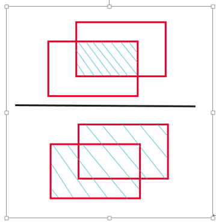

# 评估指标说明

目前可以查看的评估指标分为图像分类、物体检测和图像语义分割三种场景。模型评估的指标总共包含7大模块：评估综述、精度评估、敏感度分析、计算性能分析、热力图、抽象特征分析和对抗性分析，其中后四种仅在图像分类场景下存在，其他的在三种场景下分别有自己对应的指标。

## 公共部分

**表 1**  评估综述的指标说明

<table><thead align="left"><tr id="row81561945164410"><th class="cellrowborder" valign="top" width="28.599999999999998%" id="mcps1.2.3.1.1">
参数

</th>
<th class="cellrowborder" valign="top" width="71.39999999999999%" id="mcps1.2.3.1.2">
说明

</th>
</tr>
</thead>
<tbody><tr id="row138701247154910"><td class="cellrowborder" valign="top" width="28.599999999999998%" headers="mcps1.2.3.1.1 ">
综合指标

</td>
<td class="cellrowborder" valign="top" width="71.39999999999999%" headers="mcps1.2.3.1.2 ">
综合的评估指标，图像分类为Accurancy，物体检测为MAP，图像语义分割为PA，关于指标详细说明参见各场景中的说明。

</td>
</tr>
<tr id="row51561845134412"><td class="cellrowborder" valign="top" width="28.599999999999998%" headers="mcps1.2.3.1.1 ">
推理结果

</td>
<td class="cellrowborder" valign="top" width="71.39999999999999%" headers="mcps1.2.3.1.2 ">
展示推理的结果，包括推理结果和真实标签结果以及推理的置信度

</td>
</tr>
<tr id="row141561545134417"><td class="cellrowborder" valign="top" width="28.599999999999998%" headers="mcps1.2.3.1.1 ">
综合评估

</td>
<td class="cellrowborder" valign="top" width="71.39999999999999%" headers="mcps1.2.3.1.2 ">
经过对推理结果、数据集的分析，得出的现象和针对现象改进的建议综述，只展示优先级较高的现象和建议。

</td>
</tr>
</tbody>
</table>

## 图像分类

混淆矩阵，是一个每一列表示实际的标签统计，每一行表示预测的结果统计的矩阵。矩阵的对角线代表所有预测正确的结果。这里有几个概念，会用于计算各精度指标。以二分类举例，分别为预测正确的正例数TP，预测错误的正例数FN，预测正确的负例数TN和预测错误的负例数FP。

**表 2**  图像分类中混淆矩阵对应的概念

<table><thead align="left"><tr id="row9272165718311"><th class="cellrowborder" valign="top" width="33.33333333333333%" id="mcps1.2.4.1.1">
参数

</th>
<th class="cellrowborder" valign="top" width="33.33333333333333%" id="mcps1.2.4.1.2">
实际标签为真

</th>
<th class="cellrowborder" valign="top" width="33.33333333333333%" id="mcps1.2.4.1.3">
实际标签为假

</th>
</tr>
</thead>
<tbody><tr id="row727355711313"><td class="cellrowborder" valign="top" width="33.33333333333333%" headers="mcps1.2.4.1.1 ">
预测标签为真

</td>
<td class="cellrowborder" valign="top" width="33.33333333333333%" headers="mcps1.2.4.1.2 ">
TP（真阳性记录）

</td>
<td class="cellrowborder" valign="top" width="33.33333333333333%" headers="mcps1.2.4.1.3 ">
FP（假阳性记录）

</td>
</tr>
<tr id="row527313579316"><td class="cellrowborder" valign="top" width="33.33333333333333%" headers="mcps1.2.4.1.1 ">
预测标签为假

</td>
<td class="cellrowborder" valign="top" width="33.33333333333333%" headers="mcps1.2.4.1.2 ">
FN（假阴性记录）

</td>
<td class="cellrowborder" valign="top" width="33.33333333333333%" headers="mcps1.2.4.1.3 ">
TN（真阴性记录）

</td>
</tr>
<tr id="row3353102617349"><td class="cellrowborder" valign="top" width="33.33333333333333%" headers="mcps1.2.4.1.1 ">
总样本数

</td>
<td class="cellrowborder" valign="top" width="33.33333333333333%" headers="mcps1.2.4.1.2 ">
P = TP + FN（正样本数）

</td>
<td class="cellrowborder" valign="top" width="33.33333333333333%" headers="mcps1.2.4.1.3 ">
N = FP + TN（负样本数）

</td>
</tr>
</tbody>
</table>

**表 3**  图像分类评估指标说明

<table><thead align="left"><tr id="row619093510714"><th class="cellrowborder" valign="top" width="16.221622162216224%" id="mcps1.2.4.1.1">
指标名称

</th>
<th class="cellrowborder" valign="top" width="23.712371237123715%" id="mcps1.2.4.1.2">
子参数

</th>
<th class="cellrowborder" valign="top" width="60.066006600660074%" id="mcps1.2.4.1.3">
说明

</th>
</tr>
</thead>
<tbody><tr id="row141901235672"><td class="cellrowborder" rowspan="6" valign="top" width="16.221622162216224%" headers="mcps1.2.4.1.1 ">
精度评估

</td>
<td class="cellrowborder" valign="top" width="23.712371237123715%" headers="mcps1.2.4.1.2 ">
图像类别分布

</td>
<td class="cellrowborder" valign="top" width="60.066006600660074%" headers="mcps1.2.4.1.3 ">
不同类别图片数量的统计值。

</td>
</tr>
<tr id="row21081425611"><td class="cellrowborder" valign="top" headers="mcps1.2.4.1.1 ">
混淆矩阵

</td>
<td class="cellrowborder" valign="top" headers="mcps1.2.4.1.2 ">
对混淆矩阵的说明请参见<a href="#table1827235717315">表2</a>。

</td>
</tr>
<tr id="row47328325137"><td class="cellrowborder" valign="top" headers="mcps1.2.4.1.1 ">
召回率

</td>
<td class="cellrowborder" valign="top" headers="mcps1.2.4.1.2 ">
召回率，正确预测的正例数和实际正例总数的比值，这个值越大代表漏检的概率越小。计算公式R=TP/(TP+FN)，即混淆矩阵中某一列预测正确的个数除以该列的样本和。

</td>
</tr>
<tr id="row151583761313"><td class="cellrowborder" valign="top" headers="mcps1.2.4.1.1 ">
精确率

</td>
<td class="cellrowborder" valign="top" headers="mcps1.2.4.1.2 ">
精确率，正确预测的正例数和预测正例总数的比值，这个值越大代表误检的概率越小。计算公式P=TP/(TP+FP)，即混淆矩阵中某一行预测正确的个数除以该行的样本和。

</td>
</tr>
<tr id="row31901435676"><td class="cellrowborder" valign="top" headers="mcps1.2.4.1.1 ">
F1值

</td>
<td class="cellrowborder" valign="top" headers="mcps1.2.4.1.2 ">
精确率与召回率的调和均值。计算公式F1=2*P*R/(P+R)，其中R为召回率，P为精确率。

</td>
</tr>
<tr id="row319016350718"><td class="cellrowborder" valign="top" headers="mcps1.2.4.1.1 ">
ROC曲线

</td>
<td class="cellrowborder" valign="top" headers="mcps1.2.4.1.2 ">
ROC 曲线用于绘制采用不同分类阈值时的 TPR （真正例率，纵坐标）与 FPR（假正例率，横坐标），ROC曲线越接近左上角，该分类器的性能越好。

</td>
</tr>
<tr id="row15190435174"><td class="cellrowborder" rowspan="3" valign="top" width="16.221622162216224%" headers="mcps1.2.4.1.1 ">
敏感度分析

</td>
<td class="cellrowborder" valign="top" width="23.712371237123715%" headers="mcps1.2.4.1.2 ">
不同特征范围下的准确率

</td>
<td class="cellrowborder" valign="top" width="60.066006600660074%" headers="mcps1.2.4.1.3 ">
将图片根据特征值，如亮度、模糊度等划分为几个部分，分别测试几个部分的精度然后绘图。

</td>
</tr>
<tr id="row41901535179"><td class="cellrowborder" valign="top" headers="mcps1.2.4.1.1 ">
特征分布

</td>
<td class="cellrowborder" valign="top" headers="mcps1.2.4.1.2 ">
图片特征值的分布图。

</td>
</tr>
<tr id="row519017359720"><td class="cellrowborder" valign="top" headers="mcps1.2.4.1.1 ">
F1值敏感度

</td>
<td class="cellrowborder" valign="top" headers="mcps1.2.4.1.2 ">
展示不同类别数据在不同特征值范围内的F1值 ，用于判别模型对哪个特征范围内的图片效果较好。

</td>
</tr>
<tr id="row221219224817"><td class="cellrowborder" rowspan="2" valign="top" width="16.221622162216224%" headers="mcps1.2.4.1.1 ">
计算性能分析

（默认不展示，仅预置算法resnet_v1_50支持）

</td>
<td class="cellrowborder" valign="top" width="23.712371237123715%" headers="mcps1.2.4.1.2 ">
算子耗时占比与参数数量占比

</td>
<td class="cellrowborder" valign="top" width="60.066006600660074%" headers="mcps1.2.4.1.3 ">
计算网络中各种参数如卷积操作、池化操作在网络中的占比、以及在前向过程中耗时的占比。

</td>
</tr>
<tr id="row2664182715816"><td class="cellrowborder" valign="top" headers="mcps1.2.4.1.1 ">
其他指标

</td>
<td class="cellrowborder" valign="top" headers="mcps1.2.4.1.2 ">
包含GPU占用率、耗时、模型大小、参数总量和模型总计算量等基本模型信息。

</td>
</tr>
<tr id="row145032154314"><td class="cellrowborder" valign="top" width="16.221622162216224%" headers="mcps1.2.4.1.1 ">
热力图

（默认不展示，仅预置算法resnet_v1_50支持）

</td>
<td class="cellrowborder" valign="top" width="23.712371237123715%" headers="mcps1.2.4.1.2 ">
热力图结果展示

</td>
<td class="cellrowborder" valign="top" width="60.066006600660074%" headers="mcps1.2.4.1.3 ">
使用gradcam++算法绘制的热力图，高亮区域表示模型主要是根据图片中的该区域来判定图片的推理结果。

</td>
</tr>
<tr id="row47581135124310"><td class="cellrowborder" valign="top" width="16.221622162216224%" headers="mcps1.2.4.1.1 ">
抽象特征分析

（默认不展示，仅预置算法resnet_v1_50支持）

</td>
<td class="cellrowborder" valign="top" width="23.712371237123715%" headers="mcps1.2.4.1.2 ">
特征分布

</td>
<td class="cellrowborder" valign="top" width="60.066006600660074%" headers="mcps1.2.4.1.3 ">
提取的图像分类基础网络全连接层前一层的卷积层输出，如在resnet50网络中，最终一张图片会输出一个1*2048的矩阵。将该输出降维到二维后绘制到二维的散点图上。

</td>
</tr>
<tr id="row173969409555"><td class="cellrowborder" rowspan="7" valign="top" width="16.221622162216224%" headers="mcps1.2.4.1.1 ">
对抗样本评估

（默认不展示，仅预置算法resnet_v1_50支持）

</td>
<td class="cellrowborder" valign="top" width="23.712371237123715%" headers="mcps1.2.4.1.2 ">
PSNR

</td>
<td class="cellrowborder" valign="top" width="60.066006600660074%" headers="mcps1.2.4.1.3 ">
峰值信噪比，表示讯号最大可能功率和影响他的表示精度的破坏性噪声的功率的比值。

</td>
</tr>
<tr id="row9355191425618"><td class="cellrowborder" valign="top" headers="mcps1.2.4.1.1 ">
SSIM

</td>
<td class="cellrowborder" valign="top" headers="mcps1.2.4.1.2 ">
结构相似性，用于衡量两张数位影像的相似程度，常用于比较无失真和失真影像的区别。

</td>
</tr>
<tr id="row1942217141105"><td class="cellrowborder" valign="top" headers="mcps1.2.4.1.1 ">
ACAC

</td>
<td class="cellrowborder" valign="top" headers="mcps1.2.4.1.2 ">
对不正确类预测的平均置信度，也就是对抗样本中预测错误的类别的平均置信度。

</td>
</tr>
<tr id="row1595462912107"><td class="cellrowborder" valign="top" headers="mcps1.2.4.1.1 ">
ACTC

</td>
<td class="cellrowborder" valign="top" headers="mcps1.2.4.1.2 ">
对正确类预测的平均置信度，也就是对抗样本中预测正确的类别的平均置信度。用来进一步评估攻击在多大程度上脱离了真实值。

</td>
</tr>
<tr id="row622121151017"><td class="cellrowborder" valign="top" headers="mcps1.2.4.1.1 ">
MR

</td>
<td class="cellrowborder" valign="top" headers="mcps1.2.4.1.2 ">
对抗样本被分类错误，或者分类为目标类的比例。

</td>
</tr>
<tr id="row17520717151015"><td class="cellrowborder" valign="top" headers="mcps1.2.4.1.1 ">
ALD

</td>
<td class="cellrowborder" valign="top" headers="mcps1.2.4.1.2 ">
平均Lp失真，表示成功的对抗样本的平均标准化Lp。该值越小表示对抗样本越不易被察觉。

</td>
</tr>
<tr id="row13647871106"><td class="cellrowborder" valign="top" headers="mcps1.2.4.1.1 ">
其他

</td>
<td class="cellrowborder" valign="top" headers="mcps1.2.4.1.2 ">
与精度评估中的指标相似。

</td>
</tr>
</tbody>
</table>

> **说明：** 
>其中，“计算性能分析“仅支持TensorFlow图像分类的预置算法，“热力图“、“抽象特征分析“和“对抗样本评估“仅支持TensorFlow图像分类算法。针对这几项指标的展示，需更改评估代码生成所需的文件，详情参见[模型评估代码示例](模型评估代码示例.md)中图像分类的部分。

## 物体检测

**表 4**  物体检测评估指标说明

<table><thead align="left"><tr id="row7981103932011"><th class="cellrowborder" valign="top" width="16.56165616561656%" id="mcps1.2.4.1.1">
指标名称

</th>
<th class="cellrowborder" valign="top" width="26.072607260726073%" id="mcps1.2.4.1.2">
子参数

</th>
<th class="cellrowborder" valign="top" width="57.365736573657365%" id="mcps1.2.4.1.3">
说明

</th>
</tr>
</thead>
<tbody><tr id="row18981183922013"><td class="cellrowborder" rowspan="6" valign="top" width="16.56165616561656%" headers="mcps1.2.4.1.1 ">
精度评估

</td>
<td class="cellrowborder" valign="top" width="26.072607260726073%" headers="mcps1.2.4.1.2 ">
图像类别分布

</td>
<td class="cellrowborder" valign="top" width="57.365736573657365%" headers="mcps1.2.4.1.3 ">
数据集中不同类别的图像框个数统计。

</td>
</tr>
<tr id="row12981103910208"><td class="cellrowborder" valign="top" headers="mcps1.2.4.1.1 ">
P-R曲线

</td>
<td class="cellrowborder" valign="top" headers="mcps1.2.4.1.2 ">
根据每种分类的置信度对样例进行排序，逐个把样例加入正例进行预测，算出此时的精准率和召回率。使用这一系列的精准率和召回率绘制的曲线，即是一个类别的P-R曲线。

</td>
</tr>
<tr id="row898113912209"><td class="cellrowborder" valign="top" headers="mcps1.2.4.1.1 ">
不同目标框交并比阈值下的mAP

</td>
<td class="cellrowborder" valign="top" headers="mcps1.2.4.1.2 ">
计算不同目标框交并比阈值下的mAP值，并绘制曲线，反馈mAP值最高的阈值。其中交并比阈值是用于NMS时过滤可能预测为同一物体的重叠框的阈值。关于交并比示例请参见<a href="#fig182893664210">图1</a>。

</td>
</tr>
<tr id="row4981539102017"><td class="cellrowborder" valign="top" headers="mcps1.2.4.1.1 ">
不同置信度阈值下的F1值

</td>
<td class="cellrowborder" valign="top" headers="mcps1.2.4.1.2 ">
计算不同置信度阈值下的平均F1值，并绘制曲线，反馈F1值最高的阈值。

</td>
</tr>
<tr id="row11981143913209"><td class="cellrowborder" valign="top" headers="mcps1.2.4.1.1 ">
误检分析

</td>
<td class="cellrowborder" valign="top" headers="mcps1.2.4.1.2 ">
从预测结果角度统计错误检测的结果，包含准确检测、类别误检、背景误检、位置偏差四种误检的错误类型，绘制成饼图，统计各类错误占错误检测的比例。详细错误类别请参见<a href="#fig1710534215425">图2</a>。

</td>
</tr>
<tr id="row298112391209"><td class="cellrowborder" valign="top" headers="mcps1.2.4.1.1 ">
漏检分析

</td>
<td class="cellrowborder" valign="top" headers="mcps1.2.4.1.2 ">
从实际标签角度统计遗漏检测的结果，包含准确检测、类别误检、背景误检、位置偏差四种漏检的结果类型，绘制成饼图，统计各类错误占漏检错误的比例。详细错误类别说明请参见<a href="#fig17351349174213">图3</a>。

</td>
</tr>
<tr id="row186886301937"><td class="cellrowborder" rowspan="2" valign="top" width="16.56165616561656%" headers="mcps1.2.4.1.1 ">
敏感度分析

</td>
<td class="cellrowborder" valign="top" width="26.072607260726073%" headers="mcps1.2.4.1.2 ">
不同特征范围下的准确率

</td>
<td class="cellrowborder" valign="top" width="57.365736573657365%" headers="mcps1.2.4.1.3 ">
与图像分类相似，但可选更多和目标框相关的特征，如目标框的交叠程度，目标框的个数。

</td>
</tr>
<tr id="row1129415555811"><td class="cellrowborder" valign="top" headers="mcps1.2.4.1.1 ">
特征分布

</td>
<td class="cellrowborder" valign="top" headers="mcps1.2.4.1.2 ">
与图像分类相似，但可选更多和目标框相关的特征，如目标框的交叠程度，目标框的个数。

</td>
</tr>
</tbody>
</table>

**图 1**  交并比计算图示  

从预测结果的角度出发，预测框与实际框的交并比大于0.5时，预测框与实际框类别不符，认为是类别误检；预测框与实际框的交并比大于0.1小于0.5，预测框与实际类别相符，认为是位置误检；预测框与实际框的交并比小于0.1，认为是背景误检。

**图 2**  误检分析说明  

从实际框的角度出发，实际框与预测框交并比大于0.5，实际框与预测框类别不符，认为是类别漏检；实际框与预测框的交并比大于0.1小于0.5，实际框与预测框类别相符，认为是位置漏检；实际框与所有预测类别相同的框交并比小于0.1，认为是背景漏检。

**图 3**  漏检分析说明  

## 图像语义分割

**表 5**  图像语义分割评估指标说明

<table><thead align="left"><tr id="row18415134519122"><th class="cellrowborder" valign="top" width="19.44194419441944%" id="mcps1.2.4.1.1">
指标名称

</th>
<th class="cellrowborder" valign="top" width="23.452345234523452%" id="mcps1.2.4.1.2">
子参数

</th>
<th class="cellrowborder" valign="top" width="57.10571057105711%" id="mcps1.2.4.1.3">
说明

</th>
</tr>
</thead>
<tbody><tr id="row4415164519123"><td class="cellrowborder" rowspan="4" valign="top" width="19.44194419441944%" headers="mcps1.2.4.1.1 ">
精度评估

</td>
<td class="cellrowborder" valign="top" width="23.452345234523452%" headers="mcps1.2.4.1.2 ">
图像类别分布

</td>
<td class="cellrowborder" valign="top" width="57.10571057105711%" headers="mcps1.2.4.1.3 ">
数据集中不同类别的像素个数统计。

</td>
</tr>
<tr id="row7415104519124"><td class="cellrowborder" valign="top" headers="mcps1.2.4.1.1 ">
交并比

</td>
<td class="cellrowborder" valign="top" headers="mcps1.2.4.1.2 ">
简称IoU，计算每一类预测结果与标签的交并比，表达了预测集合与标签集合的交并比，对各类别的值求平均获得的就是平均交并比。交并比计算公式如下所示。

假设类别总数是k+1 类，pii 表示第i类分类正确的数量，pij 表示第i类被识别为第j类的数量。

</td>
</tr>
<tr id="row44151145191214"><td class="cellrowborder" valign="top" headers="mcps1.2.4.1.1 ">
Dice系数

</td>
<td class="cellrowborder" valign="top" headers="mcps1.2.4.1.2 ">
取值范围为0-1，越接近1说明模型越好。Dice系数计算公式如下所示。

假设类别总数是k+1 类，pii 表示第i类分类正确的数量，pij 表示第i类被识别为第j类的数量。

</td>
</tr>
<tr id="row341694581219"><td class="cellrowborder" valign="top" headers="mcps1.2.4.1.1 ">
混淆矩阵

</td>
<td class="cellrowborder" valign="top" headers="mcps1.2.4.1.2 ">
与图像分类的混淆矩阵相同，只是针对的是每个像素点，而不是每张图片。

</td>
</tr>
<tr id="row1416194581212"><td class="cellrowborder" valign="top" width="19.44194419441944%" headers="mcps1.2.4.1.1 ">
敏感度分析

</td>
<td class="cellrowborder" valign="top" width="23.452345234523452%" headers="mcps1.2.4.1.2 ">
敏感度分析

</td>
<td class="cellrowborder" valign="top" width="57.10571057105711%" headers="mcps1.2.4.1.3 ">
与图像分类一致，只是评估指标从F1值换成了IoU。

</td>
</tr>
</tbody>
</table>

