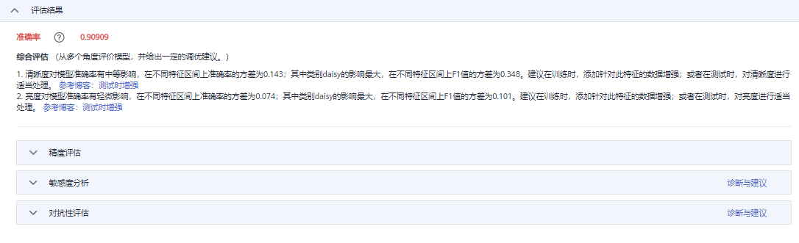

# 评估结果

针对使用ModelArts官方发布的算法创建训练作业时，其训练作业详情支持查看评估结果。根据模型训练的业务场景不同，会提供不同的评估结果。评估指标的详细解释请参考[评估指标说明](评估指标说明.md)。由于每个模型情况不同，系统将自动根据您的模型指标情况，给出一些调优建议，请仔细阅读界面中的建议和指导，对您的模型进行进一步的调优。

如果您的训练脚本中按照ModelArts规范添加了相应的评估代码，在训练作业运行结束后，也可在作业详情页面查看评估结果，添加评估代码指导请参见[添加评估结果](zh-cn_topic_0275074570.md)。ModelArts也支持用户通过控制台界面单独创建模型评估作业，请参考[模型评估简介](模型评估简介.md)。

**图 1**  评估结果  

