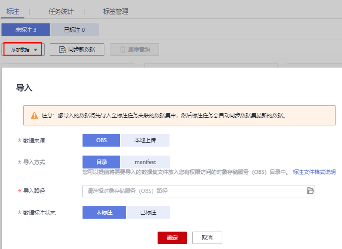

# 语音内容

由于模型训练过程需要大量有标签的音频数据，因此在模型训练之前需对没有标签的音频添加标签。通过ModelArts您可对音频进行一键式批量添加标签，快速完成对音频的标注操作，也可以对已标注音频修改或删除标签进行重新标注。

## 开始标注

1.  登录ModelArts管理控制台，在左侧菜单栏中选择“数据管理\> 数据标注“，进入“数据标注“管理页面。
2.  在数据集列表中，基于“标注类型“选择需要进行标注的数据集，单击标注作业名称进入标注作业标注详情页。
3.  在标注作业标注详情中，展示此标注作业下全部数据。

## 同步新数据

ModelArts会自动将数据集中新增的数据同步至标注作业，包含数据及当前标注作业支持的标注信息。

为了快速获取数据集中最新数据，可在标注作业详情页的“未标注“页签中，单击“同步新数据“，快速将数据集中的数据添加到标注作业中。

## 标注音频

标注作业详情页中，展示了此数据集中“未标注“和“已标注“的音频，默认显示“未标注“的音频列表。

1.  在“未标注“页签左侧音频列表中，单击目标音频文件，在右侧的区域中出现音频，单击音频下方，即可进行音频播放。
2.  根据播放内容，在下方“语音内容“文本框中填写音频内容。
3.  输入内容后单击下方的“确认标注“按钮完成标注。音频将被自动移动至“已标注“页签。

    **图 1**  语音内容音频标注  
    

## 查看已标注音频

在标注作业详情页，单击“已标注“页签，您可以查看已完成标注的音频列表。单击音频，可在右侧的“语音内容“文本框中了解当前音频的内容信息。

## 修改标注

当数据完成标注后，您还可以进入“已标注“页签，对已标注的数据进行修改。

在标注作业详情页，单击“已标注“页签，然后在音频列表中选中待修改的音频。在右侧标签信息区域中修改“语音内容“文本框中的内容，单击下方的“确认标注“按钮完成修改。

## 添加音频

除了同步新数据外，您还可以在标注详情页面中，直接添加数据，用于数据标注。

1.  在标注作业详情页面，单击“未标注“页签，然后单击左上角“添加数据“。
2.  在弹出的导入对话框中，选择数据来源、导入方式、导入路径等参数，导入数据。单击确定。

    导入数据的详细操作介绍请参见[导入操作简介](导入操作简介.md)。

    **图 2**  导入数据  
    

## 删除音频

通过数据删除操作，可将需要丢弃的音频数据快速删除。

在“未标注“或“已标注“页面中，选中需要删除的音频，然后单击左上角“删除音频“，在弹出的对话框中，根据实际情况选择是否勾选“同时删除源文件“，确认信息无误后，单击“确定“完成音频删除操作。

> **说明：** 
>如果勾选了“同时删除源文件“，删除音频操作是将删除对应OBS目录下存储的音频。此操作可能会影响已使用此源文件的其他数据集或数据集版本，有可能导致展示异常或训练/推理异常。删除后，数据将无法恢复，请谨慎操作。

