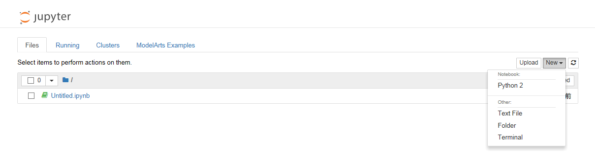
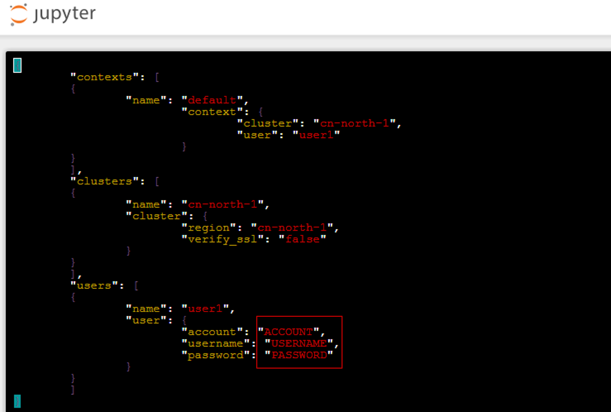

# 调用ModelArts SDK<a name="modelarts_23_0039"></a>

ModelArts集成的Notebook支持SDK的调用，通过调用ModelArts SDK，您可以在Notebook中轻松完成数据集管理、启动模型训练等。ModelArts的SDK详细介绍请参见《[ModelArts SDK参考](https://support.huaweicloud.com/sdkreference-modelarts/modelarts_04_0002.html)》。

## 使用前必读<a name="section18220478149"></a>

由于ModelArts从单引擎Notebook升级为多引擎Notebook，其对应的SDK使用存在一些区别。

-   如果您的Notebook实例是在2019年7月18日之前创建的，属于单AI引擎的Notebook，则其使用对应V1.1.0版本的SDK，详细接口说明请提交[工单](https://console.huaweicloud.com/ticket)获取相应的文档指导。
-   如果您的Notebook实例是多AI引擎类型的，即创建Notebook时，选择的是Python2或Python3的工作环境，在Jupyter页面中可以创建多种AI引擎的Files进行开发。此类Notebook对应最新版本的SDK（即V1.1.1版本），详细接口说明请参见《[ModelArts SDK参考](https://support.huaweicloud.com/sdkreference-modelarts/modelarts_04_0002.html)》。

## 初始化<a name="section19111565218"></a>

1.  在Notebook列表中，创建并打开一个Notebook，或者直接打开已有的Notebook。
2.  在Jupyter页面中，单击“New“，然后在列表下单击“Terminal“。

    **图 1**  打开Terminal<a name="fig8484162318474"></a>  
    

3.  在弹出的窗口中输入**vi .modelarts/config.json**编辑配置文件，然后按“Enter“键。
4.  在打开的**config.json**配置文件中，输入相应的华为云账号与密码。然后按“Esc“键，输入“:wq“保存配置文件。至此，完成初始化操作。

    -   将红色方框内的账号信息替换成当前账号信息，如果您使用主账号登录，将“account“的参数值设置为空，如下所示：

        ```
        "account"：""
        ```

    -   如需要在其他Notebook实例中调用SDK，需要在该实例中也完成初始化的操作。

    **图 2**  设置账号及密码<a name="fig1981173592816"></a>  
    


## 打开Python Kernel调用SDK<a name="section43091856122811"></a>

1.  进入Jupyter页面，单击“New“，然后在列表下选择对应的AI引擎创建文件。
2.  在弹出窗口中，输入SDK相关代码即可。具体SDK代码可参见《[ModelArts SDK参考](https://support.huaweicloud.com/sdkreference-modelarts/modelarts_04_0002.html)》。

