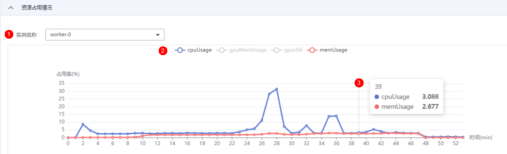

# 资源占用情况

用户可以通过资源占用情况窗口查看计算节点的资源使用情况。

操作一：如果训练作业使用多个计算节点，可以通过实例名称的下拉框切换节点。

操作二：单击图例“cpuUsage“、“gpuMemUsage“、“gpuUtil“、“memUsage“可以添加或取消对应参数的使用情况图。

操作三：鼠标悬浮在图片上的时间节点，可查看对应时间节点的占用率情况。

**图 1**  资源占用情况  

**表 1**  参数说明

<table><thead align="left"><tr id="row15991516154519"><th class="cellrowborder" valign="top" width="18.87%" id="mcps1.2.3.1.1">
参数

</th>
<th class="cellrowborder" valign="top" width="81.13%" id="mcps1.2.3.1.2">
说明

</th>
</tr>
</thead>
<tbody><tr id="row1199111616456"><td class="cellrowborder" valign="top" width="18.87%" headers="mcps1.2.3.1.1 ">
cpuUsage

</td>
<td class="cellrowborder" valign="top" width="81.13%" headers="mcps1.2.3.1.2 ">
cpu使用率。

</td>
</tr>
<tr id="row209911616134519"><td class="cellrowborder" valign="top" width="18.87%" headers="mcps1.2.3.1.1 ">
gpuMemUsage

</td>
<td class="cellrowborder" valign="top" width="81.13%" headers="mcps1.2.3.1.2 ">
gpu内存使用率。

</td>
</tr>
<tr id="row1267403516468"><td class="cellrowborder" valign="top" width="18.87%" headers="mcps1.2.3.1.1 ">
gpuUtil

</td>
<td class="cellrowborder" valign="top" width="81.13%" headers="mcps1.2.3.1.2 ">
gpu使用情况

</td>
</tr>
<tr id="row12169174014460"><td class="cellrowborder" valign="top" width="18.87%" headers="mcps1.2.3.1.1 ">
memUsage

</td>
<td class="cellrowborder" valign="top" width="81.13%" headers="mcps1.2.3.1.2 ">
内存使用率。

</td>
</tr>
</tbody>
</table>

