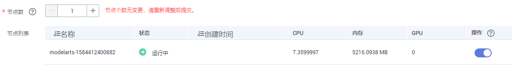
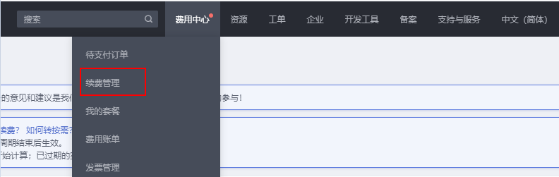

# 资源池

## ModelArts资源池说明

在使用ModelArts进行AI全流程开发时，您可以选择使用两种不同的资源池训练和部署模型。

-   **公共资源池**：公共资源池提供公共的大规模计算集群，根据用户作业参数分配使用，资源按作业隔离。按资源规格、使用时长及实例数计费，不区分任务（训练作业、部署、开发）。
-   **专属资源池**：提供独享的计算资源，可用于Notebook、训练作业、部署模型。专属资源池不与其他用户共享，更加高效。

    在使用专属资源池之前，您需要先购买一个专属资源池，然后在AI开发过程中选择此专属资源池。专属资源池的详细介绍和操作请参见：

    [专属资源池介绍](#section6250135125515)

    [创建专属资源池](#section4115221610)

    [扩缩容专属资源池](#section1521854122017)

    [删除专属资源池](#section102631431172915)

## 专属资源池介绍

-   专属资源池可以在如下作业和任务中使用：Notebook、训练作业、TensorBoard、部署上线。
-   专属资源池分为“开发环境/训练专用“和“部署上线专用“两种类型。“开发环境/训练专用“类型的专属资源池只能用于Notebook、训练作业、TensorBoard等功能，“部署上线专用“类型的专属资源池只能用于模型的部署上线。
-   只有处于“运行中“状态的专属资源池才是可用的。如果专属资源池状态为“不可用“或“异常“，请排除故障后再使用。
-   创建专属资源池后，就会基于选择的规格开始计费。
-   专属资源池的收费支持“按需计费“和“包年包月“两种。

## 创建专属资源池

1.  登录ModelArts管理控制台，在左侧菜单栏中选择“专属资源池“。
2.  在专属资源池管理页面，您可以选择通过“开发环境/训练专用“和“部署上线专用“页签选择两种不同类型的专属资源池。
3.  单击左上角“创建“，进入创建专属资源池界面。
4.  在“创建专属资源池“界面填写参数，参数填写请参见[表1](#table1073325155617)和[表2](#table199892206411)。

    **表 1** “开发环境/训练专用“专属资源池的参数说明

    
    <table><thead align="left"><tr id="row1674182512564"><th class="cellrowborder" valign="top" width="25.580000000000002%" id="mcps1.2.3.1.1">
参数名称

    </th>
    <th class="cellrowborder" valign="top" width="74.42%" id="mcps1.2.3.1.2">
说明

    </th>
    </tr>
    </thead>
    <tbody><tr id="row1929353271213"><td class="cellrowborder" valign="top" width="25.580000000000002%" headers="mcps1.2.3.1.1 ">
资源类型

    </td>
    <td class="cellrowborder" valign="top" width="74.42%" headers="mcps1.2.3.1.2 ">
系统默认为“开发环境/训练专用”， 不可修改。

    </td>
    </tr>
    <tr id="row157402565618"><td class="cellrowborder" valign="top" width="25.580000000000002%" headers="mcps1.2.3.1.1 ">
计费模式

    </td>
    <td class="cellrowborder" valign="top" width="74.42%" headers="mcps1.2.3.1.2 ">
选择计费模式，“包年/包月”或“按需计费”。

    </td>
    </tr>
    <tr id="row1974182595616"><td class="cellrowborder" valign="top" width="25.580000000000002%" headers="mcps1.2.3.1.1 ">
名称

    </td>
    <td class="cellrowborder" valign="top" width="74.42%" headers="mcps1.2.3.1.2 ">
专属资源池的名称。

    
名称由大小写字母、数字、中划线和下划线组成。

    </td>
    </tr>
    <tr id="row197432525615"><td class="cellrowborder" valign="top" width="25.580000000000002%" headers="mcps1.2.3.1.1 ">
描述

    </td>
    <td class="cellrowborder" valign="top" width="74.42%" headers="mcps1.2.3.1.2 ">
专属资源池的简要描述。

    </td>
    </tr>
    <tr id="row774102514566"><td class="cellrowborder" valign="top" width="25.580000000000002%" headers="mcps1.2.3.1.1 ">
节点数

    </td>
    <td class="cellrowborder" valign="top" width="74.42%" headers="mcps1.2.3.1.2 ">
选择专属资源池的节点数，选择的节点数越多，计算性能越强，同时费用越高。

    </td>
    </tr>
    <tr id="row1574192565616"><td class="cellrowborder" valign="top" width="25.580000000000002%" headers="mcps1.2.3.1.1 ">
节点规格

    </td>
    <td class="cellrowborder" valign="top" width="74.42%" headers="mcps1.2.3.1.2 ">
请根据界面提示选择需要使用的规格，GPU性能更好，CPU更加实惠。如果某一规格出现“售罄”字样，表示此规格已用完，需要等待其他用户删除资源池后，您才可以重新购买。

    </td>
    </tr>
    <tr id="row674182511563"><td class="cellrowborder" valign="top" width="25.580000000000002%" headers="mcps1.2.3.1.1 ">
购买时长

    </td>
    <td class="cellrowborder" valign="top" width="74.42%" headers="mcps1.2.3.1.2 "><ul id="ul572457104016"><li>选择购买时长。只有选择“包年/包月”计费模式时才需填写。
最少为1个月，最长为1年。其中，ModelArts推出套餐包优惠，购买10个月赠送2个月，直接选择1年的购买时长即可完成买10个月送2个月的套餐包购买。

    </li></ul>
    <ul id="ul2304125603911"><li>自动续费。开通自动续费后，系统将在产品到期前自动续费，无需用户手动操作。</li></ul>
    </td>
    </tr>
    </tbody>
    </table>

    **表 2** “部署上线专用“专属资源池的参数说明

    
    <table><thead align="left"><tr id="row169898203417"><th class="cellrowborder" valign="top" width="25.61%" id="mcps1.2.3.1.1">
参数名称

    </th>
    <th class="cellrowborder" valign="top" width="74.39%" id="mcps1.2.3.1.2">
说明

    </th>
    </tr>
    </thead>
    <tbody><tr id="row799072015414"><td class="cellrowborder" valign="top" width="25.61%" headers="mcps1.2.3.1.1 ">
资源类型

    </td>
    <td class="cellrowborder" valign="top" width="74.39%" headers="mcps1.2.3.1.2 ">
系统默认为“部署上线专用”， 不可修改。

    </td>
    </tr>
    <tr id="row5990102014119"><td class="cellrowborder" valign="top" width="25.61%" headers="mcps1.2.3.1.1 ">
计费模式

    </td>
    <td class="cellrowborder" valign="top" width="74.39%" headers="mcps1.2.3.1.2 ">
选择计费模式，“包年/包月”或“按需计费”。“包年/包月”仅在北京四支持。

    </td>
    </tr>
    <tr id="row119901320144114"><td class="cellrowborder" valign="top" width="25.61%" headers="mcps1.2.3.1.1 ">
名称

    </td>
    <td class="cellrowborder" valign="top" width="74.39%" headers="mcps1.2.3.1.2 ">
专属资源池的名称。

    
名称只能以小写字母开头，由小写字母、数字、中划线组成，不能以中划线结尾，长度为4~24个字符。

    </td>
    </tr>
    <tr id="row4990102010416"><td class="cellrowborder" valign="top" width="25.61%" headers="mcps1.2.3.1.1 ">
描述

    </td>
    <td class="cellrowborder" valign="top" width="74.39%" headers="mcps1.2.3.1.2 ">
专属资源池的简要描述。

    </td>
    </tr>
    <tr id="row8938151712421"><td class="cellrowborder" valign="top" width="25.61%" headers="mcps1.2.3.1.1 ">
自定义网络配置

    </td>
    <td class="cellrowborder" valign="top" width="74.39%" headers="mcps1.2.3.1.2 ">
启用自定义配置，则服务实例运行在指定的网络中，可以与该网络中的其它云服务资源实例互通；不启用自定义配置，ModelArts会为每个用户分配一个专属的网络，用户之间隔离。

    
如果启用自定义网络配置，请设置对应的“虚拟私有云”、“子网”和“安全组”。如果没有可用网络，请前往虚拟私有云服务创建。

    </td>
    </tr>
    <tr id="row31041574415"><td class="cellrowborder" valign="top" width="25.61%" headers="mcps1.2.3.1.1 ">
可用区

    </td>
    <td class="cellrowborder" valign="top" width="74.39%" headers="mcps1.2.3.1.2 ">
您可以根据实际情况选择“随机分配”、“可用区1”、“可用区2”、“可用区3”。可用区是在同一区域下，电力、网络隔离的物理区域。可用区之间内网互通，不同可用区之间物理隔离。如果您需要提高工作负载的高可靠性，建议您将云服务器创建在不同的可用区。

    </td>
    </tr>
    <tr id="row1193981718429"><td class="cellrowborder" valign="top" width="25.61%" headers="mcps1.2.3.1.1 ">
节点数

    </td>
    <td class="cellrowborder" valign="top" width="74.39%" headers="mcps1.2.3.1.2 ">
选择专属资源池的节点数，选择的节点数越多，计算性能越强，同时费用越高。

    </td>
    </tr>
    <tr id="row13939141712422"><td class="cellrowborder" valign="top" width="25.61%" headers="mcps1.2.3.1.1 ">
节点规格

    </td>
    <td class="cellrowborder" valign="top" width="74.39%" headers="mcps1.2.3.1.2 ">
请根据界面提示选择需要使用的规格，GPU性能更好，CPU更加实惠。如果某一规格出现“售罄”字样，表示此规格已用完，需要等待其他用户删除资源池后，您才可以重新购买。

    
    </td>
    </tr>
    <tr id="row57943185327"><td class="cellrowborder" valign="top" width="25.61%" headers="mcps1.2.3.1.1 ">
购买时长

    </td>
    <td class="cellrowborder" valign="top" width="74.39%" headers="mcps1.2.3.1.2 "><ul id="ul211410914362"><li>选择购买时长。只有选择“包年/包月”计费模式时才需填写。最少为1个月，最长为11个月。</li><li>自动续费。开通自动续费后，系统将在产品到期前自动续费，无需用户手动操作。</li></ul>
    </td>
    </tr>
    </tbody>
    </table>

5.  规格确认无误后，根据界面提示完成专属资源池的创建。当专属资源池创建成功后，其状态将变为“运行中“。

## 扩缩容专属资源池

当专属资源池使用一段时间后，由于AI开发业务的变化，您可以通过扩容或缩容操作，增加或减少节点数量。

扩缩容的操作步骤如下所示：

1.  进入专属资源池管理页面，在专属资源池所在行，单击操作列“扩缩容“。
2.  在扩缩容页面，增加或减少节点数量。增加节点数量表示扩容，减少节点数量表示缩容。请根据本身业务诉求进行调整。

    -   扩容时，请务必选择当前帐号的配额，增加节点数量，否则会导致扩容失败。
    -   缩容时，您需要在操作列单击开关删除减少的节点。如[图1](#fig1180514911459)所示，减少1个节点，需在“节点列表“中，单击删除节点对应操作列的开关，删除此节点。

    **图 1**  缩容时选择删除节点  
    

3.  单击“提交“完成修改。提交完成后系统自动返回专属资源池管理页面。

## 专属资源池计费模式转换

-   “按需计费“的专属资源池转换为“包年包月“的专属资源池

    ModelArts支持训练的专属资源池从“按需计费“转换为“包年包月“。前提是您需要使用按需计费的专属资源池完成一次以上的消费。如果购买的按需计费专属资源池没有消费记录，转周期操作会报错。

    转包周期的操作步骤如下所示：

    1.  进入专属资源池管理页面，在专属资源池所在行，单击操作列“转包周期“，进入“按需转包年按月“页面。
    2.  根据页面提示选择包年包月的时长并勾选是否自动续费，完成支付后即可转换成功。

-   “包年包月“的专属资源池转换为“按需计费“的专属资源池

    针对用于训练的“包年包月“专属资源池，支持在包周期到期后，将专属资源池设置为按需计费。

    转按需的操作步骤如下：

    1.  进入ModelArts控制台，单击上方设置栏的“费用中心\>续费管理“，进入续费管理页面。

        **图 2**  进入费用中心  
        

    2.  进入续费管理页面，在专属资源池所在行，单击操作列“更多\>到期转按需“。

## 删除专属资源池

当AI业务开发不再需要使用专属资源池时，您可以删除专属资源池，释放资源，减少费用成本。

> **说明：** 
>-   专属资源池删除后，将导致使用此资源的训练作业、Notebook、在线服务和批量服务等不可用，且删除后不可恢复，请谨慎操作。
>-   如果您创建“包年/包月“类型的专属资源池：
>    当您需要释放资源，请单击操作列“退订“完成订单退费，退订完成后将自动删除该资源；
>    对于创建失败的专属资源池，请单击操作列“删除“完成资源删除。

1.  进入专属资源池管理页面，在专属资源池所在行，单击操作列“删除“。
2.  在弹出的确认对话框中，单击“确定“，完成资源删除。

