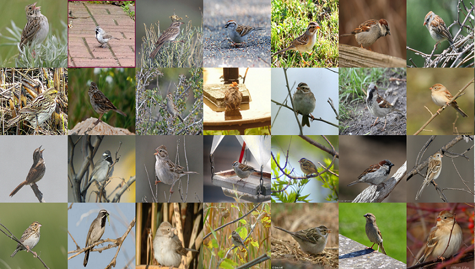
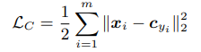
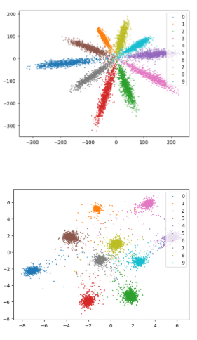
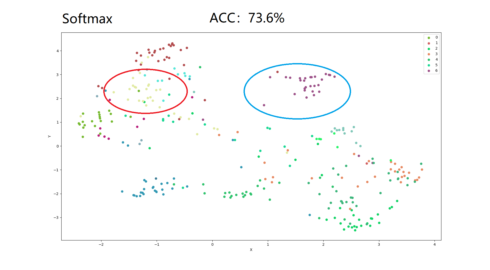
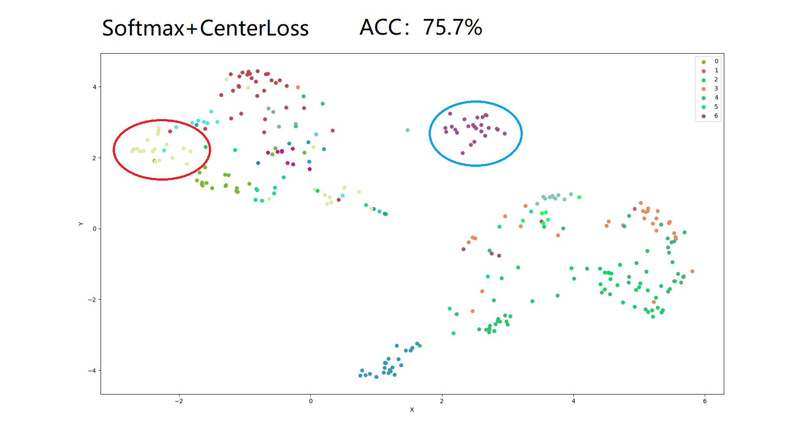

# 通过Center-Loss优化细粒度分类问题<a name="modelarts_eval_0010"></a>

## 问题描述<a name="zh-cn_topic_0275437246_section1524712513303"></a>

细粒度分类是指对相似的类别进行分类，比如鸟的种类、车的款式等，在这些图像中，每种类别只有细微差异。如下图是21种麻雀的数据，每一列代表一个种类，每类展示了10张，我们可以发现这些麻雀的相似度非常高。在使用常规CNN网络进行特征提取后，从这些相似图像生成的特征通常也十分相似，这时如果只是简单的使用softmax交叉熵损失函数，很难将这些相似的特征区分开。

**图 1**  细粒度分类问题<a name="zh-cn_topic_0275437246_fig5732224113119"></a>  


## 解决方法<a name="zh-cn_topic_0275437246_section1781434420312"></a>

**Centor-Loss**

为了增大这些特征间的区分度，[A Discriminative Feature Learning Approach for Deep Face Recognition](https://kpzhang93.github.io/papers/eccv2016.pdf)中提出了Center-Loss。这个损失函数的原理就是设置分类数个中心点，让不同类别的特征尽可能靠近各自的中心点，即希望类内距离变小、类间距离变大。公式如下，其中x指的是特征，c指的是中心，c会随着模型训练更新。



Centor-Loss的实现方式多种多样，Pytorch的一种实现方式如下：[https://github.com/KaiyangZhou/pytorch-center-loss](https://github.com/KaiyangZhou/pytorch-center-loss)

```
class CenterLoss(nn.Module):
    """Center loss.

    Reference:
    Wen et al. A Discriminative Feature Learning Approach for Deep Face Recognition. ECCV 2016.

    Args:
        num_classes (int): number of classes.
        feat_dim (int): feature dimension.
    """
    def __init__(self, num_classes=10, feat_dim=2, use_gpu=True):
        super(CenterLoss, self).__init__()
        self.num_classes = num_classes
        self.feat_dim = feat_dim
        self.use_gpu = use_gpu

        if self.use_gpu:
            self.centers = nn.Parameter(torch.randn(self.num_classes, self.feat_dim).cuda())
        else:
            self.centers = nn.Parameter(torch.randn(self.num_classes, self.feat_dim))

    def forward(self, x, labels):
        """
        Args:
            x: feature matrix with shape (batch_size, feat_dim).
            labels: ground truth labels with shape (batch_size).
        """
        batch_size = x.size(0)
        distmat = torch.pow(x, 2).sum(dim=1, keepdim=True).expand(batch_size, self.num_classes) + \
                  torch.pow(self.centers, 2).sum(dim=1, keepdim=True).expand(self.num_classes, batch_size).t()
        distmat.addmm_(1, -2, x, self.centers.t())

        classes = torch.arange(self.num_classes).long()
        if self.use_gpu:
            classes = classes.cuda()
        labels = labels.unsqueeze(1).expand(batch_size, self.num_classes)
        mask = labels.eq(classes.expand(batch_size, self.num_classes))

        dist = distmat * mask.float()
        loss = dist.clamp(min=1e-12, max=1e+12).sum() / batch_size

        return loss
```

上述工程中使用mnist数据集做测试，特征降维展示如下图，上图是普通的softmax，下图是softmax+center-loss，可以明显观测到特征被区分的更明显了。

**图 2**  特征降维<a name="zh-cn_topic_0275437246_fig1729413143418"></a>  


## 实验验证<a name="zh-cn_topic_0275437246_section7940131212328"></a>

Center-Loss最初是用在人脸分类任务中，开源项目大部分是在mnist数据集上的复现。那么Center-Loss在自然场景下的效果如何，下面进行一个实验进行验证。

实验数据来自[CUB-200](http://www.vision.caltech.edu/visipedia/CUB-200.html)数据集，选取了其中21种麻雀数据进行实验，其中训练集629张，测试集615张。

测试算法来自Pytorch官方提供的分类网络样例resnet50，[main.py](https://github.com/pytorch/examples/blob/master/imagenet/main.py)，加载imagenet预训练的模型，学习率设为0.001，batch-size设为32，训练30个epoch。

在只使用常规损失函数的情况下，获得了73.6%的分类精度，最后一个卷积层特征的降维可视化如下。

**图 3**  降维可视化<a name="zh-cn_topic_0275437246_fig16333553368"></a>  


将最后一个卷积层的特征与标签同时输入Center-Loss，计算损失值，按0.001的权重与正常的Softmax损失函数加权，然后再进行反向计算。

```
loss = softmax_loss(pred_output, target_label) + 0.001 * center_loss(feature, target_label)
```

此时，获得了75.7%的分类精度，最后一层特征的降维可视化如下。从图中圈出的类别来看，类内的距离确实被缩小了，某些类间的距离也确实被放大了，但是相比于mnist数据集的测试，效果不是那么明显，这是由于背景过于复杂造成的。

**图 4**  最后一层特征的降维可视化<a name="zh-cn_topic_0275437246_fig205562220370"></a>  


## 用户建议<a name="zh-cn_topic_0275437246_section124245234320"></a>

使用Center-Loss，确实可以优化自然场景下的细粒度分类问题，但是随着背景复杂度的增加，优化效果会被削弱。

卷积特征可视化可以有效分析模型的性能，此功能即将上线ModelArts的模型评估模块，敬请期待。

