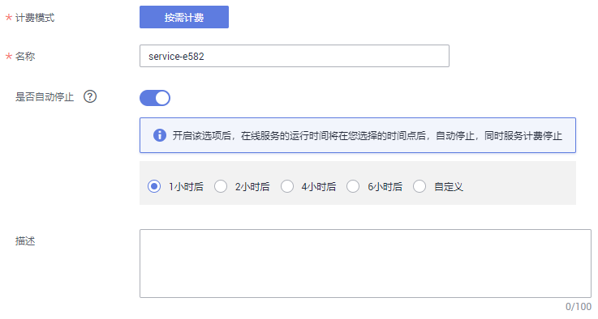
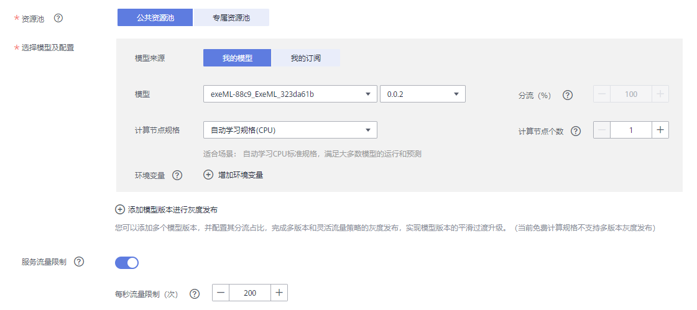

# 部署为在线服务

模型准备完成后，您可以将模型部署为在线服务，对在线服务进行预测和调用。

> **说明：** 
>单个用户最多可创建20个在线服务。

## 前提条件

-   数据已完成准备：已在ModelArts中创建状态“正常“可用的模型。
-   由于在线运行需消耗资源，确保帐户未欠费。

## 操作步骤

1.  登录ModelArts管理控制台，在左侧导航栏中选择“部署上线 \> 在线服务“，默认进入“在线服务“列表。
2.  在“在线服务“列表中，单击左上角“部署“，进入“部署“页面。
3.  在“部署“页面，填写在线服务相关参数。
    1.  填写基本信息，详细参数说明请参见[表1](#table16373156155613)。

        **表 1**  基本信息参数说明

        
        <table><thead align="left"><tr id="row137318605613"><th class="cellrowborder" valign="top" width="21.32%" id="mcps1.2.3.1.1">
参数名称

        </th>
        <th class="cellrowborder" valign="top" width="78.68%" id="mcps1.2.3.1.2">
说明

        </th>
        </tr>
        </thead>
        <tbody><tr id="row1817131218565"><td class="cellrowborder" valign="top" width="21.32%" headers="mcps1.2.3.1.1 ">
“计费模式”

        </td>
        <td class="cellrowborder" valign="top" width="78.68%" headers="mcps1.2.3.1.2 ">
当前仅支持“按需计费”，不支持修改。

        </td>
        </tr>
        <tr id="row29981091564"><td class="cellrowborder" valign="top" width="21.32%" headers="mcps1.2.3.1.1 ">
“名称”

        </td>
        <td class="cellrowborder" valign="top" width="78.68%" headers="mcps1.2.3.1.2 ">
在线服务的名称，请按照界面提示规则填写。

        </td>
        </tr>
        <tr id="row115161748112017"><td class="cellrowborder" valign="top" width="21.32%" headers="mcps1.2.3.1.1 ">
“是否自动停止”

        </td>
        <td class="cellrowborder" valign="top" width="78.68%" headers="mcps1.2.3.1.2 ">
启用该参数并设置时间后，服务将在指定时间后自动停止。如果不启用此参数，在线服务将一直运行，同时一直收费，自动停止功能可以帮您避免产生不必要的费用。默认开启自动停止功能，且默认值为“1小时后”。

        
目前支持设置为“1小时后”、“2小时后”、“4小时后”、“6小时后”、“自定义”。如果选择“自定义”的模式，可在右侧输入框中输入1~24范围内的任意整数。

        </td>
        </tr>
        <tr id="row116005243566"><td class="cellrowborder" valign="top" width="21.32%" headers="mcps1.2.3.1.1 ">
“描述”

        </td>
        <td class="cellrowborder" valign="top" width="78.68%" headers="mcps1.2.3.1.2 ">
在线服务的简要说明。

        </td>
        </tr>
        </tbody>
        </table>

        **图 1**  部署在线服务基本信息  
        

    2.  填写资源池和模型配置等关键信息，详情请参见[表2](#table10352134481117)。

        **表 2**  参数说明

        
        <table><thead align="left"><tr id="row103535447116"><th class="cellrowborder" valign="top" width="12.93%" id="mcps1.2.4.1.1">
参数名称

        </th>
        <th class="cellrowborder" valign="top" width="14.24%" id="mcps1.2.4.1.2">
子参数

        </th>
        <th class="cellrowborder" valign="top" width="72.83%" id="mcps1.2.4.1.3">
说明

        </th>
        </tr>
        </thead>
        <tbody><tr id="row93531344151114"><td class="cellrowborder" valign="top" width="12.93%" headers="mcps1.2.4.1.1 ">
“资源池”

        </td>
        <td class="cellrowborder" valign="top" width="14.24%" headers="mcps1.2.4.1.2 ">
“公共资源池”

        </td>
        <td class="cellrowborder" valign="top" width="72.83%" headers="mcps1.2.4.1.3 ">
公共资源池有CPU或GPU两种规格，不同规格的资源池，其收费标准不同，详情请参见<a href="https://www.huaweicloud.com/pricing.html?tab=detail#/modelarts" target="_blank" rel="noopener noreferrer">价格详情说明</a>。当前仅支持按需付费模式。

        </td>
        </tr>
        <tr id="row1310003117590"><td class="cellrowborder" valign="top" width="12.93%" headers="mcps1.2.4.1.1 ">
“资源池”

        </td>
        <td class="cellrowborder" valign="top" width="14.24%" headers="mcps1.2.4.1.2 ">
“专属资源池”

        </td>
        <td class="cellrowborder" valign="top" width="72.83%" headers="mcps1.2.4.1.3 ">
创建专属资源池请参见<a href="资源池.md#section4115221610">创建专属资源池</a>。您可以在资源池规格中选择对应的规格进行使用。

        </td>
        </tr>
        <tr id="row9209162134115"><td class="cellrowborder" valign="top" width="12.93%" headers="mcps1.2.4.1.1 ">
服务流量限制

        </td>
        <td class="cellrowborder" valign="top" width="14.24%" headers="mcps1.2.4.1.2 ">
-

        </td>
        <td class="cellrowborder" valign="top" width="72.83%" headers="mcps1.2.4.1.3 ">
服务流量限制是指每秒内一个服务能够被访问的次数上限。请根据实际需求设置每秒流量限制。

        </td>
        </tr>
        <tr id="row117313244916"><td class="cellrowborder" rowspan="7" valign="top" width="12.93%" headers="mcps1.2.4.1.1 ">
“选择模型及配置”

        </td>
        <td class="cellrowborder" valign="top" width="14.24%" headers="mcps1.2.4.1.2 ">
“模型来源”

        </td>
        <td class="cellrowborder" valign="top" width="72.83%" headers="mcps1.2.4.1.3 ">
您可以根据您的实际情况选择“我的模型”或者“我的订阅”，模型列表中展示模型来源对应的模型。

        </td>
        </tr>
        <tr id="row17100731145918"><td class="cellrowborder" valign="top" headers="mcps1.2.4.1.1 ">
“模型”

        </td>
        <td class="cellrowborder" valign="top" headers="mcps1.2.4.1.2 ">
选择状态“正常”的模型及版本。

        </td>
        </tr>
        <tr id="row1875153415599"><td class="cellrowborder" valign="top" headers="mcps1.2.4.1.1 ">
“分流”

        </td>
        <td class="cellrowborder" valign="top" headers="mcps1.2.4.1.2 ">
设置当前实例节点的流量占比，服务调用请求根据该比例分配到当前版本上。

        
如您仅部署一个版本模型，请设置为100%。如您添加多个版本进行灰度发布，多个版本分流之和设置为100%。

        </td>
        </tr>
        <tr id="row1575133419597"><td class="cellrowborder" valign="top" headers="mcps1.2.4.1.1 ">
“计算节点规格”

        </td>
        <td class="cellrowborder" valign="top" headers="mcps1.2.4.1.2 ">
请根据界面显示的列表，选择可用的规格，置灰的规格表示当前环境无法使用。

        </td>
        </tr>
        <tr id="row147516348594"><td class="cellrowborder" valign="top" headers="mcps1.2.4.1.1 ">
“计算节点个数”

        </td>
        <td class="cellrowborder" valign="top" headers="mcps1.2.4.1.2 ">
设置当前版本模型的实例个数。如果节点个数设置为1，表示后台的计算模式是单机模式；如果节点个数设置大于1，表示后台的计算模式为分布式的。请根据实际编码情况选择计算模式。

        </td>
        </tr>
        <tr id="row1630173817596"><td class="cellrowborder" valign="top" headers="mcps1.2.4.1.1 ">
“环境变量”

        </td>
        <td class="cellrowborder" valign="top" headers="mcps1.2.4.1.2 ">
设置环境变量，注入环境变量到容器实例。为确保您的数据安全，在环境变量中，请勿输入敏感信息，如明文密码。

        </td>
        </tr>
        <tr id="row1430153875910"><td class="cellrowborder" valign="top" headers="mcps1.2.4.1.1 ">
“添加模型版本进行灰度发布”

        </td>
        <td class="cellrowborder" valign="top" headers="mcps1.2.4.1.2 ">
ModelArts提供多版本支持和灵活的流量策略，您可以通过使用灰度发布，实现模型版本的平滑过渡升级。

        
 说明： 

如果您选择的模型当前只有一个版本，则界面上不会出现添加模型版本进行灰度发布。

        

        </td>
        </tr>
        <tr id="row1354314356338"><td class="cellrowborder" valign="top" width="12.93%" headers="mcps1.2.4.1.1 ">
“数据采集”

        </td>
        <td class="cellrowborder" valign="top" width="14.24%" headers="mcps1.2.4.1.2 ">
-

        </td>
        <td class="cellrowborder" valign="top" width="72.83%" headers="mcps1.2.4.1.3 ">
默认关闭。如需开启此功能，请参见<a href="采集数据.md">采集数据</a>了解详情并根据实际情况进行设置。

        </td>
        </tr>
        <tr id="row1599144383310"><td class="cellrowborder" valign="top" width="12.93%" headers="mcps1.2.4.1.1 ">
“难例筛选”

        </td>
        <td class="cellrowborder" valign="top" width="14.24%" headers="mcps1.2.4.1.2 ">
-

        </td>
        <td class="cellrowborder" valign="top" width="72.83%" headers="mcps1.2.4.1.3 ">
默认关闭。如需开启此功能，请参见<a href="采集数据.md">采集数据</a>了解详情并根据实际情况进行设置。

        </td>
        </tr>
        <tr id="row154291213174017"><td class="cellrowborder" valign="top" width="12.93%" headers="mcps1.2.4.1.1 ">
“支持APP认证”

        </td>
        <td class="cellrowborder" valign="top" width="14.24%" headers="mcps1.2.4.1.2 ">
APP授权配置

        </td>
        <td class="cellrowborder" valign="top" width="72.83%" headers="mcps1.2.4.1.3 ">
默认关闭。如需开启此功能，请参见<a href="访问在线服务（APP认证）.md">访问在线服务（APP认证）</a>了解详情并根据实际情况进行设置。

        </td>
        </tr>
        <tr id="row6729133020452"><td class="cellrowborder" valign="top" width="12.93%" headers="mcps1.2.4.1.1 ">
“订阅消息”

        </td>
        <td class="cellrowborder" valign="top" width="14.24%" headers="mcps1.2.4.1.2 ">
-

        </td>
        <td class="cellrowborder" valign="top" width="72.83%" headers="mcps1.2.4.1.3 ">
订阅消息使用消息通知服务，在事件列表中选择需要监控的资源池状态，在事件发生时发送消息通知。

        </td>
        </tr>
        </tbody>
        </table>

        **图 2**  设置模型配置相关信息  
        

4.  确认填写信息无误后，根据界面提示完成在线服务的部署。部署服务一般需要运行一段时间，根据您选择的数据量和资源不同，部署时间将耗时几分钟到几十分钟不等。

    > **说明：** 
    >在线服务部署完成后，将立即启动，运行过程中将按照您选择的资源按需计费。

    您可以前往在线服务列表，查看在线服务的基本情况。在在线服务列表中，刚部署的服务“状态“为“部署中“，当在线服务的“状态“变为“运行中“时，表示服务部署完成。

