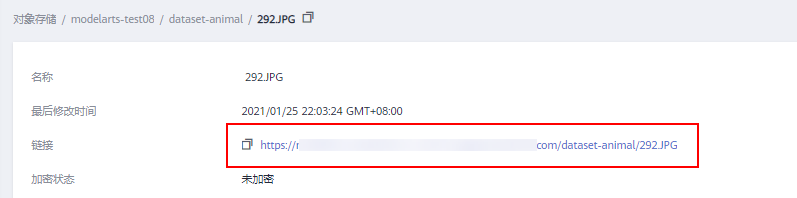

# 部署为批量服务<a name="modelarts_23_0066"></a>

模型准备完成后，您可以将模型部署为批量服务。在“部署上线\>批量服务“界面，列举了用户所创建的批量服务。您可以在右上方搜索框中输入服务名称，单击进行查询。

## 前提条件<a name="section588716131207"></a>

-   数据已完成准备：已在ModelArts中创建状态“正常“可用的模型。
-   准备好需要批量处理的数据，并上传至OBS目录。
-   已在OBS创建至少1个空的文件夹，用于存储输出的内容。

## 背景信息<a name="section68775449137"></a>

-   用户最多可创建1000个批量服务。
-   根据模型定义的输入请求不同（JSON文本或文件），不同的模型输入，需要填写的参数不同。当模型输入为JSON文件时，则需要根据配置文件生成映射文件；如果模型输入为文件时，则不需要。
-   批量服务只支持使用公共资源池，暂不支持使用专属资源池。

## 操作步骤<a name="section210412592420"></a>

1.  登录ModelArts管理控制台，在左侧导航栏中选择“部署上线 \> 批量服务“，默认进入“批量服务“列表。
2.  在批量服务列表中，单击左上角“部署“，进入“部署“页面。
3.  在部署页面，填写批量服务相关参数。
    1.  填写基本信息。基本信息包含“名称“、“描述“。其中“名称“默认生成。例如：service-bc0d，您也可以根据实际情况填写“名称“和“描述“信息。
    2.  填写服务参数。包含资源池、模型配置等关键信息，详情请参见[表1](#table1029041641314)。

        **表 1**  参数说明

        <a name="table1029041641314"></a>
        <table><thead align="left"><tr id="row1129018169133"><th class="cellrowborder" valign="top" width="26.240000000000002%" id="mcps1.2.3.1.1"><p id="p16290181619130"><a name="p16290181619130"></a><a name="p16290181619130"></a>参数名称</p>
        </th>
        <th class="cellrowborder" valign="top" width="73.76%" id="mcps1.2.3.1.2"><p id="p1729071601311"><a name="p1729071601311"></a><a name="p1729071601311"></a>说明</p>
        </th>
        </tr>
        </thead>
        <tbody><tr id="row192909169134"><td class="cellrowborder" valign="top" width="26.240000000000002%" headers="mcps1.2.3.1.1 "><p id="p029051691314"><a name="p029051691314"></a><a name="p029051691314"></a><span class="parmname" id="parmname1645563433614"><a name="parmname1645563433614"></a><a name="parmname1645563433614"></a>“选择模型及版本”</span></p>
        </td>
        <td class="cellrowborder" valign="top" width="73.76%" headers="mcps1.2.3.1.2 "><p id="p18291141691311"><a name="p18291141691311"></a><a name="p18291141691311"></a>选择状态<span class="parmname" id="parmname13987148161312"><a name="parmname13987148161312"></a><a name="parmname13987148161312"></a>“正常”</span>的模型及版本。</p>
        </td>
        </tr>
        <tr id="row029151631317"><td class="cellrowborder" valign="top" width="26.240000000000002%" headers="mcps1.2.3.1.1 "><p id="p20291161631314"><a name="p20291161631314"></a><a name="p20291161631314"></a><span class="parmname" id="parmname296510379362"><a name="parmname296510379362"></a><a name="parmname296510379362"></a>“输入数据目录位置”</span></p>
        </td>
        <td class="cellrowborder" valign="top" width="73.76%" headers="mcps1.2.3.1.2 "><p id="p629121610139"><a name="p629121610139"></a><a name="p629121610139"></a>选择输入数据的OBS路径，即您上传数据的OBS目录。只能选择文件夹或<span class="filepath" id="filepath1794913440174"><a name="filepath1794913440174"></a><a name="filepath1794913440174"></a>“.manifest”</span>文件。<span class="filepath" id="filepath98923414188"><a name="filepath98923414188"></a><a name="filepath98923414188"></a>“.manifest”</span>文件规范请参见<a href="#section190619315314">Manifest文件规范</a>。</p>
        <div class="note" id="note425767202816"><a name="note425767202816"></a><a name="note425767202816"></a><span class="notetitle"> 说明： </span><div class="notebody"><a name="ul6675112631414"></a><a name="ul6675112631414"></a><ul id="ul6675112631414"><li>输入数据为图片时，建议单张图片小于10MB。</li><li>输入数据格式为csv时，建议不要包含中文。如需使用中文，请将文件编码格式设置为UTF-8编码。您可以使用代码方式转换文件编码格式，也可以将csv文件用记事本方式打开，在另存为弹出的窗口页面设置编码格式。</li></ul>
        </div></div>
        </td>
        </tr>
        <tr id="row1829151641316"><td class="cellrowborder" valign="top" width="26.240000000000002%" headers="mcps1.2.3.1.1 "><p id="p329121681318"><a name="p329121681318"></a><a name="p329121681318"></a><span class="parmname" id="parmname5221940153618"><a name="parmname5221940153618"></a><a name="parmname5221940153618"></a>“请求路径”</span></p>
        </td>
        <td class="cellrowborder" valign="top" width="73.76%" headers="mcps1.2.3.1.2 "><p id="p16291191621315"><a name="p16291191621315"></a><a name="p16291191621315"></a>批量服务中调用模型的接口URl。</p>
        </td>
        </tr>
        <tr id="row202914161132"><td class="cellrowborder" valign="top" width="26.240000000000002%" headers="mcps1.2.3.1.1 "><p id="p11291131616136"><a name="p11291131616136"></a><a name="p11291131616136"></a><span class="parmname" id="parmname1719875493614"><a name="parmname1719875493614"></a><a name="parmname1719875493614"></a>“映射关系”</span></p>
        </td>
        <td class="cellrowborder" valign="top" width="73.76%" headers="mcps1.2.3.1.2 "><p id="p18291101614133"><a name="p18291101614133"></a><a name="p18291101614133"></a>如果模型输入是json格式时，系统将根据此模型对应的配置文件自动生成映射关系。如果模型的输入是文件，则不需要映射关系。</p>
        <p id="p7183104810137"><a name="p7183104810137"></a><a name="p7183104810137"></a>自动生成的映射关系文件，填写每个参数对应到csv单行数据的字段索引，索引index从0开始计数。</p>
        <p id="p02914161137"><a name="p02914161137"></a><a name="p02914161137"></a>映射关系生成规则：映射规则来源于模型配置文件<span class="filepath" id="filepath739319550318"><a name="filepath739319550318"></a><a name="filepath739319550318"></a>“config.json”</span>中输入参数（request）。当<span class="parmname" id="parmname765411320412"><a name="parmname765411320412"></a><a name="parmname765411320412"></a>“type”</span>定义为<span class="parmvalue" id="parmvalue11901295410"><a name="parmvalue11901295410"></a><a name="parmvalue11901295410"></a>“string/number/integer/boolean”</span>基本类型时，需要配置映射规则参数，即index参数。请参见<a href="#section119024213518">映射关系示例</a>了解其规则。</p>
        <p id="p2043174112315"><a name="p2043174112315"></a><a name="p2043174112315"></a>index必须从0开始的正整数，当index设置不符合规则时,最终的请求将忽略此参数。配置映射规则后，其对应的csv数据必须以英文半角逗号分隔。</p>
        </td>
        </tr>
        <tr id="row112911816111320"><td class="cellrowborder" valign="top" width="26.240000000000002%" headers="mcps1.2.3.1.1 "><p id="p11291181681315"><a name="p11291181681315"></a><a name="p11291181681315"></a><span class="parmname" id="parmname93241256153619"><a name="parmname93241256153619"></a><a name="parmname93241256153619"></a>“输出数据目录位置”</span></p>
        </td>
        <td class="cellrowborder" valign="top" width="73.76%" headers="mcps1.2.3.1.2 "><p id="p1291141661318"><a name="p1291141661318"></a><a name="p1291141661318"></a>选择批量预测结果的保存位置，可以选择您创建的空文件夹。</p>
        </td>
        </tr>
        <tr id="row5291716141314"><td class="cellrowborder" valign="top" width="26.240000000000002%" headers="mcps1.2.3.1.1 "><p id="p2271012382"><a name="p2271012382"></a><a name="p2271012382"></a><span class="parmname" id="parmname577345152217"><a name="parmname577345152217"></a><a name="parmname577345152217"></a>“计算节点规格”</span></p>
        </td>
        <td class="cellrowborder" valign="top" width="73.76%" headers="mcps1.2.3.1.2 "><p id="p94817428217"><a name="p94817428217"></a><a name="p94817428217"></a>系统将根据您的模型匹配提供可用的计算资源。请下拉框中选择可用资源，如果资源标识为售罄，表示此暂无此资源。</p>
        <p id="p1828185312119"><a name="p1828185312119"></a><a name="p1828185312119"></a>例如，模型来源于自动学习项目，则计算资源将自动关联自动学习规格供使用。</p>
        </td>
        </tr>
        <tr id="row8292181619132"><td class="cellrowborder" valign="top" width="26.240000000000002%" headers="mcps1.2.3.1.1 "><p id="p2283121183"><a name="p2283121183"></a><a name="p2283121183"></a><span class="parmname" id="parmname1324835415222"><a name="parmname1324835415222"></a><a name="parmname1324835415222"></a>“计算节点个数”</span></p>
        </td>
        <td class="cellrowborder" valign="top" width="73.76%" headers="mcps1.2.3.1.2 "><p id="p6292716151310"><a name="p6292716151310"></a><a name="p6292716151310"></a>设置当前版本模型的实例个数。如果节点个数设置为1，表示后台的计算模式是单机模式；如果节点个数设置大于1，表示后台的计算模式为分布式的。请根据实际编码情况选择计算模式。</p>
        </td>
        </tr>
        <tr id="row1029291621311"><td class="cellrowborder" valign="top" width="26.240000000000002%" headers="mcps1.2.3.1.1 "><p id="p1929218169132"><a name="p1929218169132"></a><a name="p1929218169132"></a><span class="parmname" id="parmname2968205883610"><a name="parmname2968205883610"></a><a name="parmname2968205883610"></a>“环境变量”</span></p>
        </td>
        <td class="cellrowborder" valign="top" width="73.76%" headers="mcps1.2.3.1.2 "><p id="p16292816131313"><a name="p16292816131313"></a><a name="p16292816131313"></a>设置环境变量，注入环境变量到容器实例。为确保您的数据安全，在环境变量中，请勿输入敏感信息，如明文密码。</p>
        </td>
        </tr>
        </tbody>
        </table>

4.  完成参数填写后，根据界面提示完成批量服务的部署。部署服务一般需要运行一段时间，根据您选择的数据量和资源不同，部署时间将耗时几分钟到几十分钟不等。

    > **说明：** 
    >批量服务部署完成后，将立即启动，运行过程中将按照您选择的资源按需计费。

    您可以前往批量服务列表，查看批量服务的基本情况。在批量服务列表中，刚部署的服务“状态“为“部署中“，当批量服务的“状态“变为“运行完成“时，表示服务部署完成。


## Manifest文件规范<a name="section190619315314"></a>

推理平台批量服务支持使用manifest文件，manifest文件可用于描述数据的输入输出。

**输入manifest文件样例**

-   文件名：“test.manifest“
-   文件内容：

    ```
    {"source": "<obs path>/test/data/1.jpg"}
    {"source": "https://infers-data.obs.cn-north-1.myhuaweicloud.com:443/xgboosterdata/data.csv?AccessKeyId=2Q0V0TQ461N26DDL18RB&Expires=1550611914&Signature=wZBttZj5QZrReDhz1uDzwve8GpY%3D&x-obs-security-token=gQpzb3V0aGNoaW5hixvY8V9a1SnsxmGoHYmB1SArYMyqnQT-ZaMSxHvl68kKLAy5feYvLDM..."}
    ```

-   文件要求：
    1.  文件名后缀需为“.manifest“；
    2.  文件内容是多行JSON，每行JSON描述一个输入数据，需精确到文件，不能是文件夹；
    3.  JSON内容需定义一个source字段，字段值是OBS的文件地址，有2种表达形式：
        1.  “<obs path\>/\{\{桶名\}\}/\{\{对象名\}\}“，适用于访问自己名下的OBS数据；您可以访问OBS服务的对象获取路径。

            **图 1**  数据的OBS路径<a name="fig01816437405"></a>  
            

        2.  OBS生成的分享链接，包含签名信息。适用于访问其他人的OBS数据。


**输出manifest文件样例**

批量服务的输出结果目录会有一个manifest文件。

-   假设用户输出结果路径为//test-bucket/test/，则结果存放位置如下：

    ```
    OBS桶/目录名
    ├── test-bucket
    │   ├── test
    │   │   ├── infer-result-{{index}}.manifest
    │   │   ├── infer-result
    │   │   │ ├── 1.jpg_result.txt
    │   │   │ ├── 2.jpg_result.txt
    ```

-   infer-result-0.manifest文件内容：

    ```
    {"source": "<obs path>/obs-data-bucket/test/data/1.jpg","inference-loc": "<obs path>/test-bucket/test/infer-result/1.jpg_result.txt"}
    {"source ": "https://infers-data.obs.cn-north-1.myhuaweicloud.com:443/xgboosterdata/2.jpg?AccessKeyId=2Q0V0TQ461N26DDL18RB&Expires=1550611914&Signature=wZBttZj5QZrReDhz1uDzwve8GpY%3D&x-obs-security-token=gQpzb3V0aGNoaW5hixvY8V9a1SnsxmGoHYmB1SArYMyqnQT-ZaMSxHvl68kKLAy5feYvLDMNZWxzhBZ6Q-3HcoZMh9gISwQOVBwm4ZytB_m8sg1fL6isU7T3CnoL9jmvDGgT9VBC7dC1EyfSJrUcqfB...",  "inference-loc": "obs://test-bucket/test/infer-result/2.jpg_result.txt"}
    ```


-   文件格式：
    1.  文件名为“infer-result-\{\{index\}\}.manifest“，index为实例序号，批量服务运行多少个实例就会产生多少个manifest文件。
    2.  manifest同一目录下会创建infer-result目录存放文件处理结果。
    3.  文件内容是多行JSON，每行JSON描述一个输入数据的对应输出结果。
    4.  JSON内容包含多个字段。
        1.  source：输入数据描述，与输入的manifest一致。
        2.  inference-loc：输出结果路径，格式为“<obs path\>/\{\{桶名\}\}/\{\{对象名\}\}“。


## 映射关系示例<a name="section119024213518"></a>

如下示例展示了配置文件、映射规则、csv数据以及最终推理请求的关系。

假设，您的模型所用配置文件，其apis参数如下所示：

```
[
    {
        "protocol": "http",
        "method": "post",
        "url": "/",
        "request": {
            "type": "object",
            "properties": {
                "data": {
                    "type": "object",
                    "properties": {
                        "req_data": {
                            "type": "array",
                            "items": [
                                {
                                    "type": "object",
                                    "properties": {
                                        "input_1": {
                                            "type": "number"
                                        },
                                        "input_2": {
                                            "type": "number"
                                        },
                                        "input_3": {
                                            "type": "number"
                                        },
                                        "input_4": {
                                            "type": "number"
                                        }
                                    }
                                }
                            ]
                        }
                    }
                }
            }
        }
    }
]
```

此时，其对应的映射关系如下所示。ModelArts管理控制台将从配置文件中自动解析映射关系，如果您调用ModelArts API时，需要自行根据规则编写映射关系。

```
{
    "type": "object",
    "properties": {
        "data": {
            "type": "object",
            "properties": {
                "req_data": {
                    "type": "array",
                    "items": [
                        {
                            "type": "object",
                            "properties": {
                                "input_1": {
                                    "type": "number",
                                    "index": 0
                                },
                                "input_2": {
                                    "type": "number",
                                    "index": 1
                                },
                                "input_3": {
                                    "type": "number",
                                    "index": 2
                                },
                                "input_4": {
                                    "type": "number",
                                    "index": 3
                                }
                            }
                        }
                    ]
                }
            }
        }
    }
}
```

用户需要进行推理的数据，即CSV数据，格式如下所示。数据必须以英文逗号隔开。

```
5.1,3.5,1.4,0.2
4.9,3.0,1.4,0.2
4.7,3.2,1.3,0.2
```

根据定义好的映射关系，最终推理请求样例如下所示，与在线服务使用的格式类似：

```
{
	"data": {
		"req_data": [{
			"input_1": 5.1,
			"input_2": 3.5,
			"input_3": 1.4,
			"input_4": 0.2
		}]
	}
}
```

