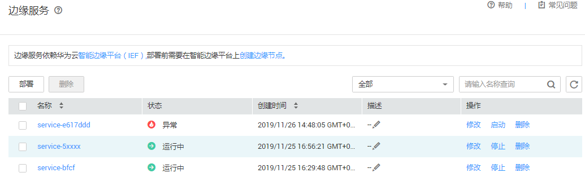

# 部署为边缘服务

模型准备完成后，您可以将模型部署为边缘服务。在“部署上线\>边缘服务“界面，列举了用户所创建的边缘服务。您可以在右上方搜索框中输入服务名称，单击进行查询。边缘服务依赖华为云智能边缘平台（IEF）,部署前需要在智能边缘平台上创建边缘节点。

## 前提条件

-   数据已完成准备：已在ModelArts中创建状态“正常“可用的模型。
-   已在智能边缘平台上创建边缘节点，如果您未创建边缘节点，具体操作请参见[创建边缘节点](https://support.huaweicloud.com/usermanual-ief/ief_01_0003.html)。
-   由于在线运行需消耗资源，确保账户未欠费。

## 背景信息

-   边缘服务目前还处于限时免费阶段，运行中的边缘服务，并不会产生费用。
-   用户最多可创建1000个边缘服务。

## 操作步骤

1.  登录ModelArts管理控制台，在左侧导航栏中选择“部署上线\>边缘服务“，默认进入“边缘服务“列表。
2.  在边缘服务列表中，单击左上角“部署“，进入“部署“页面。
3.  在部署页面，填写边缘服务相关参数，然后单击下一步。
    1.  填写基本信息。基本信息包含“名称“、“描述“。其中“名称“默认生成。例如：service-bc0d，您也可以根据实际情况填写“名称“和“描述“信息。
    2.  填写服务参数。包含资源池、模型配置等关键信息，详情请参见[表1](#table1029041641314)。

        **表 1**  参数说明

        
        <table><thead align="left"><tr id="row1129018169133"><th class="cellrowborder" valign="top" width="26.25%" id="mcps1.2.3.1.1">
参数名称

        </th>
        <th class="cellrowborder" valign="top" width="73.75%" id="mcps1.2.3.1.2">
说明

        </th>
        </tr>
        </thead>
        <tbody><tr id="row192909169134"><td class="cellrowborder" valign="top" width="26.25%" headers="mcps1.2.3.1.1 ">
“选择模型及配置”

        </td>
        <td class="cellrowborder" valign="top" width="73.75%" headers="mcps1.2.3.1.2 ">
选择状态“正常”的模型及版本。

        </td>
        </tr>
        <tr id="row5291716141314"><td class="cellrowborder" valign="top" width="26.25%" headers="mcps1.2.3.1.1 ">
“计算节点规格”

        </td>
        <td class="cellrowborder" valign="top" width="73.75%" headers="mcps1.2.3.1.2 ">
支持如下几种规格。

        <ul id="ul194691155507"><li>“CPU：2核 8GiB”</li><li>“CPU：2核 8GiB GPU：1*P4”</li><li>“自定义规格”，如果选择自定义规格，可以在参数下方设置您所需的“CPU”、“Memory”、“GPU”或“Ascend”。其中，“GPU”和“Ascend”只能二选一。</li></ul>
        
 说明： 
<ul id="ul1529214165136"><li>规格“CPU：2核 8GiB GPU：1*P4”需要提工单申请。</li></ul>
        

        </td>
        </tr>
        <tr id="row8292181619132"><td class="cellrowborder" valign="top" width="26.25%" headers="mcps1.2.3.1.1 ">
“环境变量”

        </td>
        <td class="cellrowborder" valign="top" width="73.75%" headers="mcps1.2.3.1.2 ">
设置环境变量，注入环境变量到容器实例。

        </td>
        </tr>
        <tr id="row1029291621311"><td class="cellrowborder" valign="top" width="26.25%" headers="mcps1.2.3.1.1 ">
“选择边缘节点”

        </td>
        <td class="cellrowborder" valign="top" width="73.75%" headers="mcps1.2.3.1.2 ">
边缘节点是您自己的边缘计算设备，用于运行边缘应用，处理您的数据，并安全、便捷地和云端应用进行协同。

        
单击选择边缘节点“添加”，在弹出的“添加节点”对话框中选择节点。选择您已创建的节点后，单击“确定”。

        </td>
        </tr>
        </tbody>
        </table>

4.  完成参数填写后，单击“立即创建“，完成边缘服务的部署。部署服务一般需要运行一段时间，根据您选择的数据量和资源不同，部署时间将耗时几分钟到几十分钟不等。

    您可以前往边缘服务列表，查看边缘服务的基本情况。在边缘服务列表中，刚部署的服务“状态“为“部署中“，当边缘服务的“状态“变为“运行中“时，表示服务部署完成。

    **图 1**  边缘服务列表  
    

