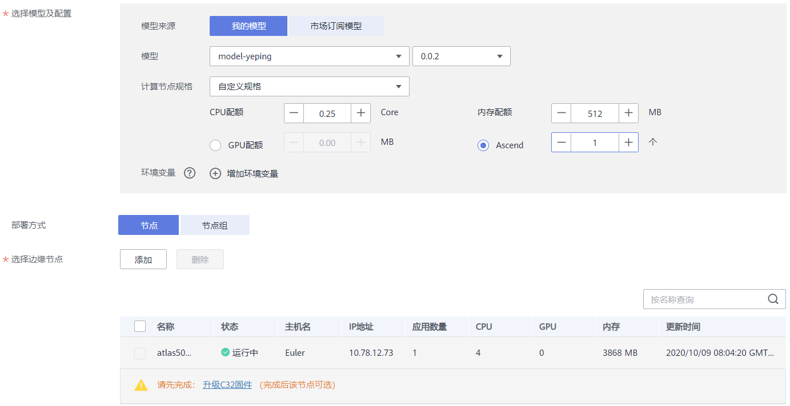

# 部署为边缘服务

模型准备完成后，您可以将模型部署为边缘服务。在“部署上线\>边缘服务“界面，列举了用户所创建的边缘服务。您可以在右上方搜索框中输入服务名称，单击进行查询。边缘服务依赖智能边缘平台（IEF），部署前需要在智能边缘平台上创建边缘节点。

## 前提条件

-   数据已完成准备：已在ModelArts中创建状态“正常“可用的模型。
-   已在IEF上创建边缘节点。如果您未创建边缘节点，具体操作请参见[创建边缘节点](https://support.huaweicloud.com/usermanual-ief/ief_01_0003.html)。
-   由于在线运行需消耗资源，确保帐户未欠费。

## 背景信息

-   边缘服务目前还处于限时免费阶段，运行中的边缘服务，并不会产生费用。
-   用户最多可创建1000个边缘服务。

## 部署边缘服务

1.  登录ModelArts管理控制台，在左侧导航栏中选择“部署上线\>边缘服务“，默认进入“边缘服务“列表。
2.  在边缘服务列表中，单击左上角“部署“，进入“部署“页面。
3.  在部署页面，填写边缘服务相关参数。
    1.  填写基本信息。基本信息包含“名称“、“描述“。其中“名称“默认生成。例如：service-bc0d，您也可以根据实际情况填写“名称“和“描述“信息。
    2.  填写服务参数。包含资源池、模型配置等关键信息，详情请参见[表1](#table1029041641314)。

        **表 1**  参数说明

        
        <table><thead align="left"><tr id="row1129018169133"><th class="cellrowborder" valign="top" width="26.25%" id="mcps1.2.3.1.1">
参数名称

        </th>
        <th class="cellrowborder" valign="top" width="73.75%" id="mcps1.2.3.1.2">
说明

        </th>
        </tr>
        </thead>
        <tbody><tr id="row192909169134"><td class="cellrowborder" valign="top" width="26.25%" headers="mcps1.2.3.1.1 ">
“选择模型及配置”

        </td>
        <td class="cellrowborder" valign="top" width="73.75%" headers="mcps1.2.3.1.2 ">
选择状态“正常”的模型及版本。

        </td>
        </tr>
        <tr id="row5291716141314"><td class="cellrowborder" valign="top" width="26.25%" headers="mcps1.2.3.1.1 ">

        
“计算节点规格”

        </td>
        <td class="cellrowborder" valign="top" width="73.75%" headers="mcps1.2.3.1.2 ">
支持如下几种规格。

        <ul id="ul194691155507"><li>“CPU：2核 8GiB”：适合纯CPU类型的负载运行的模型。</li><li>“CPU：2核 8GiB GPU：1*P4”：适合CPU+GPU类型模型的运行，带有1个Nvidia P4卡。</li><li>“自定义规格”，如果选择自定义规格，可以在参数下方设置您所需的“CPU”、“内存配额”、“GPU”或“Ascend”。其中，“GPU”和“Ascend”只能二选一。</li></ul>
        </td>
        </tr>
        <tr id="row8292181619132"><td class="cellrowborder" valign="top" width="26.25%" headers="mcps1.2.3.1.1 ">
“环境变量”

        </td>
        <td class="cellrowborder" valign="top" width="73.75%" headers="mcps1.2.3.1.2 ">
设置环境变量，注入环境变量到容器实例。为确保您的数据安全，在环境变量中，请勿输入敏感信息，如明文密码。

        
默认设置外部接口协议为https，用户可以通过修改“MODELARTS_SSL_ENABLED”环境变量设置接口协议为http。

        <pre class="screen" id="screen152861015143010">MODELARTS_SSL_ENABLED = false</pre>
        </td>
        </tr>
        <tr id="row998051123212"><td class="cellrowborder" valign="top" width="26.25%" headers="mcps1.2.3.1.1 ">
“部署方式”

        </td>
        <td class="cellrowborder" valign="top" width="73.75%" headers="mcps1.2.3.1.2 ">
可选择“节点”或“节点组”。

        <ul id="ul5561328711"><li>如果您在IEF创建的是边缘节点，则选择“节点”。IEF相关说明请参见<a href="https://support.huaweicloud.com/usermanual-ief/ief_01_0003.html" target="_blank" rel="noopener noreferrer">边缘节点</a>。</li><li>如果您在IEF创建的是铂金版实例和边缘节点组，则选择“节点组”。需指定对应的铂金版“资源实例”和“部署实例个数”。IEF相关说明请参见<a href="https://support.huaweicloud.com/usermanual-ief/ief_01_0054.html" target="_blank" rel="noopener noreferrer">边缘节点组</a>。</li></ul>
        </td>
        </tr>
        <tr id="row1029291621311"><td class="cellrowborder" valign="top" width="26.25%" headers="mcps1.2.3.1.1 ">
“选择边缘节点”

        </td>
        <td class="cellrowborder" valign="top" width="73.75%" headers="mcps1.2.3.1.2 ">
边缘节点是您自己的边缘计算设备，用于运行边缘应用，处理您的数据，并安全、便捷地和云端应用进行协同。

        
单击选择边缘节点“添加”，在弹出的“添加节点”对话框中选择节点。选择您已创建的节点后，单击“确定”。

        </td>
        </tr>
        </tbody>
        </table>

4.  完成参数填写后，根据界面提示完成边缘服务的部署。部署服务一般需要运行一段时间，根据您选择的数据量和资源不同，部署时间将耗时几分钟到几十分钟不等。

    您可以前往边缘服务列表，查看边缘服务的基本情况。在边缘服务列表中，刚部署的服务“状态“为“部署中“，当边缘服务的“状态“变为“运行中“时，表示服务部署完成。

## 部署边缘服务（Atlas 500）

如果您纳管至IEF的设备是Atlas 500智能小站，将训练好的模型部署至Atlas 500设备中。在开始操作之前，您需要了解如下几点要求。

-   对模型的要求：仅支持om模型或tflite模型，即支持部署在Ascend或ARM资源的模型。针对不满足格式的模型，必须经过模型转换操作，将模型转换成对应格式。模型转换操作和限制，请参见[压缩和转换模型操作](压缩和转换模型操作.md)。
-   关于固件升级：如果您使用AI Gallery中新版预置算法训练得到的模型。当前此算法仅适配C32固件,不支持低级版本和C7X版本。因此将此模型部署至Atlas 500设备时，需下载并升级固件，请参考《Atlas500产品C32固件升级操作指导》升级Atlas 500设备。如果您使用部署的模型适配Atlas 500原有的固件，则无需升级固件。
-   固件下载升级仅适用于Atlas 500。
-   对于预置算法训练所得的模型，要求使用AI Gallery中的预置算法，且算法支持Ascend 310进行推理。

将模型部署至Atlas 500，请参考如下步骤进行操作。

1.  登录ModelArts管理控制台，在左侧导航栏中选择“部署上线\>边缘服务“，默认进入“边缘服务“列表。
2.  在边缘服务列表中，单击左上角“部署“，进入“部署“页面。
3.  在部署页面，填写边缘服务相关参数，然后单击“下一步“。
    1.  填写基本信息。基本信息包含“名称“、“描述“。其中“名称“默认生成，建议根据实际业务填写有意义的名称。
    2.  填写边缘服务参数，详情请参见[表2](#table826720172411)。

        **表 2**  部署至Atlas 500的参数说明

        
        <table><thead align="left"><tr id="row1626712072418"><th class="cellrowborder" valign="top" width="26.25%" id="mcps1.2.3.1.1">
参数名称

        </th>
        <th class="cellrowborder" valign="top" width="73.75%" id="mcps1.2.3.1.2">
说明

        </th>
        </tr>
        </thead>
        <tbody><tr id="row22671022419"><td class="cellrowborder" valign="top" width="26.25%" headers="mcps1.2.3.1.1 ">
“选择模型及配置”

        </td>
        <td class="cellrowborder" valign="top" width="73.75%" headers="mcps1.2.3.1.2 ">
从下拉列表中选择可用的模型及版本。

        
 说明： 

选择的模型是om或tflite格式的，即经过模型转换，然后使用“ARM-Ascend模板”导入至ModelArts的模型。

        

        </td>
        </tr>
        <tr id="row1626715062417"><td class="cellrowborder" valign="top" width="26.25%" headers="mcps1.2.3.1.1 ">
“计算节点规格”

        </td>
        <td class="cellrowborder" valign="top" width="73.75%" headers="mcps1.2.3.1.2 ">
选择符合要求的模型后，计算节点规格默认支持如下两种：

        <ul id="ul930915407117"><li>ARM：3 核 3 GiB Ascend: 1 * Ascend 310</li><li>自定义规格：可自行设置CPU、内存和Ascend个数。由于Atlas 500只有1个Ascend，设置为Ascend后，数量需设置为1。</li></ul>
        </td>
        </tr>
        <tr id="row152671203248"><td class="cellrowborder" valign="top" width="26.25%" headers="mcps1.2.3.1.1 ">
“环境变量”

        </td>
        <td class="cellrowborder" valign="top" width="73.75%" headers="mcps1.2.3.1.2 ">
设置环境变量，注入环境变量到容器实例。为确保您的数据安全，在环境变量中，请勿输入敏感信息，如明文密码。

        </td>
        </tr>
        <tr id="row42675011249"><td class="cellrowborder" valign="top" width="26.25%" headers="mcps1.2.3.1.1 ">
“选择边缘节点”

        </td>
        <td class="cellrowborder" valign="top" width="73.75%" headers="mcps1.2.3.1.2 ">
边缘节点是您自己的边缘计算设备，用于运行边缘应用，处理您的数据，并安全、便捷地和云端应用进行协同。

        
单击选择边缘节点右侧的“添加”，在弹出的“添加节点”对话框中，选择在IEF中纳管的Atlas 500节点，然后单击“确定”。

        
ModelArts系统会进行自动识别和匹配，如果纳管的设备未升级至符合要求的固件，则需根据界面提示完成C32固件升级。反之，则不需要进行固件升级。

        </td>
        </tr>
        </tbody>
        </table>

        **图 1**  选择模型及边缘节点  
        

4.  （可选）Atlas 500设备升级C32固件。
    1.  如[图1](#fig239963492615)提示，在节点列表下方单击“升级C32固件“，在弹出的对话框中，仔细阅读升级说明，勾选“我已阅读并同意以上内容“，然后单击“下载“，将固件版本及升级指导下载至本地。文件名称为“atlas500\_C32\_Firmware.zip“。
    2.  解压“atlas500\_C32\_Firmware.zip“文件，打开Atlas500产品C32固件升级操作指导.doc文件，根据指导完成Atlas 500的固件升级操作。
    3.  待Atlas 500升级后，重新部署边缘服务。

        刷新ModelArts管理控制台页面，根据[1](#li41881359556)\~[3](#li105537178719)步骤，重新填写部署边缘服务的信息，此时选择升级后的Atlas 500，则不会再出现升级提示。

5.  完成参数填写后，单击“立即创建“，完成边缘服务的部署。部署服务一般需要运行一段时间，根据您选择的数据量和资源不同，部署时间将耗时几分钟到几十分钟不等。

    您可以前往边缘服务列表，查看边缘服务的基本情况。在边缘服务列表中，刚部署的服务“状态“为“部署中“，当边缘服务的“状态“变为“运行中“时，表示服务部署完成。部署完成后，您可以登录Atlas 500查看部署完成的应用。

