# 配置本地IDE（PyCharm ToolKit连接）

ModelArts提供了一个PyCharm插件工具[PyCharm ToolKit](https://support.huaweicloud.com/tg-modelarts/modelarts_15_0001.html)，协助用户完成代码上传、提交训练作业、将训练日志获取到本地展示等，用户只需要专注于本地的代码开发即可。

## 前提条件

1.  本地已安装2019.2及以上版本的PyCharm专业版。SSH远程开发功能只限PyCharm专业版。
2.  创建一个Notebook实例，并开启远程SSH开发，配置远程访问IP白名单。该实例状态必须处于“运行中“，具体参见[创建Notebook实例](创建Notebook实例.md)章节。

## Step1 下载并安装PyCharm ToolKit

插件工具包PyCharm ToolKit集成在ModelArts管理控制台中，请先下载并安装PyCharm ToolKit插件。

具体下载和安装过程请参见[安装PyCharm ToolKit工具插件包](https://support.huaweicloud.com/tg-modelarts/modelarts_15_0003.html)。

## Step2 登录插件

请创建插件访问密钥AK/SK（[参考链接](https://support.huaweicloud.com/tg-modelarts/modelarts_15_0004.html)），并使用访问密钥完成登录认证（[参考链接](https://support.huaweicloud.com/tg-modelarts/modelarts_15_0005.html)），使得ToolKit与公有云完成连接。

## Step3 插件自动化配置

1.  在本地的PyCharm开发环境中，单击“ModelArts \> Connect To Remote \> Remote Config“，配置插件。

    **图 1**  配置插件  
    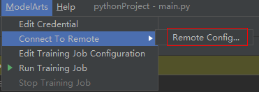

    > **说明：** 
    >此处如果看不到Connect to Remote选项，请先参考[创建Notebook实例](创建Notebook实例.md)章节，创建Notebook实例，并开启该实例的SSH远程开发功能。
    >也可能是PyCharm ToolKit的版本不正确，请按照文档要求下载新版本的PyCharm ToolKit。
    >下载前请先清除浏览器缓存，如果之前下载过老版本的PyCharm ToolKit，浏览器会有缓存，可能会导致新版本下载失败。

2.  此时，会出现该帐号已创建的所有包含SSH功能的Notebook列表，下拉进行选择对应Notebook。

    **图 2**  Notebook列表  
    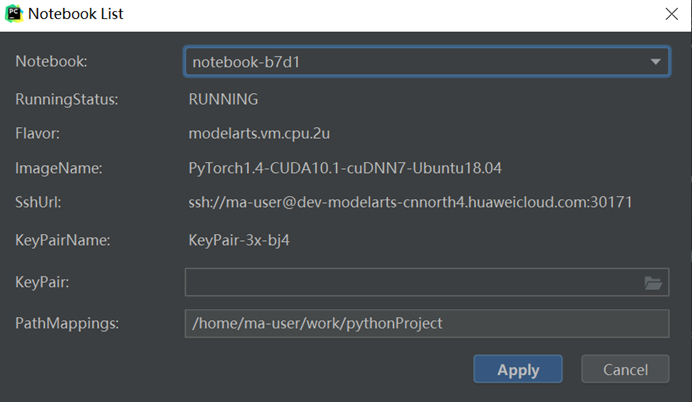

    -   KeyPair: 需要选择保存在本地的Notebook对应的keypair认证。即创建Notebook时创建的密钥对文件，创建时会直接保存到浏览器默认的下载文件夹中。
    -   PathMappings: 该参数为本地IDE项目和Notebook对应的同步目录，默认为/home/ma-user/work/project名称，可根据自己实际情况更改。

3.  单击“Apply“，配置完成后，重启IDE生效。

    重启后初次进行update python interpreter需要耗费20分钟左右。

## Step4 使用插件连接云上Notebook

与Notebook断开连接的状态下，单击Notebook名称，根据提示启动本地IDE与Notebook的连接\(默认启动时间4小时\)。

**图 3**  启动连接Notebook  
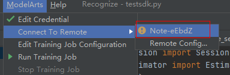

连接状态下，单击Notebook名称，根据提示断开本地IDE与云上Notebook的连接。

**图 4**  停止连接Notebook  
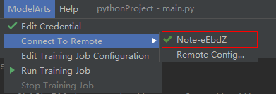

## Step5 同步上传本地文件至Notebook

本地文件中的代码直接拷贝至本地IDE中即可，本地IDE中会自动同步至云上开发环境。

**初始化同步**：

在本地IDE的Project目录下，单击右键，选择“Deployment“，单击“Upload to xxx“（Notebook名称），将本地工程文件上传至指定的Notebook。

**图 5**  同步本地文件至Notebook  
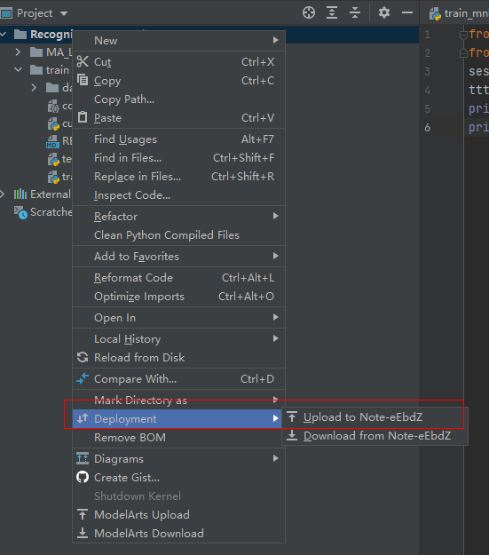

**后续同步:**

只需修改代码后保存（ctrl+s），即可进行自动同步。

插件安装完成后在本地IDE中开启了“Automatic Upload“，本地目录中的文件会自动上传至云端开发环境Notebook。如果未开启，请参考下图开启自动上传。

**图 6**  开启自动上传  
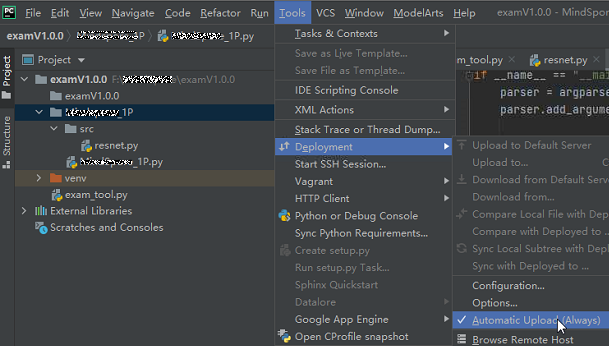

## Step6 远程调试

单击本地IDE右下角interpreter，选择Notebook的python解释器。

**图 7**  选择Python解释器  
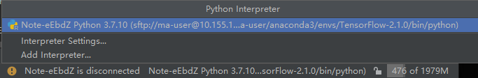

像本地运行代码一样，直接单击运行按钮运行代码即可，此时虽然是在本地IDE点的运行按钮，实际上运行的是云端Notebook里的代码，日志可以回显在本地的日志窗口。

**图 8**  查看运行日志  
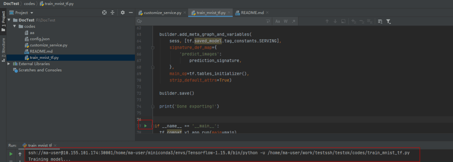

也可以单击本地IDE右上角的Run/Debug Configuration按钮来设置运行参数。

**图 9**  设置运行参数（1）  
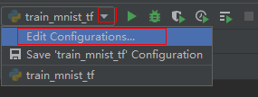

选择远程连接到云上开发环境实例对应的Python解释器。

**图 10**  设置运行参数（2）  
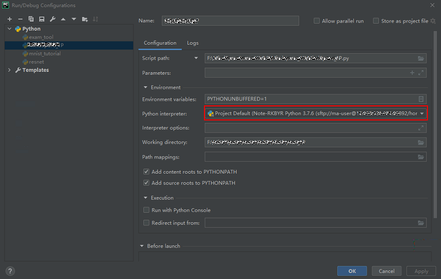

当需要调试代码时，可以直接打断点，然后使用debug方式运行程序。

**图 11**  使用debug方式运行程序  
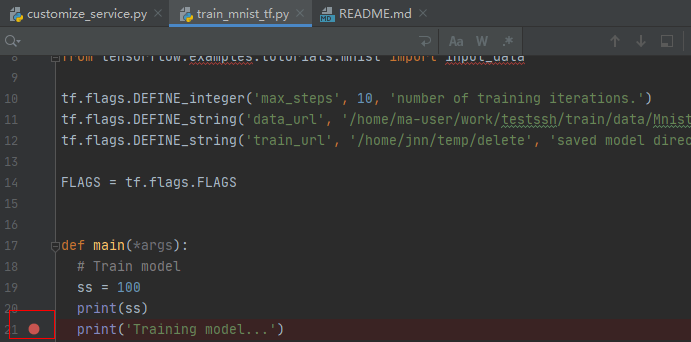

此时可以进入debug模式，代码运行暂停在该行，且可以查看变量的值。

**图 12**  Debug模式下查看变量值  
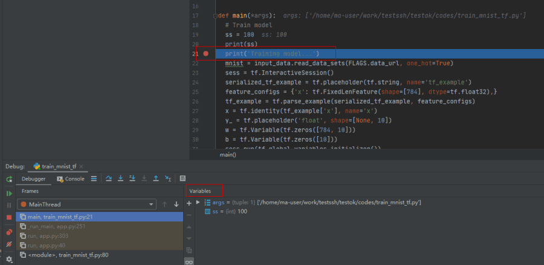

