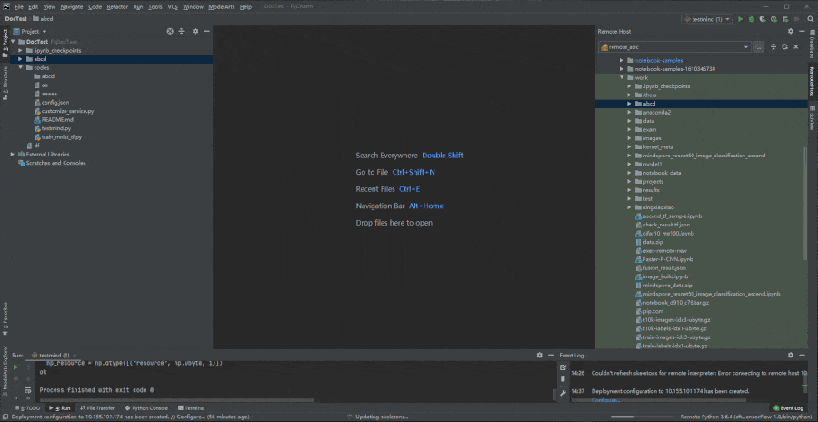
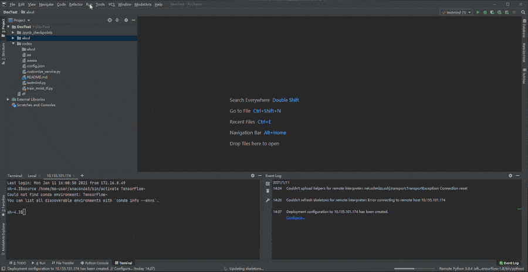
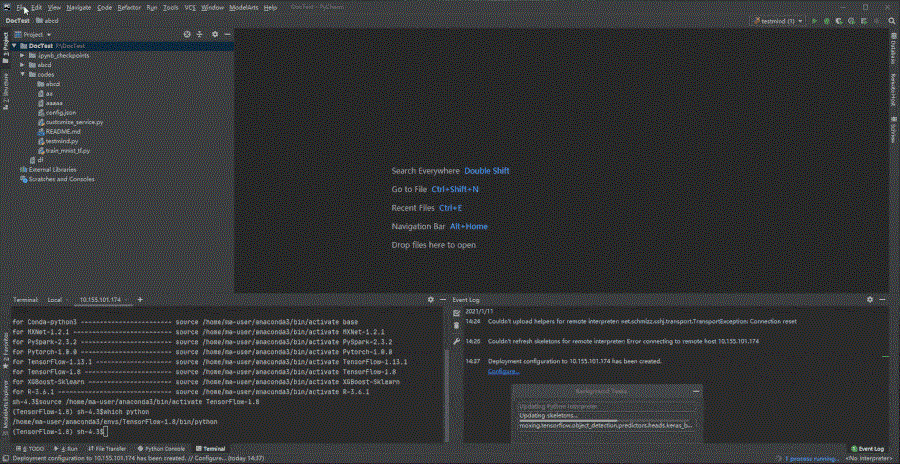
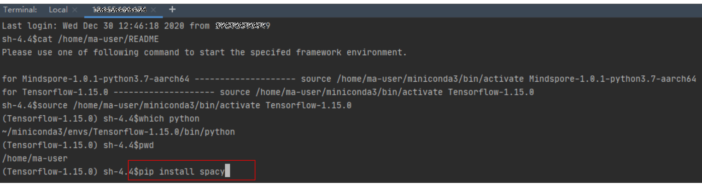
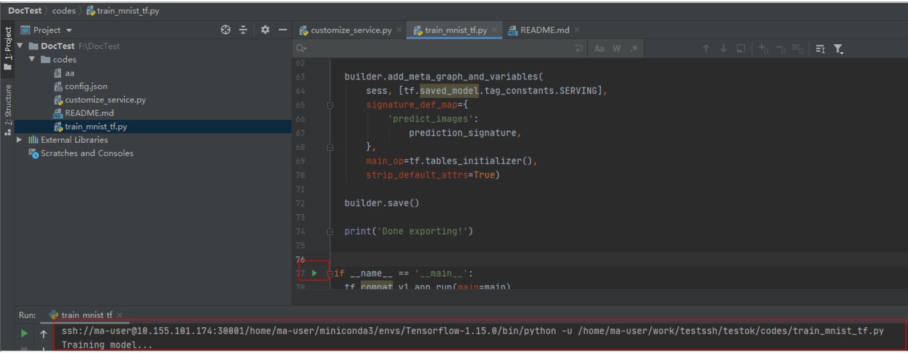
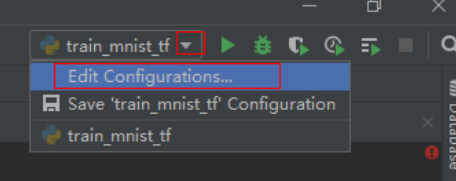
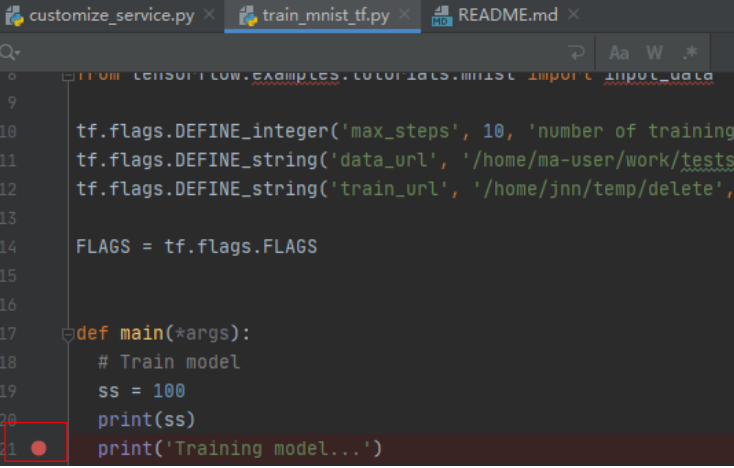
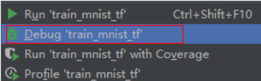
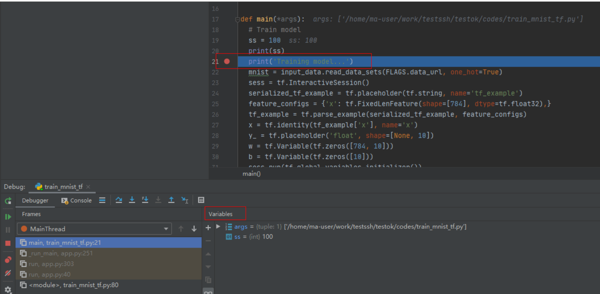

# 配置本地IDE（PyCharm手动连接）<a name="modelarts_30_0015"></a>

本地IDE环境支持Pycharm和VSCode。通过简单配置，即可用本地IDE远程连接到ModelArts的Notebook开发环境中，调试和运行代码。

本章节介绍基于PyCharm环境访问Notebook的方式。

## 前提条件<a name="section7543105425315"></a>

1.  SSH远程调试功能只限PyCharm专业版，请先安装PyCharm专业版。
2.  创建一个Notebook实例，并开启远程SSH开发，配置远程访问IP白名单。该实例状态必须处于“运行中“，具体参见[创建Notebook实例](创建Notebook实例.md)章节。
3.  在Notebook实例详情页面获取开发环境IP地址（例如：dev-modelarts-cnnorth4.huaweicloud.com）和端口号。

    **图 1**  Notebook实例详情页面<a name="fig28436362151"></a>  
    

4.  准备好密钥对。

    密钥对在用户第一次创建时，自动下载，之后使用相同的密钥时不会再有下载界面（用户一定要保存好），或者每次都使用新的密钥对。


## Step1 配置SSH<a name="section189094413373"></a>

1.  在本地的PyCharm开发环境中，单击File -\> Settings -\> Tools -\> SSH Configurations，单击+号，增加一个SSH连接配置。
    -   Host: 云上开发环境的IP地址，即在开发环境实例页面远程访问模块获取的IP地址。例如：dev-modelarts-cnnorth4.huaweicloud.com
    -   Port: 云上开发环境的端口，即在开发环境实例页面远程访问模块获取的端口号。
    -   User name: 固定为ma-user
    -   Authentication type: Key pair方式
    -   Private key file: 存放在本地的云上开发环境私钥文件，即在创建开发环境实例时创建并保存的密钥对文件。

2.  单击将连接重命名，可以自定义一个便于识别的名字，单击OK。
3.  配置完成后，单击Test Connection测试连通性。
4.  选择Yes，显示Successfully connected表示网络可以连通，单击OK。
5.  在最下方再单击OK保存配置。

**图 2**  配置SSH<a name="fig124398017311"></a>  


## Step2 获取开发环境预置虚拟环境路径<a name="section2067654203713"></a>

1.  单击“Tools \> Start SSH Session“，则可连接到云端开发环境内。
2.  执行如下命令可在/home/ma-user/下面的README文件查看当前环境内置的Python虚拟环境。

    ```
    cat /home/ma-user/README
    ```

3.  执行source命令可以切换到具体的Python环境中。
4.  执行which python查看python路径并拷贝出来，以备后续配置云上Python Interpreter使用。

**图 3**  获取开发环境预置虚拟环境路径<a name="fig835617618413"></a>  


## Step3 配置云上Python Interpreter<a name="section183069359414"></a>

1.  单击“File \> Settings \> Project：PythonProject \> Python Interpreter“，单击设置图标，再单击“Add“，添加一个新的interpreter。
2.  选择“Existing server configuration“，在下拉菜单中选择上一步配置好的SSH configuration，单击“Next“。
3.  配置Python Interpreter
    -   Interpreter：填写第一步拷贝的python路径，例如：/home/ma-user/anaconda3/envs/Pytorch-1.0.0/bin/python

        如果路径为\~/anaconda3/envs/Pytorch-1.0.0/bin/python 把\~替换为/home/ma-user即可。

    -   Sync folders: 需要配置本地的工程目录文件同步到云上开发环境环境中的某个目录，推荐配置为/home/ma-user下的某个目录中（其他目录可能没有访问权限），例如/home/ma-user/work/projects。

4.  单右侧文件夹图标!，勾选上“Automatically upload“选项，以便于本地修改的文件自动上传到容器环境中。
5.  单击“Finish“，结束配置。

    可以看到本地的工程文件已经自动往云上环境上传了。后续本地的文件每修改一下，都会自动的同步到云上的环境中。

    右下角可以看到当前的Interpreter为Remote Interpreter。

    **图 4**  配置云上Python Interpreter<a name="fig16418141915714"></a>  
    


## Step4 云上环境依赖库安装<a name="section425714124817"></a>

在进入开发环境后，可以使用不同的虚拟环境，例如TensorFlow、PyTorch等，但是实际开发中，通常还需要安装其他依赖包，此时可以通过terminal连接到环境里操作。

单击工具栏“Tools \>Start SSH session“，选择SSH Configuration中配置的开发环境。可以执行pip install安装所需要的包。



## Step5 在开发环境中调试代码<a name="section168117221425"></a>

由于已经连接至云端开发环境，此时可以方便的在本地PyCharm中编码示例如、调测并运行。运行实际环境为云上开发环境，资源为云上昇腾AI处理器资源。可以做到本地编写修改代码，直接在云上环境运行。

像本地运行代码一样，直接单击运行按钮运行代码即可，此时虽然是在本地IDE单击的运行按钮，实际上运行的是云端开发环境里的代码，日志可以回显在本地的日志窗口。

**图 5**  调试代码<a name="fig167913034612"></a>  


也可以单击右上角的Run/Debug Configuration来设置运行的参数。

**图 6**  设置运行参数<a name="fig11304618144619"></a>  


当需要调试代码时，可以直接打断点，然后使用debug方式运行程序。

**图 7**  代码打断点<a name="fig14249102734611"></a>  


**图 8**  Debug方式调试<a name="fig15105211460"></a>  


此时可以进入debug模式，代码运行暂停在该行，且可以查看变量的值。

**图 9**  Debug模式<a name="fig181531829194710"></a>  


使用debug方式调试代码的前提是本地的代码和云端的代码是完全一致的，如果不一致可能会导致在本地打断点的行和实际运行时该行的代码并不一样，会出现意想不到的错误。

因此在配置云上Python Interpreter时，推荐选择Automatically upload选项，以保证本地的文件修改能自动上传到云端。如果没有选择自动上传，则本地代码修改完后，也可以参考[Step5 同步上传本地文件至Notebook](配置本地IDE（PyCharm-ToolKit连接）.md#section155312327559)手动上传目录或代码。

