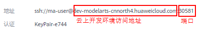
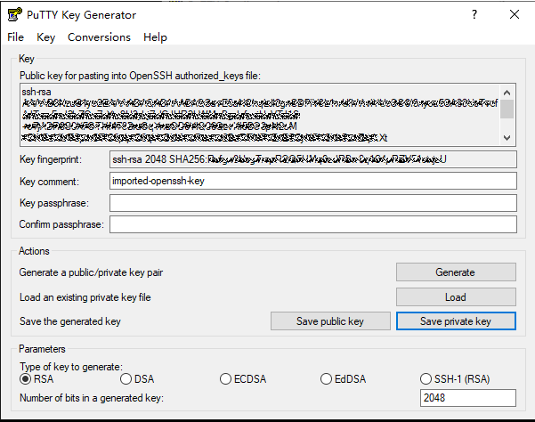
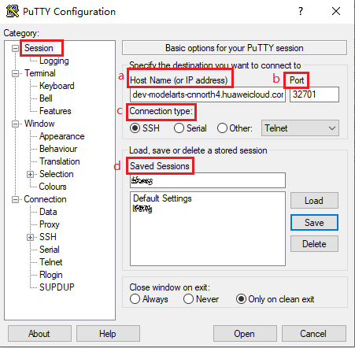
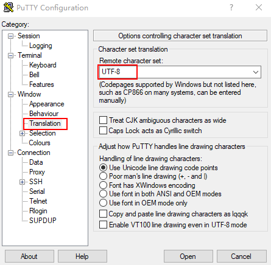
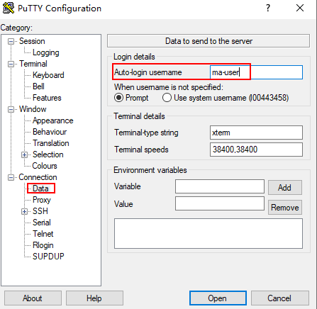
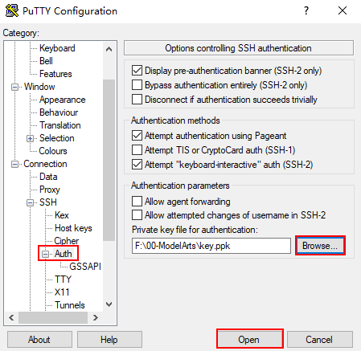
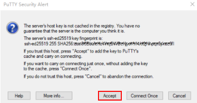
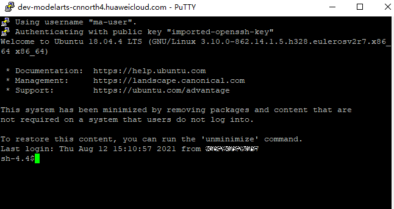

# 配置本地IDE（SSH工具连接）

本节操作介绍在Windows环境中使用PuTTY SSH远程登录云上Notebook实例的操作步骤。

## 前提条件

1.  创建一个Notebook实例，并开启远程SSH开发，配置远程访问IP白名单。该实例状态必须处于“运行中“，具体参见[创建Notebook实例](创建Notebook实例.md)章节。
2.  在Notebook实例详情页面获取开发环境访问地址（例如：dev-modelarts-cnnorth4.huaweicloud.com）和端口号。

    **图 1**  Notebook实例详情页面  
    

3.  准备好密钥对文件。

    密钥对在用户第一次创建时，自动下载，之后使用相同的密钥时不会再有下载界面（用户一定要保存好），或者每次都使用新的密钥对。

## Step1 安装SSH工具

下载并安装SSH远程连接工具，以PuTTY为例，[下载链接](https://www.chiark.greenend.org.uk/~sgtatham/putty/latest.html)。

## Step2 使用puttygen将密钥对.pem文件转成.ppk文件

1.  [下载puttygen](https://www.chiark.greenend.org.uk/~sgtatham/putty/latest.html)，并双击运行puttygen。
2.  单击“Load“，上传.pem密钥（即在创建Notebook实例时创建并保存的密钥对文件）。
3.  单击“Save private key“，保存生成的.ppk文件。.ppk文件的名字可以自定义，例如key.ppk。

    **图 2**  将密钥对.pem文件转成.ppk文件  
    

## Step3 使用SSH工具连接云上Notebook实例

1.  运行PuTTY。
2.  单击“Session“，填写以下参数。

    1.  Host Name \(or IP address\)：云上开发环境Notebook实例的访问地址，即在Notebook实例详情页获取的地址。例如：dev-modelarts-cnnorth4.huaweicloud.com。
    2.  Port：云上Notebook实例的端口，即在Notebook实例详情页获取的端口号。例如：32701。
    3.  Connection Type：选择 SSH。
    4.  Saved Sessions：任务名称，在下一次使用PuTTY时就可以单击保存的任务名称，即可打开远程连接。

    **图 3**  设置Session  
    

3.  选择“Window \> Translation“，在“Remote character set:“中选择“UTF-8“。

    **图 4**  设置字符格式  
    

4.  选择“Connection \> Data“， 在“Auto-login username“  中填写用户名“ma-user“。

    **图 5**  填写用户名  
    

5.  选择“Connection \> SSH \> Auth“, 单击“Browse“，选择“.ppk文件“（由[Step2](#section97911985211)密钥对.pem文件生成）。

    

6.  单击“Open”。如果首次登录，PuTTY会显示安全警告对话框，询问是否接受服务器的安全证书。单击“Accept”将证书保存到本地注册表中。

    **图 6**  询问是否接受服务器的安全证书  
    

7.  成功连接到云上Notebook实例。

    **图 7**  连接到云上Notebook实例  
    

