# 配置本地IDE（VSCode ToolKit连接）

ModelArts提供了一个VSCode插件工具，协助用户完成SSH远程连接Notebook。

## 前提条件

1.  VSCode的下载地址: https://code.visualstudio.com/updates/v1\_57

    VSCode版本要求：当前VSCode最新的版本1.58.2和VSCode最新的remote-ssh插件匹配有问题，建议用户使用VSCode 1.57.1。后续建议用户使用VSCode最新版本。

2.  用户本地PC或服务器的操作系统中建议先安装Python环境，详见[VSCode官方指导](https://code.visualstudio.com/docs/python/python-tutorial#_prerequisites)。
3.  创建一个Notebook实例，并开启远程SSH开发，配置远程访问IP白名单，具体参见[创建Notebook实例](创建Notebook实例.md)。Notebook实例状态处于“运行中“或“停止“状态都可以，如果Notebook实例是停止状态，VSCode插件会先启动实例再去连接。
4.  准备好密钥对。

    密钥对在用户第一次创建时，自动下载，之后使用相同的密钥时不会再有下载界面（用户一定要保存好），或者每次都使用新的密钥对。

## Step1 下载VSCode插件

VSCode的插件工具包VSCode-ToolKit集成在ModelArts管理控制台中，请先下载并安装VSCode插件工具包，[下载链接](https://cnnorth4-modelarts-sdk.obs.cn-north-4.myhuaweicloud.com/modelarts/vscode_plugin/vscode-extension/VSCode-ToolKit-latest.vsix)。

## Step2 安装VSCode插件

1.  在本地的VSCode开发环境中，如[图1](#fig2151141152213)所示，选择本地的VSCode插件并单击“安装“。

    **图 1**  安装VSCode插件  
    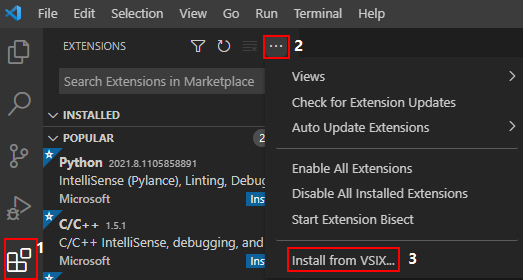

2.  安装过程预计1\~2分钟，如[图2](#fig14343202682719)所示，请耐心等待。

    **图 2**  安装过程  
    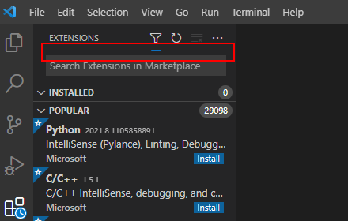

3.  安装完成后，系统右下角提示安装完成，导航左侧出现ModelArts图标和SSH远程连接图标，表示VSCode插件安装完成。

    **图 3**  安装完成提示  
    

    **图 4**  安装完成  
    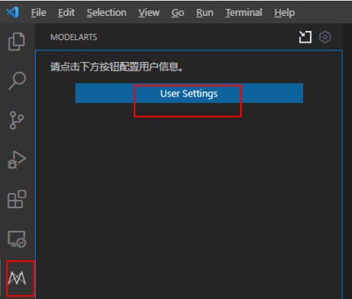

## Step3 登录VSCode插件

1.  在本地的VSCode开发环境中，单击ModelArts图标，单击“User Settings“，配置用户登录信息。

    **图 5**  登录插件  
    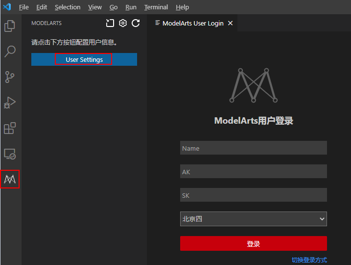

2.  输入如下用户登录信息，单击“登录“。

    -   Name：自定义用户名，仅用于VSCode页面展示，不与任何华为云用户关联。
    -   AK：在华为云“帐号中心 \> 我的凭证 \> 访问密钥“中创建访问密钥，获取AK（[参考链接](https://support.huaweicloud.com/tg-modelarts/modelarts_15_0004.html)）。
    -   SK：在华为云“帐号中心 \> 我的凭证 \> 访问密钥“中创建访问密钥，获取SK（[参考链接](https://support.huaweicloud.com/tg-modelarts/modelarts_15_0004.html)）。
    -   选择站点：例如：北京四。此处的站点必须和远程连接的Notebook在同一个站点，否则会导致连接失败。

    也可以切换登录方式，采用如[图6](#fig210919298199)所示方式输入用户信息后，Ctrl+S保存。

    **图 6**  配置用户登录信息  
    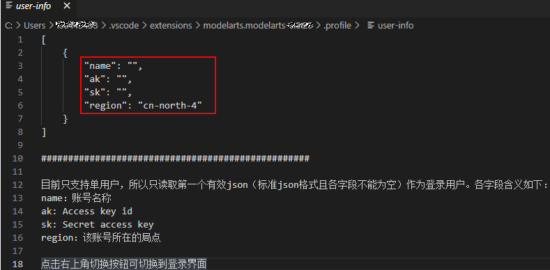

3.  登录成功后显示Notebook实例列表。

    **图 7**  登录成功  
    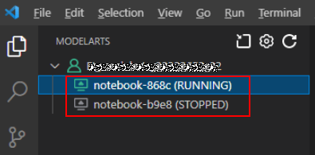

## Step4 连接Notebook实例

1.  在本地的VSCode开发环境中，右键单击实例名称，单击“Connect to Instance“，启动并连接Notebook实例。

    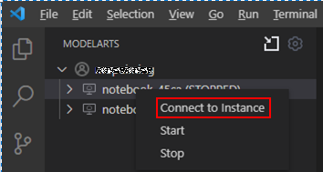

    或者单击实例名称，在VSCode开发环境中显示Notebook实例详情页，单击“连接“，系统自动启动该Notebook实例并进行远程连接。

    **图 8**  查看Notebook实例详情页  
    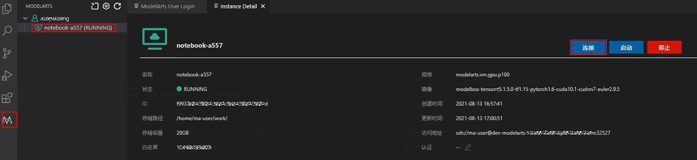

2.  第一次连接Notebook时，系统右下角会提示需要先配置密钥文件。根据系统提示单击“确定“。

    **图 9**  配置密钥文件  
    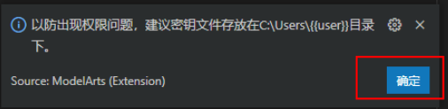

3.  选择本地密钥pem文件（建议放在用户家目录下），单击“确定“后，插件自动连接远端Notebook实例。
4.  首次连接大约耗时1\~2分钟，取决于本地的网络情况。VSCode环境左下角显示类似下图即为连接成功。

    **图 10**  连接成功  
    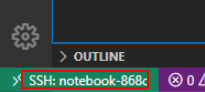

## Step5 上传本地代码到云端开发环境

1.  在VSCode界面，单击“File \> OpenFolder“打开云端路径。

    **图 11**  Open Floder  
    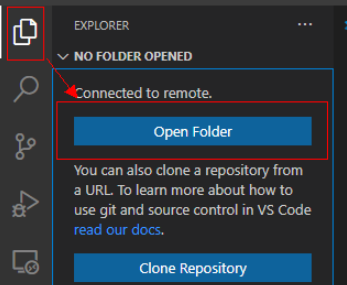

2.  选择要打开的路径，单击“OK“。

    **图 12**  选择文件路径  
    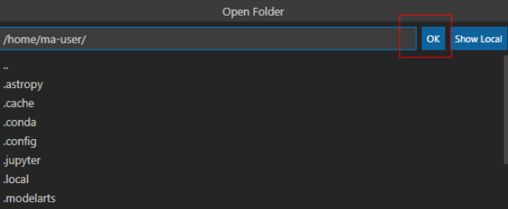

3.  此时，会在IDE左侧出现该开发环境下的目录结构，把想要上传的代码及其他文件直接拖拽至对应得文件夹内即完成本地代码上传至云端。

## Step6 远程调试代码

在VSCode中打开要执行的代码文件，在执行代码之前需要选择合适的Python版本路径，单击下方默认的Python版本路径，此时在上方会出现该远程环境上所有的python版本，选择自己需要的版本即可。

**图 13**  选择Python版本  
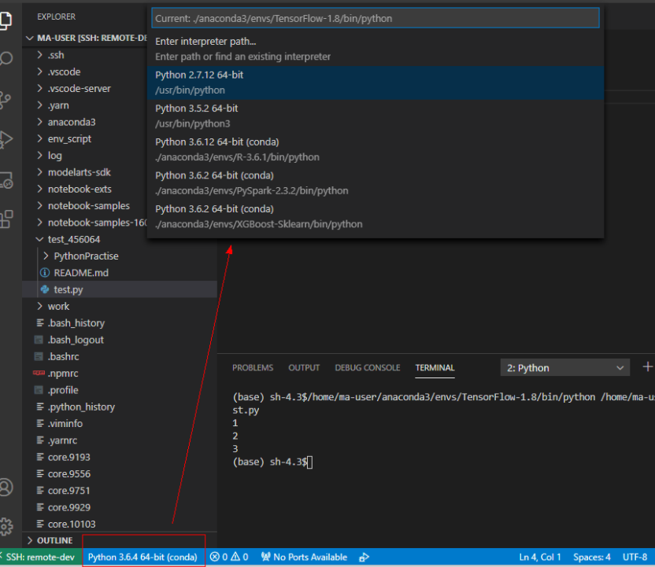

对于打开的代码文件，单击run按钮，即可执行，可以在下方的Terminal中看到代码输出信息。

如果要对代码进行debug调试，需要单击左侧“Run \> Run and Debug“。

选择当前打开的默认的python代码文件进行调试。

对当前代码进行打断点，即在代码左侧进行单击，就会出现小红点。

此时，即可按照正常的代码调试步骤对代码调试，在界面左边会显示debug信息，代码上方有相应的调试步骤。

## 相关操作

卸载VSCode插件操作如[图14](#fig267362714329)所示。

**图 14**  卸载VSCode插件  
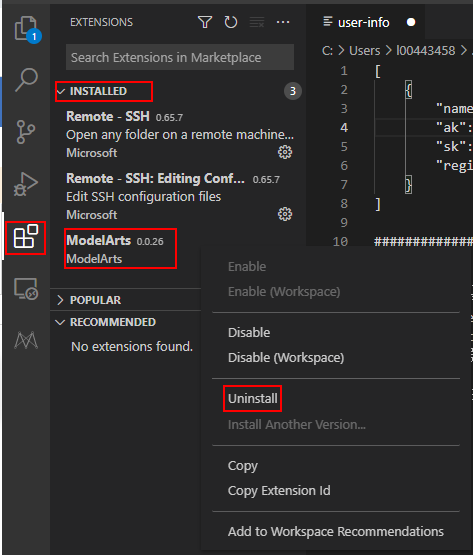

## VSCode使用常见问题

[VSCode中查看远端日志](https://support.huaweicloud.com/modelarts_faq/modelarts_05_0305.html)

[使用VSCode调试代码时不能进入源码](https://support.huaweicloud.com/modelarts_faq/modelarts_05_0301.html)

[使用VSCode提交代码时弹出对话框提示用户名和用户邮箱配置错误](https://support.huaweicloud.com/modelarts_faq/modelarts_05_0302.html)

[VSCode连接远端Notebook时报错如“XHR failed”](https://support.huaweicloud.com/modelarts_faq/modelarts_05_0304.html)

[安装远端插件时不稳定，需尝试多次](https://support.huaweicloud.com/modelarts_faq/modelarts_05_0299.html)

[Notebook实例重新启动后，需要删除本地known\_hosts才能连接](https://support.huaweicloud.com/modelarts_faq/modelarts_05_0300.html)

更多VSCode使用相关FAQ，请参见[FAQ](https://support.huaweicloud.com/modelarts_faq/modelarts_05_0298.html)。

