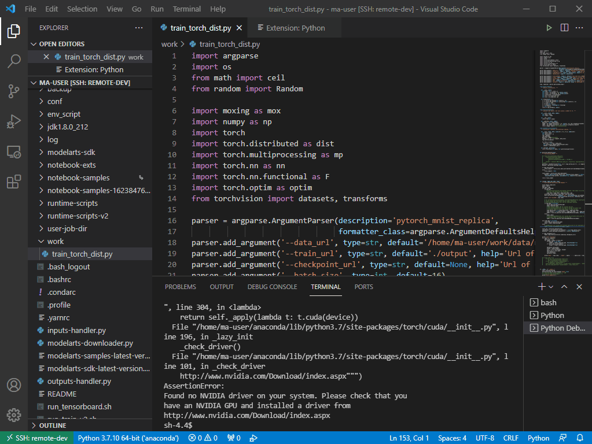

# 配置本地IDE（VSCode手动连接）<a name="modelarts_30_0016"></a>

本地IDE环境支持Pycharm和VSCode。通过简单配置，即可用本地IDE远程连接到ModelArts的Notebook开发环境中，调试和运行代码。

本章节介绍基于VSCode环境访问Notebook的方式。

## 前提条件<a name="section7543105425315"></a>

1.  VSCode的下载地址: https://code.visualstudio.com/updates/v1\_57

    VSCode版本要求：当前VSCode最新的版本1.58.2/1.59和VSCode最新的remote-ssh插件匹配有问题，建议用户使用VSCode 1.57.1。后续建议用户使用VSCode最新版本。

    **图 1**  下载VSCode<a name="fig1195510556131"></a>  
    

    **图 2**  VSCode安装指导<a name="fig10456175101116"></a>  
    

2.  用户本地PC或服务器的操作系统中建议先安装Python环境，详见[VSCode官方指导](https://code.visualstudio.com/docs/python/python-tutorial#_prerequisites)。
3.  创建一个Notebook实例，并开启远程SSH开发，配置远程访问IP白名单。该实例状态必须处于“运行中“，具体参见[创建Notebook实例](创建Notebook实例.md)章节。
4.  在Notebook实例详情页面获取开发环境访问地址（例如：dev-modelarts-cnnorth4.huaweicloud.com）和端口号。

    **图 3**  Notebook实例详情页面<a name="fig13821115753210"></a>  
    

5.  <a name="li381653411562"></a>准备好密钥对。

    密钥对在用户第一次创建时，自动下载，之后使用相同的密钥时不会再有下载界面（用户一定要保存好），或者每次都使用新的密钥对。


## Step1 添加Remote-SSH 插件<a name="section1292411145210"></a>

在本地的VSCode开发环境中，单击左侧列表的Extensions图标选项，在搜索框中输入SSH，单击Remote-SSH插件的install按钮，完成插件安装。

**图 4**  添加Remote-SSH插件<a name="fig28261027113618"></a>  


## Step2 配置SSH<a name="section189094413373"></a>

1.  在本地的VSCode开发环境中，单击左侧Remote Explorer按钮，在上方的下拉列表中选择“SSH Target“，再单击页面上的设置按钮，此时会出现SSH配置文件路径。

    **图 5**  配置SSH Targets页面<a name="fig268819131146"></a>  
    

2.  单击列表中出现的SSH路径按钮，打开config文件，进行配置。

    **图 6**  配置SSH Config文件<a name="fig020559192414"></a>  
    

    ```
    HOST remote-dev
         hostname <instance connection host>
         port <instance connection port>
         user ma-user
         IdentityFile ~/.ssh/test.pem
         UserKnownHostsFile=/dev/null
         StrictHostKeyChecking no
    ```

    -   Host: 自定义设置的云上开发环境名称
    -   HosName: 云上开发环境的访问地址，即在开发环境实例页面远程访问模块获取的访问地址。例如：dev-modelarts-cnnorth4.huaweicloud.com
    -   Port: 云上开发环境的端口，即在开发环境实例页面远程访问模块获取的端口号。
    -   User：登录用户只支持ma-user进行登录
    -   IdentityFile: 存放在本地的云上开发环境私钥文件，即前提条件[5](#li381653411562)中准备的密钥对。

3.  配置云上开发环境系统平台，单击“File \> Preference \> Settings \> Extensions \> Remote-SSH“, 在“Remote Platform“中，单击“Add Item“选项，设置“Item“和“Value“，配置完成后，单击“OK“。

    **图 7**  配置云上开发环境系统平台<a name="fig68110526366"></a>  
    

    “Item“：在SSH Config中配置的Host的名称。

    “Value“：在下拉选择框中选择远端开发环境平台。

4.  再回到SSH Targets页面，单击右侧的Connect to Host in New Window按钮，该按钮会显示远程开发环境名称，选中并打开。

    **图 8**  打开开发环境<a name="fig81861123162714"></a>  
    

    在新打开的页面中，看到下图所示界面，即表示连接成功。

    **图 9**  开发环境远程连接成功<a name="fig1780415509271"></a>  
    

    **图 10**  完整配置示例<a name="fig13784338364"></a>  
    


## Step3 安装云端Python插件<a name="section17688149183012"></a>

在新打开的的VSCode界面，单击左侧列表的Extensions选项，在搜索框中输入Python，在下拉列表中单击“Install“进行安装。

**图 11**  安装云端Python插件<a name="fig109791329133717"></a>  


如果安装云端的Python插件不成功时，建议通过离线包的方式安装。具体操作请参见[安装远端插件时不稳定，需尝试多次](https://support.huaweicloud.com/modelarts_faq/modelarts_05_0299.html)。

## Step4 云上环境依赖库安装<a name="section425714124817"></a>

在进入容器环境后，可以使用不同的虚拟环境，例如TensorFlow、PyTorch等，但是实际开发中，通常还需要安装其他依赖包，此时可以通过Terminal连接到环境里操作。

1.  在VSCode环境中，执行Ctrl+Shift+P。
2.  搜Python: Select Interpreter，选择对应的Python环境。
3.  单击页面上方的“Terminal \> New Terminal“，此时打开的的命令行界面即为远端容器环境命令行。
4.  进入引擎后，通过执行如下命令安装依赖包。

    ```
    pip install spacy
    ```


## Step5 上传本地代码到云端开发环境<a name="section1246414153818"></a>

1.  在VSCode界面，单击“File \> OpenFolder“打开云端路径。

    **图 12**  Open Floder<a name="fig104561131173914"></a>  
    

2.  选择要打开的路径，单击“OK“。

    **图 13**  选择文件路径<a name="fig146235713413"></a>  
    

3.  此时，会在IDE左侧出现该开发环境下的目录结构，把想要上传的代码及其他文件直接拖拽至对应得文件夹内即完成本地代码上传至云端。

    **图 14**  上传本地代码<a name="fig12801136123718"></a>  
    


## Step6 远程调试代码<a name="section0437191820389"></a>

在VSCode中打开要执行的代码文件，在执行代码之前需要选择合适的Python版本路径，单击下方默认的Python版本路径，此时在上方会出现该远程环境上所有的python版本，选择自己需要的版本即可。

**图 15**  选择Python版本<a name="fig151512447434"></a>  


对于打开的代码文件，单击run按钮，即可执行，可以在下方的Terminal中看到代码输出信息。

**图 16**  运行代码文件<a name="fig212312123201"></a>  


如果要对代码进行debug调试，需要单击左侧“Run \> Run and Debug“。

选择当前打开的默认的python代码文件进行调试。

对当前代码进行打断点，即在代码左侧进行单击，就会出现小红点。

此时，即可按照正常的代码调试步骤对代码调试，在界面左边会显示debug信息，代码上方有相应的调试步骤。

**图 17**  调试代码<a name="fig6444729112519"></a>  


## VSCode使用常见问题<a name="section4163133216142"></a>

[VSCode中查看远端日志](https://support.huaweicloud.com/modelarts_faq/modelarts_05_0305.html)

[使用VSCode调试代码时不能进入源码](https://support.huaweicloud.com/modelarts_faq/modelarts_05_0301.html)

[使用VSCode提交代码时弹出对话框提示用户名和用户邮箱配置错误](https://support.huaweicloud.com/modelarts_faq/modelarts_05_0302.html)

[VSCode连接远端Notebook时报错如“XHR failed”](https://support.huaweicloud.com/modelarts_faq/modelarts_05_0304.html)

[安装远端插件时不稳定，需尝试多次](https://support.huaweicloud.com/modelarts_faq/modelarts_05_0299.html)

[Notebook实例重新启动后，需要删除本地known\_hosts才能连接](https://support.huaweicloud.com/modelarts_faq/modelarts_05_0300.html)

更多VSCode使用相关FAQ，请参见[FAQ](https://support.huaweicloud.com/modelarts_faq/modelarts_05_0298.html)。

