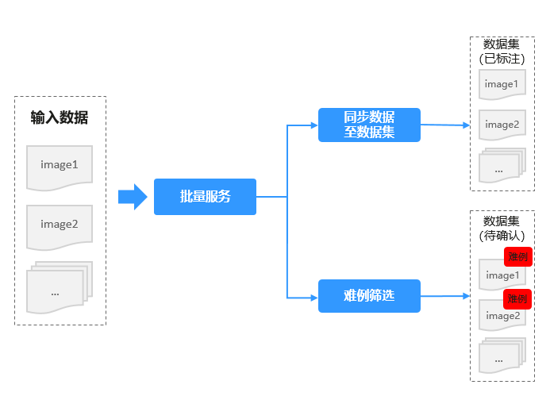
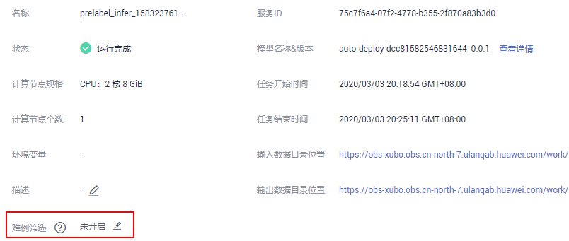
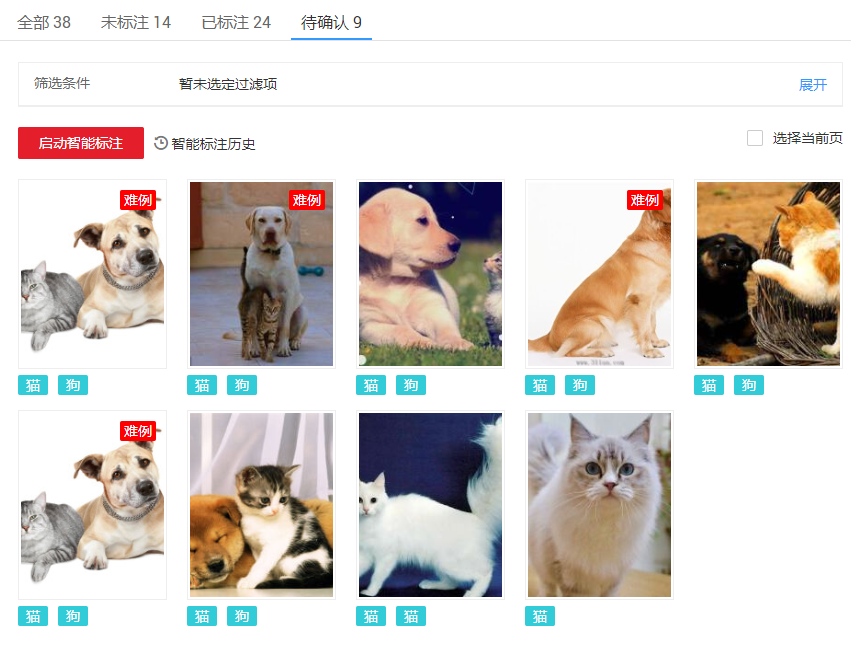

# 采集数据

ModelArts平台提供的自动难例发现功能，能够在一批输入旧模型的推理数据中，通过内置规则筛选出可以进一步提升旧模型精度的数据。自动难例发现功能可以有效减小模型更新时需要的标注人力。对于旧模型的推理数据，尽可能地发掘有利于提升模型精度的部分数据。您只需要对这部分数据进一步的确认标注，然后将其加入训练数据集中，在重新训练后，就能够得到精度更高的新模型。

针对部署为批量服务的模型，调用服务产生的数据默认存储在对应的OBS目录下，ModelArts可以根据配置规则对已有数据进行自动难例筛选，并输出至数据集，用于后续的模型训练。

针对批量服务的数据同步及难例筛选，如[图1](#fig10263710112914)所示，支持如下几个场景。

-   [同步数据至数据集](#section141946139311)：针对批量服务中的输入数据，支持将此数据同步至某一数据集中，统一管理和应用。
-   [难例筛选](#section7288194318)：针对批量服务中的输入数据，开启难例筛选功能，系统将通过内置算法，筛选出难例。最后将难例数据存储至对应数据集中，用于重新训练。

**图 1**  批量服务的数据采集  

## 同步数据至数据集

针对批量服务，支持将其输入数据同步至数据集。此操作并不会执行难例筛选，仅将数据存储至数据集。可以存储至已有数据集，也可创建一个新数据集用于存储数据。

1.  登录ModelArts管理控制台，在左侧菜单栏中选择“部署上线 \> 批量服务“，进入在线服务管理页面。
2.  单击服务名称进入服务详情页面，选择“数据采集“页签。或者在服务管理列表中，单击“操作“列的“更多 \> 数据采集“。

    **图 2**  批量服务进入数据采集页面  
    

3.  在“数据采集“页签下，单击“同步数据至数据集“。
4.  在弹出的对话框中，勾选“标注类型“，然后“选择数据集“，单击“确定“，将数据同步至数据集的“未标注“页签下。

    当批量服务的输入数据为空时，将无法执行同步数据至数据集的操作。

    **图 3**  批量服务同步数据至数据集  
    

## 难例筛选

开启难例筛选任务，可将批量服务的数据进行难例筛选，同时将筛选结果存储至对应数据集中。

> **说明：** 
>如果批量服务已运行结束，且筛选难例的开关处于关闭状态，之后将不再执行难例筛选任务。在配置难例筛选任务后，需重新启动批量服务，才能执行难例筛选任务。

1.  登录ModelArts管理控制台，在左侧菜单栏中选择“部署上线 \> 批量服务“，进入在线服务管理页面。
2.  开启难例筛选任务。
    -   在部署为批量服务时，即“部署“页面，填写部署服务相关参数时，开启难例筛选功能。

        **图 4**  部署页面开启难例筛选功能  
        

    -   针对已部署完成的批量服务，单击服务名称进入服务详情页面，在“难例筛选“参数中，单击编辑按钮，启动难例筛选任务。

        **图 5**  详情页面开启难例筛选功能  
        

3.  填写难例筛选相关参数，详细说明请参见[表1](#table16611749101618)。批量服务的难例筛选，默认针对所有的数据，与在线服务不同，不需设置筛选规则。

    **表 1**  难例筛选参数说明

    
    <table><thead align="left"><tr id="row11612496165"><th class="cellrowborder" valign="top" width="30.330000000000002%" id="mcps1.2.3.1.1">
参数

    </th>
    <th class="cellrowborder" valign="top" width="69.67%" id="mcps1.2.3.1.2">
说明

    </th>
    </tr>
    </thead>
    <tbody><tr id="row1262104913165"><td class="cellrowborder" valign="top" width="30.330000000000002%" headers="mcps1.2.3.1.1 ">
模型类型

    </td>
    <td class="cellrowborder" valign="top" width="69.67%" headers="mcps1.2.3.1.2 ">
模型的应用类型，目前仅支持“图像分类”和“物体检测”。

    </td>
    </tr>
    <tr id="row710118226567"><td class="cellrowborder" valign="top" width="30.330000000000002%" headers="mcps1.2.3.1.1 ">
训练模型的Manifest文件

    </td>
    <td class="cellrowborder" valign="top" width="69.67%" headers="mcps1.2.3.1.2 ">
将某一模型部署为批量服务，此模型是通过某一数据集训练而来，其过程如下所示。针对此批量服务对应的训练数据集，您可以在难例筛选时，导入此数据集的Manifest文件，更容易筛选出模型深层次的数据问题。

    
<em id="i21624262110">（训练脚本+训练数据集）-&gt; 训练得到模型 -&gt; 将模型部署为批量服务</em>

    
此参数为可选项，但为了提升精度，推荐您导入相应数据集。当前仅支持导入此数据集的Manifest文件格式。针对在ModelArts中管理的数据集，您可以通过<a href="zh-cn_topic_0170886812.md">发布数据集</a>的操作，得到此数据集的Manifest文件。如果您的数据集未在ModelArts中管理，请参考<a href="zh-cn_topic_0170886817.md">Manifest的文件规范</a>。

    </td>
    </tr>
    <tr id="row1462124931611"><td class="cellrowborder" valign="top" width="30.330000000000002%" headers="mcps1.2.3.1.1 ">
难例输出

    </td>
    <td class="cellrowborder" valign="top" width="69.67%" headers="mcps1.2.3.1.2 ">
将筛选出的难例数据保存至某一数据集。支持已有数据集或创建一个新的数据集。

    
必须选择一个对应类型的数据集，例如模型类型为“图像分类”，其筛选的难例输出的数据集，也必须为“图像分类”类型。

    </td>
    </tr>
    </tbody>
    </table>

    **图 6**  开启难例筛选  
    

4.  当难例筛选任务配置完成并运行结束后。您可以在批量服务的“数据采集“页签下，查看“任务状态“。当任务完成后，其“任务状态“将显示为“数据集导入完成“，您可以通过数据集链接，快速跳转至对应的数据集。筛选出的难例，将存储在数据集的“待确认“页签下。

    **图 7**  数据采集任务状态  
    

    **图 8**  难例筛选结果  
    

