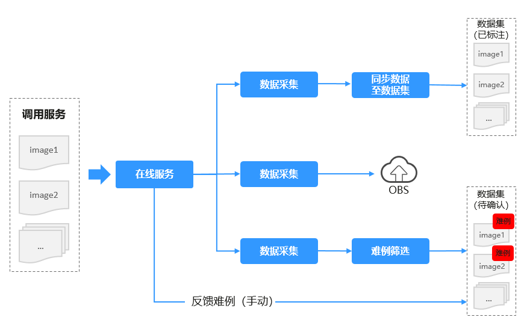
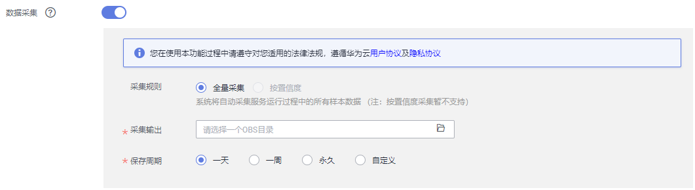
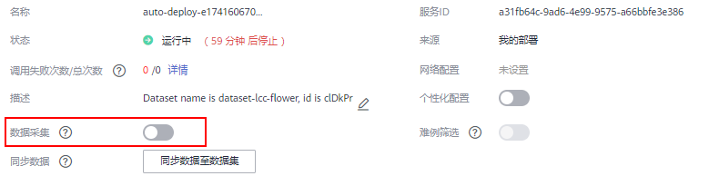
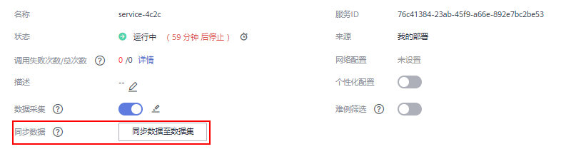
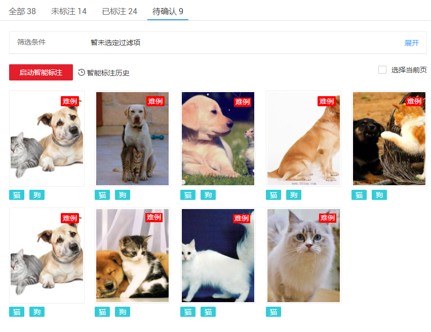
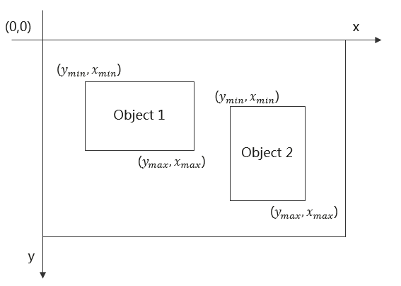

# 采集数据<a name="modelarts_23_0224"></a>

ModelArts平台提供的自动难例发现功能，能够在一批输入旧模型的推理数据中，通过内置规则筛选出可以进一步提升旧模型精度的数据。自动难例发现功能可以有效减小模型更新时需要的标注人力。对于旧模型的推理数据，尽可能地发掘有利于提升模型精度的部分数据。您只需要对这部分数据进一步的确认标注，然后将其加入训练数据集中，在重新训练后，就能够得到精度更高的新模型。

针对部署为在线服务的模型，调用URL或通过Console输入预测的数据，可通过数据采集功能，将此类数据采集或筛选出难例，并输出至数据集，用于后续的模型训练。

针对在线服务的数据采集，如[图1](#fig885771822719)所示，支持如下几个场景。

-   [数据采集](#section187461712143214)：开启数据采集任务。将调用在线服务产生的数据，按配置规则进行采集并存储。
-   [同步数据至数据集](#section16719134283219)：针对数据采集的结果数据，支持将此数据同步至某一数据集中，统一管理和应用。
-   [数据采集并筛选难例](#section1670413517323)：开启数据采集任务，同时启用难例筛选功能，将采集的数据通过内置算法，筛选出难例。最后将难例数据以及采集的数据存储至对应数据集中，用于重新训练。
-   [反馈难例](#section73063463312)：当您调用在线服务进行预测时，可将预测不准确的图片数据，作为难例反馈，存储至对应数据集。

**图 1**  在线服务的数据采集<a name="fig885771822719"></a>  


## 前提条件<a name="section10145736175016"></a>

-   训练好的模型，已部署为在线服务，且在线服务处于“运行中”状态。
-   明确此在线服务的类型。仅“物体检测”或“图像分类”类型支持数据采集和难例筛选。

## 数据采集<a name="section187461712143214"></a>

在部署为在线服务时，您可以开启数据采集任务。或者针对已部署完成的在线服务，您可以在服务详情页面，开启数据采集任务。如果仅开启数据采集任务，仅将调用服务时产生的数据，采集存储至OBS。如需进行难例筛选，请参见[数据采集并筛选难例](#section1670413517323)，如需将采集后的同步至数据集，但是不需要难例筛选，请参见[同步数据至数据集](#section16719134283219)。

1.  登录ModelArts管理控制台，在左侧菜单栏中选择“部署上线 \> 在线服务“，进入在线服务管理页面。
2.  开启数据采集任务。
    -   在部署为在线服务时，即“部署“页面，填写部署服务相关参数时，开启数据采集功能。

        **图 2**  部署页面开启数据采集功能<a name="fig2402202617219"></a>  
        

    -   针对已部署完成的在线服务，单击服务名称进入服务详情页面，在数据采集参数中，单击编辑按钮，启动数据采集任务。

        **图 3**  详情页面开启数据采集功能<a name="fig1638102018117"></a>  
        

3.  填写数据采集任务的相关参数，详细参数说明请参见[表1](#table195921021016)。

    **表 1**  数据采集参数说明

    <a name="table195921021016"></a>
    <table><thead align="left"><tr id="row1259210121015"><th class="cellrowborder" valign="top" width="33.79%" id="mcps1.2.3.1.1"><p id="p1059010171010"><a name="p1059010171010"></a><a name="p1059010171010"></a>参数</p>
    </th>
    <th class="cellrowborder" valign="top" width="66.21000000000001%" id="mcps1.2.3.1.2"><p id="p1459131010103"><a name="p1459131010103"></a><a name="p1459131010103"></a>说明</p>
    </th>
    </tr>
    </thead>
    <tbody><tr id="row05919105101"><td class="cellrowborder" valign="top" width="33.79%" headers="mcps1.2.3.1.1 "><p id="p1959151020104"><a name="p1959151020104"></a><a name="p1959151020104"></a>采集规则</p>
    </td>
    <td class="cellrowborder" valign="top" width="66.21000000000001%" headers="mcps1.2.3.1.2 "><p id="p6595102108"><a name="p6595102108"></a><a name="p6595102108"></a>支持<span class="parmname" id="parmname12417201914719"><a name="parmname12417201914719"></a><a name="parmname12417201914719"></a>“全量采集”</span>或<span class="parmname" id="parmname101961222711"><a name="parmname101961222711"></a><a name="parmname101961222711"></a>“按置信度”</span>采集。目前仅支持<span class="parmname" id="parmname87469246714"><a name="parmname87469246714"></a><a name="parmname87469246714"></a>“全量采集”</span>模式。</p>
    </td>
    </tr>
    <tr id="row10597105100"><td class="cellrowborder" valign="top" width="33.79%" headers="mcps1.2.3.1.1 "><p id="p1659111041011"><a name="p1659111041011"></a><a name="p1659111041011"></a>采集输出</p>
    </td>
    <td class="cellrowborder" valign="top" width="66.21000000000001%" headers="mcps1.2.3.1.2 "><p id="p20591010151019"><a name="p20591010151019"></a><a name="p20591010151019"></a>采集数据后，数据存储的路径。仅支持OBS目录。请选择一个已有目录或者新建一个OBS目录。</p>
    </td>
    </tr>
    <tr id="row1259910191017"><td class="cellrowborder" valign="top" width="33.79%" headers="mcps1.2.3.1.1 "><p id="p20591410161019"><a name="p20591410161019"></a><a name="p20591410161019"></a>保存周期</p>
    </td>
    <td class="cellrowborder" valign="top" width="66.21000000000001%" headers="mcps1.2.3.1.2 "><p id="p13598109106"><a name="p13598109106"></a><a name="p13598109106"></a>支持<span class="parmname" id="parmname17139231183"><a name="parmname17139231183"></a><a name="parmname17139231183"></a>“一天”</span>、<span class="parmname" id="parmname6685152519810"><a name="parmname6685152519810"></a><a name="parmname6685152519810"></a>“一周”</span>、<span class="parmname" id="parmname277642716813"><a name="parmname277642716813"></a><a name="parmname277642716813"></a>“永久”</span>或<span class="parmname" id="parmname1765122918816"><a name="parmname1765122918816"></a><a name="parmname1765122918816"></a>“自定义”</span>。</p>
    <a name="ul156221158999"></a><a name="ul156221158999"></a><ul id="ul156221158999"><li><span class="parmname" id="parmname1918616320818"><a name="parmname1918616320818"></a><a name="parmname1918616320818"></a>“一天”</span>：表示仅采集服务运行一天内的数据。</li><li><span class="parmname" id="parmname7875115418817"><a name="parmname7875115418817"></a><a name="parmname7875115418817"></a>“一周”</span>：表示仅采集服务运行一周内的数据。</li><li><span class="parmname" id="parmname1917017145918"><a name="parmname1917017145918"></a><a name="parmname1917017145918"></a>“永久”</span>：表示服务启动后的所有数据。</li><li><span class="parmname" id="parmname38651131995"><a name="parmname38651131995"></a><a name="parmname38651131995"></a>“自定义”</span>：支持设置为X天。表示采集服务运行X天内的数据。</li></ul>
    </td>
    </tr>
    </tbody>
    </table>

    **图 4**  数据采集的配置<a name="fig65264228102"></a>  
    

    数据采集启动后，当调用此服务进行预测（通过Console预测或者通过URL接口预测）时，上传的数据将按照设置的规则，被采集至对应OBS目录中。


## 同步数据至数据集<a name="section16719134283219"></a>

针对开启了数据采集任务的在线服务，支持将采集的数据同步至数据集。此操作并不会执行难例筛选，仅将采集的数据存储至数据集。可以存储至已有数据集，也可创建一个新数据集用于存储数据。

1.  开启数据采集任务。详细操作请参见[数据采集](#section187461712143214)。

    当数据采集任务未采集到数据时，即用户未调用接口使用预测功能，无法执行同步数据至数据集的操作。

2.  单击服务名称进入服务详情页面，在“同步数据“选项，单击“同步数据至数据集“。

    **图 5**  同步数据至数据集<a name="fig27244258471"></a>  
    

3.  在弹出的对话框中，勾选“标注类型“，然后“选择数据集“，单击“确定“，将采集数据同步至数据集的“未标注“页签下。

    同步的数据为数据采集任务配置规则下，系统采集到的数据。当采集数据为空时，将无法执行同步数据至数据集的操作。

    **图 6**  同步数据至数据集<a name="fig17210733507"></a>  
    


## 数据采集并筛选难例<a name="section1670413517323"></a>

如果仅开启数据采集任务，并不会启动自动识别难例的操作。您需要同时开启难例筛选任务，可将采集的数据进行难例筛选，同时将筛选结果存储至对应数据集中。

由于难例筛选功能对预测输出格式有要求，因此对于不同模型来源，要求不同：

-   针对自动学习训练所得的模型，无需任何修改。自动学习功能的预测输出格式是系统预置的，满足难例筛选要求。
-   针对预置算法训练所得的模型，无需任何修改。预置算法的预测输出格式是系统预置的，满足难例筛选要求。
-   针对用户自己训练所得的模型，需确保推理代码中输出格式符合要求，物体检测和图像分类的要求不同，详情请参见[预测输出格式的要求](#section8839155214331)。例如，使用常用框架或自定义镜像训练所得模型，在导入模型时，推理代码编写时，预测输出格式必须满足对应类型的要求。

1.  开启数据采集任务。详细操作请参见[数据采集](#section187461712143214)。

    > **说明：** 
    >在开启难例筛选功能前，必须先开启数据采集任务。当此在线服务，之前开启过数据采集任务，且对应OBS路径存储数据仍在，可仅开启难例筛选功能，此时难例筛选仅针对OBS路径中存储的数据进行筛选。

2.  开启难例筛选任务。在配置数据采集任务的同一个页面，您可以同时开启难例筛选任务。相关参数填写请参见[表2](#table16611749101618)。

    **表 2**  难例筛选参数说明

    <a name="table16611749101618"></a>
    <table><thead align="left"><tr id="row11612496165"><th class="cellrowborder" valign="top" width="30.330000000000002%" id="mcps1.2.3.1.1"><p id="p1661184931619"><a name="p1661184931619"></a><a name="p1661184931619"></a>参数</p>
    </th>
    <th class="cellrowborder" valign="top" width="69.67%" id="mcps1.2.3.1.2"><p id="p14616493165"><a name="p14616493165"></a><a name="p14616493165"></a>说明</p>
    </th>
    </tr>
    </thead>
    <tbody><tr id="row34354613323"><td class="cellrowborder" valign="top" width="30.330000000000002%" headers="mcps1.2.3.1.1 "><p id="p497914753215"><a name="p497914753215"></a><a name="p497914753215"></a>模型类型</p>
    </td>
    <td class="cellrowborder" valign="top" width="69.67%" headers="mcps1.2.3.1.2 "><p id="p59801847163216"><a name="p59801847163216"></a><a name="p59801847163216"></a>模型的应用类型，目前仅支持<span class="parmname" id="parmname1898014718328"><a name="parmname1898014718328"></a><a name="parmname1898014718328"></a>“图像分类”</span>和<span class="parmname" id="parmname1698074763218"><a name="parmname1698074763218"></a><a name="parmname1698074763218"></a>“物体检测”</span>。</p>
    </td>
    </tr>
    <tr id="row146219499165"><td class="cellrowborder" valign="top" width="30.330000000000002%" headers="mcps1.2.3.1.1 "><p id="p146264913169"><a name="p146264913169"></a><a name="p146264913169"></a>训练数据集</p>
    </td>
    <td class="cellrowborder" valign="top" width="69.67%" headers="mcps1.2.3.1.2 "><p id="p26211492161"><a name="p26211492161"></a><a name="p26211492161"></a>将某一模型部署为在线服务，此模型是通过某一数据集训练而来，其过程如下所示。针对此在线服务对应的训练数据集，您可以在难例筛选时，导入训练数据集，更容易筛选出模型深层次的数据问题。</p>
    <p id="p794114071915"><a name="p794114071915"></a><a name="p794114071915"></a><em id="i21624262110"><a name="i21624262110"></a><a name="i21624262110"></a>（训练脚本+训练数据集）-&gt; 训练得到模型 -&gt; 将模型部署为在线服务</em></p>
    <p id="p154610555239"><a name="p154610555239"></a><a name="p154610555239"></a>此参数为可选项，但为了提升精度，推荐您导入相应数据集。如果您的数据集未在ModelArts中管理，请参考<a href="zh-cn_topic_0170886809.md">创建数据集（旧版）</a>。</p>
    </td>
    </tr>
    <tr id="row156264911169"><td class="cellrowborder" valign="top" width="30.330000000000002%" headers="mcps1.2.3.1.1 "><p id="p1626499167"><a name="p1626499167"></a><a name="p1626499167"></a>筛选规则</p>
    </td>
    <td class="cellrowborder" valign="top" width="69.67%" headers="mcps1.2.3.1.2 "><p id="p1862164915164"><a name="p1862164915164"></a><a name="p1862164915164"></a>支持<span class="parmname" id="parmname1336531319265"><a name="parmname1336531319265"></a><a name="parmname1336531319265"></a>“按时长”</span>筛选或<span class="parmname" id="parmname16609191502618"><a name="parmname16609191502618"></a><a name="parmname16609191502618"></a>“按样本量”</span>筛选。</p>
    <a name="ul20730194817307"></a><a name="ul20730194817307"></a><ul id="ul20730194817307"><li><span class="parmname" id="parmname17458121713266"><a name="parmname17458121713266"></a><a name="parmname17458121713266"></a>“按时长”</span>：指按指定时长定期对OBS目录中存储的未筛选数据进行筛选。支持<span class="parmname" id="parmname6541182916309"><a name="parmname6541182916309"></a><a name="parmname6541182916309"></a>“1小时”</span>、<span class="parmname" id="parmname6404143213014"><a name="parmname6404143213014"></a><a name="parmname6404143213014"></a>“1天”</span>、<span class="parmname" id="parmname1667193414309"><a name="parmname1667193414309"></a><a name="parmname1667193414309"></a>“2天”</span>或<span class="parmname" id="parmname1666703617304"><a name="parmname1666703617304"></a><a name="parmname1666703617304"></a>“自定义”</span>。<span class="parmname" id="parmname1441219402307"><a name="parmname1441219402307"></a><a name="parmname1441219402307"></a>“自定义”</span>仅支持设置为XX小时。<div class="note" id="note1042012562300"><a name="note1042012562300"></a><a name="note1042012562300"></a><span class="notetitle"> 说明： </span><div class="notebody"><p id="p19420256203017"><a name="p19420256203017"></a><a name="p19420256203017"></a><span class="parmname" id="parmname644716193113"><a name="parmname644716193113"></a><a name="parmname644716193113"></a>“按时长”</span>筛选难例时，时长设置需小于数据采集的<span class="parmname" id="parmname491312503113"><a name="parmname491312503113"></a><a name="parmname491312503113"></a>“保存周期”</span>。例如，当数据采集的<span class="parmname" id="parmname614563810311"><a name="parmname614563810311"></a><a name="parmname614563810311"></a>“保存周期”</span>为<span class="parmvalue" id="parmvalue1515454893115"><a name="parmvalue1515454893115"></a><a name="parmvalue1515454893115"></a>“一天”</span>，那么<span class="parmname" id="parmname499619159323"><a name="parmname499619159323"></a><a name="parmname499619159323"></a>“筛选规则”</span>中的时长必须小于等于1天。如果您设置的时长大于保存周期，但实际系统筛选的对象仅为保存周期内的数据。</p>
    </div></div>
    </li><li><span class="parmname" id="parmname13557142131720"><a name="parmname13557142131720"></a><a name="parmname13557142131720"></a>“按样本量”</span>：当采集数据满样本量时执行一次难例筛选。支持<span class="parmname" id="parmname2557821181710"><a name="parmname2557821181710"></a><a name="parmname2557821181710"></a>“100个”</span>、<span class="parmname" id="parmname1655762110176"><a name="parmname1655762110176"></a><a name="parmname1655762110176"></a>“500个”</span>、<span class="parmname" id="parmname11557102111170"><a name="parmname11557102111170"></a><a name="parmname11557102111170"></a>“1000个”</span>或<span class="parmname" id="parmname125571321151720"><a name="parmname125571321151720"></a><a name="parmname125571321151720"></a>“自定义”</span>。如果数据采集周期内，样本量小于您设置的筛选规则，那么难例筛选将一直不启用。例如，当数据采集的<span class="parmname" id="parmname1055752114174"><a name="parmname1055752114174"></a><a name="parmname1055752114174"></a>“保存周期”</span>设置为1天，而1天内此在线服务的数据仅有100张数据，而筛选规则设置为按500个样本量进行筛选，那么此任务将一直不启用。OBS数据会根据保存周期，删除大于1天的数据，此时样本量不会增长，无法达到筛选规则设置的条件。因此，在设置规则时，请务必评估服务的调用量，根据实际情况设置样本量数据。</li></ul>
    </td>
    </tr>
    <tr id="row1462124931611"><td class="cellrowborder" valign="top" width="30.330000000000002%" headers="mcps1.2.3.1.1 "><p id="p106214911614"><a name="p106214911614"></a><a name="p106214911614"></a>难例输出</p>
    </td>
    <td class="cellrowborder" valign="top" width="69.67%" headers="mcps1.2.3.1.2 "><p id="p962349151615"><a name="p962349151615"></a><a name="p962349151615"></a>将筛选出的难例数据保存至某一数据集。支持已有数据集或创建一个新的数据集。</p>
    <p id="p218894183517"><a name="p218894183517"></a><a name="p218894183517"></a>必须选择一个对应类型的数据集，例如模型类型为<span class="parmname" id="parmname07282517351"><a name="parmname07282517351"></a><a name="parmname07282517351"></a>“图像分类”</span>，其筛选的难例输出的数据集，也必须为<span class="parmname" id="parmname146071039113520"><a name="parmname146071039113520"></a><a name="parmname146071039113520"></a>“图像分类”</span>类型。</p>
    </td>
    </tr>
    </tbody>
    </table>

    **图 7**  开启难例筛选功能<a name="fig1341611713160"></a>  
    

3.  当数据采集及难例筛选任务配置完成后，系统将根据您设置的规则，采集数据并筛选难例。您可以在在线服务的“难例筛选“页签下，查看“任务状态“。当任务完成后，其“任务状态“将显示为“数据集导入完成“，您可以通过数据集链接，快速跳转至对应的数据集。采集的数据将存储在“未标注“页签下；筛选出的难例，将存储在数据集的“待确认“页签下。

    **图 8**  任务状态<a name="fig7562205010383"></a>  
    

    **图 9**  难例筛选结果<a name="fig1388515723916"></a>  
    


## 反馈难例<a name="section73063463312"></a>

在ModelArts管理控制台中，当您使用在线服务进行预测时，如果预测结果不准确时，您可以在预测页面直接将此难例反馈至对应数据集。

1.  登录ModelArts管理控制台，在左侧菜单栏中选择“部署上线 \> 在线服务“，单击对应服务名称进入服务详情页面。
2.  单击“预测“页签，上传您用于预测的图片，然后单击“预测“。
3.  当预测结果不准确时，单击“难例反馈“。

    **图 10**  在线服务难例反馈<a name="fig690112217514"></a>  
    

4.  在弹出的对话框中，勾选“标注类型“，然后“选择数据集“，单击“确定“，将此难例数据反馈至此数据集的“待确认“页签。用于提升进一步的模型训练精度。

    **图 11**  难例反馈<a name="fig1728917895218"></a>  
    


## 预测输出格式的要求<a name="section8839155214331"></a>

针对用户自定义的模型，推理代码中的“infer\_output”，即预测返回的JSON格式，需与如下示例一致。

-   **物体检测**

    预测输出格式如下所示：

    ```
    {
      "detection_classes": [
        "<label-name-1>",
        "<label-name-2>"
      ],
      "detection_boxes": [
        [
          <y_min>,
          <x_min>,
          <y_max>,
          <x_max>
        ],
        [
          <y_min>,
          <x_min>,
          <y_max>,
          <x_max>
        ]
      ],
      "detection_scores": [
        <label-1-score>,
        <label-2-score>
      ]
    }
    ```

    **表 3**  预测结果中的参数说明

    <a name="table27971626122015"></a>
    <table><thead align="left"><tr id="row8798202642018"><th class="cellrowborder" valign="top" width="23.919999999999998%" id="mcps1.2.3.1.1"><p id="p47981126172011"><a name="p47981126172011"></a><a name="p47981126172011"></a>参数</p>
    </th>
    <th class="cellrowborder" valign="top" width="76.08%" id="mcps1.2.3.1.2"><p id="p1279892682015"><a name="p1279892682015"></a><a name="p1279892682015"></a>说明</p>
    </th>
    </tr>
    </thead>
    <tbody><tr id="row18798142662019"><td class="cellrowborder" valign="top" width="23.919999999999998%" headers="mcps1.2.3.1.1 "><p id="p1179817267200"><a name="p1179817267200"></a><a name="p1179817267200"></a>detection_classes</p>
    </td>
    <td class="cellrowborder" valign="top" width="76.08%" headers="mcps1.2.3.1.2 "><p id="p9798152662018"><a name="p9798152662018"></a><a name="p9798152662018"></a>每个检测框的标签。</p>
    </td>
    </tr>
    <tr id="row10798112613201"><td class="cellrowborder" valign="top" width="23.919999999999998%" headers="mcps1.2.3.1.1 "><p id="p579892692020"><a name="p579892692020"></a><a name="p579892692020"></a>detection_boxes</p>
    </td>
    <td class="cellrowborder" valign="top" width="76.08%" headers="mcps1.2.3.1.2 "><p id="p107981326182012"><a name="p107981326182012"></a><a name="p107981326182012"></a>每个检测框的四点坐标（y_min,x_min,y_max,x_max），如<a href="#fig8987811133012">图12</a>所示。</p>
    </td>
    </tr>
    <tr id="row1579832642011"><td class="cellrowborder" valign="top" width="23.919999999999998%" headers="mcps1.2.3.1.1 "><p id="p1979916265208"><a name="p1979916265208"></a><a name="p1979916265208"></a>detection_scores</p>
    </td>
    <td class="cellrowborder" valign="top" width="76.08%" headers="mcps1.2.3.1.2 "><p id="p1379972610201"><a name="p1379972610201"></a><a name="p1379972610201"></a>每个检测框的置信度。</p>
    </td>
    </tr>
    </tbody>
    </table>

    **图 12**  检测框的四点坐标示意图<a name="fig8987811133012"></a>  
    

-   **图像分类**

    预测输出格式如下所示：

    ```
    {
      "predicted_label": "<label-name-1>",
      "scores": [
        [
          "<label-name-1>",
          "<label-1-score>"
        ],
        [
          "<label-name-2>",
          "<label-2-score>"
        ]
      ]
    }
    ```

    **表 4**  预测结果中的参数说明

    <a name="table78821622163515"></a>
    <table><thead align="left"><tr id="row48821422183518"><th class="cellrowborder" valign="top" width="21.33%" id="mcps1.2.3.1.1"><p id="p18821422163519"><a name="p18821422163519"></a><a name="p18821422163519"></a>参数</p>
    </th>
    <th class="cellrowborder" valign="top" width="78.67%" id="mcps1.2.3.1.2"><p id="p68829224357"><a name="p68829224357"></a><a name="p68829224357"></a>说明</p>
    </th>
    </tr>
    </thead>
    <tbody><tr id="row1488222213514"><td class="cellrowborder" valign="top" width="21.33%" headers="mcps1.2.3.1.1 "><p id="p15882182283516"><a name="p15882182283516"></a><a name="p15882182283516"></a>predict_label</p>
    </td>
    <td class="cellrowborder" valign="top" width="78.67%" headers="mcps1.2.3.1.2 "><p id="p2882172212354"><a name="p2882172212354"></a><a name="p2882172212354"></a>表示图片预测的标签。</p>
    </td>
    </tr>
    <tr id="row118822221358"><td class="cellrowborder" valign="top" width="21.33%" headers="mcps1.2.3.1.1 "><p id="p18821522143513"><a name="p18821522143513"></a><a name="p18821522143513"></a>scores</p>
    </td>
    <td class="cellrowborder" valign="top" width="78.67%" headers="mcps1.2.3.1.2 "><p id="p18821522173516"><a name="p18821522173516"></a><a name="p18821522173516"></a>表示Top5标签的预测置信度。</p>
    </td>
    </tr>
    </tbody>
    </table>


