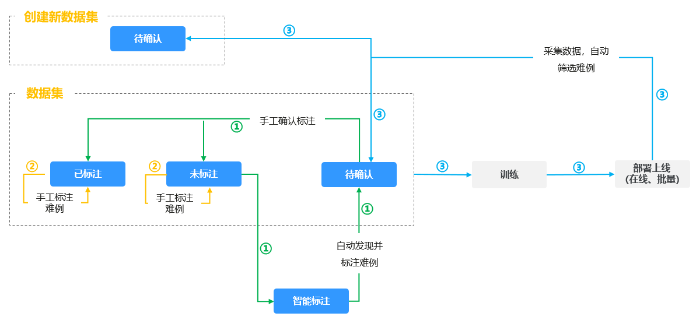
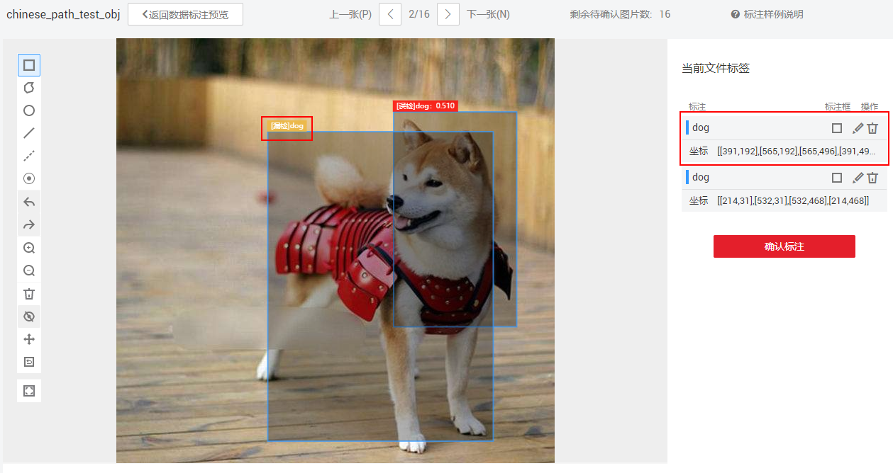
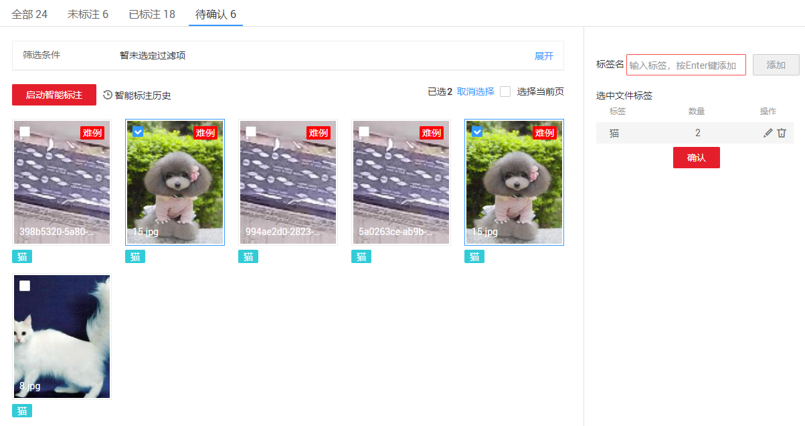
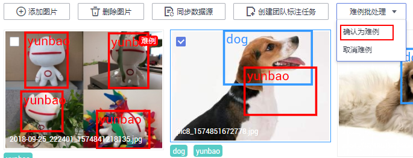

# 难例确认

在数据量很大的标注任务中，标注初期由于已标注图片不足，智能标注的结果无法直接用于训练。若对所有的未标注数据一一进行调整确认仍然需要较大的人力和时间成本。为了更快地完成标注任务，在对未标注数据进行智能标注的任务中，Modelarts嵌入了自动难例发现功能。该功能会对剩余未标注图片的标注优先级给出建议。因为标注优先级高的图片的智能标注结果未达到预期，所以称之为难例。

ModelArts平台提供的自动难例发现功能，在智能标注以及数据采集筛选过程中，将自动标注出难例，建议对难例数据进一步确认标注，然后将其加入训练数据集中，使用此数据集训练模型，可得到精度更高的模型。首先，针对智能标注和采集筛选任务，难例的发现操作是系统自动执行的，无需人工介入，仅需针对标注后的数据进行确认和修改即可，提升数据管理和标注效率。其次，您可以基于难例的情况，补充类似数据，提升数据集的丰富性，进一步提升模型训练的精度。

在数据集管理中，对难例的管理有如下三种场景，如[图1](#zh-cn_topic_0217235047_fig186822108396)所示。

-   [智能标注后，确认难例](#zh-cn_topic_0217235047_section12530766412)
-   [将数据集中的数据标注为难例](#zh-cn_topic_0217235047_section176081753173911)
-   [查看数据采集的难例](#zh-cn_topic_0217235047_section1770219494193)

**图 1**  数据集中的难例  

> **说明：** 
>目前只有“图像分类”和“物体检测”类型的数据集支持难例发现功能。

## 智能标注后，确认难例

“智能标注”任务执行过程中，ModelArts将自动识别难例，并完成标注。当智能标注结束后，难例标注结果将呈现在“待确认”页签，建议您对难例数据进行人工修正，然后确认标注。

1.  登录ModelArts管理控制台，在左侧菜单栏中选择“数据管理\>数据标注“，进入“数据标注“管理页面。
2.  在标注作业列表中，选择“物体检测”或“图像分类”类型的标注作业，单击标注作业名称进入“标注作业详情“。
3.  在“标注作业详情页“，选择“标注\>待确认”页签，查看并确认难例。

    > **说明：** 
    >只有当智能标注任务完成后，待确认页签才会显示标注数据。否则，此页签内容为空。智能标注操作请参见[智能标注](智能标注.md)。

    -   针对“物体检测”标注作业

        在“待确认“页签中，单击图片展开标注详情，查看图片数据的标注情况，如标签是否准确、目标框位置添加是否准确。如果智能标注结果不准确，建议手工调整标签或目标框，然后单击“确认标注“。完成确认后，重新标注的数据将呈现在“已标注”页签下。

        如[图2](#zh-cn_topic_0217235047_fig1391884005315)所示的难例，dog标签的目标框位置不准确，使用标注框重新标注，如图中的“漏检”目标框，然后需要将原先标注错误的目标框删除，即“误检”标签框。手工调整后，单击“确认标注“完成难例确认。

        **图 2**  物体检测的难例确认  
        

    -   针对“图像分类”标注作业

        在“待确认“页签中，查看标注难例的图片，其添加的标签是否准确。勾选标注不准确的图片，删除错误标签，然后在右侧“标签名“处添加准确标签。单击“确认“，勾选的图片及其标注情况，将呈现在“已标注”页签下。

        如[图3](#zh-cn_topic_0217235047_fig1952118181968)所示，选中的图片为标注错误图片，在右侧删除错误标签，然后在标签名处添加“狗”的标签，然后单击“确认“，完成难例确认。

        **图 3**  图像分类的难例确认  
        

## 将数据集中的数据标注为难例

针对标注作业中，已标注或未标注数据，也可以将图片数据标注为难例。标注为难例的数据，对后续模型训练中，通过内置规则提升模型精度。

1.  登录ModelArts管理控制台，在左侧菜单栏中选择“数据管理\>数据标注“，进入“数据标注“管理页面。
2.  在标注作业列表中，选择“物体检测”或“图像分类”类型的标注作业，单击数据集名称进入“标注作业详情页“。
3.  在标注作业详情页，选择“标注”页签”，单击“已标注“、“未标注“或“全部“页签，勾选需标注为难例的图片，然后单击“难例批处理 \> 确认为难例“。完成标注后，图片预览时，其右上角将显示为“难例”。

    **图 4**  确认为难例  
    

## 查看数据采集的难例

针对在线服务或批量服务，您可以创建数据采集和筛选任务，根据您设置的规则，针对采集的数据，系统将自动发现其中的难例，并存储至对应的数据集中。详细配置说明和操作请参见[采集数据](https://support.huaweicloud.com/engineers-modelarts/modelarts_23_0224.html)（在线服务）和[采集数据](https://support.huaweicloud.com/engineers-modelarts/modelarts_23_0225.html)（批量服务）。

1.  登录ModelArts管理控制台，在左侧菜单栏中选择“数据管理\>数据集“，进入“数据集“管理页面。
2.  在数据集列表中，选择采集数据任务中指定的数据集，单击数据集名称进入“数据集概览页“。
3.  在“数据集概览页“，单击右上角“开始标注“，进入数据集详情页。
4.  在数据集详情页，单击“待确认“页签，查看并确认难例。
    -   针对已标注为难例的数据，您可以手工修改其标注信息，然后确认标注。针对两种类型的数据集，难例确认的详细操作请参见步骤[•智能标注后，确认难例](#zh-cn_topic_0217235047_li3477120144213)。
    -   针对难例数据，您可以在此数据集中补充相似数据，在下一次模型训练时，进一步提升模型的精度。

