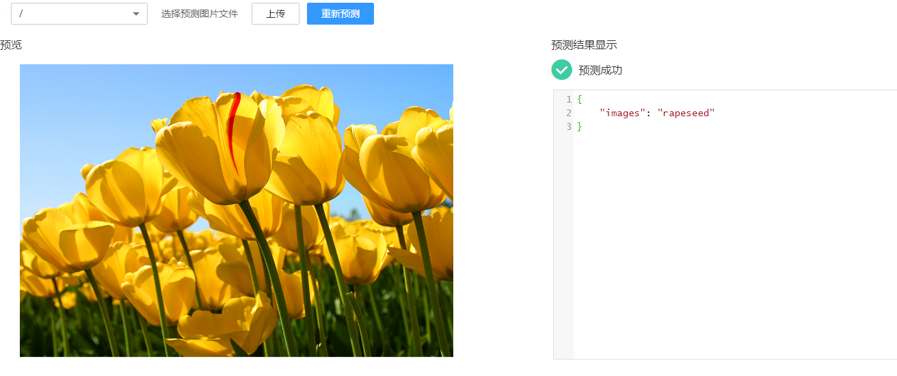
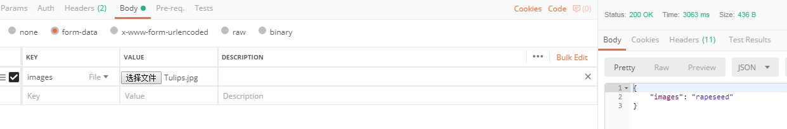

# 预置图像处理模式

## 输入

系统预置图像处理输入输出模式，适用于图像分类的模型，使用该模式的模型将被标识为图像分类模型。预测请求路径“/“，请求协议为“HTTPS“，请求方法为“POST“，调用方需采用“multipart/form-data“内容类型，以“key“为“images“，“type“为“file“的格式输入待处理图片。选择该模式时需确保您的模型能处理key为images的输入数据。

## 输出

推理结果以“JSON“体的形式返回，“JSON“的具体字段由模型决定。

## 请求样例

该模式下的推理方式均为输入一张待处理图片，响应的“JSON“根据模型改变而改变。示例如下：

-   页面预测

    **图 1**  在界面中直接预测  
    

-   Postman调REST接口预测

    部署上线成功后，您可以从服务详情页的调用指南中获取预测接口地址。选择“Body“设置请求体，“key“选择为“images“，选择为“File“类型，接着通过选择文件按钮选择需要处理的图片，最后单击“send“，发送您的预测请求。

    **图 2**  调用REST接口  
    

