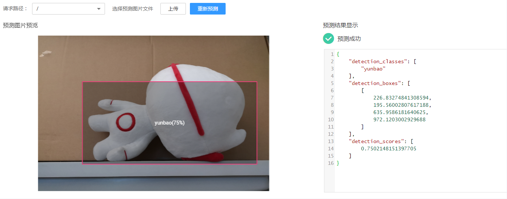
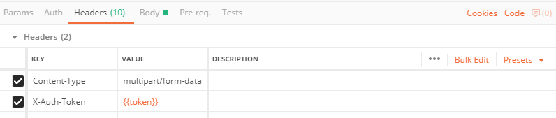
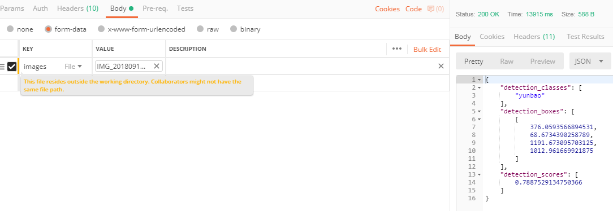

# 预置物体检测模式<a name="modelarts_23_0100"></a>

## 输入<a name="section1172594215425"></a>

系统预置物体检测输入输出模式，适用于物体检测的模型，使用该模式的模型被标识为物体检测模型。预测请求路径“/“，请求协议为“HTTP“，请求方法为“POST“，调用方需采用“multipart/form-data“内容类型，以“key“为“images“，“type“为“file“的格式输入待处理图片。选择该模式时需确保您的模型能处理key为images的输入数据。

## 输出<a name="section54355451423"></a>

推理结果以“JSON“体的形式返回，具体字段请参见[表1](#table101531747125712)。

**表 1**  参数说明

<a name="table101531747125712"></a>
<table><thead align="left"><tr id="row1015314475579"><th class="cellrowborder" valign="top" width="33.33333333333333%" id="mcps1.2.4.1.1"><p id="p1415494795715"><a name="p1415494795715"></a><a name="p1415494795715"></a>字段名</p>
</th>
<th class="cellrowborder" valign="top" width="27.47274727472747%" id="mcps1.2.4.1.2"><p id="p18154124711577"><a name="p18154124711577"></a><a name="p18154124711577"></a>类型</p>
</th>
<th class="cellrowborder" valign="top" width="39.1939193919392%" id="mcps1.2.4.1.3"><p id="p17154114755714"><a name="p17154114755714"></a><a name="p17154114755714"></a>描述</p>
</th>
</tr>
</thead>
<tbody><tr id="row61541247175711"><td class="cellrowborder" valign="top" width="33.33333333333333%" headers="mcps1.2.4.1.1 "><p id="p115434715573"><a name="p115434715573"></a><a name="p115434715573"></a>detection_classes</p>
</td>
<td class="cellrowborder" valign="top" width="27.47274727472747%" headers="mcps1.2.4.1.2 "><p id="p715417479575"><a name="p715417479575"></a><a name="p715417479575"></a>字符串数组</p>
</td>
<td class="cellrowborder" valign="top" width="39.1939193919392%" headers="mcps1.2.4.1.3 "><p id="p115414715573"><a name="p115414715573"></a><a name="p115414715573"></a>输出物体的检测类别列表，如["yunbao","cat"]</p>
</td>
</tr>
<tr id="row12154154718574"><td class="cellrowborder" valign="top" width="33.33333333333333%" headers="mcps1.2.4.1.1 "><p id="p215444715720"><a name="p215444715720"></a><a name="p215444715720"></a>detection_boxes</p>
</td>
<td class="cellrowborder" valign="top" width="27.47274727472747%" headers="mcps1.2.4.1.2 "><p id="p6154847165719"><a name="p6154847165719"></a><a name="p6154847165719"></a>数组，元素为浮点数数组</p>
</td>
<td class="cellrowborder" valign="top" width="39.1939193919392%" headers="mcps1.2.4.1.3 "><p id="p161547473571"><a name="p161547473571"></a><a name="p161547473571"></a>输出物体的检测框坐标列表，坐标表示为[<a name="image1319141631616"></a><a name="image1319141631616"></a><span></span>,<a name="image15861353162"></a><a name="image15861353162"></a><span></span>,<a name="image042765901615"></a><a name="image042765901615"></a><span></span>,<a name="image12168171120172"></a><a name="image12168171120172"></a><span></span>]</p>
</td>
</tr>
<tr id="row11154114710576"><td class="cellrowborder" valign="top" width="33.33333333333333%" headers="mcps1.2.4.1.1 "><p id="p115411471576"><a name="p115411471576"></a><a name="p115411471576"></a>detection_scores</p>
</td>
<td class="cellrowborder" valign="top" width="27.47274727472747%" headers="mcps1.2.4.1.2 "><p id="p123715583612"><a name="p123715583612"></a><a name="p123715583612"></a>浮点数数组</p>
</td>
<td class="cellrowborder" valign="top" width="39.1939193919392%" headers="mcps1.2.4.1.3 "><p id="p1815464717573"><a name="p1815464717573"></a><a name="p1815464717573"></a>输出每种检测列表的置信度，用来衡量识别的准确度。</p>
</td>
</tr>
</tbody>
</table>

推理结果的“JSON Schema“表示如下：

```
{
	"type": "object",
	"properties": {
		"detection_classes": {
			"items": {
				"type": "string"
			},
			"type": "array"
		},
		"detection_boxes": {
			"items": {
				"minItems": 4,
				"items": {
					"type": "number"
				},
				"type": "array",
				"maxItems": 4
			},
			"type": "array"
		},
		"detection_scores": {
			"items": {
				"type": "string"
			},
			"type": "array"
		}
	}
}
```

## 请求样例<a name="section1459434854217"></a>

该模式下的推理方式均为输入一张待处理图片，推理结果以“JSON“格式返回。示例如下：

-   页面预测

    在服务详情的“预测“页签，上传需要检测的图片，单击“预测“即可获取检测结果。

    **图 1**  页面预测<a name="fig6883142116238"></a>  
    

-   Postman调REST接口预测

    部署上线成功后，您可以从服务详情页的调用指南中获取预测接口地址，预测步骤如下：

    -   选择“Headers“设置请求头部，“Content-Type“的值设为“multipart/form-data“，“X-Auth-Token“的值设为用户实际获取的token值。

        **图 2**  设置请求头部<a name="fig196641035192710"></a>  
        

    -   选择“Body“设置请求体，“key“选择为“images“，选择为“File“类型，接着通过选择文件按钮选择需要处理的图片，最后单击“send“，发送您的预测请求。

        **图 3**  设置请求体<a name="fig87811148281"></a>  
        


