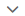
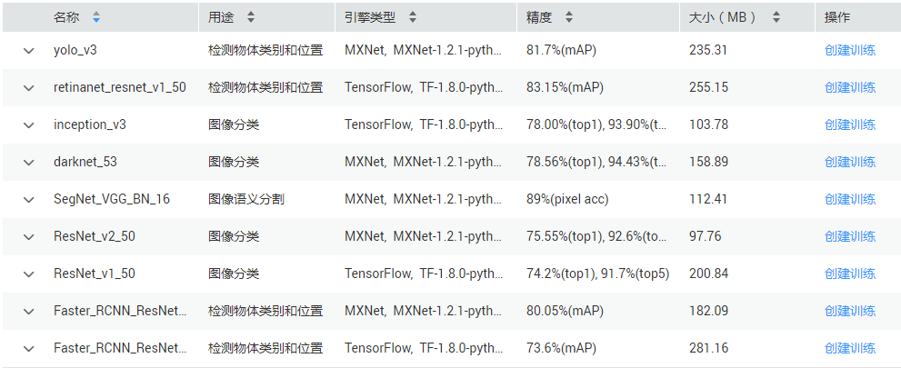

# 预置算法简介

ModelArts基于业界常用的AI引擎，提供了常见用途的算法，并预置在系统中。您可以不关注模型开发，直接选择此算法用于训练作业即可。

目前，ModelArts提供的预置算法主要是基于MXNet和TensorFlow两种引擎，其用途主要覆盖检测物体类别和位置、图像分类、图像语义分割、强化学习的场景。

## 查看预置算法

在ModelArts管理控制台，选择“训练作业“，然后单击“预置算法“页签，进入预置算法列表页面。在预置算法列表中，您可以单击算法名称前的，查看该算法的详情。

另外，您还可以在算法的“操作“列，单击“创建训练“，快速创建一个训练作业，将此算法用于训练作业中的“算法来源“。

> **说明：**   
>使用预置算法创建训练前，需准备好训练数据并上传至OBS，数据存储路径及数据格式要求请参见[对数据集的要求](对数据集的要求.md)。  

**图 1**  预置算法列表  

预置算法的详细介绍及其运行参数说明请参见：

-   [yolo\_v3](算法介绍及其运行参数说明.md#section927534914236)
-   [retinanet\_resnet\_v1\_50](算法介绍及其运行参数说明.md#section14756183063012)
-   [inception\_v3](算法介绍及其运行参数说明.md#section8882739173020)
-   [darknet\_53](算法介绍及其运行参数说明.md#section1371034453015)
-   [SegNet\_VGG\_BN\_16](算法介绍及其运行参数说明.md#section1411685323014)
-   [ResNet\_v2\_50](算法介绍及其运行参数说明.md#section1422116595303)
-   [ResNet\_v1\_50](算法介绍及其运行参数说明.md#section175188416313)
-   [Faster\_RCNN\_ResNet\_v2\_101](算法介绍及其运行参数说明.md#section184719918316)
-   [Faster\_RCNN\_ResNet\_v1\_50](算法介绍及其运行参数说明.md#section1794118221311)
-   [caffe\_mobilenet\_yolov3](算法介绍及其运行参数说明.md#section48061108562)
-   [caffe\_resnet\_v2\_50](算法介绍及其运行参数说明.md#section174621375567)

