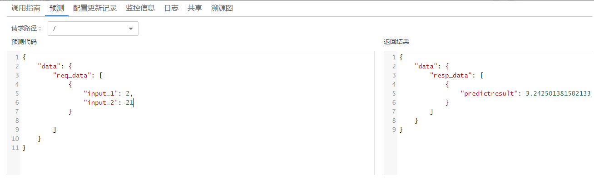

# 预置预测分析模式<a name="modelarts_23_0102"></a>

## 输入<a name="section1172594215425"></a>

系统预置预测分析输入输出模式，适用于预测分析的模型，使用该模式的模型将被标识为预测分析模型。预测请求路径“/“，请求协议为“HTTP“，请求方法为“POST“，调用方需采用“application/json“内容类型，发送预测请求，请求体以“JSON“格式表示，“JSON“字段说明请参见[表1](#table101531747125712)。选择该模式时需确保您的模型能处理符合该输入“JSON Schema“格式的输入数据格。

**表 1**  JSON字段说明

<a name="table101531747125712"></a>
<table><thead align="left"><tr id="row1015314475579"><th class="cellrowborder" valign="top" width="25.842584258425845%" id="mcps1.2.4.1.1"><p id="p1415494795715"><a name="p1415494795715"></a><a name="p1415494795715"></a>字段名</p>
</th>
<th class="cellrowborder" valign="top" width="21.3021302130213%" id="mcps1.2.4.1.2"><p id="p18154124711577"><a name="p18154124711577"></a><a name="p18154124711577"></a>类型</p>
</th>
<th class="cellrowborder" valign="top" width="52.855285528552855%" id="mcps1.2.4.1.3"><p id="p17154114755714"><a name="p17154114755714"></a><a name="p17154114755714"></a>描述</p>
</th>
</tr>
</thead>
<tbody><tr id="row61541247175711"><td class="cellrowborder" valign="top" width="25.842584258425845%" headers="mcps1.2.4.1.1 "><p id="p115434715573"><a name="p115434715573"></a><a name="p115434715573"></a>data</p>
</td>
<td class="cellrowborder" valign="top" width="21.3021302130213%" headers="mcps1.2.4.1.2 "><p id="p715417479575"><a name="p715417479575"></a><a name="p715417479575"></a>Data结构</p>
</td>
<td class="cellrowborder" valign="top" width="52.855285528552855%" headers="mcps1.2.4.1.3 "><p id="p115414715573"><a name="p115414715573"></a><a name="p115414715573"></a>包含预测数据。<span class="parmname" id="parmname2019884494312"><a name="parmname2019884494312"></a><a name="parmname2019884494312"></a>“Data结构”</span>说明请参见<a href="#table159187574436">表2</a>。</p>
</td>
</tr>
</tbody>
</table>

**表 2**  Data结构说明

<a name="table159187574436"></a>
<table><thead align="left"><tr id="row392214578437"><th class="cellrowborder" valign="top" width="25.842584258425845%" id="mcps1.2.4.1.1"><p id="p7922185744312"><a name="p7922185744312"></a><a name="p7922185744312"></a>字段名</p>
</th>
<th class="cellrowborder" valign="top" width="23.632363236323634%" id="mcps1.2.4.1.2"><p id="p1292235711439"><a name="p1292235711439"></a><a name="p1292235711439"></a>类型</p>
</th>
<th class="cellrowborder" valign="top" width="50.52505250525052%" id="mcps1.2.4.1.3"><p id="p10922105719438"><a name="p10922105719438"></a><a name="p10922105719438"></a>描述</p>
</th>
</tr>
</thead>
<tbody><tr id="row492265711438"><td class="cellrowborder" valign="top" width="25.842584258425845%" headers="mcps1.2.4.1.1 "><p id="p63851610164419"><a name="p63851610164419"></a><a name="p63851610164419"></a>req_data</p>
</td>
<td class="cellrowborder" valign="top" width="23.632363236323634%" headers="mcps1.2.4.1.2 "><p id="p2385210184412"><a name="p2385210184412"></a><a name="p2385210184412"></a>ReqData结构数组</p>
</td>
<td class="cellrowborder" valign="top" width="50.52505250525052%" headers="mcps1.2.4.1.3 "><p id="p6385910184416"><a name="p6385910184416"></a><a name="p6385910184416"></a>预测数据列表。</p>
</td>
</tr>
</tbody>
</table>

“ReqData“，是“Object“类型，表示预测数据，数据的具体组成结构由业务场景决定。使用该模式的模型，其自定义的推理代码中的预处理逻辑应能正确处理模式所定义的输入数据格式。

预测请求的“JSON Schema“表示如下：

```
{
	"type": "object",
	"properties": {
		"data": {
			"type": "object",
			"properties": {
				"req_data": {
					"items": [{
						"type": "object",
						"properties": {}
					}],
					"type": "array"
				}
			}
		}
	}
}
```

## 输出<a name="section54355451423"></a>

预测结果以“JSON“格式返回，“JSON“字段说明请参见[表3](#table49621346461)。

**表 3**  JSON字段说明

<a name="table49621346461"></a>
<table><thead align="left"><tr id="row0962123415461"><th class="cellrowborder" valign="top" width="25.842584258425845%" id="mcps1.2.4.1.1"><p id="p6962334114617"><a name="p6962334114617"></a><a name="p6962334114617"></a>字段名</p>
</th>
<th class="cellrowborder" valign="top" width="21.3021302130213%" id="mcps1.2.4.1.2"><p id="p49631434194610"><a name="p49631434194610"></a><a name="p49631434194610"></a>类型</p>
</th>
<th class="cellrowborder" valign="top" width="52.855285528552855%" id="mcps1.2.4.1.3"><p id="p896314349461"><a name="p896314349461"></a><a name="p896314349461"></a>描述</p>
</th>
</tr>
</thead>
<tbody><tr id="row59631534124618"><td class="cellrowborder" valign="top" width="25.842584258425845%" headers="mcps1.2.4.1.1 "><p id="p109631134184616"><a name="p109631134184616"></a><a name="p109631134184616"></a>data</p>
</td>
<td class="cellrowborder" valign="top" width="21.3021302130213%" headers="mcps1.2.4.1.2 "><p id="p396313418460"><a name="p396313418460"></a><a name="p396313418460"></a>Data结构</p>
</td>
<td class="cellrowborder" valign="top" width="52.855285528552855%" headers="mcps1.2.4.1.3 "><p id="p6963203444613"><a name="p6963203444613"></a><a name="p6963203444613"></a>包含预测数据。<span class="parmname" id="parmname15963153474616"><a name="parmname15963153474616"></a><a name="parmname15963153474616"></a>“Data结构”</span>说明请参见<a href="#table196311344469">表4</a>。</p>
</td>
</tr>
</tbody>
</table>

**表 4**  Data结构说明

<a name="table196311344469"></a>
<table><thead align="left"><tr id="row696419345466"><th class="cellrowborder" valign="top" width="25.842584258425845%" id="mcps1.2.4.1.1"><p id="p1996411349461"><a name="p1996411349461"></a><a name="p1996411349461"></a>字段名</p>
</th>
<th class="cellrowborder" valign="top" width="23.632363236323634%" id="mcps1.2.4.1.2"><p id="p196415344461"><a name="p196415344461"></a><a name="p196415344461"></a>类型</p>
</th>
<th class="cellrowborder" valign="top" width="50.52505250525052%" id="mcps1.2.4.1.3"><p id="p496483414610"><a name="p496483414610"></a><a name="p496483414610"></a>描述</p>
</th>
</tr>
</thead>
<tbody><tr id="row1196413419467"><td class="cellrowborder" valign="top" width="25.842584258425845%" headers="mcps1.2.4.1.1 "><p id="p65163384710"><a name="p65163384710"></a><a name="p65163384710"></a>resp_data</p>
</td>
<td class="cellrowborder" valign="top" width="23.632363236323634%" headers="mcps1.2.4.1.2 "><p id="p9593316476"><a name="p9593316476"></a><a name="p9593316476"></a>RespData结构数组</p>
</td>
<td class="cellrowborder" valign="top" width="50.52505250525052%" headers="mcps1.2.4.1.3 "><p id="p195163394719"><a name="p195163394719"></a><a name="p195163394719"></a>预测结果列表。</p>
</td>
</tr>
</tbody>
</table>

与“ReqData“一样，“RespData“也是“Object“类型，表示预测结果，其具体组成结构由业务场景决定。我们建议使用该模式的模型，其自定义的推理代码中的后处理逻辑应输出符合模式所定义的输出格式的数据。

预测结果的“JSON Schema“表示如下：

```
{
	"type": "object",
	"properties": {
		"data": {
			"type": "object",
			"properties": {
				"resp_data": {
					"type": "array",
					"items": [{
						"type": "object",
						"properties": {}
					}]
				}
			}
		}
	}
}
```

## 请求样例<a name="section1459434854217"></a>

该模式下的推理方式均为输入“JSON“格式的待预测数据，预测结果以“JSON“格式返回。示例如下：

-   页面预测

    在服务详情的“预测“页签，输入预测代码，单击“预测“即可获取检测结果。

    **图 1**  页面预测结果<a name="fig54791342154914"></a>  
    

-   Postman调REST接口预测

    部署上线成功后，您可以从服务详情页的调用指南中获取预测接口地址，预测步骤如下：

    -   选择“Headers“设置请求头部，“Content-Type“的值设为“application/json“，“X-Auth-Token“的值设为用户实际获取的token值。

        **图 2**  设置请求头部<a name="fig1238581875417"></a>  
        

    -   选择“Body“设置请求体，编辑需要预测的数据，最后单击“send“，发送您的预测请求。


