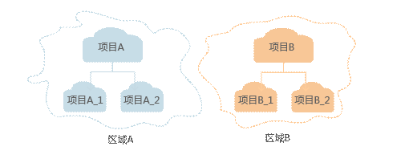

# 基本概念

-   帐号

    用户注册时的帐号，帐号对其所拥有的资源及云服务具有完全的访问权限，可以重置用户密码、分配用户权限等。由于帐号是付费主体，为了确保帐号安全，建议您不要直接使用帐号进行日常管理工作，而是创建IAM用户并使用他们进行日常管理工作。

-   IAM用户

    由帐号在IAM中创建的用户，是云服务的使用人员，具有身份凭证（密码和访问密钥）。

    在[我的凭证](https://console.huaweicloud.com/iam/?locale=zh-cn#/myCredential)下，您可以查看帐号ID和IAM用户ID。通常在调用API的鉴权过程中，您需要用到帐号、用户和密码等信息。

-   区域

    指云资源所在的物理位置，同一区域内可用区间内网互通，不同区域间内网不互通。通过在不同地区创建云资源，可以将应用程序设计的更接近特定客户的要求，或满足不同地区的法律或其他要求。

-   可用区

    一个可用区（AZ）是一个或多个物理数据中心的集合，有独立的风火水电，AZ内逻辑上再将计算、网络、存储等资源划分成多个集群。一个Region中的多个AZ间通过高速光纤相连，以满足用户跨AZ构建高可用性系统的需求。

-   项目

    区域默认对应一个项目，这个项目由系统预置，用来隔离物理区域间的资源（计算资源、存储资源和网络资源），以默认项目为单位进行授权，用户可以访问您帐号中该区域的所有资源。如果您希望进行更加精细的权限控制，可以在区域默认的项目中创建子项目，并在子项目中购买资源，然后以子项目为单位进行授权，使得用户仅能访问特定子项目中资源，使得资源的权限控制更加精确。

    同样在[我的凭证](https://console.huaweicloud.com/iam/?locale=zh-cn#/myCredential)下，您可以查看项目ID。

    **图 1**  项目隔离模型  
    

-   企业项目

    企业项目是项目的升级版，针对企业不同项目间资源的分组和管理，是逻辑隔离。企业项目中可以包含多个区域的资源，且项目中的资源可以迁入迁出。

    关于企业项目ID的获取及企业项目特性的详细信息，请参见《[企业管理服务用户指南](https://support.huaweicloud.com/usermanual-em/em_am_0006.html)》。

