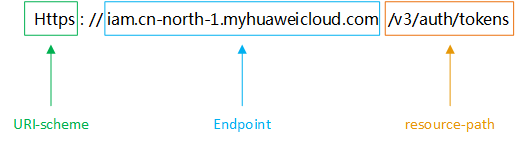

# 构造请求<a name="modelarts_03_0005"></a>

本节介绍REST API请求的组成，并以调用IAM服务的[获取用户Token](https://support.huaweicloud.com/zh-cn/api-iam/iam_30_0001.html)接口说明如何调用API，Token可以用于调用其他API时的鉴权。

您还可以通过这个视频教程了解如何构造请求调用API：[https://bbs.huaweicloud.com/videos/102987](https://bbs.huaweicloud.com/videos/102987)  。

## 请求URI<a name="zh-cn_topic_0170917207_zh-cn_topic_0168405763_section1849899574"></a>

请求URI由如下部分组成：

**\{URI-scheme\} :// \{**Endpoint**\} / \{resource-path\} ? \{query-string\}**

**表 1**  请求URI

<a name="zh-cn_topic_0170917207_zh-cn_topic_0168405763_table442645372610"></a>
<table><thead align="left"><tr id="zh-cn_topic_0170917207_zh-cn_topic_0168405763_row15427253182617"><th class="cellrowborder" valign="top" width="18.790000000000003%" id="mcps1.2.3.1.1"><p id="zh-cn_topic_0170917207_zh-cn_topic_0168405763_p24271253182614"><a name="zh-cn_topic_0170917207_zh-cn_topic_0168405763_p24271253182614"></a><a name="zh-cn_topic_0170917207_zh-cn_topic_0168405763_p24271253182614"></a>参数</p>
</th>
<th class="cellrowborder" valign="top" width="81.21000000000001%" id="mcps1.2.3.1.2"><p id="zh-cn_topic_0170917207_zh-cn_topic_0168405763_p19427155318264"><a name="zh-cn_topic_0170917207_zh-cn_topic_0168405763_p19427155318264"></a><a name="zh-cn_topic_0170917207_zh-cn_topic_0168405763_p19427155318264"></a>说明</p>
</th>
</tr>
</thead>
<tbody><tr id="zh-cn_topic_0170917207_zh-cn_topic_0168405763_row104278530268"><td class="cellrowborder" valign="top" width="18.790000000000003%" headers="mcps1.2.3.1.1 "><p id="zh-cn_topic_0170917207_zh-cn_topic_0168405763_p44271053122619"><a name="zh-cn_topic_0170917207_zh-cn_topic_0168405763_p44271053122619"></a><a name="zh-cn_topic_0170917207_zh-cn_topic_0168405763_p44271053122619"></a>URI-scheme</p>
</td>
<td class="cellrowborder" valign="top" width="81.21000000000001%" headers="mcps1.2.3.1.2 "><p id="zh-cn_topic_0170917207_zh-cn_topic_0168405763_p11427453192617"><a name="zh-cn_topic_0170917207_zh-cn_topic_0168405763_p11427453192617"></a><a name="zh-cn_topic_0170917207_zh-cn_topic_0168405763_p11427453192617"></a>传输请求的协议，当前所有API均采用<strong id="zh-cn_topic_0170917207_zh-cn_topic_0168405763_b1626664512275"><a name="zh-cn_topic_0170917207_zh-cn_topic_0168405763_b1626664512275"></a><a name="zh-cn_topic_0170917207_zh-cn_topic_0168405763_b1626664512275"></a>HTTPS</strong>协议。</p>
</td>
</tr>
<tr id="zh-cn_topic_0170917207_zh-cn_topic_0168405763_row1142745318267"><td class="cellrowborder" valign="top" width="18.790000000000003%" headers="mcps1.2.3.1.1 "><p id="zh-cn_topic_0170917207_zh-cn_topic_0168405763_p1342765311266"><a name="zh-cn_topic_0170917207_zh-cn_topic_0168405763_p1342765311266"></a><a name="zh-cn_topic_0170917207_zh-cn_topic_0168405763_p1342765311266"></a>Endpoint</p>
</td>
<td class="cellrowborder" valign="top" width="81.21000000000001%" headers="mcps1.2.3.1.2 "><p id="p992044614557"><a name="p992044614557"></a><a name="p992044614557"></a>承载REST服务端点的服务器域名或IP，不同服务在不同区域时，对应Endpoint不同，可以从<a href="终端节点.md">终端节点</a>中获取。</p>
<p id="zh-cn_topic_0170917207_zh-cn_topic_0168405763_p64278534269"><a name="zh-cn_topic_0170917207_zh-cn_topic_0168405763_p64278534269"></a><a name="zh-cn_topic_0170917207_zh-cn_topic_0168405763_p64278534269"></a>例如IAM服务在<span class="parmname" id="zh-cn_topic_0170917207_zh-cn_topic_0168405763_parmname161691327202815"><a name="zh-cn_topic_0170917207_zh-cn_topic_0168405763_parmname161691327202815"></a><a name="zh-cn_topic_0170917207_zh-cn_topic_0168405763_parmname161691327202815"></a>“华北-北京一”</span>区域的Endpoint为<span class="parmname" id="zh-cn_topic_0170917207_zh-cn_topic_0168405763_parmname6169162762813"><a name="zh-cn_topic_0170917207_zh-cn_topic_0168405763_parmname6169162762813"></a><a name="zh-cn_topic_0170917207_zh-cn_topic_0168405763_parmname6169162762813"></a>“iam.cn-north-1.myhuaweicloud.com”</span>。</p>
</td>
</tr>
<tr id="zh-cn_topic_0170917207_zh-cn_topic_0168405763_row94271453112615"><td class="cellrowborder" valign="top" width="18.790000000000003%" headers="mcps1.2.3.1.1 "><p id="zh-cn_topic_0170917207_zh-cn_topic_0168405763_p144271753182618"><a name="zh-cn_topic_0170917207_zh-cn_topic_0168405763_p144271753182618"></a><a name="zh-cn_topic_0170917207_zh-cn_topic_0168405763_p144271753182618"></a>resource-path</p>
</td>
<td class="cellrowborder" valign="top" width="81.21000000000001%" headers="mcps1.2.3.1.2 "><p id="zh-cn_topic_0170917207_zh-cn_topic_0168405763_p4427953122617"><a name="zh-cn_topic_0170917207_zh-cn_topic_0168405763_p4427953122617"></a><a name="zh-cn_topic_0170917207_zh-cn_topic_0168405763_p4427953122617"></a>资源路径，即API访问路径。从具体API的URI模块获取，例如<span class="parmname" id="zh-cn_topic_0170917207_zh-cn_topic_0168405763_parmname663013436287"><a name="zh-cn_topic_0170917207_zh-cn_topic_0168405763_parmname663013436287"></a><a name="zh-cn_topic_0170917207_zh-cn_topic_0168405763_parmname663013436287"></a>“获取用户Token”</span>API的resource-path为<span class="parmvalue" id="zh-cn_topic_0170917207_zh-cn_topic_0168405763_parmvalue176306433280"><a name="zh-cn_topic_0170917207_zh-cn_topic_0168405763_parmvalue176306433280"></a><a name="zh-cn_topic_0170917207_zh-cn_topic_0168405763_parmvalue176306433280"></a>“/v3/auth/tokens”</span>。</p>
</td>
</tr>
<tr id="zh-cn_topic_0170917207_zh-cn_topic_0168405763_row1991179192817"><td class="cellrowborder" valign="top" width="18.790000000000003%" headers="mcps1.2.3.1.1 "><p id="zh-cn_topic_0170917207_zh-cn_topic_0168405763_p1091217918289"><a name="zh-cn_topic_0170917207_zh-cn_topic_0168405763_p1091217918289"></a><a name="zh-cn_topic_0170917207_zh-cn_topic_0168405763_p1091217918289"></a>query-string</p>
</td>
<td class="cellrowborder" valign="top" width="81.21000000000001%" headers="mcps1.2.3.1.2 "><p id="zh-cn_topic_0170917207_zh-cn_topic_0168405763_p79121799283"><a name="zh-cn_topic_0170917207_zh-cn_topic_0168405763_p79121799283"></a><a name="zh-cn_topic_0170917207_zh-cn_topic_0168405763_p79121799283"></a>查询参数，可选，查询参数前面需要带一个<span class="parmname" id="zh-cn_topic_0170917207_zh-cn_topic_0168405763_parmname5182450132811"><a name="zh-cn_topic_0170917207_zh-cn_topic_0168405763_parmname5182450132811"></a><a name="zh-cn_topic_0170917207_zh-cn_topic_0168405763_parmname5182450132811"></a>“？”</span>，形式为<span class="parmname" id="zh-cn_topic_0170917207_zh-cn_topic_0168405763_parmname1718315019284"><a name="zh-cn_topic_0170917207_zh-cn_topic_0168405763_parmname1718315019284"></a><a name="zh-cn_topic_0170917207_zh-cn_topic_0168405763_parmname1718315019284"></a>“参数名=参数取值”</span>，例如<span class="parmname" id="zh-cn_topic_0170917207_zh-cn_topic_0168405763_parmname818314500282"><a name="zh-cn_topic_0170917207_zh-cn_topic_0168405763_parmname818314500282"></a><a name="zh-cn_topic_0170917207_zh-cn_topic_0168405763_parmname818314500282"></a>“limit=10”</span>，表示查询不超过10条数据。</p>
</td>
</tr>
</tbody>
</table>

例如您需要获取“华北-北京一“区域的Token，则需使用“华北-北京一“区域的Endpoint（iam.cn-north-1.myhuaweicloud.com），并在[获取用户Token](https://support.huaweicloud.com/zh-cn/api-iam/iam_30_0001.html)的URI部分找到resource-path（**/v3/auth/tokens**），拼接起来如下所示。

```
https://iam.cn-north-1.myhuaweicloud.com/v3/auth/tokens
```

**图 1**  URI示意图<a name="fig1083413311206"></a>  


> **说明：** 
>为查看方便，服务每个具体API的URI，只给出resource-path部分，并将请求方法写在一起。这是因为URI-scheme都是HTTPS，而Endpoint在同一个区域也相同，所以简洁起见将这两部分省略。

## 请求方法<a name="zh-cn_topic_0170917207_zh-cn_topic_0168405763_section580035055419"></a>

HTTP请求方法（也称为操作或动词），它告诉服务你正在请求什么类型的操作。

**表 2**  HTTP方法

<a name="zh-cn_topic_0113746487_table1961229113819"></a>
<table><thead align="left"><tr id="zh-cn_topic_0113746487_row86141913816"><th class="cellrowborder" valign="top" width="30%" id="mcps1.2.3.1.1"><p id="zh-cn_topic_0113746487_p186147910387"><a name="zh-cn_topic_0113746487_p186147910387"></a><a name="zh-cn_topic_0113746487_p186147910387"></a><strong id="zh-cn_topic_0113746487_b1093312238395"><a name="zh-cn_topic_0113746487_b1093312238395"></a><a name="zh-cn_topic_0113746487_b1093312238395"></a>方法</strong></p>
</th>
<th class="cellrowborder" valign="top" width="70%" id="mcps1.2.3.1.2"><p id="zh-cn_topic_0113746487_p166141293387"><a name="zh-cn_topic_0113746487_p166141293387"></a><a name="zh-cn_topic_0113746487_p166141293387"></a><strong id="zh-cn_topic_0113746487_b169341023133919"><a name="zh-cn_topic_0113746487_b169341023133919"></a><a name="zh-cn_topic_0113746487_b169341023133919"></a>说明</strong></p>
</th>
</tr>
</thead>
<tbody><tr id="zh-cn_topic_0113746487_row146141194381"><td class="cellrowborder" valign="top" width="30%" headers="mcps1.2.3.1.1 "><p id="zh-cn_topic_0113746487_p12831539123914"><a name="zh-cn_topic_0113746487_p12831539123914"></a><a name="zh-cn_topic_0113746487_p12831539123914"></a>GET</p>
</td>
<td class="cellrowborder" valign="top" width="70%" headers="mcps1.2.3.1.2 "><p id="zh-cn_topic_0113746487_p2831123916397"><a name="zh-cn_topic_0113746487_p2831123916397"></a><a name="zh-cn_topic_0113746487_p2831123916397"></a>请求服务器返回指定资源。</p>
</td>
</tr>
<tr id="zh-cn_topic_0113746487_row161429103817"><td class="cellrowborder" valign="top" width="30%" headers="mcps1.2.3.1.1 "><p id="zh-cn_topic_0113746487_p3831239183912"><a name="zh-cn_topic_0113746487_p3831239183912"></a><a name="zh-cn_topic_0113746487_p3831239183912"></a>PUT</p>
</td>
<td class="cellrowborder" valign="top" width="70%" headers="mcps1.2.3.1.2 "><p id="zh-cn_topic_0113746487_p178311939193911"><a name="zh-cn_topic_0113746487_p178311939193911"></a><a name="zh-cn_topic_0113746487_p178311939193911"></a>请求服务器更新指定资源。</p>
</td>
</tr>
<tr id="zh-cn_topic_0113746487_row56141190384"><td class="cellrowborder" valign="top" width="30%" headers="mcps1.2.3.1.1 "><p id="zh-cn_topic_0113746487_p68311239113912"><a name="zh-cn_topic_0113746487_p68311239113912"></a><a name="zh-cn_topic_0113746487_p68311239113912"></a>POST</p>
</td>
<td class="cellrowborder" valign="top" width="70%" headers="mcps1.2.3.1.2 "><p id="zh-cn_topic_0113746487_p1583133918391"><a name="zh-cn_topic_0113746487_p1583133918391"></a><a name="zh-cn_topic_0113746487_p1583133918391"></a>请求服务器新增资源或执行特殊操作。</p>
</td>
</tr>
<tr id="zh-cn_topic_0113746487_row861411903812"><td class="cellrowborder" valign="top" width="30%" headers="mcps1.2.3.1.1 "><p id="zh-cn_topic_0113746487_p1183153943916"><a name="zh-cn_topic_0113746487_p1183153943916"></a><a name="zh-cn_topic_0113746487_p1183153943916"></a>DELETE</p>
</td>
<td class="cellrowborder" valign="top" width="70%" headers="mcps1.2.3.1.2 "><p id="zh-cn_topic_0113746487_p6831163914392"><a name="zh-cn_topic_0113746487_p6831163914392"></a><a name="zh-cn_topic_0113746487_p6831163914392"></a>请求服务器删除指定资源，如删除对象等。</p>
</td>
</tr>
<tr id="zh-cn_topic_0113746487_row5614119183810"><td class="cellrowborder" valign="top" width="30%" headers="mcps1.2.3.1.1 "><p id="zh-cn_topic_0113746487_p78314395393"><a name="zh-cn_topic_0113746487_p78314395393"></a><a name="zh-cn_topic_0113746487_p78314395393"></a>HEAD</p>
</td>
<td class="cellrowborder" valign="top" width="70%" headers="mcps1.2.3.1.2 "><p id="zh-cn_topic_0113746487_p38311239153920"><a name="zh-cn_topic_0113746487_p38311239153920"></a><a name="zh-cn_topic_0113746487_p38311239153920"></a>请求服务器资源头部。</p>
</td>
</tr>
<tr id="zh-cn_topic_0113746487_row2614199163812"><td class="cellrowborder" valign="top" width="30%" headers="mcps1.2.3.1.1 "><p id="zh-cn_topic_0113746487_p1483143915390"><a name="zh-cn_topic_0113746487_p1483143915390"></a><a name="zh-cn_topic_0113746487_p1483143915390"></a>PATCH</p>
</td>
<td class="cellrowborder" valign="top" width="70%" headers="mcps1.2.3.1.2 "><p id="zh-cn_topic_0113746487_p17831173918394"><a name="zh-cn_topic_0113746487_p17831173918394"></a><a name="zh-cn_topic_0113746487_p17831173918394"></a>请求服务器更新资源的部分内容。</p>
<p id="zh-cn_topic_0113746487_p9831123911390"><a name="zh-cn_topic_0113746487_p9831123911390"></a><a name="zh-cn_topic_0113746487_p9831123911390"></a>当资源不存在的时候，PATCH可能会去创建一个新的资源。</p>
</td>
</tr>
</tbody>
</table>

在[获取用户Token](https://support.huaweicloud.com/zh-cn/api-iam/iam_30_0001.html)的URI部分，您可以看到其请求方法为“POST“，则其请求为：

```
POST https://iam.cn-north-1.myhuaweicloud.com/v3/auth/tokens
```

## 请求消息头<a name="zh-cn_topic_0170917207_zh-cn_topic_0168405763_section1454211155819"></a>

附加请求头字段，如指定的URI和HTTP方法所要求的字段。例如定义消息体类型的请求头“Content-Type“，请求鉴权信息等。

需要添加到请求中的公共消息头如[表3](#table139019272562)所示。

**表 3**  公共请求消息头

<a name="table139019272562"></a>
<table><thead align="left"><tr id="zh-cn_topic_0106912064_row46150831"><th class="cellrowborder" valign="top" width="16.88%" id="mcps1.2.5.1.1"><p id="zh-cn_topic_0106912064_p47229853"><a name="zh-cn_topic_0106912064_p47229853"></a><a name="zh-cn_topic_0106912064_p47229853"></a>参数名</p>
</th>
<th class="cellrowborder" valign="top" width="33.12%" id="mcps1.2.5.1.2"><p id="zh-cn_topic_0106912064_p412859"><a name="zh-cn_topic_0106912064_p412859"></a><a name="zh-cn_topic_0106912064_p412859"></a>说明</p>
</th>
<th class="cellrowborder" valign="top" width="20%" id="mcps1.2.5.1.3"><p id="zh-cn_topic_0106912064_p33441585"><a name="zh-cn_topic_0106912064_p33441585"></a><a name="zh-cn_topic_0106912064_p33441585"></a>是否必选</p>
</th>
<th class="cellrowborder" valign="top" width="30%" id="mcps1.2.5.1.4"><p id="zh-cn_topic_0106912064_p24413864"><a name="zh-cn_topic_0106912064_p24413864"></a><a name="zh-cn_topic_0106912064_p24413864"></a>示例</p>
</th>
</tr>
</thead>
<tbody><tr id="zh-cn_topic_0106912064_row31365959"><td class="cellrowborder" valign="top" width="16.88%" headers="mcps1.2.5.1.1 "><p id="zh-cn_topic_0106912064_p57614775"><a name="zh-cn_topic_0106912064_p57614775"></a><a name="zh-cn_topic_0106912064_p57614775"></a>Content-type</p>
</td>
<td class="cellrowborder" valign="top" width="33.12%" headers="mcps1.2.5.1.2 "><p id="zh-cn_topic_0106912064_p36285216"><a name="zh-cn_topic_0106912064_p36285216"></a><a name="zh-cn_topic_0106912064_p36285216"></a>消息体的类型（格式），默认取值为<span class="parmvalue" id="parmvalue58263396120"><a name="parmvalue58263396120"></a><a name="parmvalue58263396120"></a>“application/json”</span>。</p>
</td>
<td class="cellrowborder" valign="top" width="20%" headers="mcps1.2.5.1.3 "><p id="zh-cn_topic_0106912064_p53421353"><a name="zh-cn_topic_0106912064_p53421353"></a><a name="zh-cn_topic_0106912064_p53421353"></a>是</p>
</td>
<td class="cellrowborder" valign="top" width="30%" headers="mcps1.2.5.1.4 "><p id="zh-cn_topic_0106912064_p32162298"><a name="zh-cn_topic_0106912064_p32162298"></a><a name="zh-cn_topic_0106912064_p32162298"></a>application/json</p>
</td>
</tr>
<tr id="zh-cn_topic_0106912064_row21025229"><td class="cellrowborder" valign="top" width="16.88%" headers="mcps1.2.5.1.1 "><p id="zh-cn_topic_0106912064_p25322014"><a name="zh-cn_topic_0106912064_p25322014"></a><a name="zh-cn_topic_0106912064_p25322014"></a>Content-Length</p>
</td>
<td class="cellrowborder" valign="top" width="33.12%" headers="mcps1.2.5.1.2 "><p id="zh-cn_topic_0106912064_p37817292"><a name="zh-cn_topic_0106912064_p37817292"></a><a name="zh-cn_topic_0106912064_p37817292"></a>请求body长度，单位为Byte。</p>
</td>
<td class="cellrowborder" valign="top" width="20%" headers="mcps1.2.5.1.3 "><p id="zh-cn_topic_0106912064_p43301822"><a name="zh-cn_topic_0106912064_p43301822"></a><a name="zh-cn_topic_0106912064_p43301822"></a>POST/PUT请求必填，GET不能包含。</p>
</td>
<td class="cellrowborder" valign="top" width="30%" headers="mcps1.2.5.1.4 "><p id="zh-cn_topic_0106912064_p17786717"><a name="zh-cn_topic_0106912064_p17786717"></a><a name="zh-cn_topic_0106912064_p17786717"></a>3495</p>
</td>
</tr>
<tr id="zh-cn_topic_0106912064_row25862728"><td class="cellrowborder" valign="top" width="16.88%" headers="mcps1.2.5.1.1 "><p id="zh-cn_topic_0106912064_p14506261"><a name="zh-cn_topic_0106912064_p14506261"></a><a name="zh-cn_topic_0106912064_p14506261"></a>X-Project-Id</p>
</td>
<td class="cellrowborder" valign="top" width="33.12%" headers="mcps1.2.5.1.2 "><p id="zh-cn_topic_0106912064_p34156482"><a name="zh-cn_topic_0106912064_p34156482"></a><a name="zh-cn_topic_0106912064_p34156482"></a>project id，用于不同project取token。</p>
</td>
<td class="cellrowborder" valign="top" width="20%" headers="mcps1.2.5.1.3 "><p id="zh-cn_topic_0106912064_p15211639"><a name="zh-cn_topic_0106912064_p15211639"></a><a name="zh-cn_topic_0106912064_p15211639"></a>否</p>
</td>
<td class="cellrowborder" valign="top" width="30%" headers="mcps1.2.5.1.4 "><p id="zh-cn_topic_0106912064_p24183261"><a name="zh-cn_topic_0106912064_p24183261"></a><a name="zh-cn_topic_0106912064_p24183261"></a>e9993fc787d94b6c886cbaa340f9c0f4</p>
</td>
</tr>
<tr id="zh-cn_topic_0106912064_row16322762"><td class="cellrowborder" valign="top" width="16.88%" headers="mcps1.2.5.1.1 "><p id="zh-cn_topic_0106912064_p47075323"><a name="zh-cn_topic_0106912064_p47075323"></a><a name="zh-cn_topic_0106912064_p47075323"></a>X-Auth-Token</p>
</td>
<td class="cellrowborder" valign="top" width="33.12%" headers="mcps1.2.5.1.2 "><p id="zh-cn_topic_0106912064_p55004850"><a name="zh-cn_topic_0106912064_p55004850"></a><a name="zh-cn_topic_0106912064_p55004850"></a>用户Token，也就是调用<a href="https://support.huaweicloud.com/zh-cn/api-iam/iam_30_0001.html" target="_blank" rel="noopener noreferrer">获取用户Token</a>接口的响应值，该接口是唯一不需要认证的接口。</p>
</td>
<td class="cellrowborder" valign="top" width="20%" headers="mcps1.2.5.1.3 "><p id="zh-cn_topic_0106912064_p26207828"><a name="zh-cn_topic_0106912064_p26207828"></a><a name="zh-cn_topic_0106912064_p26207828"></a>否，使用Token认证时必选。</p>
</td>
<td class="cellrowborder" valign="top" width="30%" headers="mcps1.2.5.1.4 "><p id="zh-cn_topic_0106912064_p46589738"><a name="zh-cn_topic_0106912064_p46589738"></a><a name="zh-cn_topic_0106912064_p46589738"></a>-</p>
</td>
</tr>
<tr id="zh-cn_topic_0106912064_row16654463"><td class="cellrowborder" valign="top" width="16.88%" headers="mcps1.2.5.1.1 "><p id="zh-cn_topic_0106912064_p6834263"><a name="zh-cn_topic_0106912064_p6834263"></a><a name="zh-cn_topic_0106912064_p6834263"></a>X-Sdk-Date</p>
</td>
<td class="cellrowborder" valign="top" width="33.12%" headers="mcps1.2.5.1.2 "><p id="zh-cn_topic_0106912064_p16704444"><a name="zh-cn_topic_0106912064_p16704444"></a><a name="zh-cn_topic_0106912064_p16704444"></a>请求的发生时间，格式为(YYYYMMDD'T'HHMMSS'Z')。</p>
<p id="zh-cn_topic_0106912064_p16122270"><a name="zh-cn_topic_0106912064_p16122270"></a><a name="zh-cn_topic_0106912064_p16122270"></a>取值为当前系统的GMT时间。</p>
</td>
<td class="cellrowborder" valign="top" width="20%" headers="mcps1.2.5.1.3 "><p id="zh-cn_topic_0106912064_p30835521"><a name="zh-cn_topic_0106912064_p30835521"></a><a name="zh-cn_topic_0106912064_p30835521"></a>否，如果使用AK/SK做接口认证的时候，那么此字段必须设置；如果使用PKI token的时候，不必设置。</p>
</td>
<td class="cellrowborder" valign="top" width="30%" headers="mcps1.2.5.1.4 "><p id="zh-cn_topic_0106912064_p64734405"><a name="zh-cn_topic_0106912064_p64734405"></a><a name="zh-cn_topic_0106912064_p64734405"></a>20190307T101459Z</p>
</td>
</tr>
<tr id="zh-cn_topic_0106912064_row45738735"><td class="cellrowborder" valign="top" width="16.88%" headers="mcps1.2.5.1.1 "><p id="zh-cn_topic_0106912064_p13850059"><a name="zh-cn_topic_0106912064_p13850059"></a><a name="zh-cn_topic_0106912064_p13850059"></a>Authorization</p>
</td>
<td class="cellrowborder" valign="top" width="33.12%" headers="mcps1.2.5.1.2 "><p id="zh-cn_topic_0106912064_p48112991"><a name="zh-cn_topic_0106912064_p48112991"></a><a name="zh-cn_topic_0106912064_p48112991"></a>签名认证信息。</p>
<p id="zh-cn_topic_0106912064_p30363742"><a name="zh-cn_topic_0106912064_p30363742"></a><a name="zh-cn_topic_0106912064_p30363742"></a>该值来源于请求签名结果，使用AK/SK进行加密签名的时候需要。</p>
<p id="zh-cn_topic_0106912064_p4838228"><a name="zh-cn_topic_0106912064_p4838228"></a><a name="zh-cn_topic_0106912064_p4838228"></a>类型：字符串</p>
<p id="zh-cn_topic_0106912064_p43544058"><a name="zh-cn_topic_0106912064_p43544058"></a><a name="zh-cn_topic_0106912064_p43544058"></a>默认值：无</p>
</td>
<td class="cellrowborder" valign="top" width="20%" headers="mcps1.2.5.1.3 "><p id="zh-cn_topic_0106912064_p10136448"><a name="zh-cn_topic_0106912064_p10136448"></a><a name="zh-cn_topic_0106912064_p10136448"></a>否，使用AK/SK认证时必选。</p>
</td>
<td class="cellrowborder" valign="top" width="30%" headers="mcps1.2.5.1.4 "><p id="zh-cn_topic_0106912064_p7496077"><a name="zh-cn_topic_0106912064_p7496077"></a><a name="zh-cn_topic_0106912064_p7496077"></a>SDK-HMAC-SHA256 Credential=ZIRRKMTWPTQFQI1WKNKB/20150907//ec2/sdk_request, SignedHeaders=content-type;host;x-sdk-date, Signature=55741b610f3c9fa3ae40b5a8021ebf7ebc2a28a603fc62d25cb3bfe6608e1994</p>
</td>
</tr>
<tr id="zh-cn_topic_0106912064_row355832"><td class="cellrowborder" valign="top" width="16.88%" headers="mcps1.2.5.1.1 "><p id="zh-cn_topic_0106912064_p28822435"><a name="zh-cn_topic_0106912064_p28822435"></a><a name="zh-cn_topic_0106912064_p28822435"></a>Host</p>
</td>
<td class="cellrowborder" valign="top" width="33.12%" headers="mcps1.2.5.1.2 "><p id="zh-cn_topic_0106912064_p81053717359"><a name="zh-cn_topic_0106912064_p81053717359"></a><a name="zh-cn_topic_0106912064_p81053717359"></a>请求的服务器信息，从服务API的URL中获取。</p>
<p id="zh-cn_topic_0106912064_p140124114357"><a name="zh-cn_topic_0106912064_p140124114357"></a><a name="zh-cn_topic_0106912064_p140124114357"></a>值为hostname[:port]。</p>
<p id="zh-cn_topic_0106912064_p52915874"><a name="zh-cn_topic_0106912064_p52915874"></a><a name="zh-cn_topic_0106912064_p52915874"></a>端口缺省时使用默认的端口，https的默认端口为443。</p>
</td>
<td class="cellrowborder" valign="top" width="20%" headers="mcps1.2.5.1.3 "><p id="zh-cn_topic_0106912064_p58327390"><a name="zh-cn_topic_0106912064_p58327390"></a><a name="zh-cn_topic_0106912064_p58327390"></a>否，使用AK/SK认证时必选。</p>
</td>
<td class="cellrowborder" valign="top" width="30%" headers="mcps1.2.5.1.4 "><p id="zh-cn_topic_0106912064_p40756399"><a name="zh-cn_topic_0106912064_p40756399"></a><a name="zh-cn_topic_0106912064_p40756399"></a>code.test.com</p>
<p id="zh-cn_topic_0106912064_p31263274"><a name="zh-cn_topic_0106912064_p31263274"></a><a name="zh-cn_topic_0106912064_p31263274"></a>or</p>
<p id="zh-cn_topic_0106912064_p12934017"><a name="zh-cn_topic_0106912064_p12934017"></a><a name="zh-cn_topic_0106912064_p12934017"></a>code.test.com:443</p>
</td>
</tr>
</tbody>
</table>

> **说明：** 
>API同时支持使用AK/SK认证，AK/SK认证是使用SDK对请求进行签名，签名过程会自动往请求中添加Authorization（签名认证信息）和X-Sdk-Date（请求发送的时间）请求头。AK/SK认证的详细说明请参见[API签名指南](https://support.huaweicloud.com/devg-apisign/api-sign-provide.html)。

对于[获取用户Token](https://support.huaweicloud.com/zh-cn/api-iam/iam_30_0001.html)接口，由于不需要认证，所以只添加“Content-Type“即可，添加消息头后的请求如下所示。

```
POST https://iam.cn-north-1.myhuaweicloud.com/v3/auth/tokens
Content-Type: application/json
```

## 请求消息体<a name="zh-cn_topic_0170917207_zh-cn_topic_0168405763_section14612192315587"></a>

请求消息体通常以结构化格式发出，与请求消息头中Content-type对应，传递除请求消息头之外的内容。若请求消息体中参数支持中文，则中文字符必须为UTF-8编码。

每个接口的请求消息体内容不同，也并不是每个接口都需要有请求消息体（或者说消息体为空），GET、DELETE操作类型的接口就不需要消息体，消息体具体内容需要根据具体接口而定。

对于[获取用户Token](https://support.huaweicloud.com/zh-cn/api-iam/iam_30_0001.html)接口，您可以从接口的请求部分看到所需的请求参数及参数说明。将消息体加入后的请求如下所示，加粗的斜体字段需要根据实际值填写，其中**_user\_name_**为用户名，**_domain\_name_**为用户所属的帐号名，**_user\_password_**为用户登录密码，**_cn-north-1_**为项目名称，获取方法请参见[获取用户名](获取用户名和用户ID.md)、[获取帐号名和帐号ID](获取帐号名和帐号ID.md)和[获取项目名称](获取项目ID和名称.md)。

> **说明：** 
>scope参数定义了Token的作用域，示例中获取的Token仅能访问project下的资源。Modelarts使用区域的Endpoint（非全局域名）调用该接口，推荐您将scope设置为project。您还可以设置Token作用域为某个帐号下所有资源或帐号的某个project下的资源，详细定义请参见[获取用户Token](https://support.huaweicloud.com/zh-cn/api-iam/iam_30_0001.html)。

```
POST https://iam.cn-north-1.myhuaweicloud.com/v3/auth/tokens
Content-Type:application/json
{
  "auth": {
    "identity": {
      "methods": ["password"],
      "password": {
        "user": {
          "name": "user_name", 
          "password": "user_password",
          "domain": {
            "name": "domain_name"  
          }
        }
      }
    },
    "scope": {
      "project": {
        "name": "cn-north-1"  
      }
    }
  }
}
```

到这里为止这个请求需要的内容就具备齐全了，您可以使用[curl](https://curl.haxx.se/)、[Postman](https://www.getpostman.com/)或直接编写代码等方式发送请求调用API。对于[获取用户Token](https://support.huaweicloud.com/zh-cn/api-iam/iam_30_0001.html)接口，返回的响应消息头中“x-subject-token“的值，就是需要获取的用户Token。有了Token之后，您就可以使用Token认证调用其他API。

