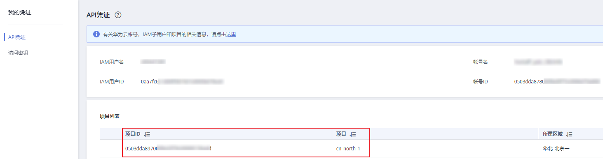

# 获取项目ID<a name="modelarts_03_0147"></a>

## 从控制台获取项目ID<a name="section1747620762418"></a>

在调用接口的时候，部分URL中需要填入项目编号，所以需要获取到项目编号。项目编号获取步骤如下：

1.  注册并登录管理控制台。
2.  鼠标移动至用户名，在下拉列表中单击“我的凭证“。
3.  在“API凭证“页面的项目列表中查看项目ID。

    **图 1**  查看项目ID<a name="fig398722612183"></a>  
    


多项目时，展开“所属区域“，从“项目ID“列获取子项目ID。

## 调用API获取项目ID<a name="section3926171216207"></a>

项目ID还用通过调用[查询指定条件下的项目信息](https://support.huaweicloud.com/api-iam/zh-cn_topic_0057845625.html)API获取。

获取项目ID的接口为GET“https://\{Endpoint\}/v3/projects/“，其中\{Endpoint\}为IAM的终端节点，可以从[地区和终端节点](https://developer.huaweicloud.com/endpoint?IAM)获取。接口的认证鉴权请参见认证鉴权章节。

响应示例如下，其中projects下的“id“即为项目ID。

```
{
	"projects": [{
		"domain_id": "65382450e8f64ac0870cd180d14e684b",
		"is_domain": false,
		"parent_id": "65382450e8f64ac0870cd180d14e684b",
		"name": "cn-north-4",
		"description": "",
		"links": {
			"next": null,
			"previous": null,
			"self": "https://www.example.com/v3/projects/a4a5d4098fb4474fa22cd05f897d6b99"
		},
		"id": "a4a5d4098fb4474fa22cd05f897d6b99",
		"enabled": true
	}],
	"links": {
		"next": null,
		"previous": null,
		"self": "https://www.example.com/v3/projects"
	}
}
```

