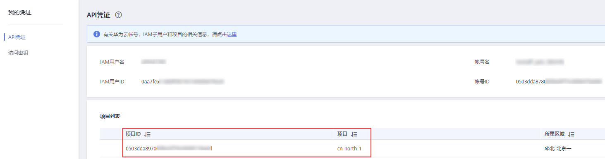

# 获取项目ID和名称<a name="modelarts_03_0147"></a>

## 操作场景<a name="section1887604518013"></a>

在调用接口的时候，部分请求中需要填入项目ID或项目名称，所以需要获取到项目ID和名称。有如下两种获取方式：

-   [从控制台获取项目ID和名称](#section1747620762418)
-   [调用API获取项目ID](#section3926171216207)

## 从控制台获取项目ID和名称<a name="section1747620762418"></a>

从控制台获取项目ID（project\_id）和名称（project name）的步骤如下：

1.  注册并登录管理ModelArts控制台。
2.  在页面右上角单击用户名，然后在下拉列表中单击“我的凭证“，进入“我的凭证”页面。

    > **说明：** 
    >如果您登录的是华为云官网，而非管理控制台。在单击用户名后，选择下拉列表中的“帐号中心“，然后单击“管理我的凭证“进入“我的凭证“页面。

3.  在“API凭证“页面的项目列表中查看项目ID和名称（即“项目“）。

    **图 1**  查看项目ID<a name="fig398722612183"></a>  
    

    多项目时，展开“所属区域“，从“项目ID“列获取子项目ID。


## 调用API获取项目ID<a name="section3926171216207"></a>

项目ID通过调用[查询指定条件下的项目信息](https://support.huaweicloud.com/api-iam/iam_06_0001.html)API获取。

获取项目ID的接口为**GET https://_\{iam-endpoint\}_/v3/projects**，其中\{iam-endpoint\}为IAM的终端节点，可以从[地区和终端节点](https://developer.huaweicloud.com/endpoint?IAM)处获取。

响应示例如下，例如ModelArts部署的区域为"cn-north-4"，响应消息体中查找“name”为"cn-north-4"，其中projects下的“id“即为项目ID。

```
{
	"projects": [{
		"domain_id": "65382450e8f64ac0870cd180d14e684b",
		"is_domain": false,
		"parent_id": "65382450e8f64ac0870cd180d14e684b",
		"name": "cn-north-4",
		"description": "",
		"links": {
			"next": null,
			"previous": null,
			"self": "https://www.example.com/v3/projects/a4a5d4098fb4474fa22cd05f897d6b99"
		},
		"id": "a4a5d4098fb4474fa22cd05f897d6b99",
		"enabled": true
	}],
	"links": {
		"next": null,
		"previous": null,
		"self": "https://www.example.com/v3/projects"
	}
}
```

