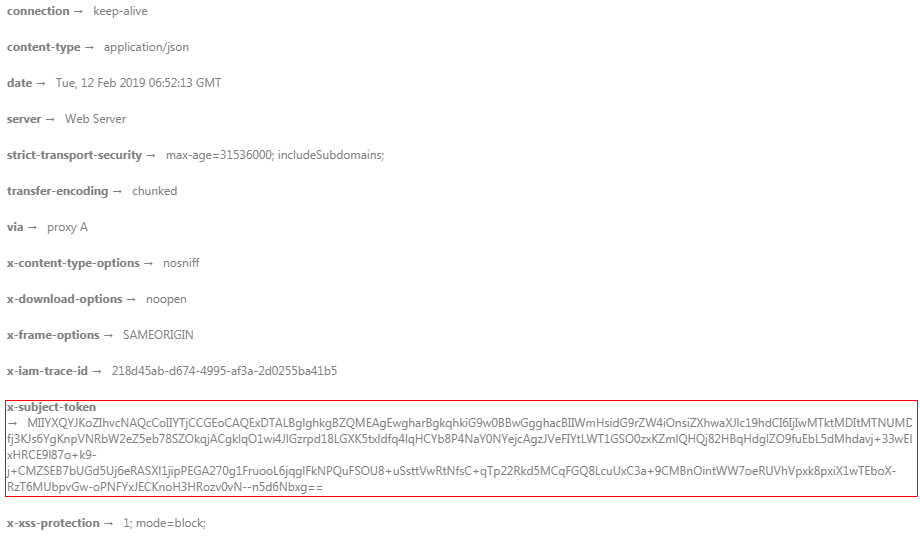

# 返回结果<a name="modelarts_03_0003"></a>

请求发送以后，您会收到响应，包含：状态码、响应消息头和响应消息体。

## 状态码<a name="zh-cn_topic_0170917209_zh-cn_topic_0168405765_section968114282311"></a>

状态码是一组从1xx到5xx的数字代码，状态码表示了请求响应的状态，完整的状态码列表请参见[状态码](状态码.md)。

对于[获取用户Token](https://support.huaweicloud.com/zh-cn/api-iam/zh-cn_topic_0057845583.html)接口，如果调用后返回状态码为“201“，则表示请求成功。

## 响应消息头<a name="zh-cn_topic_0170917209_zh-cn_topic_0168405765_section7804143005810"></a>

对应请求消息头，响应同样也有消息头，如“Content-type“。

**表 1**  公共响应消息头

<a name="table14216843"></a>
<table><thead align="left"><tr id="row62973985"><th class="cellrowborder" valign="top" width="21.43%" id="mcps1.2.4.1.1"><p id="p619185"><a name="p619185"></a><a name="p619185"></a>消息头名称</p>
</th>
<th class="cellrowborder" valign="top" width="59.18%" id="mcps1.2.4.1.2"><p id="p48733195"><a name="p48733195"></a><a name="p48733195"></a>描述</p>
</th>
<th class="cellrowborder" valign="top" width="19.39%" id="mcps1.2.4.1.3"><p id="p25910100"><a name="p25910100"></a><a name="p25910100"></a>是否必选</p>
</th>
</tr>
</thead>
<tbody><tr id="row30872424"><td class="cellrowborder" valign="top" width="21.43%" headers="mcps1.2.4.1.1 "><p id="p17638454"><a name="p17638454"></a><a name="p17638454"></a>Content-Type</p>
</td>
<td class="cellrowborder" valign="top" width="59.18%" headers="mcps1.2.4.1.2 "><p id="p8511342153715"><a name="p8511342153715"></a><a name="p8511342153715"></a>用于指明发送给接收者的实体正文的媒体类型。</p>
<p id="p19428680"><a name="p19428680"></a><a name="p19428680"></a>类型：字符串。</p>
<p id="p40640399"><a name="p40640399"></a><a name="p40640399"></a>默认值：application/json; charset=UTF-8</p>
</td>
<td class="cellrowborder" valign="top" width="19.39%" headers="mcps1.2.4.1.3 "><p id="p3537986"><a name="p3537986"></a><a name="p3537986"></a>是</p>
</td>
</tr>
<tr id="row31841882"><td class="cellrowborder" valign="top" width="21.43%" headers="mcps1.2.4.1.1 "><p id="p29055658"><a name="p29055658"></a><a name="p29055658"></a>X-request-id</p>
</td>
<td class="cellrowborder" valign="top" width="59.18%" headers="mcps1.2.4.1.2 "><p id="p1697874723710"><a name="p1697874723710"></a><a name="p1697874723710"></a>此字段携带请求ID号，以便任务跟踪。</p>
<p id="p1855111243715"><a name="p1855111243715"></a><a name="p1855111243715"></a>类型：字符串。request_id-timestamp-hostname（request_id在服务器端生成UUID， timestamp为当前时间戳，hostname为处理当前接口的服务器名称）。</p>
<p id="p45000031"><a name="p45000031"></a><a name="p45000031"></a>默认值：无。</p>
</td>
<td class="cellrowborder" valign="top" width="19.39%" headers="mcps1.2.4.1.3 "><p id="p21123860"><a name="p21123860"></a><a name="p21123860"></a>否</p>
</td>
</tr>
<tr id="row55897013"><td class="cellrowborder" valign="top" width="21.43%" headers="mcps1.2.4.1.1 "><p id="p31364244"><a name="p31364244"></a><a name="p31364244"></a>X-ratelimit</p>
</td>
<td class="cellrowborder" valign="top" width="59.18%" headers="mcps1.2.4.1.2 "><p id="p57475868"><a name="p57475868"></a><a name="p57475868"></a>此字段携带总计流控请求数。</p>
<p id="p47520766"><a name="p47520766"></a><a name="p47520766"></a>类型：整型。</p>
<p id="p25033716"><a name="p25033716"></a><a name="p25033716"></a>默认值：无。</p>
</td>
<td class="cellrowborder" valign="top" width="19.39%" headers="mcps1.2.4.1.3 "><p id="p14465092"><a name="p14465092"></a><a name="p14465092"></a>否</p>
</td>
</tr>
<tr id="row63076969"><td class="cellrowborder" valign="top" width="21.43%" headers="mcps1.2.4.1.1 "><p id="p8960865"><a name="p8960865"></a><a name="p8960865"></a>X-ratelimit-used</p>
</td>
<td class="cellrowborder" valign="top" width="59.18%" headers="mcps1.2.4.1.2 "><p id="p54741478"><a name="p54741478"></a><a name="p54741478"></a>此字段携带剩下请求数。</p>
<p id="p22911256"><a name="p22911256"></a><a name="p22911256"></a>类型：整型。</p>
<p id="p4874719"><a name="p4874719"></a><a name="p4874719"></a>默认值：无。</p>
</td>
<td class="cellrowborder" valign="top" width="19.39%" headers="mcps1.2.4.1.3 "><p id="p59307957"><a name="p59307957"></a><a name="p59307957"></a>否</p>
</td>
</tr>
<tr id="row64009566"><td class="cellrowborder" valign="top" width="21.43%" headers="mcps1.2.4.1.1 "><p id="p17392329"><a name="p17392329"></a><a name="p17392329"></a>X-ratelimit-window</p>
</td>
<td class="cellrowborder" valign="top" width="59.18%" headers="mcps1.2.4.1.2 "><p id="p66601413"><a name="p66601413"></a><a name="p66601413"></a>此字段携带流控单位。</p>
<p id="p62541809"><a name="p62541809"></a><a name="p62541809"></a>类型：字符串。单位按照分钟、小时、天。</p>
<p id="p26005369"><a name="p26005369"></a><a name="p26005369"></a>默认值：小时。</p>
</td>
<td class="cellrowborder" valign="top" width="19.39%" headers="mcps1.2.4.1.3 "><p id="p26060174"><a name="p26060174"></a><a name="p26060174"></a>否</p>
</td>
</tr>
</tbody>
</table>

对于[获取用户Token](https://support.huaweicloud.com/zh-cn/api-iam/zh-cn_topic_0057845583.html)接口，返回如[图1](#zh-cn_topic_0170917209_zh-cn_topic_0168405765_fig4865141011511)所示的消息头。

其中“x-subject-token“就是需要获取的用户Token。有了Token之后，您就可以使用Token认证调用其他API。

**图 1**  获取用户Token响应消息头<a name="zh-cn_topic_0170917209_zh-cn_topic_0168405765_fig4865141011511"></a>  


## 响应消息体<a name="zh-cn_topic_0170917209_zh-cn_topic_0168405765_section034615592583"></a>

响应消息体通常以结构化格式返回，与响应消息头中Content-type对应，传递除响应消息头之外的内容。

对于[获取用户Token](https://support.huaweicloud.com/zh-cn/api-iam/zh-cn_topic_0057845583.html)接口，返回如下消息体。为篇幅起见，这里只展示部分内容。

```
{
    "token": {
        "expires_at": "2019-02-13T06:52:13.855000Z",
        "methods": [
            "password"
        ],
        "catalog": [
            {
                "endpoints": [
                    {
                        "region_id": "cn-north-1",
......
```

当接口调用出错时，会返回错误码及错误信息说明，错误响应的Body体格式如下所示。

```
{
    "error_msg": "The format of message is error",
    "error_code": "AS.0001"
}
```

其中，error\_code表示错误码，error\_msg表示错误描述信息，具体请参见[错误码](错误码.md)。

